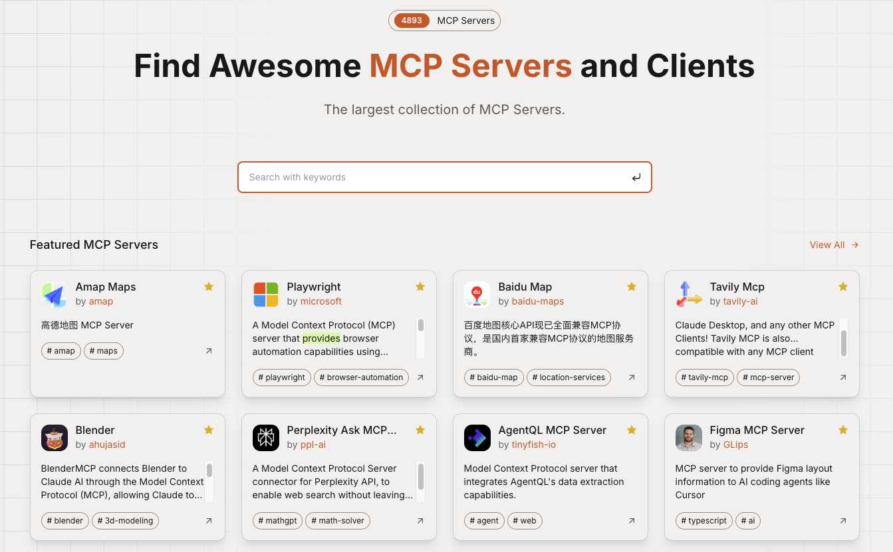
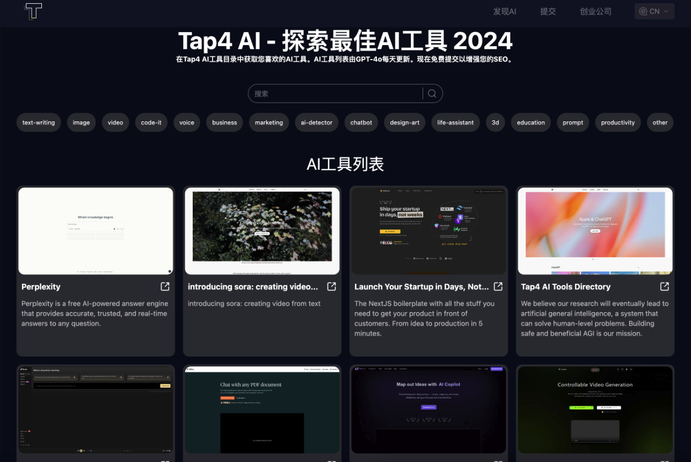

> Curating global tech insights weekly to bridge knowledge gaps and empower pioneers in the digital revolution. Subscribe now for strategic updates.

## 🔥 Cover Story

Vibe Coding, the most rebellious code philosophy of 2025. It was proposed by Andrej Karpathy, a former core member of OpenAI, with the core idea of “letting developers lie completely flat and give their souls to AI”. Imagine: you no longer need to struggle with Python indentation or JavaScript closures, just like a friend and nagging to the AI said: “Add a cyber neon effect to the sidebar, to be that kind of Blade Runner 2049 decadence”, the code will automatically flow out. This is no longer “programming” in the traditional sense, but a “human-computer stream-of-consciousness dialog” - the developer is like a director, and the AI is the director. The developer is like a director, the AI is a full-fledged field worker, and the code becomes a by-product of improvisation.

<iframe width="100%" height="315" src="https://www.youtube.com/embed/5k2-NOh2tk0?si=coWzNWWgg80RB-eu" title="YouTube video player" frameBorder="0" allow="accelerometer; autoplay; clipboard-write; encrypted-media; gyroscope; picture-in-picture; web-share" referrerPolicy="strict-origin-when-cross-origin" allowFullScreen></iframe>

Vibe Coding is like love - you don't need to fully understand each other, just keep the ambiguous “vibe”. It may have ended the era of the “coder”, but it has given rise to a new species of “digital bard”. As Karpathy puts it, “When code works, it's functional; when it doesn't work, it's performance art.” This revolution is proving that the most elegant code may not even need to be read by humans.

But the opposition fears that programmers are degenerating into “AI tamers” and that code bases are becoming black box art. For instance, Maximilian believes that "vibe coding" is not his future：

<iframe width="100%" height="315" src="https://www.youtube.com/embed/VQFvugpxNJE?si=10saN8tSh9DZnm2G" title="YouTube video player" frameBorder="0" allow="accelerometer; autoplay; clipboard-write; encrypted-media; gyroscope; picture-in-picture; web-share" referrerPolicy="strict-origin-when-cross-origin" allowFullScreen></iframe>

## 📤 Share

> Curated Dev Tools & Open-Source Gems

### ChoDocs - nice-looking static site


[ChoDocs](https://chodocs.cn/) is a static website generator based on vitepress developed by [Chocolate1999](https://github.com/Chocolate1999). It provides an easy-to-use and nice-looking interface that allows users to easily create and manage document websites.

### QBIT Capital - Amazing magnetic effect with small ball

The [QBIT Capital website](https://qbitcapital.xyz/) has some cool animations, with the magnetic animation being the most notable one：


If you wanna initialize it yourself, you can code with the video：

<iframe src="//player.bilibili.com/player.html?isOutside=true&aid=114149308829497&bvid=BV1w8QnYvEm5&cid=28828437165&p=1&autoplay=0" scrolling="no" border="0" frameBorder="no" framespacing="0" allowFullScreen width="100%" height="315"></iframe>

### MCP.so - The largest collection of MCP Servers

If you wanna develop AI Agent, this site can't be missed, it contains 4000+ MCP servers, through which you can quickly build various types of AI Agent Application.



### tap4.ai - Open Source AI Tools Collection Navigator Site

If you want to build an AI navigation site for free and make passive income from it, check out tap4.ai, which has a face value theme and runs through the monetization model. The Project technical stack are：

- Uses NEXT 14 and app routing (React server components).
- Supabase serverless database.
- Internationalization.
- SEO friendly (supports i18n).
- Dynamic sitemap.xml (supports i18n).
- Tailwind CSS.



### valibot - The modular and type safe schema library for validating structural data 🤖

```js
import v from 'valibot';

// Create login schema with email and password
const loginSchema = v.object({
  email: v.string([v.email()]),
  password: v.string([v.minLength(8)]),
});

// Infer output TypeScript type of login schema as
type LoginData = v.InferOutput<typeof LoginSchema>;

// Throws error for email and password
const output1 = v.parse(LoginSchema, { email: '', password: '' });

// Returns data as {email: string, password: string}
const output2 = v.parse(LoginSchema, {
  email: 'jane@example.com',
  password: '12345678',
})
```

Why valibot？

1. **​Tree-Shaking & Bundle Size Optimization**
  - Small, independent functions allow bundlers (e.g., Webpack, Rollup) to ​eliminate unused code via static import analysis.
​  - Result: Up to ​95% smaller bundle size compared to monolithic libraries (e.g., Zod).
​2. **Extensibility & Flexibility**
  - Modular functions enable ​easy integration with external code.
  - Users can ​selectively import only what they need, avoiding unnecessary dependencies.

## 🚀 AI Trends

> LLM Breakthroughs & Industry Shifts

### 🧠 Big Models and Algorithmic Revolution

1. **DeepSeek-V3-0324**: China's first 685 billion parameter open-source model with mathematical reasoning ability equaling Claude 3.7, and 99.26% accuracy rate of cancer screening in the medical field.
2. **ByteDance LCT technology**: AI video can generate multi-camera narrative, solve the visual consistency problem, and improve the efficiency of movie and TV production.
3. **OpenAI GPT-4o Upgrade**: Open image generation function supports Ghibli-style illustrations, but triggers copyright controversy.

### 🛠️ Hardware and Robotics Breakthroughs

1. **NVIDIA Blackwell Ultra**: TSMC's 3nm process with 4x higher inference performance and 50% lower power consumption, accelerating the AI computing revolution.
2. **Ant Group Hybrid Chip**: AI training cost reduced by 20%, promoting domestic arithmetic substitution and boosting the development of large models.
3. **Tsinghua team N2 robot**: the world's first to realize “continuous flip”, reduce mass production cost by 30%, and promote the commercialization of humanoid robots.

### 💰 Investment, Financing & Strategic Cooperation

1. **Musk's empire reorganization**: xAI and X merge at a valuation of $80 billion, aiming at the fusion of AI and social data to build a super AI ecosystem. 2.
2. **Apple's $1B investment in NVIDIA**: joint construction of generative AI infrastructure, Vision Pro head to take over Siri business.
3. **Microsoft acquires LexAI**: acquires French AI legal platform at a valuation of 1.8 billion euros, expanding enterprise service ecosystem.

### 💻 AI Coding Frontier

1. **GitHub Copilot X**: adds multimodal code generation, supports natural language description to generate complete functions. 2.
2. **DeepSeek-Coder 2.0**: open source code big model, beyond GPT-4o programming ability on Python, C++ and other languages.
3. **Rise of AI Code Review Tool**: Meta launches CodeLlama-Reviewer, which automatically detects code vulnerabilities with 40% higher accuracy.

## 👋 Hello Wasp

> A Journey Through the new skill I learned

This Week I learned about Wasp, a new open-source web framework for building modern web applications. Wasp is built on top of the Next.js framework, and it provides a new way to build web applications.

It is an opinionated way of building full-stack web applications. It takes care of all three major parts of a web application: client (front-end), server (back-end) and database.

At the core is the Wasp compiler which takes the Wasp config and your Javascript code and outputs the client app, server app and deployment code.


Let's create and run our first Wasp app in 3 short steps:

1. **To install Wasp on Linux / OSX / WSL (Windows), open your terminal and run:**
  ```sh
  curl -sSL https://get.wasp.sh/installer.sh | sh
  ```
**2. Then, create a new app by running:**
  ```sh
  wasp new
  ```
**3. Finally, run the app:**
  ```sh
  cd <my-project-name>
  wasp start
  ```

That's it 🎉 You have successfully created and served a new full-stack web app at http://localhost:3000 and Wasp is serving both frontend and backend for you.