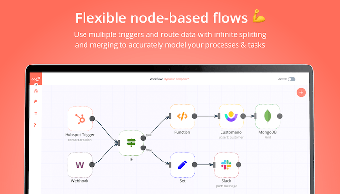
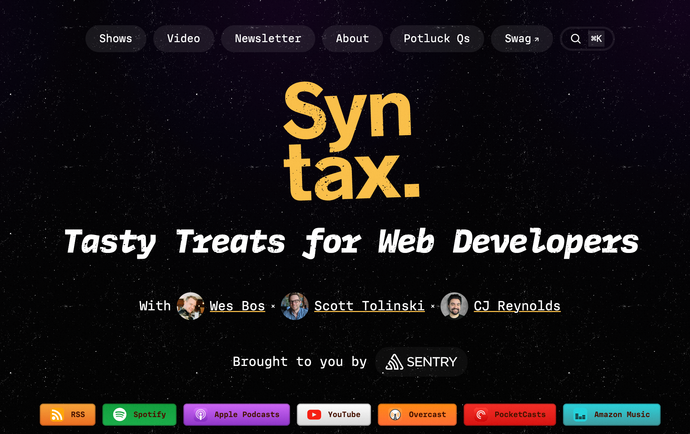
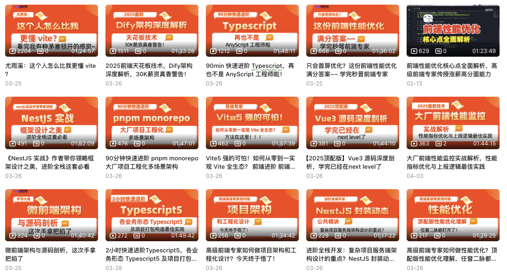

> Curating global tech insights weekly to bridge knowledge gaps and empower pioneers in the digital revolution. Subscribe now for strategic updates.

## 🔥 Cover Story

**Trump’s 2025 Reciprocal Tariff Policy**

Announced on April 2, 2025 (“Liberation Day”), Trump’s **reciprocal tariff policy** mandates that the U.S. impose tariffs equivalent to those levied by other nations on American goods. Key features:

1. **Scope**: Targets countries like China, the EU, Japan, and others imposing tariffs **above 10%** on U.S. exports (e.g., steel, aluminum, automobiles, electronics).
2. **Auto Tariffs**: Raises import car tariffs to **25%** (from 2.5%), affecting German, Japanese, Korean, and Chinese automakers.
3. **Universal Tariff Proposal**: A potential **20% flat tariff** on all imports to reduce trade deficits.

**Objectives**: Reduce reliance on foreign goods, revive U.S. manufacturing, and counter perceived “unfair practices” like subsidies or currency manipulation.

**Global Impact**: Risks escalating trade wars (e.g., EU retaliation on pork/luxury cars, China targeting agriculture), disrupting supply chains, and fueling inflation. Critics argue the policy is less about reciprocity and more a protectionist tool, potentially destabilizing WTO frameworks.

**Economic Impact**: The S&P 500 index plunged 4.8%, with about $2 trillion in market value evaporated. The Dow Jones and Nasdaq fell 4% and 6% respectively. Asian and European stock markets also declined simultaneously. Japan's Nikkei 225 index fell 2.7% in the morning session, and the UK's FTSE 100 index closed down 1.5%.

This strategy reflects Trump’s broader “America First” agenda, prioritizing economic leverage over multilateral cooperation.

## 📤 Share

> Curated Dev Tools & Open-Source Gems

### 1、[Immersive Translate](https://immersivetranslate.com/?via=zisheng) - Highly Rated Bilingual Translation Website Extension

</img>

Are you tired of stumbling over language hurdles while exploring the web? Immersive Translate is your solution! This amazing browser extension offers seamless translations for web pages. It instantly shows you both the original and translated text, making reading international news, academic content, or product reviews a breeze.

It supports multiple translation services and can even handle PDF files. Whether on desktop or mobile, it ensures you stay informed across languages. Don't let language stop you. Try Immersive Translate and open doors to global knowledge today!

### 2、[n8n](n8n.io) - Flexible AI workflow automation for technical teams

n8n.io is an open-source workflow automation platform with 400+ integrations, enabling no-code automation via a visual interface. Licensed under Fair-code, it supports self-hosting for data control. Developers can deploy via Docker/npm and leverage AI nodes for smart workflows. With 75K+ GitHub Stars and 5M+ daily downloads, it’s a top choice for tech teams. The platform features:



1. ​Workflow Automation
    - Drag-and-drop interface for designing complex workflows with triggers like schedules, webhooks, and APIs.
    - 400+ pre-built nodes (e.g., CRM, databases, AI tools) for data sync, notifications, and reporting.
​2. AI Integration
    - LangChain-based AI agent workflows, supporting OpenAI, Hugging Face models for tasks like customer service and analytics.
    - AI nodes for data cleaning, algorithmic processing, and automated decision-making.
3. ​Flexible Deployment
    - Local deployment via Docker/Kubernetes for data control.
    - Cloud service options for rapid deployment.
4. ​Enterprise Capabilities
    - Multi-environment management, Git integration, logging, and OAuth 2.0 security.
    - 1,599+ templates for marketing, data processing, and project management.

### 3、[Folo](https://follow.is/) - AI-Powered Information Aggregator

Folo is a revolutionary open-source information aggregation tool designed for the information-overloaded era. It supports subscribing to traditional RSS, social media (Twitter, Xiaohongshu), video platforms (YouTube, Bilibili), and web pages. AI-powered features like smart summaries, real-time translation, and personalized recommendations make it effortless to grasp the essence of content across the web. Users can customize tag rules, manage subscriptions dynamically, and support creators through the $POWER token economy, fostering a virtuous cycle of content creation and consumption.

### 4、[Simple Icons](https://simpleicons.org/) - A Simple, Open-Source Icon Collection

Simple Icons is an open-source icon collection offering 2,400+ SVG vector logos for brands (GitHub), tech stacks (React), and tools (Figma). All icons adhere to strict standardization (24x24 canvas, 2px stroke) for visual consistency. Developers can embed icons via CDN or npm install. Licensed under CC0 (free for commercial use, no attribution required), it's a top-tier icon resource with 5M+ daily downloads. Ideal for dev docs, tech blogs, and OSS projects due to its simplicity, compliance, and one-click integration. Maintained by the community, it exemplifies how open-source solves real-world design needs efficiently.

### 5、[Syntax.fm](https://youtube.com/@syntaxfm) - Tasty Treats for Web Developers



Syntax.fm is a biweekly podcast hosted by full-stack engineers **Wes Bos** and **Scott Tolinski**, focusing on web development technologies. It covers frontend frameworks (like React), toolchain optimization, modern CSS features, and developer productivity. The show delivers expert insights through conversational deep dives, blending practical experience with industry trends for developers at all levels. Beyond technical topics, it explores soft skills like teamwork and project management. Notable for its community advocacy (e.g., campaigning against Oracle's JavaScript trademark claim), Syntax.fm combines professional depth with engaging discussions, making it a global go-to resource for skill development and tech community engagement.

### 6、[前端架构师Hery](https://space.bilibili.com/2032193111) - 分享前端高阶知识的 UP

Hery 老师是字节的 3-1 大佬，视频中会分享前端高级进阶技术栈，包括但不限于：

- 前端工程化
- 性能优化
- 项目实战
- 微前端架构



## 🚀 AI Trends

> LLM Breakthroughs & Industry Shifts

### 🧠 Big Models and Algorithmic Revolution

Meta released the Llama 4 series of open-source models with 2 trillion parameters, supporting tens of millions of long-text processing. The Scout model outperforms GPT-4o in creative writing tasks. OpenAI's GPT-4.5 passed the Turing test, with 73% of humans mistaking it for a real person, sparking ethical debates. DeepSeek proposed the SPCT technique to optimize model logical consistency, significantly improving reasoning performance.

### 🛠️ Hardware and Robotics Breakthroughs

Kawasaki Heavy Industries launched the hydrogen fuel cell quadruped robot Corleo, with excellent off-road performance and adult riding capacity. China's semiconductor imports decreased by 24%, and the cost of domestic 28-nanometer chips reduced by 40%. Huawei Ascend chips account for 79% of domestic intelligent computing centers. Japan's Rapidus commenced trial production of 2-nanometer AI chips, planning mass production by 2027.

### 💰 Investment, Financing & Strategic Cooperation

Global AI venture capital transactions decreased by 32% in Q1, but AI accounted for 58% of total funding. OpenAI received one-third of global AI financing. Google allocated 17.1% of its 2024 investment to AI, focusing on healthcare and enterprise services, with 53% going to application-layer investments. Meta plans to invest $1 billion to build AI data centers in the US, accelerating computing expansion.

### 💻 AI Coding Frontier

Runway released the Gen-4 video generation model, enhancing character consistency. Higgsfield AI launched a movie-grade camera control model, supporting professional lens language generation. Zhima launched the free intelligent agent product "AutoGLM Meditation," with reasoning costs only 1/30 of DeepSeek-R1. Ant Group released a 290-billion-parameter open-source model, driving financial technology applications.

## 👋 Hello Lynx

> A Journey Through the new skill I learned

### Create a new Lynx project

Lynx use Rspeedy (a Rspack-based Lynx build tool) to build Lynx projects.

It is recommended to start a new project using [create-rspeedy](https://npmjs.org/package/create-rspeedy), which sets up everything automatically for you. To create a project, run:

```sh
npm create rspeedy@latest
```

After completing the prompts, `create-rspeedy` will create a folder with your project name.

### Prepare Lynx Explorer

Lynx Explorer is a sandbox for trying out Lynx quickly.

1、**Install Xcode**

Open up the Mac App Store, search for [Xcode](https://apps.apple.com/us/app/xcode/id497799835), and click Install (or Update if you have it already).

2、**Download LynxExplorer**

Download [LynxExplorer-arm64.app.tar.gz](https://github.com/lynx-family/lynx/releases/latest/download/LynxExplorer-arm64.app.tar.gz).

Then extract the downloaded archive:

```sh
mkdir -p LynxExplorer-arm64.app/
tar -zxf LynxExplorer-arm64.app.tar.gz -C LynxExplorer-arm64.app/
```

3、**Install LynxExplorer on Simulator**

Open Xcode, choose **Open Developer Tool** from the Xcode menu. Click the **Simulator** to launch a simulator. Drag "LynxExplorer-arm64.app" into it.

### Start developing

1、Navigate to the created project:

```sh
cd <project-name>
```

Install the NPM dependencies with package manager:

```sh
npm install
```

To start the development server, run:

```share
npm run dev
```

You will see a QR code showing up in the terminal, scan with your Lynx Explorer App.

4、Make your first change

Open the `src/App.tsx` file in your code editor and make a change.

You should see the UI on your Lynx Explorer being updated automatically.

