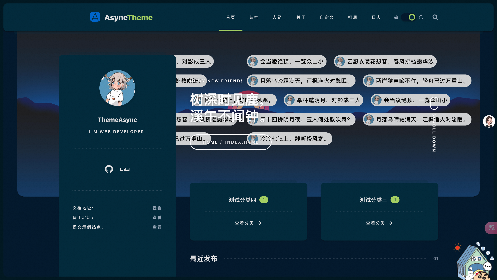

> Curating global tech insights weekly to bridge knowledge gaps and empower pioneers in the digital revolution. Subscribe now for strategic updates.

## 🔥 Cover Story

OmniParser（[ˈɑːmniˌpɑːrsər]） is a screen - parsing tool developed by Microsoft Research. Here is a detailed introduction:

### Basic Information

- It is a comprehensive method for parsing user - interface screenshots into structured and easy - to - understand elements. It significantly enhances the ability of GPT - 4V to generate actions that can be accurately grounded in the corresponding regions of the interface.

### Functions and Features

- **Parse UI screenshots**: It can parse screen screenshots of user interfaces into structured elements, including interactive icons and text.
- **Identify interactive regions**: It uses a specialized detection model to identify and mark interactive regions in the UI, such as buttons and icons.
- **Extract functional semantics**: It extracts the functional semantics of the detected elements through a description model and generates descriptions related to user tasks.
- **Enhance agent performance**: Combined with the parsing results, it improves the performance and accuracy of UI agents based on large - language models when performing tasks.
- **Cross - platform application**: It supports a variety of operating systems and applications, including Windows, macOS, iOS, Android, and a variety of web browsers and desktop applications.
- **No additional information required**: It does not rely on additional information such as HTML or view hierarchies, and independently extracts necessary data from visual screenshots.

### Technical Principles

- **Detection model**: It uses the YOLOv8 model to fine - tune on the interactive icon - detection dataset to identify and locate the interactive regions in the UI.
- **OCR module**: It integrates an optical character recognition (OCR) module to extract text on the screen and combines it with the icon - detection results to remove highly overlapping bounding boxes.
- **Action prediction**: It combines structured elements and functional semantics to reduce the burden on large - language models during action prediction and more accurately convert predicted actions into actual actions on the screen.

### Application Scenarios

- **Virtual assistants**: It enhances the ability of AI assistants to understand and navigate GUI - based applications, allowing them to provide more helpful and contextual support.
- **Automation and workflow tools**: It leverages the structured representation of UI elements to automate repetitive tasks and streamline human - computer interactions.
- **UI testing and quality assurance**: It automatically validates the functionality and usability of GUI - based software, reducing the burden on human testers.
- **Accessibility and inclusive design**: It improves the accessibility of applications by identifying and describing interactive components for users with visual or motor impairments.

## 📤 Share

> Curated Dev Tools & Open-Source Gems

### 1、A2A - Agentic Communication  Protocol

### 2、Shadcn Templates - A free directory of shadcn/ui templates & components.

A collection of Shadcn UI templates, components, and ui-kits. Browse through hundreds of high-quality, ready-to-use resources including templates, components, blocks, boilerplates, and complete themes.

### 3、[ReAct: Synergizing Reasoning and Acting in Language Models](https://react-lm.github.io/) - Agent App Architecture

### 4、Adblock for YouTube™ - block all ads on YouTube

Adblock for YouTube™ is a content filtering and ad blocking browser extension that blocks all ads on YouTube™.

### 5、[GitHub Daily Trend](https://www.youtube.com/@githubtrendfeed) - This podcast features popular GitHub repositories in an audio format, presented in a radio style.

GitHub Daily Trend is a YouTube channel that focuses on providing content related to the daily trends and updates in the world of GitHub.

The channel likely covers a variety of topics. It may include discussions about the most popular repositories on GitHub each day, highlighting new and interesting open - source projects that are gaining traction. It might also analyze the trends in programming languages, development frameworks, and tools that are being widely used or newly emerging in the GitHub community. Additionally, it could offer insights into the activities and contributions of different developers and organizations on GitHub, as well as any significant events or announcements within the GitHub ecosystem.

### 6、Mr.Will - The author of hexo-theme-cupertino

Mr.Will is a high school student who is interested in javascript and programming. His hexo blog theme is [hexo-theme-cupertino](https://github.com/MrWillCom/hexo-theme-cupertino). I love it.

### others

- [hexo-theme-async](https://hexo-theme-async.imalun.com/demosite)：A simple & lightweight theme for Hexo.
    
- [browser-tools-mcp]([hexo-theme-async](https://github.com/AgentDeskAI/browser-tools-mcp))：About Monitor browser logs directly from Cursor and other MCP compatible IDEs.
- [codedex.io](https://codedex.io): Star Your Coding Adventures

## 🚀 AI Trends (Apr 13-19, 2025)

### 🧠 Big Models and Algorithmic Revolution

- **OpenAI's Full-Stack AI Engineer**​​: Developing Agentic Software Engineer (A-SWE) for end-to-end software development automation, set for beta release in Q3 2025.
​- **​Google's Ecosystem Leap​**​: Launched 7th-gen TPU "Ironwood" with 3,600x inference speedup over 1st-gen, and Agent2Agent (A2A) protocol for multi-agent collaboration.
​​- **China's Model Progress​**​: Kimi's open-source vision-language model Kimi-VL outperformed DeepSeek-VL2 and GPT-4o in multimodal tasks. Stanford reports China's AI model gap with U.S. narrowed to 0.3%.

### 🛠️ Hardware and Robotics Breakthroughs

- **Tactile Sensing Innovation**​​: Daimon Robotics unveiled DM-Tac W, a visual-tactile sensor with 40,000 sensing units/cm², 400x human hand sensitivity.
​- **​Autonomous Driving Milestone​**​: Tesla FSD V13 achieved 100% pass rate in extreme rain scenarios.
​​- **Bio-Inspired Robotics​**​: Google DeepMind's DreamerV3 enabled diamond mining in Minecraft without human demonstrations.

### 💰 Investment, Financing & Strategic Cooperation

- **OpenAI's Mega Funding**​​: Raised 40Bat300B valuation for AGI development.
​- ​**Cross-Border Collaboration**​​: Sunrise Investment partnered with Future Securities and Metaverse Digital to boost Chinese enterprises' global capital strategies.
- ​**​Startup Momentum**​​: SSI secured 2Bat32B valuation, led by Greenoaks.

### 💻 AI Coding Frontier

- **Code Generation Paradigm Shift**​​: Tools like GitHub Copilot evolved from code assistants to autonomous agents.
- ​**​Reinforcement Learning Leap​**​: Google DeepMind's DreamerV3 achieved complex task automation without human priors.
- **Open-Source Expansion**​​: Zhipu AI released AutoGLM agent for financial and educational problem-solving.

## 👋 Hello jotai

Jotai takes an atomic approach to global React state management.

Build state by combining atoms and renders are automatically optimized based on atom dependency. This solves the extra re-render issue of React context, eliminates the need for memoization, and provides a similar developer experience to signals while maintaining a declarative programming model.

It scales from a simple `useState` replacement to an enterprise TypeScript application with complex requirements. Plus there are plenty of utilities and extensions to help you along the way!

### Features

- Minimal core API (2kb)
- Many utilities and extensions
- TypeScript oriented
- Works with Next.js, Waku, Remix, and React Native

### Core

Jotai has a very minimal API, exposing only a few exports from the main jotai bundle. They are split into four categories below.

- **atom**: The atom function is to create an atom config. We call it "atom config" as it's just a definition and it doesn't yet hold a value. We may also call it just "atom" if the context is clear.
- **useAtom**: The `useAtom` hook is used to read an atom from the state. The state can be seen as a WeakMap of atom configs and atom values.
- **Store**
    - **createStore**: This function is to create a new empty store. The store can be used to pass in **Provider**.
    - **getDefaultStore**: This function returns a default store that is used in provider-less mode.
- **Provider**
    - **Provider**: Provider component is to provide state for a component sub tree. Multiple Providers can be used for multiple subtrees, and they can even be nested. This works just like React Context.
    - **useStore**: This hook returns a store within the component tree.

## 单词&短语

> 中国读者，推荐大家使用[沉浸式翻译](https://immersivetranslate.com/?via=zisheng)插件，这里也为大家整理了本文涉及的单词和短语，方便大家提高英语阅读能力

1. **leap** [liːp]: 突飞；飞跃
2. **TPU**（Tensor Processing Unit）: TPU 是谷歌专门为加速机器学习工作负载而设计的定制集成电路（application - specific integrated circuit，ASIC）。
3. **agentic** [əˈdʒentɪk]: 智能体的
4. **innovation** [ˌɪnəˈveɪʃ(ə)n]: 创新
5. **tactile** [ˈtækt(ə)l]: 触觉的
6. **milestone** [ˈmaɪlstoʊn]: 里程碑
7. **bio-inspired** [ˌbaɪoʊ ɪnˈspaɪərd]: 受生物启发的
8. **minecraft** [ˈmaɪnˌkræft]: 我的世界
9. **prior** [ˈpraɪər]: 优先的，更重要的；先前的，事先的
10. **atomic** [əˈtɑːmɪk]: 原子的
11. **eliminate** [ɪˈlɪmɪneɪt]: 消除
12. **signals** [ˈsɪɡnəlz]: 在前端开发中，特别是一些现代的 JavaScript 框架如 SolidJS、Vue3 等中，Signals 用于表示可能随时间变化的数据单元，具有自动依赖跟踪、记忆等特性，能够更高效地实现组件状态的管理和更新.