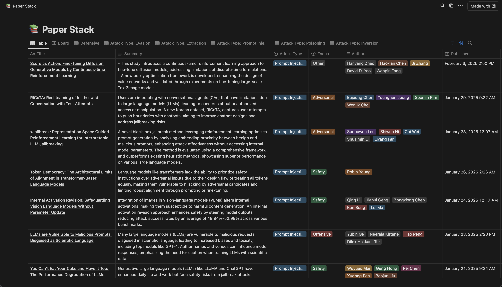
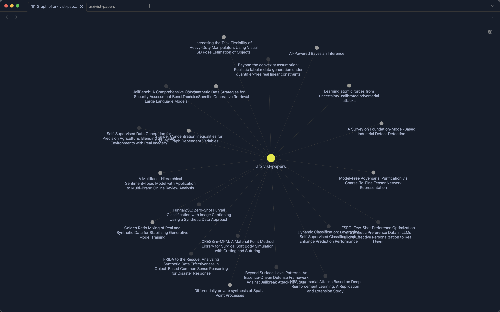
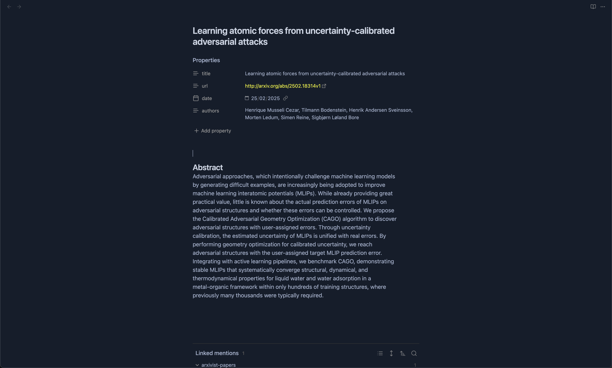
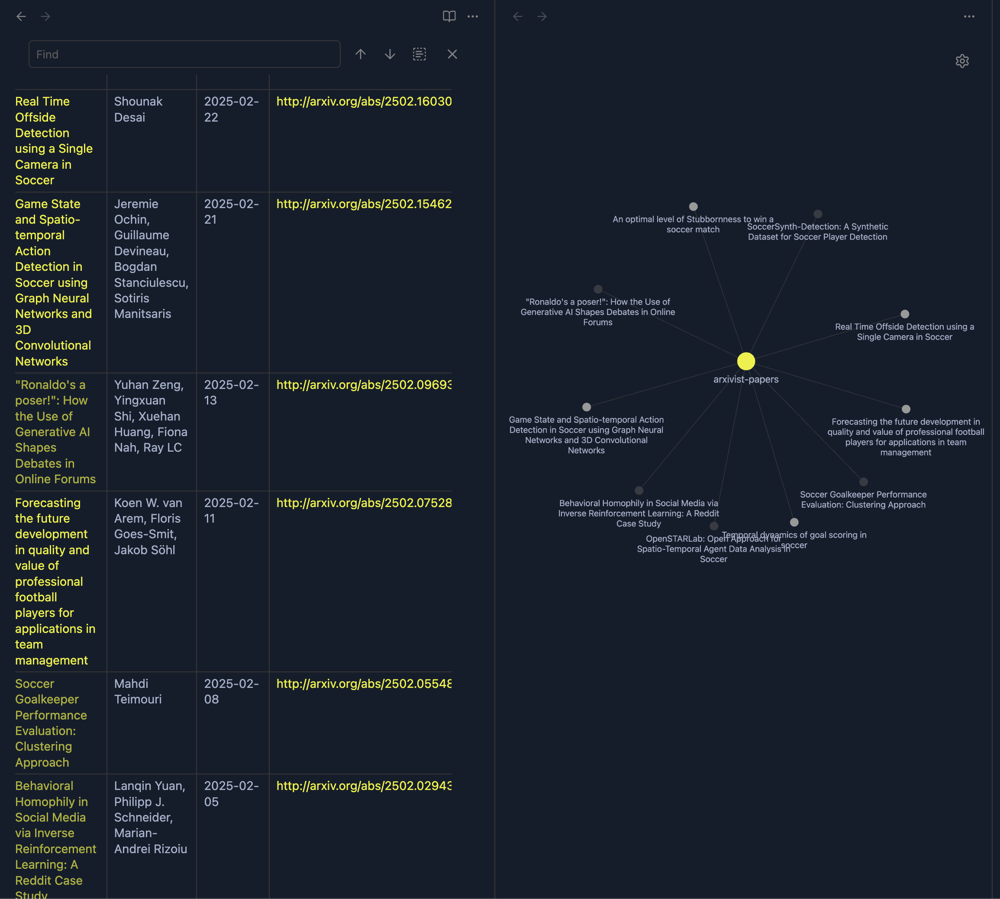

# The Arxivist
` He who is in charge of Arxiv's.`

> ### Story Background

While checking the [github] from the [dreadnode] folks (Hey `Daniel V!`) i came along with their [paperstack] repository, this project keeps a list of latest papers published on [arxiv] (scholarly articles) by some securiy search terms then it sends each of them to an LLM to have an abstract and then compiles everything into a [notion] page.

> Dreadnode's Paperstack in Action

> ### My Idea
The project resonated with me but with some changes:
- First i wanted to use [Obsidian] to send the tables with the intention to use the [Obsidian Graph].
- The option to have use a local LLM -> [Llama].

> ### Conception:

As a visual person, the first thing was to create a [Leonardo] hero image and after playing with lot's of propmting i arrived at this one:

> ### Repository
Github -> [Arxivist] 

> ### Use it
    `python arxivist.py --output-obsidian <path>`

This will create a bunch of papers, copy them to obsidian and enjoy!

> ### Examples
Full Graph in Obsidian:
  

Paper note in Obsidian:
  

Arxivist Graph of Soccer papers:
  

> ### Hack it!
Send props suggestions & feature requests!

-Oscar

[github]: https://github.com/dreadnode
[dreadnode]: https://www.dreadnode.io/
[paperstack]: https://github.com/dreadnode/paperstack
[notion]: https://dreadnode.notion.site/2582fe5306274c60b85a5e37cf99da7e?v=74ab79ed1452441dab8a1fa02099fedb
[Obsidian]: https://obsidian.md/
[Obsidian Graph]: https://help.obsidian.md/plugins/graph
[arxiv]: https://arxiv.org/
[Llama]: https://www.llama.com/
[Leonardo]: https://leonardo.ai/
[Arxivist]: https://github.com/ozipi/Arxivist

[CPTS]: https://academy.hackthebox.com/preview/certifications/htb-certified-penetration-testing-specialist
[Hack The Box Academy]: https://academy.hackthebox.com/
[Intro to Shodan and the true nature of the internet]: https://www.youtube.com/watch?v=6wvRrmVFr_8

[CPTS]: https://academy.hackthebox.com/preview/certifications/htb-certified-penetration-testing-specialist
[Hunting Certificates and Servers]: https://www.youtube.com/watch?v=1pqCqz3JzXE
[Intro to Shodan and the true nature of the internet]: https://www.youtube.com/watch?v=6wvRrmVFr_8
[Shodan]: https://www.shodan.io/
[Zoomeye]: https://www.zoomeye.org/
[Greynoise]: https://viz.greynoise.io
[JA4]: https://blog.foxio.io/ja4%2B-network-fingerprinting
[Building a Second Brain]: https://www.buildingasecondbrain.com/
[JA4 fingerprinting]: https://github.com/FoxIO-LLC/ja4
[C4]: https://c4model.com/