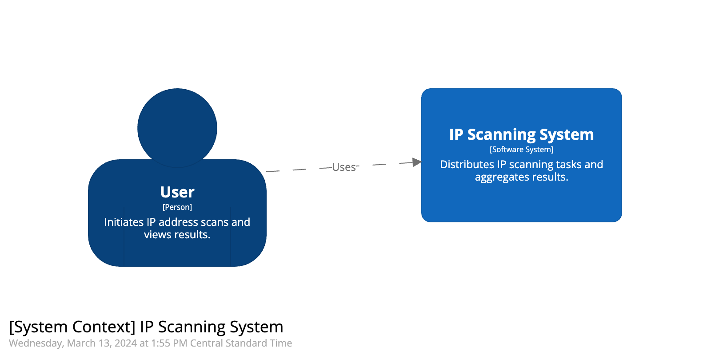

```
Verum ipsum factum - We only know what we make.

- Giambattista Vico, Italian philosopher 
```

### Present day
Learning my way into the [CPTS] curriculum from [Hack The Box Academy] made me realize how important the `enumeration` part is, which by definition is `Collecting as much information as possible. The more information we have, the easier it will be for us to find vectors of attack.`, so basically the more we information we have the more easier will be to understand the current state of any given `server`.

Today you can rely on several vendors that enumerate a portion of the services available on the `internet` ie. [Shodan], [Zoomeye] and [Greynoise], you rely on `what` and `how` they capture/grab the information behind the scenes (They scan ports/services on every IP address available), so it's all nice and easy but reading about [JA4 fingerprinting] and [Hunting Certificates and Servers] it hit in my head about how difficult would it be to create a `internet scale` enumeration service?.

(ChatGPT dreaming about the 4.3 billion unique ipv4 addresses).


If i really want to understand how those enumeration services work, how the interact with the different protocols and how to store those large datasets and how to protect from the enumeration techniques, then i have to `create` it.

### Project Inception
```
What is the smallest version of this I can produce 
to get useful feedback from others?.

- Building a Second Brain / Tiago forte 
```
Instead of trying to define all portions of the project at the beginning, i will focus on just creating the smallest version to get feedback from.

Using [C4] to model the first alpha version with the following pieces:

### System Context Diagram


### Container Diagram


### Component Diagram


This represent the barebones initial version, later i'll update the `model` when it's needed to expand each of the containers/components and anything in the middle (`messaging`, `cache`, `worker node provisioning` and the full `Web app` definition).

Will it be `hard`? for sure but as Mike Tyson says 

>I'm a dreamer. I have to dream and reach for the stars

Oscar


[CPTS]: https://academy.hackthebox.com/preview/certifications/htb-certified-penetration-testing-specialist
[Hack The Box Academy]: https://academy.hackthebox.com/
[Intro to Shodan and the true nature of the internet]: https://www.youtube.com/watch?v=6wvRrmVFr_8

[CPTS]: https://academy.hackthebox.com/preview/certifications/htb-certified-penetration-testing-specialist
[Hunting Certificates and Servers]: https://www.youtube.com/watch?v=1pqCqz3JzXE
[Intro to Shodan and the true nature of the internet]: https://www.youtube.com/watch?v=6wvRrmVFr_8
[Shodan]: https://www.shodan.io/
[Zoomeye]: https://www.zoomeye.org/
[Greynoise]: https://viz.greynoise.io
[JA4]: https://blog.foxio.io/ja4%2B-network-fingerprinting
[Building a Second Brain]: https://www.buildingasecondbrain.com/
[JA4 fingerprinting]: https://github.com/FoxIO-LLC/ja4
[C4]: https://c4model.com/