Open source has clearly won. Yes, there are plenty of closed source products and businesses. But the shared infrastructure--the commons--runs on open source.

We might take this for granted, but it wasn't a foregone conclusion thirty five years ago. There were powerful forces that wanted open source to lose. Some believed in the open source model but didn't think it could ever compete with closed source. Many categories of tools only existed as closed source. A Microsoft CEO called open source cancer--a decade before Microsoft has rebuilt its empire around it. The open source movement may not have lived up to the ideals of the "free software", but it won in industry adoption. Nobody gets fired for choosing open source these days. For much crucial software, open source is now *the default*.

I believe we are at a similar juncture with social apps as we have been with open source thirty five years ago. **There's a new movement on the block.** I like to call it *"open social"*. There are competing visions for what "open social" should be like. I think the [AT Protocol](https://atproto.com/) created by Bluesky is the most convincing take on it so far. It's not perfect, and it's a work in progress, but there's nothing I know quite like it.

(Disclosure: I used to work at Bluesky on the Bluesky client app. I wasn't involved in the protocol design. I am a fan, and this post is my attempt to explain why.)

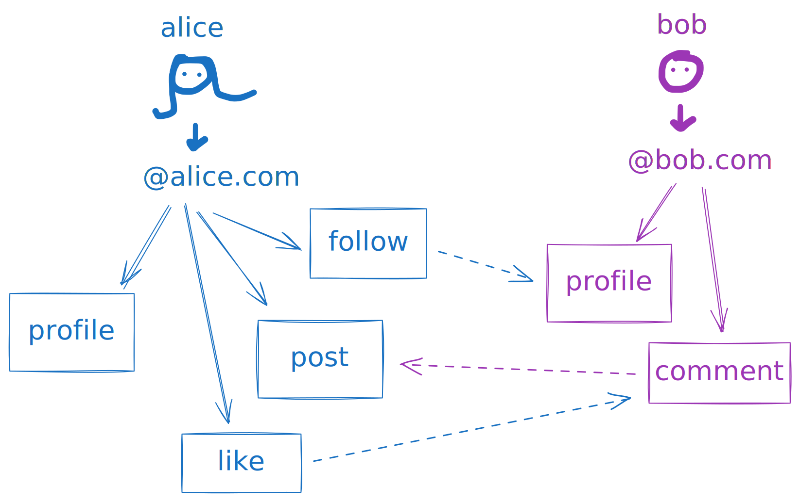

In this post, I'll explain the ideas of the AT Protocol, lovingly called *atproto*, and how it changes the relationship between the user, the developer, and the product.

I don't expect atproto and its ecosystem (known as *the Atmosphere*) to win hearts overnight. Like open source, it might take a few decades to become ubiquitous. By explaining these ideas here, I'm hoping to slightly nudge this timeline. Despite the grip of today's social media companies, I believe open social will eventually seem inevitable in retrospect--just like open source does now. Good things *can* happen; all it takes is years of sustained effort by a community of stubborn enthusiasts.

So what is it all about?

What open source did for code, open social does for data.

---

## Before Social

The web is a beautiful invention.

You type `https://alice.com` and you end up on Alice's website.

Or you type `https://bob.com` and you end up on Bob's website.

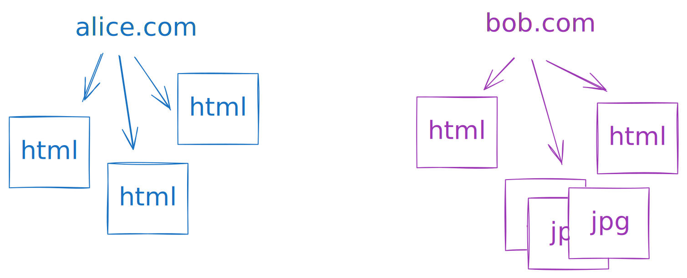

In a sense, your browser is a portal to millions of different worlds, each with its own little jurisdiction. Only Alice decides what appears on Alice's website. Only Bob decides what appears on Bob's website. They meaningfully "own their data".

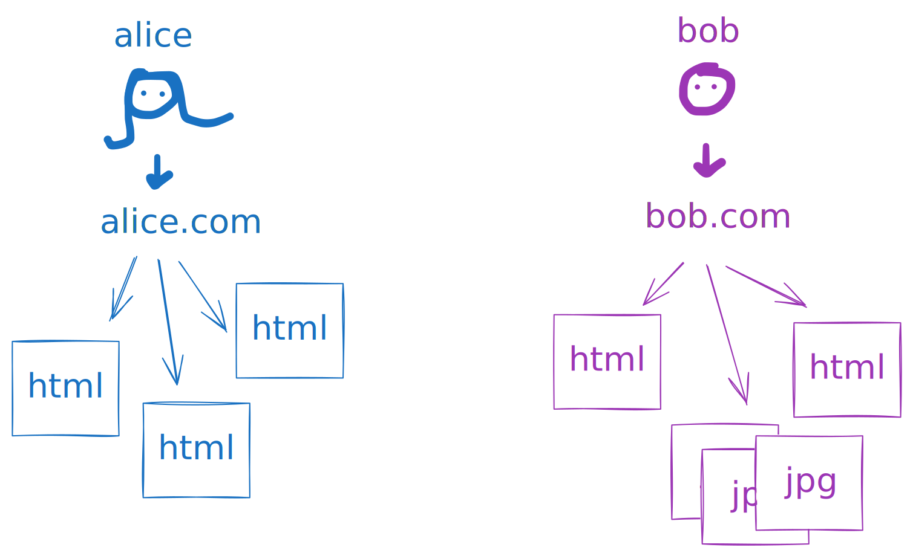

This doesn't mean that they're isolated. On the contrary, Alice can embed Bob's picture with an ``, and Bob can link to Alice's page with `<a href>`:

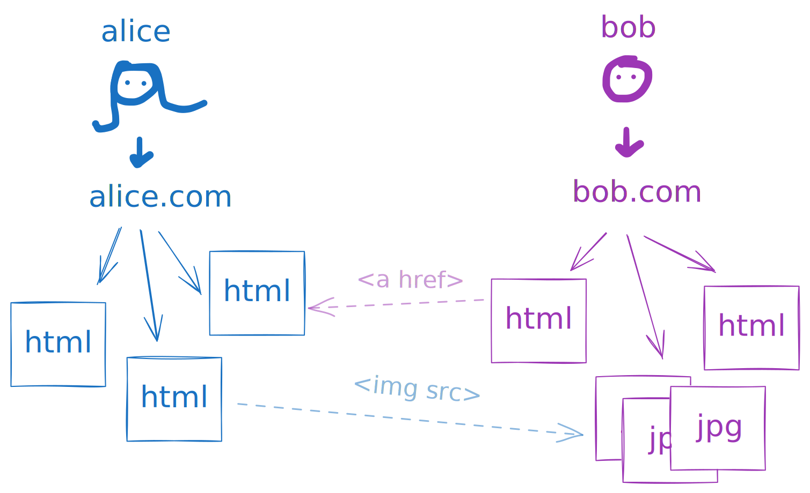

Alice and Bob can link to each other, but they remain in charge of their sites.

What do I *mean* by saying Alice and Bob are in charge of their own sites? Even if they're not physically hosting their content on their own computers, they could always change hosting. For example, if Alice's hosting provider starts deleting her pages or injecting ads into them, Alice can take her content to another host, and point `https://alice.com` at another computer. *The visitors won't need to know.*

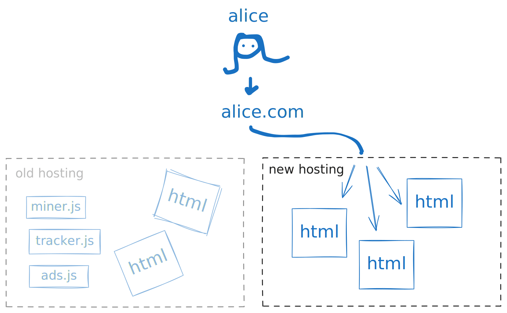

**This is important.** Hosting providers have no real leverage over Alice and Bob. If the hosting provider "turns evil" and starts messing with your site, you can just walk away and host it elsewhere (as long as you have a backup). You're not going to lose your traffic. All existing links will seamlessly resolve to the new destination.

If Alice changes her hosting, Bob won't need to update any links to Alice's website. Alice's site will keep working as if nothing had happened. At worst, a DNS change might make it inaccessible for a few hours, but then the web will be repaired:

Imagine how different the incentives would be if links *were* tied to physical hosts!

If changing a hosting provider caused Alice to lose her traffic, she would think many times before changing providers. Perhaps she'd stick with her existing provider even if it was messing with her site, as losing her connections is even worse. Luckily, web's decentralized design avoids this. Because it's easy to walk away, hosting providers are forced to compete, and hosting is now a commodity.

I think the web is a beautiful idea. It links decentralized islands controlled by different people and companies into one interconnected surface that anyone can index and navigate. Links describe a *relationship between logical documents* rather than between physical servers. As a result, you're not a hostage to your hosting.

As a wise person said, in theory, there is no difference between theory and practice, but in practice there is. So what's been happening with the web?

---

## Closed Social

In the early 90's, the main way to publish something on the web was to have your own website. Today, most people publish content by using a social media app.

Alice and Bob are still publishing things. But instead of publishing at domains like `alice.com` and `bob.com`, they publish at usernames like `@alice` and `@bob` allocated by a social media company. The things they publish are not HTML pages, but app-specific entities such as profiles, posts, comments, likes, and so on.

These entities are usually stored in a database on the social company's servers. The most common way to visualize a database is as a sequence of rows, but you could also visualize it as a graph. This makes it look very similar to web itself:

What does this social graph enable that a web of personal sites doesn't?

The advantage of storing structured app-specific entities, such as posts and likes, instead of HTML documents is obvious. App-specific entities such as posts and likes have a richer structure: you can always turn them *into* HTML documents later, but you can *also* aggregate them, filter them, query, sort, and recombine them in different ways before that. This allows you to create **many projections of the same data**--a profile page, a list of posts, an individual post with comments.

Where this really shines, though, is when many people use *the same* social app. Since everyone's public content is now in a single database, it is easy to aggregate *across* content published by many people. This enables social features like global search, notifications, feeds, personalized algorithms, shared moderation, etc.

It's specifically this **social aggregation** that blows the "personal sites" paradigm out of the water. People are social creatures, and we want to congregate in shared spaces. We don't just want to visit each other's sites--we want to hang out *together*, and social apps provide the shared infrastructure. Social aggregation features like notifications, feeds, and search are non-negotiable in modern social products.

Today, the most common way to implement these features is shaped like this:

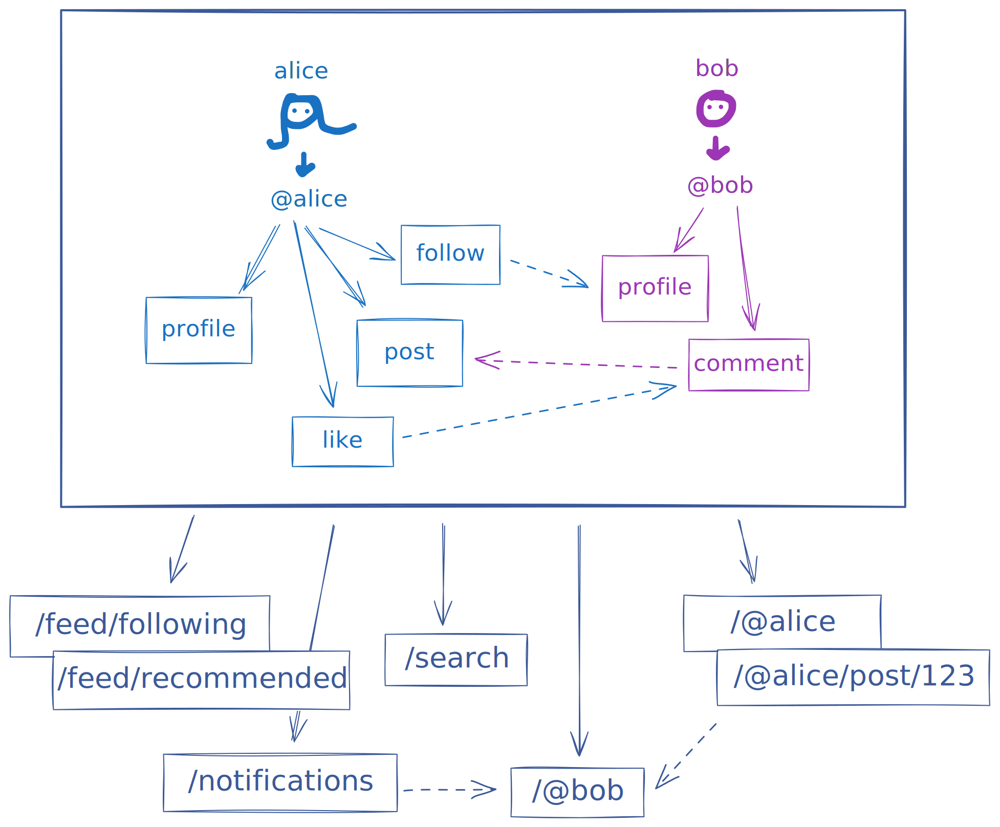

There still *exists* a web-like logical model of our data--our profiles, our posts, our follows, our likes, all the things that we've created--but it lives *within* some social app's database. What's exposed to the web are only *projections* of that model--the Home screen, the Notifications screen, the HTML pages for individual posts.

This architecture makes sense. It is the easiest way to evolve the "personal sites" paradigm to support aggregation so it's not surprising today's apps have largely converged on it. People create accounts on social apps, which lets those apps build aggregated features, which entices more people to sign up for those apps.

However, something got lost in the process. *The web we're actually creating*--our posts, our follows, our likes--is no longer meaningfully ours. Even though much of what we're creating is public, it is not a part of the open web. We can't change our "hosting provider" because we're now *one step removed* from how the internet works. We, and the web we create, have become rows in somebody else's database:

This creates an imbalance.

When Alice used to publish her stuff on `alice.com`, she was not tied to any particular hosting provider. If she were unhappy with a hosting provider, she knew that she could swap it out without losing any traffic or breaking any links:

That kept the hosting providers in check.

But now that Alice publishes her stuff on a social media platform, she can no longer "walk away" without losing something. If she signs up to another social platform, she would be *forced* to start from scratch, even if she *wants* to retain her connections. There is no way for Alice to sever the relationship with a particular app without ripping herself, and anything she created there, out of its social graph:

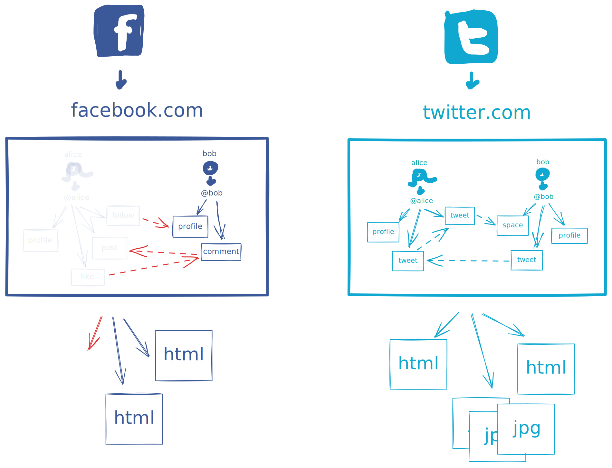

The web Alice created--who she follows, what she likes, what she has posted--is trapped in a box that's owned by somebody else. To leave is to leave it *behind*.

On an individual level, it might not be a huge deal.

Alice can rebuild her social presence connection by connection somewhere else. Eventually she might even have the same reach as on the previous platform.

However, *collectively*, the net effect is that social platforms--at first, gradually, and then suddenly--turn their backs on their users. If you can't leave without losing something important, the platform has no incentives to respect you as a user.

Maybe the app gets squeezed by investors, and every third post is an ad. Maybe it gets bought by a congolomerate that wanted to get rid of competition, and is now on life support. Maybe it runs out of funding, and your content goes down in two days. Maybe the founders get acquihired--an exciting new chapter. Maybe the app was bought by some guy, and now you're slowly getting cooked by the algorithm.

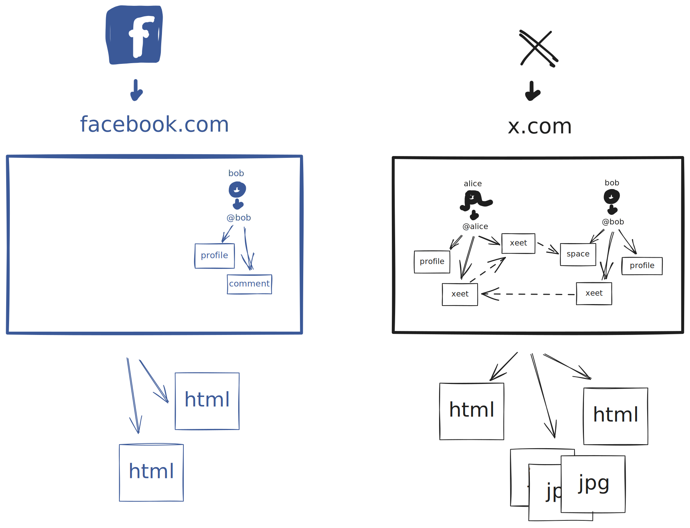

If your next platform doesn't respect you as a user, you might try to leave it, too.

But what are you going to do? Will you "export your data"? What will you do with that lonely shard of a social graph? You can upload it somewhere as an archive but it's ripped out of its social context--a pitiful memento of your self-imposed exile.

Those megabytes of JSON you got on your way out are *dead data*. It's like a branch torn apart from its tree. It doesn't *belong* anywhere. To give a new life to our data, we'd have to *collectively* export it and then *collectively* import it into some next agreed-upon social app--a near-impossible feat of coordination. Even then, the network effects are so strong that most people would soon find their way back.

You can't *leave* a social app without *leaving behind* the web you've created.

What if you could keep it?

---

## Open Social

Alice and Bob are still using social apps. Those apps don't look much different from today's social apps. **You could hardly tell that something has changed.**

Something has changed, though. (Can you spot it?)

Notice that Alice's handle is now `@alice.com`. It is not allocated by a social media company. Rather, her handle is *the* universal "internet handle", i.e. a domain. Alice *owns* the `alice.com` domain, so she can *use it as a handle* on any open social app. (On most open social apps, she goes by `@alice.com`, but for others she wants a distinct disconnected identity, so she owns another handle she'd rather not share.)

Bob owns a domain too, even though he isn't technical. He might not even know what a "domain" is. Bob just thinks of `@bob.com` as his "internet handle". Some open social apps will offer you a free subdomain on registration, just like Gmail gives you a free Gmail address, or may offer an extra flow for buying a domain. You're not locked into your first choice, and can swap to a different domain later.

Your internet handle being something you *actually own* is the most user-visible aspect of open social apps. But the much bigger difference is invisible to the user.

When you previously saw the social graph above, it was trapped *inside* a social app's database. There was a box around that graph--it wasn't a part of the web. With open social, Alice's data--her posts, likes, follows, etc--*is* hosted on the web itself. Alongside her personal site, Alice now has a *personal repository* of her data:

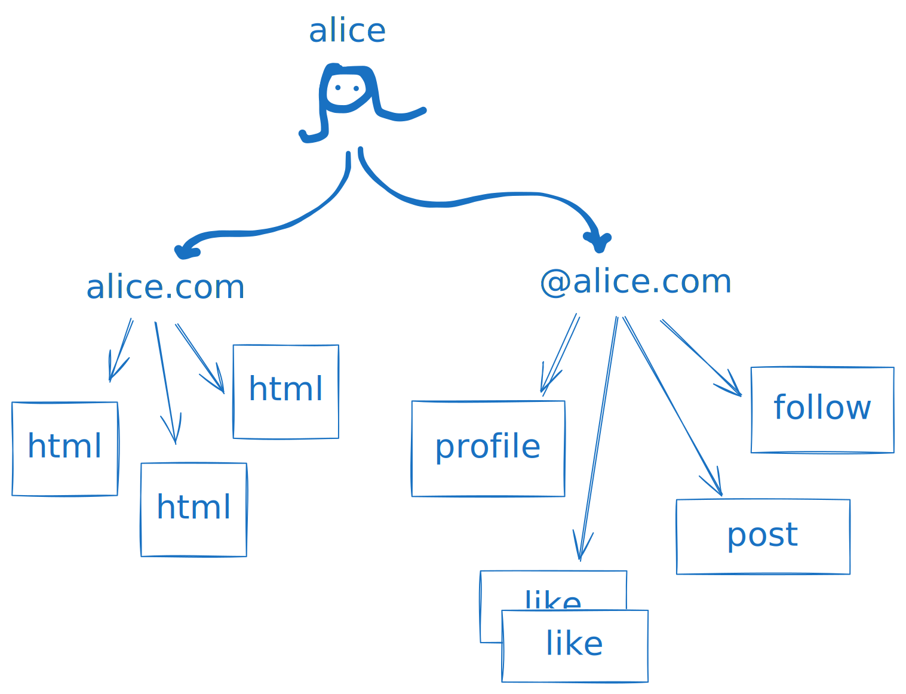

This "repository" is a regular web server that implements the [AT Protocol](https://atproto.com/) spec. The only job of Alice's personal repository is to store and serve data created by Alice in the form of signed JSON. Alice is technical, so she likes to sometimes inspect her repo using open source tools like [pdsls](https://pdsls.dev/), [Taproot](https://atproto.at/), or [atproto-browser](https://atproto-browser.vercel.app/).

Bob, however, isn't technical. He doesn't even know that there is a "repository" with his "data". He got a repository behind the scenes when he signed up for his first open social app. His repository stores *his* data (from all open social apps).

Have another look at this picture:

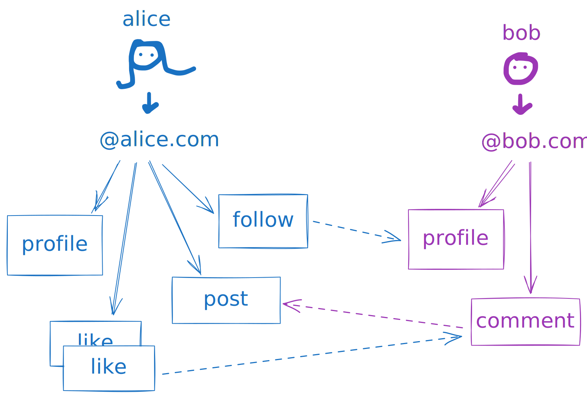

**These aren't rows in somebody's database. This is a web of hyperlinked JSON.** Just like every HTML page has an `https://` URI so other pages can link to it, every JSON record has an `at://` URI, so any other JSON record can link to it. (On this and other illustrations, `@alice.com` is a shorthand for `at://alice.com`.) The `at://` protocol is [a bunch of conventions](https://www.ietf.org/archive/id/draft-newbold-at-architecture-00.html) on top of DNS, HTTP, and JSON.

Now have a look at the arrows between their records. Alice follows Bob, so she has a `follow` record linking to Bob's `profile` record. Bob commented on Alice's post, so he has a `comment` record that links to Alice's `post` record. Alice liked his comment, so she has a `like` record with a link to his `comment` record. Everything Alice creates stays in her repo under her control, everything Bob creates stays in his repo under his control, and links express the connections--just like in HTML.

**All of this happens behind the scenes and is invisibile to a non-technical user.** The user doesn't need to think about where their data is stored until it matters, just like the user doesn't think about how servers work when navigating the web.

Alice's and Bob's repositories could be hosted on the same machine. Or they could be hosted by different companies or communities. Maybe Alice is self-hosting her repository, while Bob uses a free hosting service that came by default with his first open social app. They may even be running completely [different](https://github.com/bluesky-social/pds) [implementations](https://github.com/blacksky-algorithms/rsky/tree/main/rsky-pds). If both servers follow the AT protocol, they can participate in this web of JSON.

Note that `https://alice.com` and `at://alice.com` do not need to resolve to the same server. This is intentional so that having a nice handle like `@alice.com` doesn't *force* Alice to host her own data, to mess with her website, or even to *have* a site at all. If she owns `alice.com`, she can point `at://alice.com` at any server.

If Alice is unhappy with her hosting, she can pack up and leave:

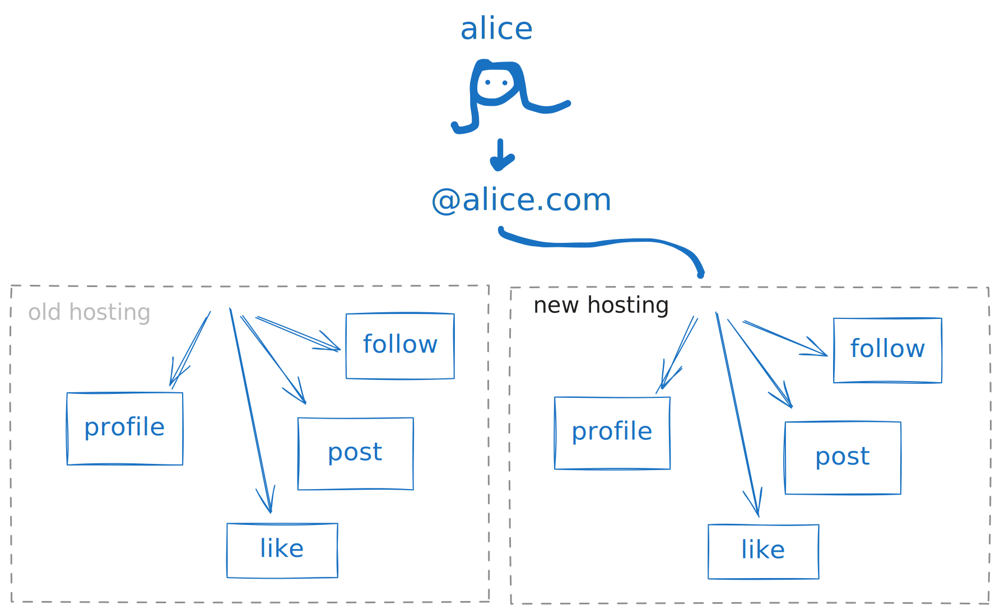

*(This requires a modicum of technical skill today but it's getting [more accessible](https://pdsmoover.com/info.html).)*

Just like with moving a personal site, changing where her repo is being served from doesn't require cooperation from the previous host. It also doesn't disrupt her ability to log into apps and doesn't break any links. The web repairs itself:

It is worth pausing for a moment to appreciate what we have here.

**Every bit of public data that Alice and Bob created--their posts, their likes, their comments, their recipes, their scrobbles--is meaningfully owned by them.** It's not in a database subject to some CEO's whims, but hosted *directly* on the open web, with ability to "walk away" without losing traffic or breaking any links.

Like the web of personal sites, this model is centered around the user.

What does it mean for apps?

Each open social app is like a CMS (content management system) for a subset of data that lives in its users' repositories. In that sense, your personal repository serves a role akin to a Google account, a Dropbox folder, or a Git repository, with data from your different open social apps grouped under different "subfolders".

When you make a post on [Bluesky](https://bsky.app/), Bluesky puts that post into *your* repo:

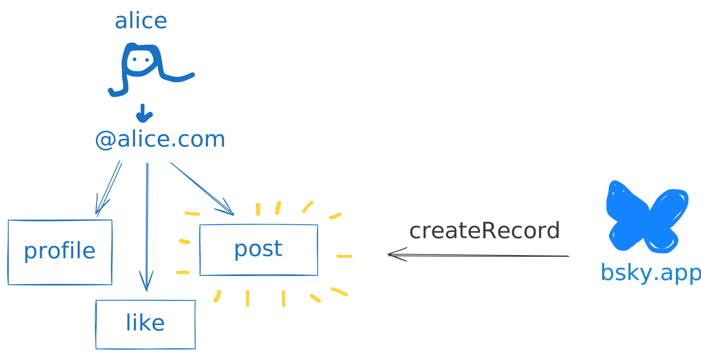

When you star a project on [Tangled](https://tangled.org/), Tangled puts that star into *your* repo:

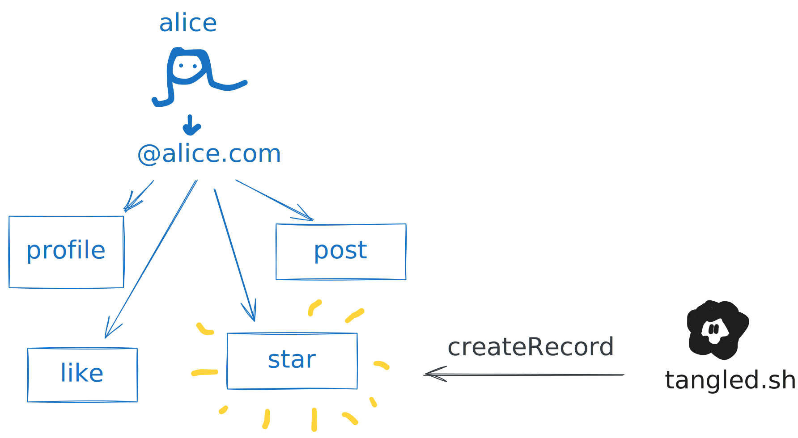

When you create a publication on [Leaflet](https://leaflet.pub), Leaflet puts it into *your* repo:

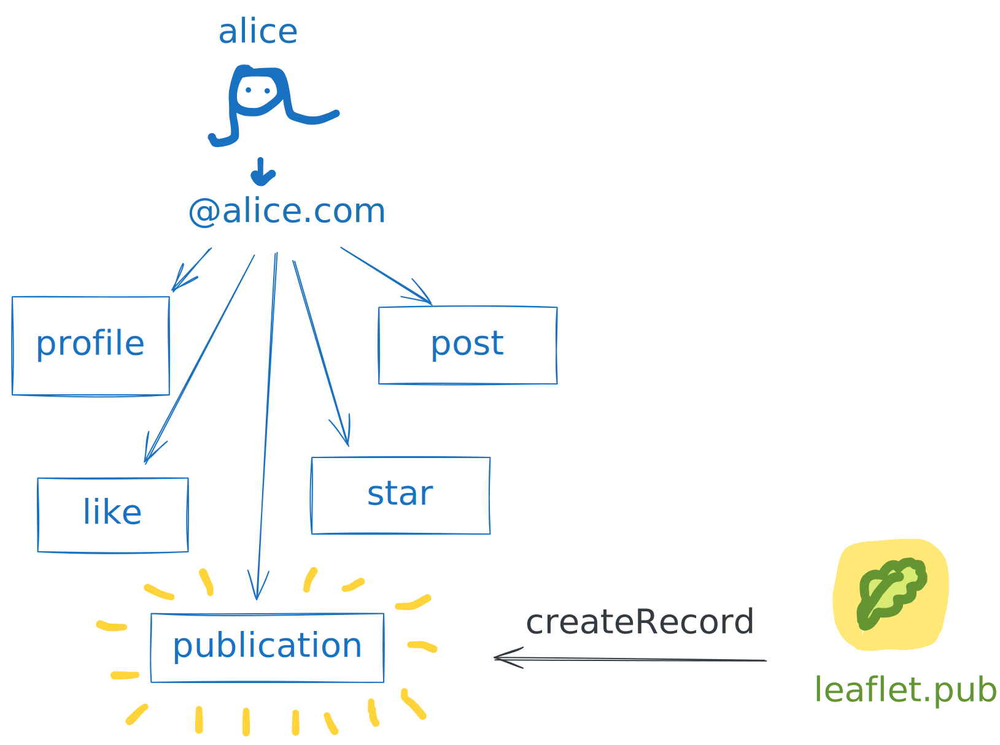

You get the idea.

Over time, your repo grows to be a collection of data from different open social apps. This data is open by default--if you wanted to look at my Bluesky posts, or Tangled stars, or Leaflet publications, you wouldn't need to hit these applications' APIs. You could just [hit my personal repository and enumerate all of its records](https://atproto-browser.vercel.app/at/danabra.mov).

To avoid naming collisions, the data in the repository is grouped by the format:

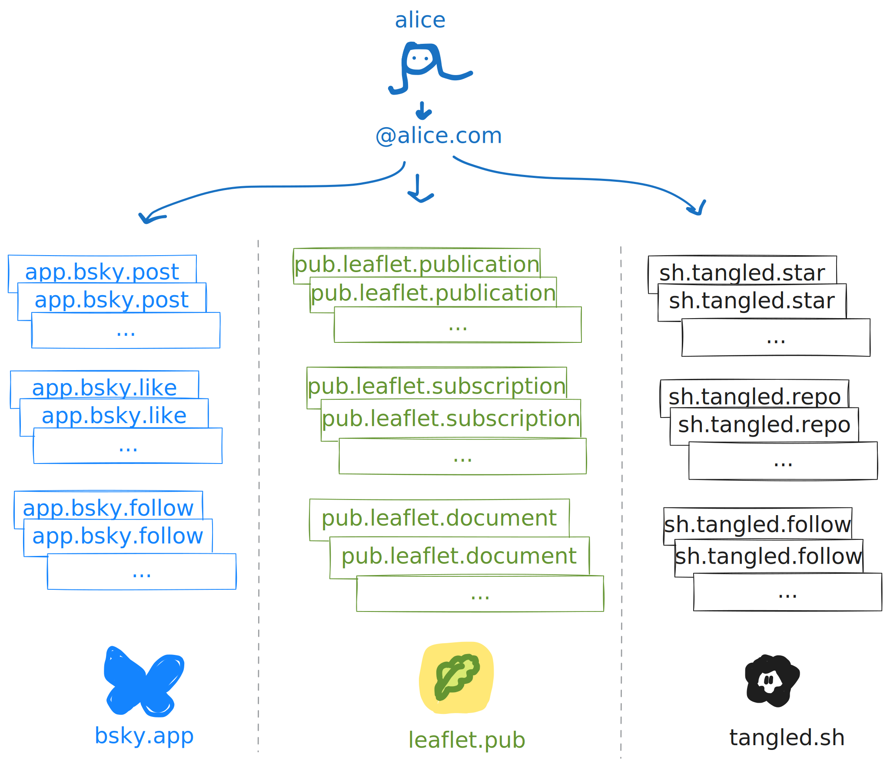

In any user's repo, Bluesky posts go with other Bluesky posts, Leaflet publications go with Leaflet publications, Tangled stars go with Tangled stars, and so on. Each data format is [controlled and evolved](https://www.pfrazee.com/blog/why-not-rdf#lexicon) by developers of the relevant application.

I've drawn a dotted line to separate them but perhaps this is misleading.

Since the data from different apps "lives together", there's a much lower barrier for open social apps to piggyback on each other's data. In a way, it starts to feel like a connected multiverse of apps, with data from one app "bleeding into" other apps.

When I signed up for Tangled, I chose to use my existing `@danabra.mov` handle. That makes sense since identity can be shared between open social apps. What's more interesting is that Tangled *prefilled* my avatar based on my Bluesky profile. It didn't need to hit the Bluesky API to do that; it just read the Bluesky profile record in my repository. **Every app can choose to piggyback on data from other apps.**

That might remind you of [Gravatar](https://gravatar.com/), but it works for *every piece of data*. Every open social app can take advantage of data created by every other open social app:

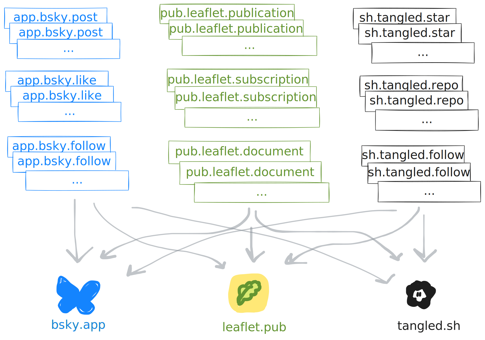

There is no API to hit, no integrations to build, nothing to get locked out of. All the data is in the user's repository, so you can parse it (as typed JSON), and use it.

The protocol *is* the API.

**This has deep implications for the lifecycle of products.** If a product gets shut down, the data doesn't disappear. It's still in its users' repos. Someone can build a replacement that makes this data comes back to life. Someone can build a new product that incorporates *some* of that data, or lets users choose what to import. Someone can build an alternative projection of existing data--*a forked product.*

This also reduces the "cold start" problem for new apps. If some of the data you care about already exists on the network, you can bootstrap your product off of that. For example, if you're launching a short video app, you can piggyback on the Bluesky `follow` records so that people don't have to find each other again. But if that doesn't make sense for your app, you can have your own `follow` records instead, or offer a one-time import. All existing data is up for reuse and remixing.

Some open social apps are explicitly based *around* this sort of remixing. [Anisota](https://anisota.net/) is primarily a Bluesky client, but it [natively supports](https://anisota.net/profile/dame.is/document/3lxankooyf22l) showing Leaflet documents. [Popfeed](https://popfeed.social/) can [cross-post reviews](https://bsky.app/profile/leaflet.pub/post/3lzjsw7c6os23) to both Bluesky and Leaflet. If Leaflet does get very popular, there's nothing stopping Bluesky itself from supporting a Leaflet document as another type of post attachment. In fact, some third-party Bluesky client could decide to do that first, and the official one could eventually follow.

This is why I like "open social" as a term.

**Open social frees up our data like open source freed up our code.** Open social ensures that old data can get a new life, that people can't be locked out of the web they've created, and that *products can be forked and remixed*. You don't need an "everything app" when data from different apps circulates in the open web.

If you're technical, by now you might have a burning question.

How the hell does aggregation work?!

Since every user's records live in *that user's* repository, there are millions (potentially billions?) of repositories. How can an app efficiently query, sort, filter, and aggregate information from them? Surely it can't search them on demand.

I've previously used a CMS as an analogy--for example, a blogging app could directly write posts to your repository and then read posts from it when someone visits your blog. This "singleplayer" use case would not require aggregation at all.

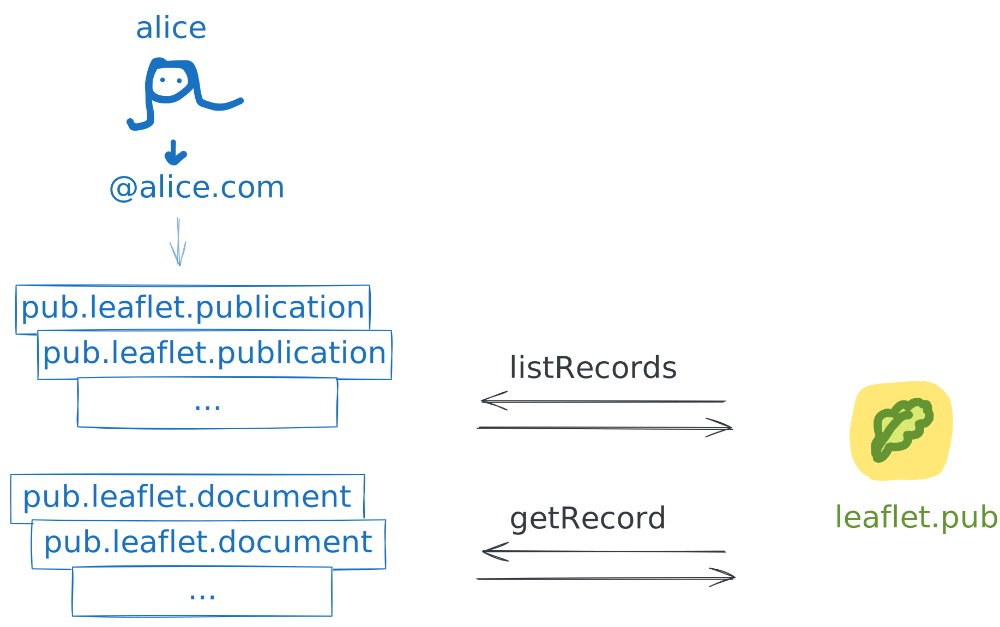

To avoid hitting the user's repository every time you want to display their blog post, you can connect to the user's repository by a websocket. Every time a record relevant to your app is created, updated, or deleted, you can update your database:

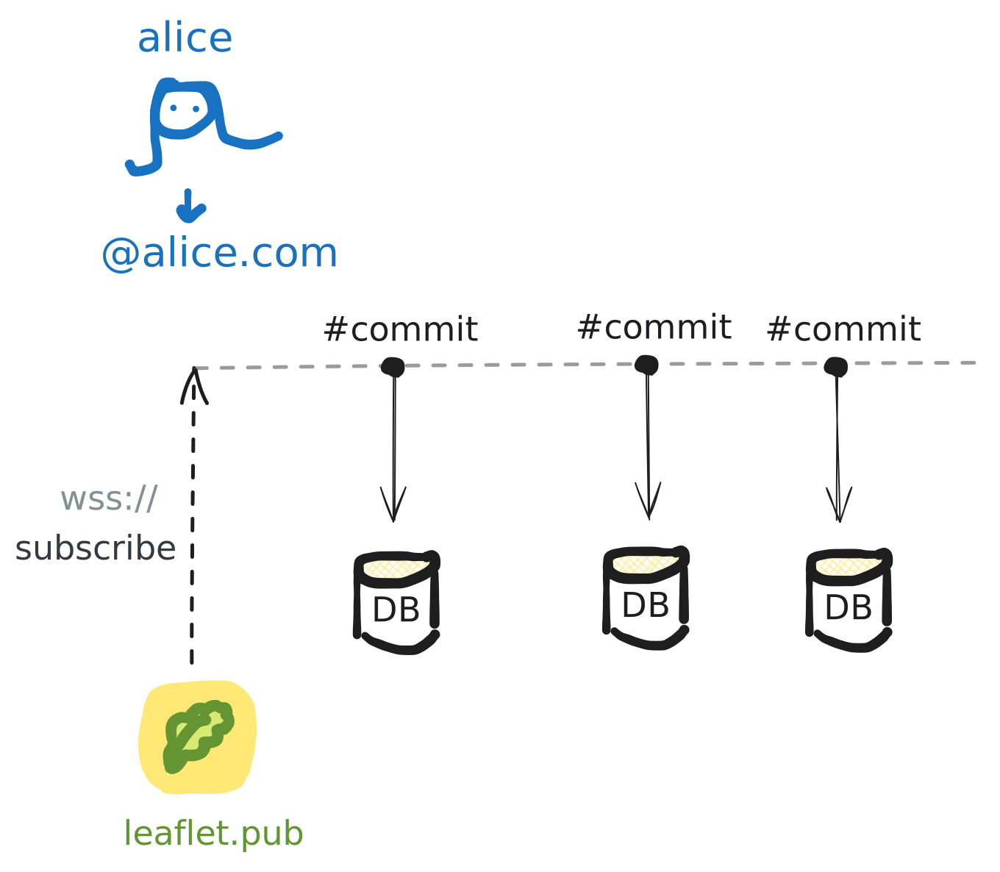

This database isn't the *source of truth* for user's data--it's more like an app-specific cache that lets you avoid going to the user repo whenever you need some data.

**Coincidentally, that's the exact mechanism you would use for aggregation.** You listen to events from all of your app users' repositories, write them to a local database, and query that database as much as you like with zero extra latency.

This might remind you of how Google Reader crawls RSS (rip).

To avoid opening a million event socket connections, it makes sense to listen to a stream that retransmits events from all known repositories on the network:

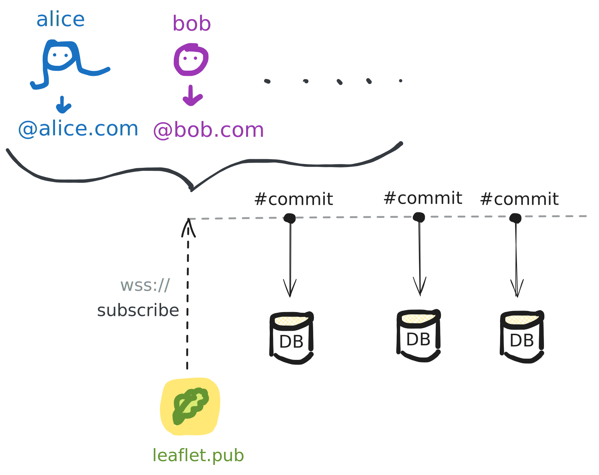

You can then filter down such a stream to just the events you're interested in, and then update your local database in response to the events your app cares about.

For example, Leaflet is only interested in events concerning `pub.leaflet.*` records. However, Leaflet can also *choose* to listen to other events. If Leaflet wanted to add a feature that shows backlinks to Bluesky discussions of a Leaflet document, it would simply start tracking `bsky.app.feed.post` records too. *(Edit: I've been informed that Leaflet [already does this](https://bsky.app/profile/o.simardcasanova.net/post/3luujudlr5c2j) to display quotes from Bluesky.)*

You can see the combined event stream from every known repository [here](https://pdsls.dev/jetstream?instance=wss%3A%2F%2Fjetstream1.us-east.bsky.network%2Fsubscribe):

<Video src="./jetstream.mp4" loop muted autoPlay playsInline />

 

This is a realtime stream of every single event on the network. It's dominated by `app.bsky.*` records because Bluesky is the most-used app, but you can filter it down to other record types. This retransmitter (called a "relay") is operated by Bluesky, but you don't have to depend on it. The [Blacksky community](https://github.com/blacksky-algorithms) runs [their own relay implementation](https://github.com/blacksky-algorithms/rsky/tree/main/rsky-relay) at `wss://atproto.africa`, which you can try [here](https://pdsls.dev/firehose?instance=wss%3A%2F%2Fatproto.africa). It doesn't matter which relay is used by which app--everyone "sees" the same web.

An important detail is that commits are cryptographically signed, which means that you don't need to trust a relay or a cache of network data. You can verify that the records haven't been tampered with, and each commit is legitimate. This is why "AT" in "AT Protocol" stands for "authenticated transfer". You're supposed to pronounce it like “@" ("at") though. Don't say "ay-tee" or you'll embarrass me!

As time goes by, we'll see more infrastructure built around and for open social apps. [Graze](https://www.graze.social/) is letting users build their own algorithmic feeds, and [Slices](https://slices.network/) is an upcoming developer platform that does large-scale repository indexing for you.

These are all technical details, though.

What matters is the big picture.

---

## The Big Picture

The pre-social web of "personalized sites" got data ownership, hosting independence, and linking right. Alice and Bob fully participate in the web:

The closed social web innovated in scaling and in social aggregation features. Notifications, search, and feeds are non-negotiable in modern social products:

However, the closed social web has also excluded *us* from the web. *The web we create* is no longer meaningfully ours. We're just rows in somebody else's database.

Open social frees the web we're creating from somebody else's boxes. Our profiles, likes, follows, recipes, scrobbles, and other content meaningfully belong to us:

The data no longer lives *inside* the products; the products *aggregate over* our data:

This blurs the boundaries between apps. Every open social app can use, remix, link to, and riff on data from every other open social app.

The web we've created remains after the products we used to create it are gone. Developers can build new products to recontextualize it. No one can take it away.

As more products are built in the open social paradigm, [there's going to be a shift.](https://knotbin.leaflet.pub/3lx3uqveyj22f/)

People might not ever start using technical concepts like "decentralization" but they do understand when data from one app can seamlessly flow into other apps.

People might not care about "federation" but they do notice when they log into a competing product, and their data is *already there*, and their reach is intact.

And people *do* understand when they're being fucked with.

For a long time, open social will rely on a community of [stubborn enthusiasts](https://bsky.app/profile/atprotocol.dev) who see the promise of the approach and are willing to bear the pains of building (and failing) in a new ecosystem. But I don't think that dooms the effort. That's the history of every big community-driven change. Somebody has to work through the kinks. Like with open source, open social is a compounding effort. Every mildly successful open social app lifts all open social apps. Every piece of shared infrastructure can benefit somebody else. At some point, open is bound to win.

I just hope it doesn't take thirty five years.
