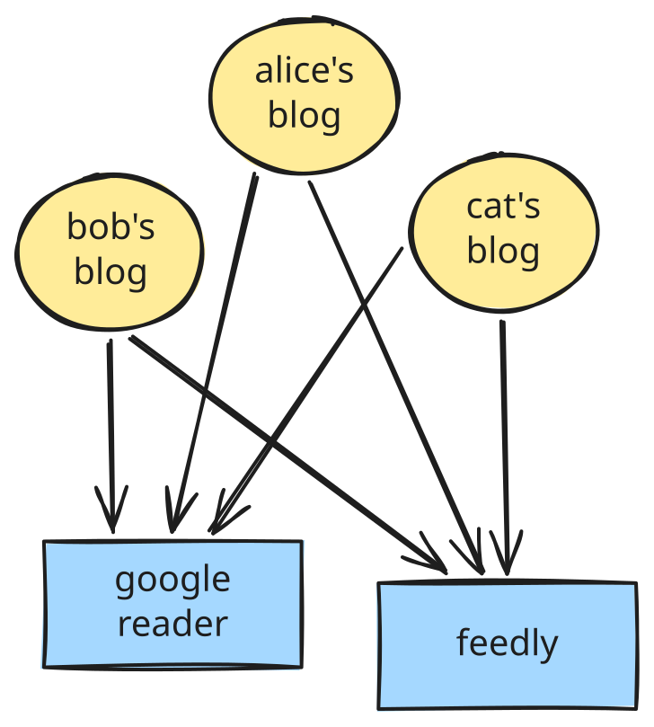
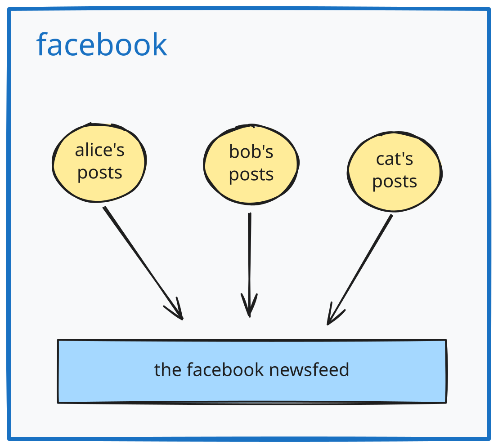
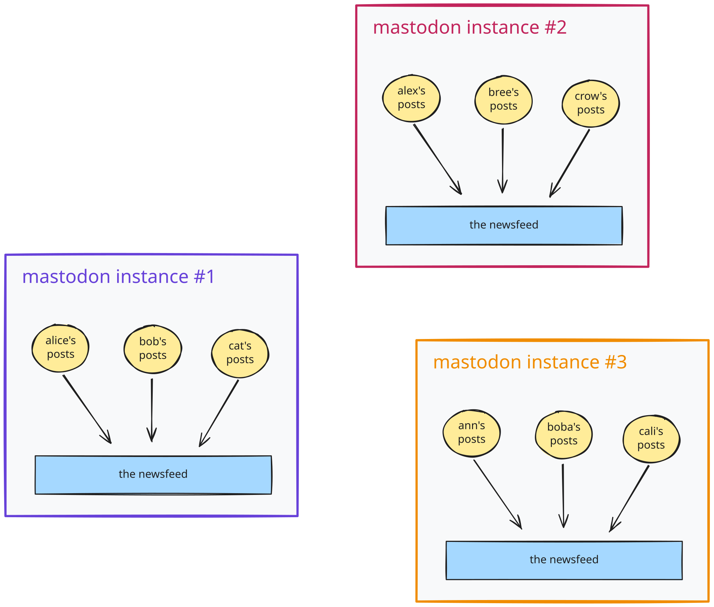
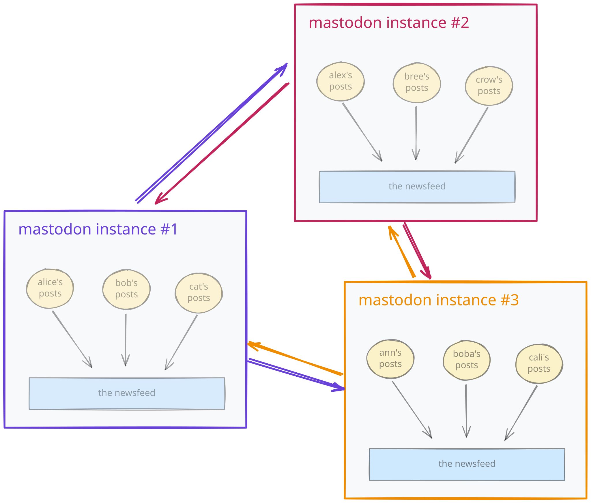
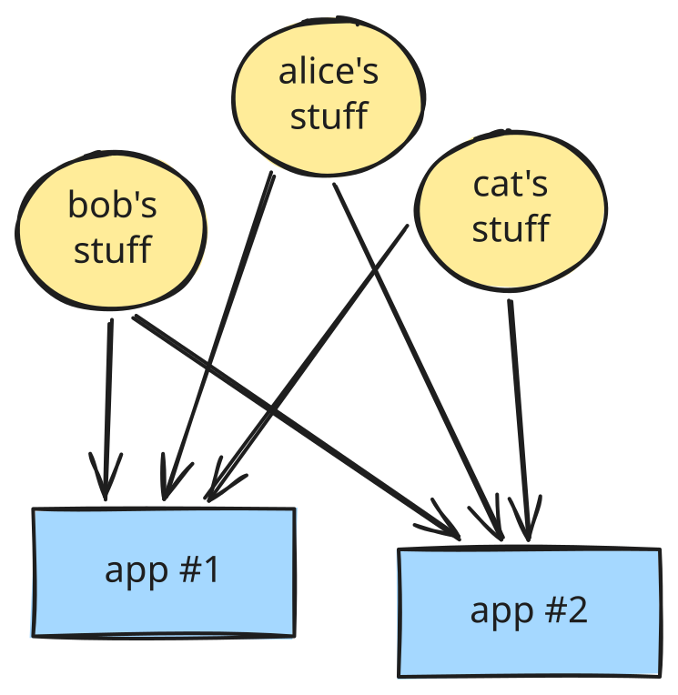
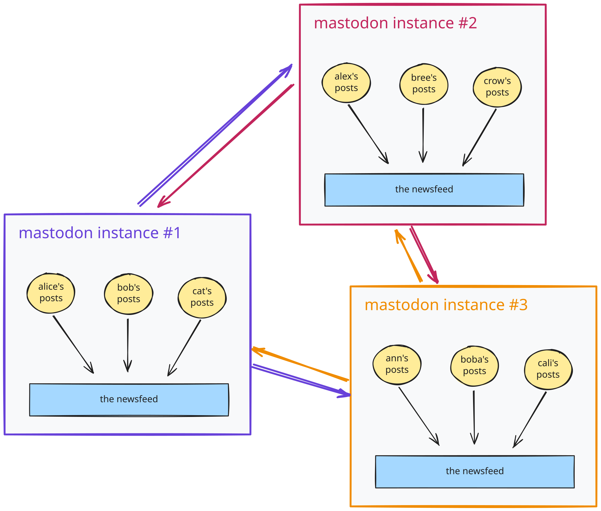
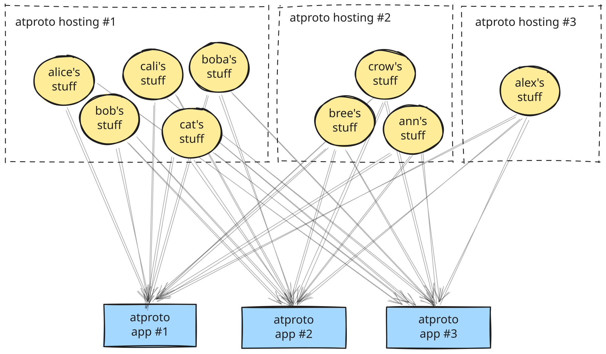

Every single time a post about [atproto](https://atproto.com/) hits Hacker News, somebody asks in the comments: "But where are all the Bluesky instances?”. The problem is, there are no instances in atproto! The question is a category error. Instances are a Mastodon-brained concept, and I wanted something I can link to that explains this clearly.

So this is that post.

---

## RSS and Google Reader

I know RSS is still being used somewhere (podcasts?!) but its heyday is arguably behind. Which is a shame. For a few years, which some of us might fondly remember as the golden age of the web, it felt like blogging was a cool thing.

Now look at this picture because it's going to be important:

As a reminder, you publish stuff on *your own* blog, which you can either self-host or host on a popular blogging platform. But then everyone's stuff *gets aggregated* into apps like Google Reader and Feedly, or collective blogs like [Monologue](https://www.mono-project.com/archived/monologue/) (RIP).

Note that **hosting and aggregation are two separate things**. Your posts don't "live" in an app like Google Reader. Apps are mere *projections* of the Blogosphere.

Seriously, make sure this thought sears into your brain; it's going to be essential.

---

## Facebook and Such

Here's what you could call an evolution of this concept.

We put a box around the whole thing so that everyone is enclosed in the same space so we can show ads and stuff. Also, let's leave only one app (we can let alternative apps live for a while, but not for long). That's traditional social media.

Oh no, now we have centralization!

Oh no, runaway network effects!

Oh no, [bla bla bla.](/open-social/#closed-social)

What do we do?

We need to decentralize this somehow.

---

## Mastodon and Its Instances

I say "Mastodon" here because if I say "ActivityPub" instead, a crowd of people will show up and say that *actually* what I'm describing is how Mastodon *chose* to implement ActivityPub. Whereas ActivityPub by itself does not *really* specify how to actually use it in practice. I'm sure this is all very interesting--but I digress.

**How do we decentralize a social network?**

Let's build a version of what we saw earlier, but make it self-hostable. Then every community can have their own "little Facebook" or "little Twitter". We'll call them *instances*. They're kind of like countries--because you live "inside" one of them:

But wait, this opens a bunch of questions.

How do you choose which instance to join? Maybe you're a member of a few overlapping communities. Well, I guess you're just gonna have to pick which community's admins you trust the most with handling your identity and data.

Okay, now another problem--what if my friend's on a different instance? How will they see my posts? Since each instance is basically its own little Facebook, they have no shared source of truth. So they have to send messages to each other:

This network topology might remind you of warrying fiefdoms in Ancient China.

If *Alice-from-instance-#1* follows *Bree-from-instance-#2*, the two instances make an agreement: Bree's posts will be forwarded to instance #1 so that Alice can see them. That's called "federation". You post on your instance, and then it gets forwarded to other instances whose users wanted to hear from you.

This picture has a few interesting implications:

- You "belong" to your instance. You're not *Alice*, you are *Alice-from-instance-#1*. That's why your Mastodon login is literally `yourname@someinstance.com`. "Where you're from" is an immutable part of your identity. (Somehow, this manages to be even more restrictive than countries and nationalities.)
- If your instance's admins pick a fight with another instance's admins, they may choose to "stop federating", and no longer forward any posts between them. That could be a surprising reason why you're no longer seeing posts from your friends.
- If your instance goes down, your identity *ceases to exist*. People who followed you followed *you-from-that-instance*, not some abstract platonic "actual you".

Oh, and the arrows between instances scale as <i>O(n²)</i>. This might not matter much now, but it could matter if this approach to social networking becomes popular.

---

## atproto

Now forget all of that—full reset.

The mistake was when we drew this box:

Erase the box.

Go back to this:

We have hosting where things actually "live", and apps *aggregate* from them. This worked for blogs just fine, so why wouldn't it work for literally everything else?

Like RSS, but [for](http://bsky.app/) [all](https://leaflet.pub/) [kinds](http://tangled.org/) [of](https://semble.so/) [stuff.](https://rpg.actor/)

That's atproto.

---

## So Where Are All the Bluesky Instances?

Now you know! There are no instances in atproto.

Instances are these Mastodon-brained things:

They're those isolated bundled hosting+app fiefdoms that send stuff to each other.

Compare this picture to atproto.

In atproto, we cut hosting apart from the aggregation at the network level:

There are no instances at all! There's hosting you can swap, and there are apps that aggregate from everyone's hosting. It's very much like RSS and Google Reader.

The decentralization of atproto is *richer in structure* than "many copies of one app":

- If you want to **swap your hosting,** you can. I literally did this today. Aside from [three or four UX snags](https://bsky.app/profile/did:plc:fpruhuo22xkm5o7ttr2ktxdo/post/3mon7oy66pc2e), it was all automatic. My atproto stuff is at [Eurosky](https://eurosky.tech/accounts/) now. If I were more adventurous, I could host all my data myself too [for free on Cloudflare](https://github.com/ascorbic/cirrus).

- If you want to **try new apps or make new apps,** you can do that too! Check out [Tangled](https://tangled.org/) and [Semble](https://semble.so/), which have nothing to do with Bluesky. I've made [my own app](https://sidetrail.app/) recently (and it's [open source](https://tangled.org/danabra.mov/sidetrail)). I recommend you to [try your hand at it too.](https://atproto.com/guides/statusphere-tutorial)

You care about decentralization? You have full agency here. Decentralize away.

---

## Free Yourself from the Instance Brain

Now you see why every decentralized social media discussion is derailed by this.

Mastodon users measure decentralization by the number of instances because *that's the only thing you can do in Mastodon*. If there's only one type of "box", and each box is "an app coupled with hosting", the only thing you can do is to host more of these boxes and get them to talk to each other. They're isolated by default.

In atproto, **every app is a projection of the whole Atmosphere,** just like Feedly and Google Reader are projections of the entire Blogosphere. You mostly "decentralize" by swapping your hosting, and/or by making and trying new apps. Running many full copies of the Bluesky database server is possible, but it's not any more useful than running many copies of Google Reader. People *do* set them up (cue [Blacksky](https://blacksky.community/)), but they arise to meet someone's *specific needs* (like a different moderation philosophy). There are other approaches too: [this Bluesky client](https://reddwarf.app/) has no dedicated database at all, and it just hits [a free community-run cache](https://constellation.microcosm.blue/) of everyone's hosting. Shared network infrastructure like Relays has been [cheap to run](https://whtwnd.com/bnewbold.net/3lo7a2a4qxg2l) for a year now.

This is why "counting Bluesky instances" is so misleading. What matters is:

1. Are people migrating to alternative hosting?
2. Are people trying and making new apps?

Separating hosting and apps fixes broken incentives in closed *and* in federated social. Coupling hosting and apps was the original sin, and the fix is simple.

Keep our stuff *outside* the apps; let the apps *aggregate over* it.

Like RSS and Google Reader.
