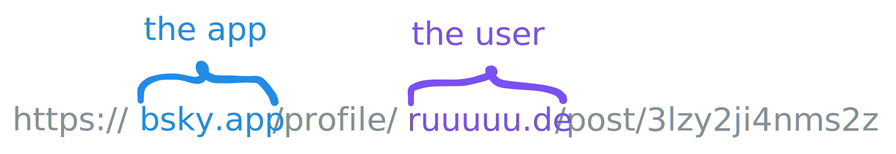
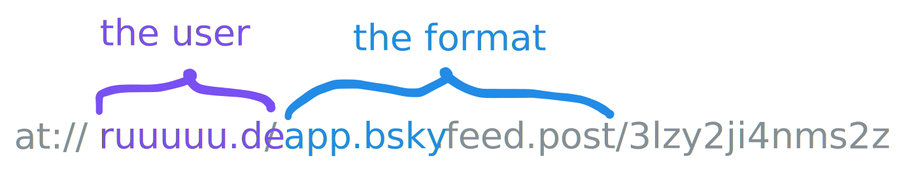
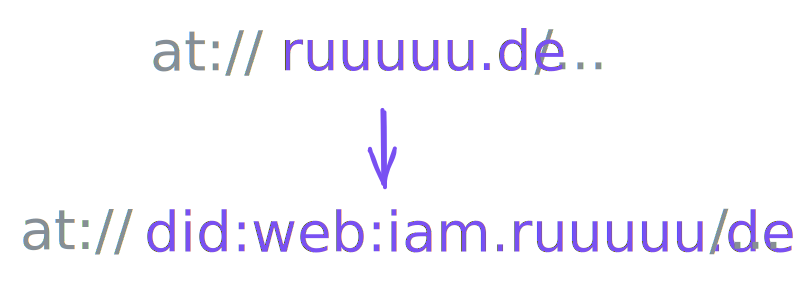
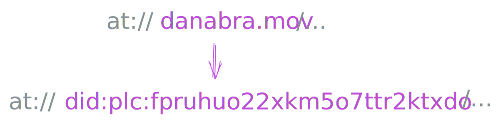
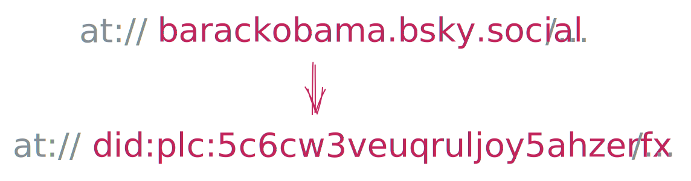
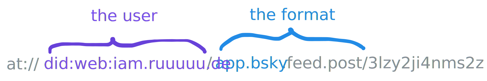
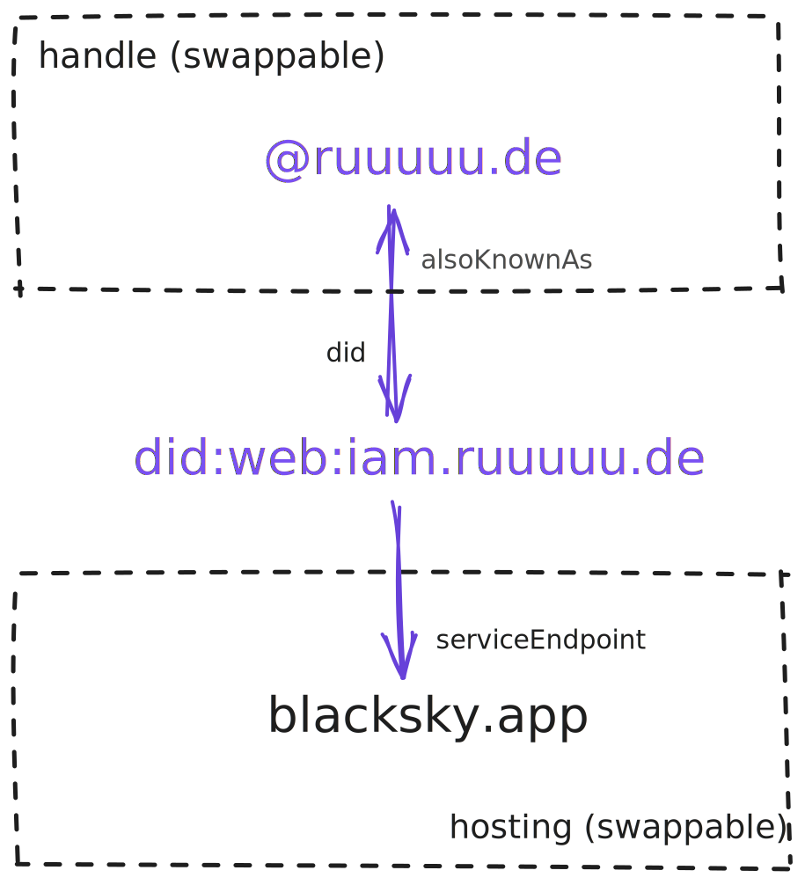
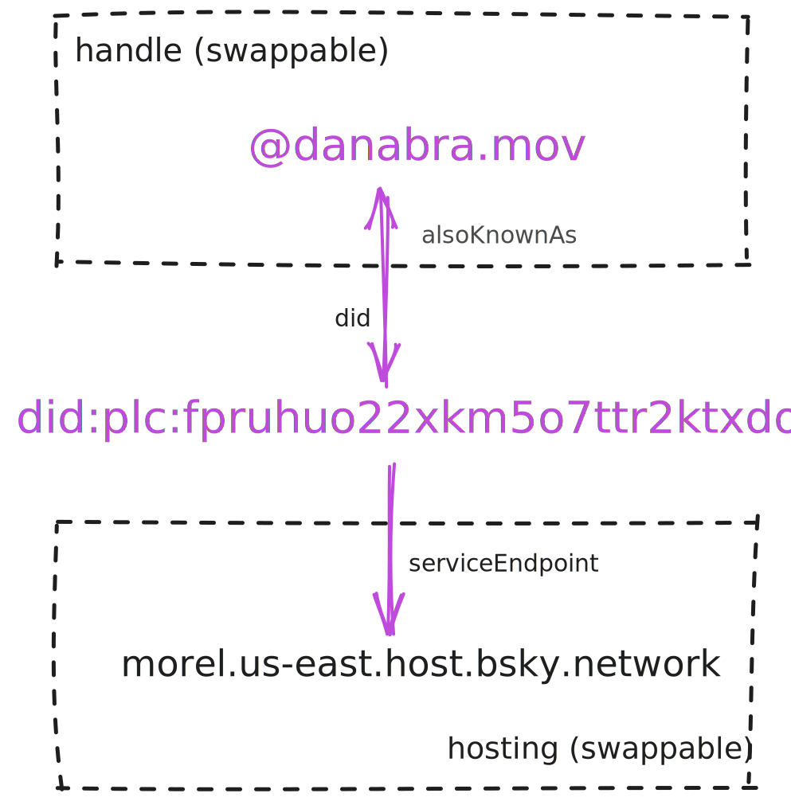

You might have heard about the AT protocol (if not, [read this!](/open-social/))

Together, all servers speaking the AT protocol comprise *the atmosphere*--a web of hyperlinked JSON. Each piece of JSON on the atmosphere has its own `at://` URI:

- <span style={{wordBreak: 'break-word'}}>[`at://ruuuuu.de/app.bsky.feed.post/3lzy2ji4nms2z`](https://pdsls.dev/at://ruuuuu.de/app.bsky.feed.post/3lzy2ji4nms2z)</span>
- <span style={{wordBreak: 'break-word'}}>[`at://danabra.mov/sh.tangled.feed.star/3m23ddgjpgn22`](https://pdsls.dev/at://danabra.mov/sh.tangled.feed.star/3m23ddgjpgn22)</span>
- <span style={{wordBreak: 'break-word'}}>[`at://tessa.germnetwork.com/pub.leaflet.publication/3lzz6juivnc2d`](https://pdsls.dev/at://tessa.germnetwork.com/pub.leaflet.publication/3lzz6juivnc2d)</span>

But where do they point, exactly?

Given an `at://` URI, how do you locate the corresponding JSON?

In this post, I'll show you the exact process of resolving an `at://` URI step by step. Turns out, this is also a great way to learn the details of how `at://` works.

Let's start with the structure of a URI itself.

---

### The User as the Authority

As you might know, a URI often contains a scheme (for example, `https://`), an *authority* (like `wikipedia.com`), a path (like `/Main_Page`), and maybe a query.

In most protocols, including `https://`, the authority part points at whoever's *hosting* the data. Whoever *created* this data is either not present, or is in the path:



**The `at://` protocol flips that around.**

In `at://` URIs, whoever *created* the data is the authority, in the most literal sense:



**The user is the authority for their own data.** Whoever's *hosting* the data could change over time, and is *not* directly included in an `at://` URI. To find out the actual physical server hosting that JSON, you're gonna need to take a few steps.

---

### A Post in the Atmosphere

Let's try to resolve this `at://` URI to the piece of JSON it represents:


An easy way to resolve an `at://` URI is using an [SDK](https://sdk.blue/) or a client app. Let's try an online client, for example, [pdsls](https://pdsls.dev/at://ruuuuu.de/app.bsky.feed.post/3lzy2ji4nms2z) or [Taproot](https://atproto.at/viewer?uri=at://ruuuuu.de/app.bsky.feed.post/3lzy2ji4nms2z) or [atproto-browser](https://atproto-browser.vercel.app/at/ruuuuu.de/app.bsky.feed.post/3lzy2ji4nms2z). They'll figure out the physical server where its JSON is currently hosted, and show that JSON for you.

**The above `at://` URI points at this JSON, wherever it is currently being hosted:**

```js
{
  "uri": "at://did:web:iam.ruuuuu.de/app.bsky.feed.post/3lzy2ji4nms2z",
  "cid": "bafyreiae4ehmkk4rtajs5ncagjhrsv6rj3v6fggphlbpyfco4dzddp42nu",
  "value": {
    "text": "posting from did:web, like a boss",
    "$type": "app.bsky.feed.post",
    "langs": ["en"],
    "createdAt": "2025-09-29T12:53:23.048Z"
  }
}
```

You can guess by the `$type` field being `"app.bsky.feed.post"` that this is some kind of a post (which might explain why it has fields like `text` and `langs`).

However, note that this piece of JSON represents a certain social media post *itself*, not a web page or a piece of some app. **It's pure data as a piece of JSON**, not a piece of UI. You may think of the `$type` stating the data *format*; the `app.bsky.*` prefix tells us that the `bsky.app` application might know something about what to do with it. Other applications [may also](https://bsky.app/profile/o.simardcasanova.net/post/3luujudlr5c2j) consume and produce data in this format.

A careful reader might notice that the `uri` in the JSON block is *also* an `at://` URI but it's slightly different from the original `at://` URI we requested:

```js
// What's at://ruuuuu.de/app.bsky.feed.post/3lzy2ji4nms2z ?
{
  "uri": "at://did:web:iam.ruuuuu.de/app.bsky.feed.post/3lzy2ji4nms2z",
  // ...
}
```

In particular, the short `ruuuuu.de` authority has expanded into a longer `did:web:iam.ruuuuu.de` authority. Maybe that's the physical host?

**Actually, no, that's not the physical host either**--it's something called an *identity*. Turns out, resolving an `at://` URI is done in three distinct steps:

1. Resolve the handle to an identity *("who are you?”)*
2. Resolve that identity to a hosting *("who holds your data?”)*
3. Request the JSON from that hosting *("what is the data?”)*

Let's go through each of these steps and see how they work.

---

### From Handles to Identities

The `at://` URIs you've seen earlier are fragile because they use handles. 

Here, `ruuuuu.de`, `danabra.mov`, and `tessa.germnetwork.com` are handles:

- <span style={{wordBreak: 'break-word'}}>[`at://ruuuuu.de/app.bsky.feed.post/3lzy2ji4nms2z`](https://pdsls.dev/at://ruuuuu.de/app.bsky.feed.post/3lzy2ji4nms2z) </span>
- <span style={{wordBreak: 'break-word'}}>[`at://danabra.mov/sh.tangled.feed.star/3m23ddgjpgn22`](https://pdsls.dev/at://danabra.mov/sh.tangled.feed.star/3m23ddgjpgn22)</span>
- <span style={{wordBreak: 'break-word'}}>[`at://tessa.germnetwork.com/pub.leaflet.publication/3lzz6juivnc2d`](https://pdsls.dev/at://tessa.germnetwork.com/pub.leaflet.publication/3lzz6juivnc2d)</span>

*(Read more about [domains as "internet handles" here.](/open-social/#open-social))*

The user may choose to change their `at://` handle later, and it is important for that not to break any links between pieces of JSON already on the network.

This is why, before you *store* an `at://` URI, you should turn it into a canonical form by resolving the handle to something that never changes--an *identity*. An identity is like an account ID, but global and meant for the entire web. There are two mechanisms to resolve a handle to an identity (also known as a “[DID](https://en.wikipedia.org/wiki/Decentralized_identifier)”):

1. Query the DNS TXT record at `_atproto.<handle>` looking for `did=???`
2. Make an HTTPS GET to `https://<handle>/.well-known/atproto-did`

The thing you're looking for, the DID, is going to have a shape like `did:something:whatever`. (We'll revisit what that means later.)

---

For example, let's try to resolve `ruuuuu.de` via the DNS mechanism:

```sh {6}
$ nslookup -type=TXT _atproto.ruuuuu.de
Server:		192.168.1.254
Address:	192.168.1.254#53

Non-authoritative answer:
_atproto.ruuuuu.de	text = "did=did:web:iam.ruuuuu.de"
```

Found it!

The `ruuuuu.de` handle *claims* to be owned by `did:web:iam.ruuuuu.de`, whoever that may be. That's all that we wanted to know at this point:



**Note this doesn't *prove* their association yet.** We'll need to verify that whoever controls the `did:web:iam.ruuuuu.de` identity "agrees" with `ruuuuu.de` being their handle. The mapping is bidirectional. But we'll confirm that in a later step.

---

Now let's try to resolve `danabra.mov` using the DNS route:

```sh {6}
$ nslookup -type=TXT _atproto.danabra.mov
Server:		192.168.1.254
Address:	192.168.1.254#53

Non-authoritative answer:
_atproto.danabra.mov	text = "did=did:plc:fpruhuo22xkm5o7ttr2ktxdo"
```

That also worked! The `danabra.mov` handle claims to be owned by the `did:plc:fpruhuo22xkm5o7ttr2ktxdo` identity, whoever that may be:



This DID looks a bit different than what you saw earlier but it's also a valid DID. Again, it's important to emphasize we've not confirmed the association yet.

---

Subdomains like `barackobama.bsky.social` can also be handles.

Let's try to resolve it:

```sh {6}
$ nslookup -type=TXT _atproto.barackobama.bsky.social
Server:		192.168.1.254
Address:	192.168.1.254#53

Non-authoritative answer:
*** Can't find _atproto.barackobama.bsky.social: No answer
```

The DNS mechanism didn't work, so let's try with HTTPS:

```sh {2}
$ curl https://barackobama.bsky.social/.well-known/atproto-did
did:plc:5c6cw3veuqruljoy5ahzerfx
```

That worked! This means that `barackobama.bsky.social` handle claims to be owned by the `did:plc:5c6cw3veuqruljoy5ahzerfx` identity, whoever that is:



So you get the idea. When you see a handle, you can probe it with DNS and HTTPS to see if it claims to be owned by some identity (a DID). If you found a DID, you'll then be able to (1) verify it actually owns that handle, and (2) locate the server that hosts the data for that DID. And that will be the server you'll ask for the JSON.

[In practice](https://docs.bsky.app/docs/advanced-guides/resolving-identities), if you're building with AT, you'll likely want to either deploy your own handle/did resolution cache or hit an existing one. (Here's [one implementation.](https://ngerakines.leaflet.pub/3lyea5xnhhc2w))

---

### AT Permalinks

Now you know how handles resolve to identities, also known as DIDs. Unlike handles, which change over time, DIDs never change--they're immutable.

These `at://` links, which use handles, are human-readable but fragile:

- <span style={{wordBreak: 'break-word'}}>[`at://ruuuuu.de/app.bsky.feed.post/3lzy2ji4nms2z`](https://pdsls.dev/at://ruuuuu.de/app.bsky.feed.post/3lzy2ji4nms2z) </span>
- <span style={{wordBreak: 'break-word'}}>[`at://danabra.mov/sh.tangled.feed.star/3m23ddgjpgn22`](https://pdsls.dev/at://danabra.mov/sh.tangled.feed.star/3m23ddgjpgn22)</span>
- <span style={{wordBreak: 'break-word'}}>[`at://tessa.germnetwork.com/pub.leaflet.publication/3lzz6juivnc2d`](https://pdsls.dev/at://tessa.germnetwork.com/pub.leaflet.publication/3lzz6juivnc2d)</span>

They will break if one of us changes a handle again.

In contrast, the `at://` links below, which use DIDs, will not break until we either delete our accounts, delete these records, or permanently take down our hosting:

- <span style={{wordBreak: 'break-word'}}>[`at://did:web:iam.ruuuuu.de/app.bsky.feed.post/3lzy2ji4nms2z`](https://pdsls.dev/at://did:web:iam.ruuuuu.de/app.bsky.feed.post/3lzy2ji4nms2z) </span>
- <span style={{wordBreak: 'break-word'}}>[`at://did:plc:fpruhuo22xkm5o7ttr2ktxdo/sh.tangled.feed.star/3m23ddgjpgn22`](https://pdsls.dev/at://did:plc:fpruhuo22xkm5o7ttr2ktxdo/sh.tangled.feed.star/3m23ddgjpgn22)</span>
- <span style={{wordBreak: 'break-word'}}>[`at://did:plc:ad4m72ykh2evfdqen3qowxmg/pub.leaflet.publication/3lzz6juivnc2d`](https://pdsls.dev/at://did:plc:ad4m72ykh2evfdqen3qowxmg/pub.leaflet.publication/3lzz6juivnc2d)</span>

So, really, this is the "true form" of an `at://` URI:



**Think of `at://` links with DIDs as "permalinks".** Any application *storing* `at://` URIs should store them in this canonical form so that logical links between our pieces of JSON don't break when we change our handles or change our hosting.

Now that you know how to resolve a handle to a DID, you want to do two things:

1. Verify that whoever owns this DID actually goes by that handle.
2. Find the server that hosts all the data for this DID.

You can do both of these things by fetching a piece of JSON called the *DID Document*. You can think of it as sort of a "passport" for a given DID.

How you do that depends on what kind of DID it is.

---

### From Identities to Hosting

Currently, there are two kinds of DIDs, known as *DID methods*, supported by the AT protocol: `did:web` (a [W3C draft](https://w3c-ccg.github.io/did-method-web/)) and `did:plc` ([specified](https://github.com/did-method-plc/did-method-plc) by Bluesky).

Let's compare them.

#### `did:web`

The `ruuuuu.de` handle claims to be owned by `did:web:iam.ruuuuu.de`:


To check this claim, let's find the DID Document for `did:web:iam.ruuuuu.de`. The [`did:web` method](https://w3c-ccg.github.io/did-method-web/) is a specification that specifies an [algorithm](https://w3c-ccg.github.io/did-method-web/#read-resolve) for that.

In short, you cut off the `did:web:` from the DID, append `/.well-known/did.json` to the end, and run an HTTPS GET request:

```sh
$ curl https://iam.ruuuuu.de/.well-known/did.json | jq
{
  "@context": [
    "https://www.w3.org/ns/did/v1",
    "https://w3id.org/security/multikey/v1",
    "https://w3id.org/security/suites/secp256k1-2019/v1"
  ],
  "id": "did:web:iam.ruuuuu.de",
  "alsoKnownAs": [
    "at://ruuuuu.de"
  ],
  "verificationMethod": [
    {
      "id": "did:web:iam.ruuuuu.de#atproto",
      "type": "Multikey",
      "controller": "did:web:iam.ruuuuu.de",
      "publicKeyMultibase": "zQ3shWHtz9QMJevcGBcffZBBqBfPo55jJQaVDuEG7ZwerALGk"
    }
  ],
  "service": [
    {
      "id": "#atproto_pds",
      "type": "AtprotoPersonalDataServer",
      "serviceEndpoint": "https://blacksky.app"
    }
  ]
}
```

This DID Document looks sleep-inducing but it tells us three important things:

- **How to refer to them.** The `alsoKnownAs` field confirms that whoever controls `did:web:iam.ruuuuu.de` indeed wants to use `@ruuuuu.de` as a handle. ✅
- **How to verify the integrity of their data.** The `publicKeyMultibase` field tells us the public key with which all changes to their data are signed.
- **Where their data is stored.** The `serviceEndpoint` field tells us the actual server with their data. Rudy's data is currently hosted at `https://blacksky.app`.

A DID Document really *is* like an internet passport for an identity: here's their handle, here's their signature, and here's their location. It connects a handle to a hosting while letting the identity owner change *either* the handle *or* the hosting.



Users who interact with `@ruuuuu.de` on different apps in the atmosphere don't need to know or care about his DID *or* about his current hosting (and whether it moves). From their perspective, his current handle is the only relevant identifier. As for developers, they'll refer to him by DID, which conveniently never changes.

All of this sounds great, but there is one big downside to the `did:web` identity. If `did:web:iam.ruuuuu.de` ever loses control of the `iam.ruuuuu.de` domain, he will lose control over his DID Document, and thus over his entire identity.

Let's have a look at an alternative to `did:web` that avoids this problem.

#### `did:plc`

We already know the `danabra.mov` handle claims to be owned by the `did:plc:fpruhuo22xkm5o7ttr2ktxdo` identity (actually, that's me!)


To check this claim, let's find the DID Document for `did:plc:fpruhuo22xkm5o7ttr2ktxdo`.

The [`did:plc` method](https://github.com/did-method-plc/did-method-plc) is a specification that specifies an [algorithm](https://github.com/did-method-plc/did-method-plc?tab=readme-ov-file#did-resolution) for that.

Essentially, you need to hit the [`https://plc.directory`](https://plc.directory) service with a `GET`:

```sh
$ curl https://plc.directory/did:plc:fpruhuo22xkm5o7ttr2ktxdo | jq

{
  "@context": [
    "https://www.w3.org/ns/did/v1",
    "https://w3id.org/security/multikey/v1",
    "https://w3id.org/security/suites/secp256k1-2019/v1"
  ],
  "id": "did:plc:fpruhuo22xkm5o7ttr2ktxdo",
  "alsoKnownAs": ["at://danabra.mov"],
  "verificationMethod": [
    {
      "id": "did:plc:fpruhuo22xkm5o7ttr2ktxdo#atproto",
      "type": "Multikey",
      "controller": "did:plc:fpruhuo22xkm5o7ttr2ktxdo",
      "publicKeyMultibase": "zQ3shopLMtAvvVrSsmWPE2pstFWY4xhGFBjkdRuETieUBozgo"
    }
  ],
  "service": [
    {
      "id": "#atproto_pds",
      "type": "AtprotoPersonalDataServer",
      "serviceEndpoint": "https://morel.us-east.host.bsky.network"
    }
  ]
}
```

The DID Document itself works exactly the same way. It specifies:

- **How to refer to me.** The `alsoKnownAs` field confirms that whoever controls `did:plc:fpruhuo22xkm5o7ttr2ktxdo` uses `@danabra.mov` as a handle. ✅
- **How to verify the integrity of my data.** The `publicKeyMultibase` field tells us the public key with which all changes to my data are signed.
- **Where my data is stored.** The `serviceEndpoint` field tells us the actual server with my data. It's currently at `https://morel.us-east.host.bsky.network`.

Let's visualize this:



Although my handle is `@danabra.mov`, the actual server storing my data is currently `https://morel.us-east.host.bsky.network`. I'm happy to keep hosting it there but I'm thinking of moving it to a host I control in the future. I can change both my handle and my hosting without disruption to my social apps.

Unlike Rudy, who has a `did:web` identity, I stuck with `did:plc` (which is the default one when you create an account on Bluesky) so that I'm not irrecovably tying myself to any web domain. "PLC" officially stands for a "Public Ledger of Credentials"--essentially, it is like an npm registry but for DID Documents. (Fun fact: originally PLC meant "placeholder" but they've decided [it's a good tradeoff.](https://www.youtube.com/watch?v=m9AVUAUDC2A))

The upside of a `did:plc` identity is that I can't lose my identity if I forget to renew a domain, or if something bad happens at the top level to my TLD.

The downside of a `did:plc` identity is that whoever operates the PLC registry has some degree of control over my identity. They can't outright *change* it because every version is recursively signed with the hash of the previous version, every past version is queryable, and the hash of the initial version itself *is* the DID itself.

However, in theory, whoever operates the PLC registry [could](https://github.com/did-method-plc/did-method-plc?tab=readme-ov-file#plc-server-trust-model) deny my requests to update the DID Document, or refuse to serve some information about it. Bluesky is currently moving PLC to [an independent legal entity in Switzerland](https://docs.bsky.app/blog/plc-directory-org) to address some of these concerns. The AT community is also [thinking](https://updates.microcosm.blue/3lz7nwvh4zc2u) and [experimenting](https://plc.wtf/).

---

### From Hosting to JSON

So far, you've learned how to:

* Resolve a handle to a DID.
* Grab the DID Document for that DID.

That actually tells you enough to get the JSON by its `at://` URI!

Each DID Document includes the `serviceEndpoint` which is the actual hosting. *That's* the service you can hit by HTTPS to grab any JSON record it stores.

For example, the `@ruuuuu.de` handle resolves to `did:web:iam.ruuuuu.de`, and its DID Document has a `serviceEndpoint` pointing at `https://blacksky.app`.

To get the [`at://ruuuuu.de/app.bsky.feed.post/3lzy2ji4nms2z`](https://pdsls.dev/at://ruuuuu.de/app.bsky.feed.post/3lzy2ji4nms2z) record, hit the `https://blacksky.app` server with the [`com.atproto.repo.getRecord`](https://docs.bsky.app/docs/api/com-atproto-repo-get-record) endpoint, passing different parts of the `at://` URI as parameters:

```sh
$ curl "https://blacksky.app/xrpc/com.atproto.repo.getRecord?\
repo=ruuuuu.de&collection=app.bsky.feed.post&rkey=3lzy2ji4nms2z" | jq
```

And there it is:

```json
{
  "uri": "at://did:web:iam.ruuuuu.de/app.bsky.feed.post/3lzy2ji4nms2z",
  "cid": "bafyreiae4ehmkk4rtajs5ncagjhrsv6rj3v6fggphlbpyfco4dzddp42nu",
  "value": {
    "text": "posting from did:web, like a boss",
    "$type": "app.bsky.feed.post",
    "langs": [
      "en"
    ],
    "createdAt": "2025-09-29T12:53:23.048Z"
  }
}
```

Now let's get [`at://danabra.mov/sh.tangled.feed.star/3m23ddgjpgn22`](https://pdsls.dev/at://danabra.mov/sh.tangled.feed.star/3m23ddgjpgn22):

- The `@danabra.mov` handle resolves to `did:plc:fpruhuo22xkm5o7ttr2ktxdo`.
- The DID Document for `did:plc:fpruhuo22xkm5o7ttr2ktxdo` points at `https://morel.us-east.host.bsky.network` as the current hosting.

Let's hit it:

```sh
$ curl "https://morel.us-east.host.bsky.network/xrpc/com.atproto.repo.getRecord?\
repo=danabra.mov&collection=sh.tangled.feed.star&rkey=3m23ddgjpgn22" | jq
```

And there you have it:

```json
{
  "uri": "at://did:plc:fpruhuo22xkm5o7ttr2ktxdo/sh.tangled.feed.star/3m23ddgjpgn22",
  "cid": "bafyreiaghm4ep5eeqx6yf55z43ge65qswwis7aiwc67rt7ni54jj6pg6fa",
  "value": {
    "$type": "sh.tangled.feed.star",
    "subject": "at://did:plc:dzmqinfp7efnofbqg5npjmth/sh.tangled.repo/3m232u6xrq222",
    "createdAt": "2025-09-30T20:09:02Z"
  }
}
```

And that's how you resolve an `at://` URI.

---

### In Conclusion

To resolve an arbitrary `at://` URI, you need to follow three steps:

1. Resolve the handle to an identity (using DNS and/or HTTPS).
2. Resolve that identity to a hosting (using the DID Document).
3. Request the JSON from that hosting (by hitting it with `getRecord`).

If you're building a client app or a small project, an [SDK](https://sdk.blue/) will handle all of this for you. However, for good performance, you'll want to hit a resolution cache instead of doing DNS/HTTPS lookups on every request. [QuickDID](https://quickdid.smokesignal.tools/) is one such cache. You can also check out the [pdsls source](https://tangled.org/@pdsls.dev/pdsls/blob/main/src/utils/api.ts) to see how exactly it handles resolution.

The AT protocol is fundamentally an abstraction over HTTP, DNS, and JSON. But by standardizing how these pieces fit together—putting the user in the authority position, separating identity from hosting, and making data portable—it turns the web into a place where [your content belongs to you](/open-social/), not to the apps that display it.

There's more to explore in the atmosphere, but now you know where it's `at://`.