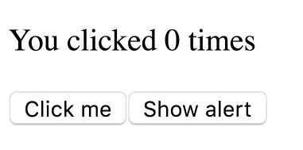
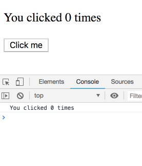
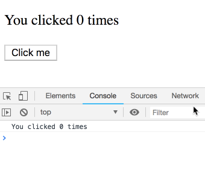
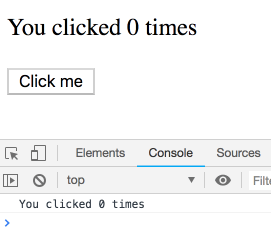
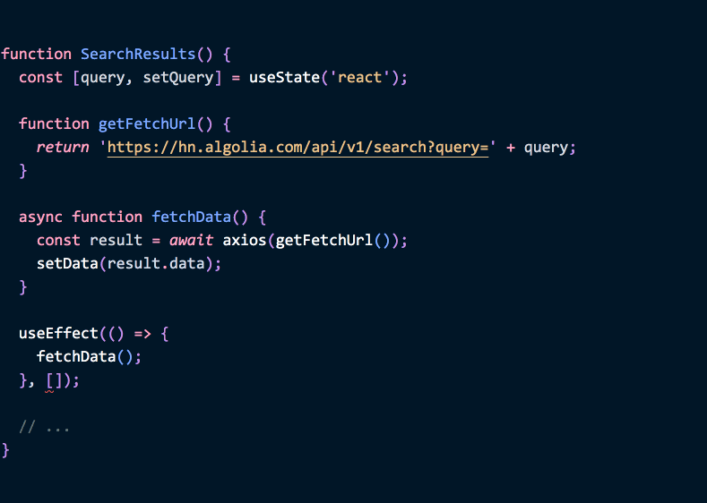

여러분은 [Hooks로(이하 훅)](https://reactjs.org/docs/hooks-intro.html) 몇 개의 컴포넌트를 작성해 봤을 겁니다. 아마 작은 앱에서라고 해도요. 아마 대체적으로 만족하셨겠죠. API가 편리하다는 느낌을 받고 벌써 몇 가지 트릭을 익히기도 했을 겁니다. 심지어 [커스텀 훅](https://reactjs.org/docs/hooks-custom.html)을 작성하여 반복되는 로직을 추출해내기도 했습니다(300줄의 코드가 줄어들었네요!). 그래서 동료들에게 보여주면 동료들은 "대단하네요" 라고 말하겠지요.

하지만 때때로 `useEffect` 를 쓸 때마다 뭔가 잘 들어맞지 않습니다. 뭔가 놓치고 있다는 기분을 느끼며 괴로움을 느끼기도 합니다. 처음에 보면 클래스 컴포넌트의 라이프사이클 메서드와 비슷하다고 느낍니다만... 정말 그럴까요? 점점 시간이 지나면서 스스로에게 아래와 같은 질문을 하게 됩니다.

- 🤔 `useEffect` 로 `componentDidMount` 동작을 흉내내려면 어떻게 하지?
- 🤔 `useEffect` 안에서 데이터 페칭(Data fetching)은 어떻게 해야할까? 두번째 인자로 오는 배열(`[]`) 은 뭐지?
- 🤔 이펙트를 일으키는 의존성 배열에 함수를 명시해도 되는걸까?
- 🤔 왜 가끔씩 데이터 페칭이 무한루프에 빠지는걸까?
- 🤔 왜 가끔씩 이펙트 안에서 이전 state나 prop 값을 참조할까?

제가 처음 훅을 사용할 때도, 위의 질문에 똑같이 혼란스러운 기분을 느꼈습니다. 심지어 초기 문서를 작성하면서도 나는 미묘한 부분에 대해 제대로 파악하지 못하고 있었습니다. 몇 번의 "아하 모먼트(aha moment, 특정 아이디어에 대해 영감을 얻게 되는 순간 등)" 를 겪고 나서 여러분들에게 알게된 점을 공유하고 싶습니다. **이 완벽 가이드를 통해 위의 질문에 명백하게 답해 드리겠습니다.**

답을 얻기에 앞서 한 발짝 뒤로 물러나야 합니다. 이 글의 목적은 단순히 요약된 정보를 목록 형태로 제공하는게 아닙니다. 진짜 목적은 여러분이 `useEffect` 를 "완전히" 이해하도록 만드는 것입니다. 실제로는 알아야 할 것이 그리 많지 않을 것입니다. 실제로 대부분의 시간을 이전에 배웠던 것을 잊어버리는데(unlearning) 할애할 것입니다.

**제가 `useEffect` 훅을 클래스 컴포넌트의 라이프사이클이라는 익숙한 프리즘을 통해 바라보는 것을 그만두자 모든 것이 명백하게 다가왔습니다.**

> "알고 있던 것을 전부 잊어버리게" - 요다  


- - - -

**이 글은 독자 여러분이 어느 정도 `useEffect` API에 익숙하다는 것을 전제로 합니다.**

**이 글은 *아주* 깁니다. 하나의 작은 책 수준입니다. 제가 개인적으로 선호하는 방식으로 작성했습니다. 하지만 서둘러 살펴보시거나 긴 글은 신경쓰고 싶지 않을 경우를 위해 바로 아래에 요약본(TLDR)을 달아 두었습니다.**

**깊이 파고드는 글이 불편하신 경우, 아래의 내용을 좀 더 알아듣기 쉽게 설명하는 다른 글이나 강좌가 나오길 기다리셔야 할 수도 있습니다. 리액트가 2013년에 처음 나온 뒤 개발자들이 기존과 다른 멘탈 모델을 익히고 다른 사람에게 가르치기 시작하기까지 시간이 좀 걸렸듯 말입니다.**

- - - -

## TLDR (Too Long; Didn't Read - 요약)

글 전체를 읽고 싶지 않은 분들을 위해 여기 요약본을 마련해 두었습니다. 읽다가 어떤 부분이 잘 이해가 되지 않으셨다면 연관된 부분이 나올 때까지 스크롤을 아래로 내려보세요.

만약 글 전체를 읽으실 거라면 편하게 스킵하셔도 됩니다. 이 부분으로 이동하는 링크를 글 끝에 달아 두겠습니다.

🤔 **질문:  `useEffect` 로 `componentDidMount` 동작을 흉내내려면 어떻게 하지?**

완전히 같진 않지만 `useEffect(fn, [])` 으로 가능합니다. `componentDidMount` 와 달리 prop과 state를 잡아둘 것입니다. 그래서 콜백 안에서도 초기 prop과 state를 확인할 수 있습니다. 만약 "최신의" 상태 등을 원한다면, ref에다 담아둘 수는 있습니다. 하지만 보통 더 간단하게 코드를 구조화하는 방법이 있기 때문에 굳이 이 방법을 쓸 필요도 없습니다. 이펙트를 다루는 멘탈 모델은 `componentDidMount` 나 다른 라이프사이클 메서드와 다르다는 점을 인지하셔야 합니다. 그리고 어떤 라이프사이클 메서드와 비슷한 동작을 하도록 만드는 방법을 찾으려고 하면 오히려 혼란을 더 키울 뿐입니다. 더 생산적으로 접근하기 위해 "이펙트 기준으로 생각해야(thinking in effects)" 하며 이 멘탈 모델은 동기화를 구현하는 것에 가깝지 라이프사이클 이벤트에 응답하는 것과는 다릅니다.

🤔 **질문:  `useEffect` 안에서 데이터 페칭은 어떻게 해야할까? 두번째 인자로 오는 배열(`[]`) 은 뭐지?**

[이 링크의 글이](https://www.robinwieruch.de/react-hooks-fetch-data/) `useEffect` 를 사용하여 데이터를 불러오는 방법을 파악하는데 좋은 기본서가 됩니다. 글을 꼭 끝까지 읽어보세요! 지금 읽고 계시는 글처럼 길지 않습니다. `[]` 는 이펙트에 리액트 데이터 흐름에 관여하는 어떠한 값도 사용하지 않겠다는 뜻입니다. 그래서 한 번 적용되어도 안전하다는 뜻이기도 합니다. 이 빈 배열은 실제로 값이 사용되어야 할 때 버그를 일으키는 주된 원인 중 하나입니다. 잘못된 방식으로 의존성 체크를 생략하는 것 보다 의존성을 필요로 하는 상황을 제거하는 몇 가지 전략을(주로 `useReducer`, `useCallback`) 익혀야 할 필요가 있습니다.

🤔 **질문: 이펙트를 일으키는 의존성 배열에 함수를 명시해도 되는걸까?**

추천하는 방법은 prop이나 state를 반드시 요구하지 않는 함수는 컴포넌트 바깥에 선언해서 호이스팅하고, 이펙트 안에서만 사용되는 함수는 이펙트 함수 내부에 선언하는 겁니다. 그러고 나서 만약에 랜더 범위 안에 있는 함수를 이펙트가 사용하고 있다면 (prop으로 내려오는 함수 포함해서), 구현부를 `useCallback` 으로 감싸세요. 왜 이런걸 신경써야 할까요? 함수는 prop과  state로부터 값을 "볼 수" 있습니다. 그러므로 리액트의 데이터 플로우와 연관이 있지요.  [자세한 답변](https://reactjs.org/docs/hooks-faq.html#is-it-safe-to-omit-functions-from-the-list-of-dependencies)은 훅 FAQ 부분에 있습니다.

🤔 **질문: 왜 가끔씩 데이터 페칭이 무한루프에 빠지는걸까?**

이펙트 안에서 데이터 페칭을 할 때 두 번째 인자로 의존성 배열을 전달하지 않았을 때 생길 수 있는 문제입니다. 이게 없으면 이펙트는 매 랜더마다 실행됩니다. 그리고 state를 설정하는 일은 또 다시 이펙트를 실행하죠. 의존성 배열에 항상 바뀌는 값을 지정해 두는 경우에도 무한 루프가 생길 수 있습니다. 하나씩 지워보면서 어느 값이 문제인지 확인할 수도 있지만, 사용하고 있는 의존 값을 지우는 일은(아니면 맹목적으로 `[]` 을 지정하는 것은) 보통 잘못된 해결법입니다. 그 대신 문제의 근원을 파악하여 해결해야 합니다. 예를 들어 함수가 문제를 일으킬 수 있습니다. 그렇다면 이펙트 함수 안에 집어넣거나, 함수를 꺼내서 호이스팅 하거나, `useCallback` 으로 감싸서 해결할 수 있습니다. 객체가 재생성되는 것을 막으려면 `useMemo` 를 비슷한 용도로 사용할 수 있습니다.

🤔 **질문: 왜 가끔씩 이펙트 안에서 이전 state나 prop 값을 참조할까?**

이펙트는 언제나 자신이 정의된 블록 안에서 랜더링이 일어날 때마다 prop과 state를 "지켜봅니다". 이렇게 하면 [버그를 방지할 수 있지만](https://overreacted.io/ko/how-are-function-components-different-from-classes/) 어떤 경우에는 짜증날 수 있습니다. 그럴 때는 명시적으로 어떤 값을 가변성 ref에 넣어서 관리할 수 있습니다(링크에 있는 글 말미에 설명되어 있습니다). 혹시 기대한 것과 달리 이전에 랜더링될 때의 prop이나 state가 보인다면, 아마도 의존성 배열에 값을 지정하는 것을 깜빡했을 겁니다. 이 [린트 규칙](https://github.com/facebook/react/issues/14920)을 사용하여 그 값을 파악할 수 있도록 연습해 보세요. 며칠 안으로 자연스레 몸에 밸 것입니다. 또한 FAQ 문서에서 [이 답변 부분을](https://reactjs.org/docs/hooks-faq.html#why-am-i-seeing-stale-props-or-state-inside-my-function) 읽어보세요.

- - - -

위 요악본이 도움이 되었으면 좋겠네요! 그럼 본론으로 들어가 보겠습니다.

- - - -

## 모든 랜더링은 고유의 Prop과 State가 있다

이펙트에 대해 이야기하기 전에, 먼저 랜더링에 대해 이야기해야 합니다.

여기 카운터 컴포넌트가 있습니다. 하이라이트된 줄을 자세히 봐 주세요.

```jsx{6}
function Counter() {
  const [count, setCount] = useState(0);

  return (
    <div>
      <p>You clicked {count} times</p>
      <button onClick={() => setCount(count + 1)}>
        Click me
      </button>
    </div>
  );
}
```

이게 무슨 뜻일까요? `count` 가 어찌저찌 state의 변화를 관찰하여 자동으로 업데이트 한다는 걸까요? 처음에 리액트를 배우면서 직관적으로 받아들일 때는 유용한 생각일 수 있지만 [정확한 멘탈 모델](https://overreacted.io/ko/react-as-a-ui-runtime/)은 아닙니다.

**이 예제에서 `count` 는 그저 숫자입니다.** 마법의 "데이터 바인딩" 이나 "워쳐" 나 "프록시", 혹은 비슷한 그 어떤 것도 아닙니다. 그냥 아래와 같이 단순한 숫자에 불과합니다.

```jsx
const count = 42;
// ...
<p>You clicked {count} times</p>
// ...
```

처음으로 컴포넌트가 랜더링될 때, `useState` 로부터 가져온 `count` 변수는 `0` 입니다. `setCount(1)` 을 호출하면, 다시 컴포넌트를 호출하고. 이 때 `count` 는 `1` 이 되는 식입니다.

```jsx{3,11,19}
// 처음 랜더링 시
function Counter() {
  const count = 0; // useState() 로부터 리턴
  // ...
  <p>You clicked {count} times</p>
  // ...
}

// 클릭하면 함수가 다시 호출된다
function Counter() {
  const count = 1; // useState() 로부터 리턴
  // ...
  <p>You clicked {count} times</p>
  // ...
}

// 또 한번 클릭하면, 다시 함수가 호출된다
function Counter() {
  const count = 2; // useState() 로부터 리턴
  // ...
  <p>You clicked {count} times</p>
  // ...
}
```

**state를 업데이트할 때마다, 리액트는 컴포넌트를 호출합니다. 매 랜더 결과물은 고유의 `counter`  상태 값을 "살펴봅니다". 그리고 이 값은 함수 안에 *상수로* 존재하는 값입니다.**

따라서 위에 표시한 줄은 어떠한 데이터 바인딩도 수행하지 않습니다.

```jsx
<p>You clicked {count} times</p>
```

**이건 랜더링 결과물에 숫자 값을 내장하는 것에 불과합니다.** 이 숫자 값은 리액트를 통헤 제공됩니다. `setCount` 를 호출할 때, 리액트는 다른 `count` 값과 함께 컴포넌트를 다시 호출합니다. 그러면 리액트는 가장 최신의 랜더링 결과물과 일치하도록 DOM을 업데이트 합니다.

명심하셔야 할 점은 여느 특정 랜더링 시 그 안에 있는 `count`  상수는 시간이 지난다고 바뀌는 것이 아니라는 것입니다. 컴포넌트가 다시 호출되고, 각각의 랜더링마다 격리된 고유의 `count` 값을 "보는" 것입니다.

(이 과정을 자세히 알고 싶다면, 제가 쓴 다른 글 [UI 런타임으로서의 React](https://overreacted.io/ko/react-as-a-ui-runtime/)를 읽어보세요.)

## 모든 랜더링은 고유의 이벤트 핸들러를 가진다

여기까진 할만하네요. 이벤트 핸들러의 경우는 어떨까요?

아래의 예제를 봐 주세요. 이 컴포넌트는 3초 뒤에 `count` 값과 함께 얼럿(alert)을 띄워줍니다.

```jsx{4-8,16-18}
function Counter() {
  const [count, setCount] = useState(0);

  function handleAlertClick() {
    setTimeout(() => {
      alert('You clicked on: ' + count);
    }, 3000);
  }
  return (
    <div>
      <p>You clicked {count} times</p>
      <button onClick={() => setCount(count + 1)}>
        Click me
      </button>
      <button onClick={handleAlertClick}>
        Show alert
      </button>
    </div>
  );
}
```

제가 단계별로 이런 과정을 실행해본다고 하죠.

- 카운터를 3으로 **증가시킨다**
- "Show alert" 을 **누른다**
- 타임아웃이 실행되기 전에 카운터를 5로 **증가시킨다**



이럴 때 얼럿에는 어떤 값이 나타날까요? 얼럿이 등장할 때의 값인 5가 나올까요? 아니면 제가 "Show alert" 버튼을 클릭할 당시의 값인 3이 나올까요?

- - - -

*스포 방지*

- - - -

한번 [직접 해 보세요!](https://codesandbox.io/s/w2wxl3yo0l)

만약에 실행해 본 결과가 잘 납득이 되지 않는다면, 조금 더 실질적인 예를 상상해 보세요. 채팅 앱에서 state에 현재 수신자 ID를 가지고 있는 상태에서 전송 버튼을 누른 것이나 마찬가지입니다. 왜 결과값으로 3이 나왔는지 [이 글이](https://overreacted.io/ko/how-are-function-components-different-from-classes/)  자세히 설명해 줍니다.

얼럿은 버튼을 클릭할 때의 state를 잡아둘 것입니다.

*(다른 방식으로 동작할 수 있도록 구현하는 방법도 있습니다만 지금은 일반적인 경우를 집중해서 다루겠습니다. 멘탈 모델을 형성할 때 중요한 것은 "가장 쉬운 방법"과 긴급 피난 해치를 구분하는 것입니다.)*

- - - -

그런데 왜 이렇게 동작할까요?

앞서 우리는 `count` 값이 매번 별개의 함수 호출마다 존재하는 상수값이라는 이야기를 했습니다. 이걸 특히 강조하고 싶은데, **우리의 함수는 여러번 호출되지만(랜더링마다 한 번씩), 각각의 랜더링에서 함수 안의 `count` 값은 상수이자 독립적인 값(특정 랜더링 시의 상태)으로 존재합니다.**

리액트만 특별이 이렇게 동작하는게 아닙니다. 보통의 함수도 같은 방식으로 동작합니다.

```jsx{2}
function sayHi(person) {
  const name = person.name;
  setTimeout(() => {
    alert('Hello, ' + name);
  }, 3000);
}

let someone = {name: 'Dan'};
sayHi(someone);

someone = {name: 'Yuzhi'};
sayHi(someone);

someone = {name: 'Dominic'};
sayHi(someone);
```

[이 예제에서](https://codesandbox.io/s/mm6ww11lk8), 외부의 `someone` 변수는 여러 번 재할당됩니다. (리액트 어딘가에서 *현재의* 컴포넌트 상태가 바뀔 수 있는 것처럼요.) **하지만 `sayHi` 내부에서, 특정 호출마다 `person` 과 엮여있는 `name` 이라는 지역 상수가 존재합니다.** 이 상수는 지역 상수이기 때문에, 각각의 함수 호출로부터 분리되어 있습니다! 결과적으로 타임아웃 이벤트가 실행될 때마다 각자의 얼럿은 고유의 `name` 을 기억하게 됩니다.

이 설명을 통해 클릭 시 우리의 이벤트 핸들러가 `count` 값을 잡아두었는지 알 수 있게 되었습니다. 또 한번 아래와 같이 치환해보면, 매 랜더링 마다 각각의 `count` 값을 "보는" 것입니다.

```jsx{3,15,27}
// 처음 랜더링 시
function Counter() {
  const count = 0; // useState() 로부터 리턴
  // ...
  function handleAlertClick() {
    setTimeout(() => {
      alert('You clicked on: ' + count);
    }, 3000);
  }
  // ...
}

// 클릭하면 함수가 다시 호출된다
function Counter() {
  const count = 1; // useState() 로부터 리턴
  // ...
  function handleAlertClick() {
    setTimeout(() => {
      alert('You clicked on: ' + count);
    }, 3000);
  }
  // ...
}

// 또 한번 클릭하면, 다시 함수가 호출된다
function Counter() {
  const count = 2; // useState() 로부터 리턴
  // ...
  function handleAlertClick() {
    setTimeout(() => {
      alert('You clicked on: ' + count);
    }, 3000);
  }
  // ...
}
```

따라서 효과적으로, 각각의 랜더링은 고유한 "버전"의 `handleAlertClick` 을 리턴합니다. 그리고 각각의 버전은 고유의 `count` 를 "기억합니다".

```jsx{6,10,19,23,32,36}
// 처음 랜더링 시
function Counter() {
  // ...
  function handleAlertClick() {
    setTimeout(() => {
      alert('You clicked on: ' + 0);
    }, 3000);
  }
  // ...
  <button onClick={handleAlertClick} /> // 0이 안에 들어있음
  // ...
}

// 클릭하면 함수가 다시 호출된다
function Counter() {
  // ...
  function handleAlertClick() {
    setTimeout(() => {
      alert('You clicked on: ' + 1);
    }, 3000);
  }
  // ...
  <button onClick={handleAlertClick} /> // 1이 안에 들어있음
  // ...
}

// 또 한번 클릭하면, 다시 함수가 호출된다
function Counter() {
  // ...
  function handleAlertClick() {
    setTimeout(() => {
      alert('You clicked on: ' + 2);
    }, 3000);
  }
  // ...
  <button onClick={handleAlertClick} /> // 2가 안에 들어있음
  // ...
}
```

그래서 [이 데모에서](https://codesandbox.io/s/w2wxl3yo0l) 이벤트 핸들러가 특정 랜더링에 "속해 있으며", 얼럿 표시 버튼을 클릭할 때 *그 랜더링 시점의* `counter` state를 유지한 채로 사용하는 것입니다.

**특정 랜더링 시 그 내부에서 props와 state는 영원히 같은 상태로 유지됩니다.** props와 state가 랜더링으로부터 분리되어 있다면, 이를 사용하는 어떠한 값(이벤트 핸들러를 포함하여)도 분리되어 있는 것입니다. 이들도 마찬가지로 특정 랜더링에 "속해 있습니다". 따라서 이벤트 핸들러 내부의 비동기 함수라 할지라도 같은 `count` 값을 "보게" 될 것입니다.

*참고 노트: 저는 위의 예제에서 `handleAlertClick` 함수 안에 직접 구체적인 `count` 값을 넣어서 표시했습니다. 이런 방식으로 치환하여 보는 것은 안전한데, `count` 는 각각의 랜더링 내부에서 변할 수 없는 값이기 때문입니다. `const` 로 선언되어있는 숫자 값이기 때문이죠. 객체와 같이 다른 값에 대해서도 같은 생각을 할 수 있습니다만, 오로지 불변 값을 사용한다는 전제가 있어야 합니다. `setSomething(newObj)` 를 호출할 때 객체를 변형하지 않고 새 객체를 전달하는 것은 괜찮습니다. 이전 랜더링에 속해 있는 state는 손상되지 않기 때문입니다.*

## 모든 랜더링은 고유의 이펙트를 가진다

이 글은 분명 이펙트에 대해 다루는 글인데 아직까지 이펙트 이야기를 하지 않았죠! 드디어 이펙트를 다루기 시작합니다. 사실 이펙트라고 그다지 다르진 않습니다.

[이 문서](https://reactjs.org/docs/hooks-effect.html)에 있는 예제로 돌아가 보겠습니다.

```jsx{4-6}
function Counter() {
  const [count, setCount] = useState(0);

  useEffect(() => {
    document.title = `You clicked ${count} times`;
  });
  return (
    <div>
      <p>You clicked {count} times</p>
      <button onClick={() => setCount(count + 1)}>
        Click me
      </button>
    </div>
  );
}
```

**여기서 하나 질문을 드리죠. 어떻게 이펙트가 최신의 `count` 상태를 읽어 들일까요?**

아마도 뭔가 "데이터 바인딩" 이라던가 "옵저버" 라던가 하는게 이펙트 함수 안에서 `count` 의 업데이트를 반영할까요? 아니면 `count` 는 가변값이라서 리액트가 컴포넌트 안에 값을 지정해주고 이펙트가 항상 최신 값을 바라볼 수 있게 해 주는 걸까요?

아닙니다.

우리는 이미 `count` 는 특정 컴포넌트 랜더링에 포함되는 상수라고 배웠습니다. 이벤트 핸들러는 그 랜더링에 "속한" `count` 상태를 "봅니다". `count` 는 특정 범위 안에 속하는 변수이기 때문입니다. 이펙트에도 똑같은 개념이 적용됩니다!

**"변화하지 않는" 이펙트 안에서 `count` 변수가 임의로 바뀐다는 뜻이 아닙니다. *이펙트 함수 자체가* 매 랜더링마다 별도로 존재합니다.**

각각의 이펙트 버전은 매번 랜더링에 "속한" `count` 값을 "봅니다".

```jsx{5-8,17-20,29-32}
// 최초 랜더링 시
function Counter() {
  // ...
  useEffect(
    // 첫 번째 랜더링의 이펙트 함수
    () => {
      document.title = `You clicked ${0} times`;
    }
  );
  // ...
}

// 클릭하면 함수가 다시 호출된다
function Counter() {
  // ...
  useEffect(
    // 두 번째 랜더링의 이펙트 함수
    () => {
      document.title = `You clicked ${1} times`;
    }
  );
  // ...
}

// 또 한번 클릭하면, 다시 함수가 호출된다
function Counter() {
  // ...
  useEffect(
    // 세 번째 랜더링의 이펙트 함수
    () => {
      document.title = `You clicked ${2} times`;
    }
  );
  // ..
}
```

리액트는 여러분이 제공한 이펙트 함수를 기억해 놨다가 DOM의 변화를 처리하고 브라우저가 스크린에 그리고 난 뒤 실행합니다.

따라서 비록 우리가 하나의 개념으로 *이펙트*를 이야기하고 있지만(도큐먼트의 타이틀을 업데이트 하는 동작), 사실 매 랜더링 마다 *다른 함수*라는 뜻입니다. 그리고 각각의 이펙트 함수는 그 랜더링에 "속한" props와 state를 "봅니다".

**개념적으로, 이펙트는 랜더링 결과의 일부라 생각할 수 있습니다.**

엄격하게 이야기하자면 그렇진 않습니다만(볼품 없는 문법이나 런타임 오버헤드 없이 [훅의 조합을 할 수 있도록](https://overreacted.io/why-do-hooks-rely-on-call-order/) 만들기 위해), 우리가 형성하고 있는 멘탈 모델 속에서 이펙트 함수는 이벤트 핸들러처럼 특정 랜더링에 속하는 함수라고 생각하시면 됩니다.

- - - -

더 자세하게 이해할 수 있도록, 첫 번째 랜더링을 되짚어 보겠습니다.

- 리액트: state가 `0` 일 때의 UI를 보여줘.
- 컴포넌트
  - 여기 랜더링 결과물로 `<p>You clicked 0 times</p>` 가 있어.
  - 그리고 모든 처리가 끝나고 이 이펙트를 실행하는 것을 잊지 마: `() => { document.title = 'You clicked 0 times' }`.
- 리액트: 좋아. UI를 업데이트 하겠어. 이봐 브라우저, 나 DOM에 뭘 좀 추가하려고 해.
- 브라우저: 좋아, 화면에 그려줄게.
- 리액트: 좋아 이제 컴포넌트 네가 준 이펙트를 실행할거야.
  - `() => { document.title = 'You clicked 0 times' }` 를 실행하는 중.

- - - -

그럼 버튼을 클릭하면 어떤 일이 벌어지는지 복습해 보시죠.

- 컴포넌트: 이봐 리액트, 내 상태를 `1` 로 변경해줘.
- 리액트: 상태가 `1` 일때의 UI를 줘.
- 컴포넌트
  - 여기 랜더링 결과물로 `<p>You clicked 1 times</p>` 가 있어.
  - 그리고 모든 처리가 끝나고 이 이펙트를 실행하는 것을 잊지 마: `() => { document.title = 'You clicked 1 times' }`.
- 리액트: 좋아. UI를 업데이트 하겠어. 이봐 브라우저, 나 DOM에 뭘 좀 추가하려고 해.
- 브라우저: 좋아, 화면에 그려줄게.
- 리액트: 좋아 이제 컴포넌트 네가 준 이펙트를 실행할거야.
  - `() => { document.title = 'You clicked 1 times' }` 를 실행하는 중.

- - - -

## 모든 랜더링은 고유의... 모든 것을 가지고 있다

이제 이펙트는 매 랜더링 후 실행되며, 그리고 개념적으로 컴포넌트 결과물의 일부로서 특정 랜더링 시점의 prop과 state를 "본다는" 것을 알았습니다.

생각이 맞는지 실험을 해 보겠습니다. 아래의 코드를 보시죠.

```jsx{4-8}
function Counter() {
  const [count, setCount] = useState(0);

  useEffect(() => {
    setTimeout(() => {
      console.log(`You clicked ${count} times`);
    }, 3000);
  });
  return (
    <div>
      <p>You clicked {count} times</p>
      <button onClick={() => setCount(count + 1)}>
        Click me
      </button>
    </div>
  );
}
```

제가 약간 뜸을 들이며 버튼을 여러번 누른다면 어떤 일이 일어날까요?

- - - -

*스포 주의*

- - - -

아마 이 문제는 일종의 함정이고 결과물은 일관되지 않으리라 생각하셨겠지만, 그렇지 않습니다! 로그는 순서대로 출력됩니다. 각각의 타이머는 특정 랜더링에 속하기 때문에 그 시점의 `count` 값을 가집니다. [직접 실험해보세요.](https://codesandbox.io/s/lyx20m1ol)



아마 "당연히 이렇게 동작하겠지! 어떻게 다르게 동작하겠어?" 라고 생각하실 수도 있습니다.

글쎄요. [클래스 컴포넌트로 만들면](https://codesandbox.io/s/kkymzwjqz3) 이렇게 동작하지 않았습니다. 이 링크의 클래스 컴포넌트도 함수 컴포넌트와 같은 동작을 하리라고 착각하기 쉽습니다.

```jsx
componentDidUpdate() {
  setTimeout(() => {
     console.log(`You clicked ${this.state.count} times`);
  }, 3000);
}
```

하지만 `this.state.count` 값은 특정 랜더링 시점의 값이 아니라 언제나 최신의 값을 가리킵니다. 그래서 매번 5가 찍혀있는 로그를 보게 됩니다.



저는 훅이 자바스크립트 클로저에 아주 많이 의존하고 있다는게 아이러니하다고 생각합니다. 이에 반해 클래스 컴포넌트는 [전통적으로 타임아웃에서 잘못된 값을 가져오는 문제에](https://wsvincent.com/javascript-closure-settimeout-for-loop/) 시달리고 있는데 이 문제는 주로 클로저와 연관이 있지요. 왜냐면 이 예시에서 발생한 진짜 문제의 근원은 클로저 자체가 아니라 가변값 변경(mutation)이기 때문입니다(리액트는 `this.state` 가 최신 상태를 가리키도록 변경합니다).

**클로저는 접근하려는 값이 절대 바뀌지 않을 때 유용합니다. 반드시 상수를 참조하고 있기 때문에 생각을 하기 쉽도록 만들어 줍니다.** 그리고 위에서 논의한 대로 props와 state는 특정 랜더링 안에서 절대 바뀌지 않습니다. 그나저나 클로저를 사용하여 위의 클래스 컴포넌트 예제를 고칠 수 있습니다... [클로저를 이용해서요.](https://codesandbox.io/s/w7vjo07055)

## 흐름을 거슬러 올라가기

이 시점에서 다시 한번 크게 뒤의 구절을 읊어보는게 중요합니다. "컴포넌트의 랜더링 안에 있는 **모든** 함수는 (이벤트 핸들러, 이펙트, 타임아웃이나 그 안에서 호출되는 API 등) 랜더(render)가 호출될 때 정의된 props와 state 값을 잡아둔다."

따라서 아래의 두 예제는 같습니다.

```jsx{4}
function Example(props) {
  useEffect(() => {
    setTimeout(() => {
      console.log(props.counter);
    }, 1000);
  });
  // ...
}
```

```jsx{2,5}
function Example(props) {
  const counter = props.counter;
  useEffect(() => {
    setTimeout(() => {
      console.log(counter);
    }, 1000);
  });
  // ...
}
```

**props나 state를 컴포넌트 안에서 일찍 읽어 들였는지 아닌지는 상관 없습니다.** 그 값들은 바뀌지 않을테니까요! 하나의 랜더링 스코프 안에서 props와 state는 변하지 않은 값으로 남아있습니다. (값들을 분해 할당하면 더 확실해집니다.)

물론 때때로 이펙트 안에 정의해둔 콜백에서 사전에 잡아둔 값을 쓰는 것이 아니라 최신의 값을 이용하고 *싶을 때가* 있습니다. 제일 쉬운 방법은 ref를 이용하는 것인데 [링크의 글](https://overreacted.io/how-are-function-components-different-from-classes/) 마지막 단락에 설명되어 있습니다.

과거의 랜더링 시점에서 *미래의* props나 state를 조회할 필요가 있을 때 주의하셔야 하는게, 이런 방식은 흐름을 거슬러 올라가는 일입니다. *잘못 되진* 않았지만 (어떤 경우에는 반드시 필요하고요) 패러다임에서 벗어나는게 덜 "깨끗해" 보일 수 있습니다. 아래의 코드는 의도적인 결과인데 하이라이트 쳐둔 코드는 타이밍에 민감하고 다루기 어렵기 때문입니다. 클래스 컴포넌트라면 언제 값을 조회하는지 덜 명확합니다.

여기 클래스 컴포넌트로 일으켰던 동작을 따라해본 버전의 [카운터 예제](https://codesandbox.io/s/rm7z22qnlp)가 있습니다.

```jsx{3,6-7,9-10}
function Example() {
  const [count, setCount] = useState(0);
  const latestCount = useRef(count);
  useEffect(() => {
    // 변경 가능한 값을 최신으로 설정한다
    latestCount.current = count;
    setTimeout(() => {
      // 변경 가능한 최신의 값을 읽어 들인다
      console.log(`You clicked ${latestCount.current} times`);
    }, 3000);
  });
  // ...
```



리액트로 어떠한 값을 직접 변경하는 것이 꺼림칙해 보입니다만, 리액트의 클래스 컴포넌트는 정확하게 이런 식으로 `this.state`  를 재할당하고 있습니다. 미리 잡아둔 props 및 state와는 달리 특정 콜백에서 `latestCount.current` 의 값을 읽어 들일 때 언제나 같은 값을 보장하지 않습니다. 정의된 바에 따라 이 값은 언제나 변경할 수 있습니다. 그렇기 때문에 이런 사용 방법은 기본 동작이 아니며, 여러분이 직접 가져다 써야 합니다.

## 그러면 클린업(cleanup)은 뭐지?

[문서에서 설명한 대로](https://reactjs.org/docs/hooks-effect.html#effects-with-cleanup), 어떤 이펙트는 클린업 단계를 가질 수도 있습니다. 본질적으로 클린업의 목적은 구독과 같은 이펙트를 "되돌리는" 것입니다.

아래의 코드를 보시죠.

```jsx
useEffect(() => {
  ChatAPI.subscribeToFriendStatus(props.id, handleStatusChange);
  return () => {
    ChatAPI.unsubscribeFromFriendStatus(props.id, handleStatusChange);
  };
});
```

첫 번째 랜더링에서 `prop` 이 `{id: 10}` 이고, 두 번째 랜더링에서 `{id: 20}` 이라고 해 봅시다. *아마도* 아래와 같은 흐름대로 흘러가리라 생각하실겁니다.

- 리액트가 `{id: 10}` 을 다루는 이펙트를 클린업한다.
- 리액트가 `{id: 20}` 을 가지고 UI를 랜더링한다.
- 리액트가 `{id: 20}` 으로 이펙트를 실행한다.

(실제는 조금 다릅니다)

위의 멘탈 모델대로라면, 클린업이 리랜더링 되기 전에 실행되고 이전의 prop을 "보고", 그 다음 새 이펙트가 리랜더링 이후 실행되기 때문에 새 prop을 "본다고"  생각할 수 있습니다. 이 멘탈 모델은 클래스의 라이프사이클을 그대로 옮겨 놓은 것과 같고, 여기서는 잘못된 내용입니다. 왜 그런지 알아봅시다.

리액트는 [브라우저가 페인트 하고 난 뒤에야](https://medium.com/@dan_abramov/this-benchmark-is-indeed-flawed-c3d6b5b6f97f) 이펙트를 실행합니다. 이렇게 하여 대부분의 이펙트가 스크린 업데이트를 가로막지 않기 때문에 앱을 빠르게 만들어줍니다. 마찬가지로 이펙트의 클린업도 미뤄집니다. **이전 이펙트는 새 prop과 함께 리랜더링 되고 난 *뒤에* 클린업됩니다.**

- 리액트가 `{id: 20}` 을 가지고 UI를 랜더링한다.
- 브라우저가 실제 그리기를 한다. 화면 상에서 `{id: 20}` 이 반영된 UI를 볼 수 있다.
- 리액트는 `{id: 10}` 에 대한 이펙트를 클린업한다.
- 리액트가 `{id: 20}` 에 대한 이펙트를 실행한다.

이상하게 느낄 수 있습니다. 그런데 어떻게 prop이 `{id: 20}` 으로 바뀌고 나서도 이전 이펙트의 클린업이 여전히 예전 값인 `{id: 10}` 을 "보는" 걸까요?

전에도 겪어 본 것 같군요... 🤔


이전 단락을 인용해 보자면

> 컴포넌트가 랜더링 안에 있는 **모든** 함수는 (이벤트 핸들러, 이펙트, 타임아웃이나 그 안에서 호출되는 API 등) 랜더가 호출될 때 정의된 props와 state 값을 잡아둔다.  

이제 답이 명확해졌네요! 어찌되었건 이펙트의 클린업은 "최신" prop을 읽지 않습니다. 클린업이 정의된 시점의 랜더링에 있던 값을 읽는 것입니다.

```jsx{8-11}
// 첫 번째 랜더링, props는 {id: 10}
function Example() {
  // ...
  useEffect(
    // 첫 번째 랜더링의 이펙트
    () => {
      ChatAPI.subscribeToFriendStatus(10, handleStatusChange);
      // 첫 번째 랜더링의 클린업
      return () => {
        ChatAPI.unsubscribeFromFriendStatus(10, handleStatusChange);
      };
    }
  );
  // ...
}

// 다음 랜더링, props는 {id: 20}
function Example() {
  // ...
  useEffect(
    // 두 번째 랜더링의 이펙트
    () => {
      ChatAPI.subscribeToFriendStatus(20, handleStatusChange);
      // 두 번째 랜더링의 클린업
      return () => {
        ChatAPI.unsubscribeFromFriendStatus(20, handleStatusChange);
      };
    }
  );
  // ...
}
```

왕국은 흥망성쇠를 거치고, 해는 수명을 다하여 백색 왜성으로 변할 것이며, 마지막 문명은 종말을 맞이할 것입니다. 하지만 그 어떠한 것도 첫 번째 랜더링의 클린업이 바라보는 값을 `{id: 10}` 이외의 것으로 만들 수 없습니다.

이렇게 리액트는 페인팅 이후 이펙트를 다루는게 기본이며 그 결과 앱을 빠르게 만들어 줍니다. 이전 props는 우리의 코드가 원한다면 남아 있습니다.

## 라이프사이클이 아니라 동기화

제가 리액트에서 제일 좋아하는 것 중 하나는 처음 랜더링 결과물과 그 업데이트를 통합하여 표현하고 있다는 점입니다. 이로 인해 여러분의 프로그램의 [엔트로피를 줄일 수 있습니다.](https://overreacted.io/the-bug-o-notation/)

제 컴포넌트가 이렇게 생겼다고 해 보죠.

```jsx
function Greeting({ name }) {
  return (
    <h1 className="Greeting">
      Hello, {name}
    </h1>
  );
}
```

제가 `<Greeting name="Dan" />` 을 랜더링 한 다음에 `<Greeting name="Yuzhi" />` 를 랜더링하던지, 아예 `<Greeting name="Yuzhi" />` 만 랜더링하던지 모든 경우의 결과는 "Hello, Yuzhi" 로 같습니다.

이런 말이 있습니다. "모든 것은 여정에 달렸지 목적지에 달린 것이 아니라" 고요. 리액트에 있어서는 정 반대로 적용됩니다. **모든 것은 목적지에 달렸지 여정에 달린게 아니다.** 이게 jQuery 코드에서 `$.addClass`, `$.removeClass` 를 호출하는 것과("여정") 리액트 코드에서 어떤 CSS클래스가 *있어야 하는지* 지정하는 것의 차이입니다("목적지").

**리액트는 우리가 지정한 props와 state에 따라 DOM과 동기화합니다.** 랜더링 시 "마운트" 와 "업데이트" 의 구분이 없습니다.

이펙트도 같은 방식으로 생각하셔야 합니다. **`useEffect` 는 리액트 트리 바깥에 있는 것들을 props와 state에 따라 *동기화* 할 수 있게 합니다.**

```jsx{2-4}
function Greeting({ name }) {
  useEffect(() => {
    document.title = 'Hello, ' + name;
  });
  return (
    <h1 className="Greeting">
      Hello, {name}
    </h1>
  );
}
```

위 코드는 친숙한 *마운트/업데이트/언마운트* 멘탈 모델과는 묘하게 다릅니다. 다르다는 것을 마음속에 담아두는 것이 중요합니다. **만약 컴포넌트가 첫 번째로 랜더링할 때와 그 후에 다르게 동작하는 이펙트를 작성하려고 하신다면, 흐름을 거스르는 것입니다!** 랜더링 결과물이 "목적지" 에 따라가는 것이 아니라 "여정" 에 따른다면 동기화에 실패합니다.

컴포넌트를 prop A, B, C 순서로 랜더링하던지, 바로 C로 랜더링하던지 별로 신경쓰이지 않아야 합니다. 잠깐 차이가 있을 수 있지만(예: 데이터를 불러올 때), 결국 마지막 결과물은 같아야 합니다.

당연하지만 여전히 모든 이펙트를 *매번* 랜더링마다 실행하는 것은 효율이 떨어질 수 있습니다. (그리고 어떤 경우에는 무한루프를 일으킬 수 있지요.)

그렇다면 어떻게 이 문제를 해결할 수 있을까요?

## 리액트에게 이펙트를 비교하는 법을 가르치기

우리는 이미 DOM 그 자체에 대해서는 배웠습니다. 매번의 리랜더링마다 DOM 전체를 새로 그리는 것이 아니라, 리액트가 실제로 바뀐 부분만 DOM을 업데이트 합니다.

아래의 컴포넌트를

```jsx
<h1 className="Greeting">
  Hello, Dan
</h1>
```

이렇게 바꾼다면

```jsx
<h1 className="Greeting">
  Hello, Yuzhi
</h1>
```

리액트는 두 객체를 비교합니다.

```jsx
const oldProps = {className: 'Greeting', children: 'Hello, Dan'};
const newProps = {className: 'Greeting', children: 'Hello, Yuzhi'};
```

각각의 prop을 짚어보고 `children` 이 바뀌어서 DOM 업데이트가 필요하다고 파악했지만 `className` 은 그렇지 않습니다. 그래서 그저 아래의 코드만 호출됩니다.

```jsx
domNode.innerText = 'Hello, Yuzhi';
// domNode.className 은 건드릴 필요가 없다
```

**이펙트에도 이런 방법을 적용할 수 있을까요? 이펙트를 적용할 필요가 없다면 다시 실행하지 않는 것이 좋을텐데요.**

예를 들어 아마 아래의 컴포넌트는 상태 변화 때문에 다시 랜더링 될 것입니다.

```jsx{11-13}
function Greeting({ name }) {
  const [counter, setCounter] = useState(0);

  useEffect(() => {
    document.title = 'Hello, ' + name;
  });

  return (
    <h1 className="Greeting">
      Hello, {name}
      <button onClick={() => setCounter(count + 1)}>
        Increment
      </button>
    </h1>
  );
}
```

하지만 이펙트는 `counter` 상태값을 사용하지 않습니다. **이펙트는 `document.title` 과 `name` prop을 동기화하지만, `name` prop은 같습니다.** `document.title` 을 매번 카운터 값이 바뀔때마다 재할당하는 것은 그다지 이상적으로 보이지 않습니다.

좋아요, 그렇다면... 리액트가 그냥 이펙트를 비교하면 안 될까요?

```jsx
let oldEffect = () => { document.title = 'Hello, Dan'; };
let newEffect = () => { document.title = 'Hello, Dan'; };
// 리액트가 이 배열을 같은 배열이라고 인식할 수 있을까?
```

그렇게는 안되겠네요. 리액트는 함수를 호출해보지 않고 함수가 어떤 일을 하는지 알아낼 수 없습니다. (저 코드는 특정한 값을 포함하고 있는 것이 아니라 `name` prop에 있는 것을 담아왔을 뿐입니다.)

그래서 특정한 이펙트가 불필요하게 다시 실행되는 것을 방지하고 싶다면 의존성 배열을("deps" 라고 알려진 녀석이죠) `useEffect` 의 인자로 전달할 수 있는 것입니다.

```jsx{3}
useEffect(() => {
  document.title = 'Hello, ' + name;
}, [name]); // 우리의 의존성
```

**이건 마치 우리가 리액트에게 "이봐, 네가 이 함수의 *안을* 볼 수 없는 것을 알고 있지만, 랜더링 스코프에서 `name` 외의 값은 쓰지 않는다고 약속할게." 라고 말하는 것과 같습니다.**

현재와 이전 이펙트 발동 시 이 값들이 같다면 동기화할 것은 없으니 리액트는 이펙트를 스킵할 수 있습니다.

```jsx
const oldEffect = () => { document.title = 'Hello, Dan'; };
const oldDeps = ['Dan'];

const newEffect = () => { document.title = 'Hello, Dan'; };
const newDeps = ['Dan'];

// 리액트는 함수 안을 살펴볼 수 없지만, deps를 비교할 수 있다.
// 모든 deps가 같으므로, 새 이펙트를 실행할 필요가 없다.
```

랜더링 사이에 의존성 배열 안에 있는 값이 하나라도 다르다면 이펙트를 스킵할 수 없습니다. 모든 것을 동기화해야죠!

## 리액트에게 의존성으로 거짓말하지 마라

의존성에 대해 리액트에게 거짓말을 할 경우 좋지 않은 결과를 가져옵니다. 직관적으로 이게 말은 됩니다만, 클래스 컴포넌트에 익숙한 멘탈 모델을 가진 대부분의 사람들이 `useEffect` 을 쓸 때 그 규칙을 어기려는 모습을 봤습니다. (심지어 저도 처음에는 그랬어요!)

```jsx
function SearchResults() {
  async function fetchData() {
    // ...
  }

  useEffect(() => {
    fetchData();
  }, []); // 이게 맞을까요? 항상 그렇진 않지요. 그리고 더 나은 방식으로 코드를 작성하는 방법이 있습니다.

  // ...
}
```

*([Hooks FAQ](https://reactjs.org/docs/hooks-faq.html#is-it-safe-to-omit-functions-from-the-list-of-dependencies)에서 그 대신 어떻게 해야하는지 설명합니다. 위의 예제는 [아랫부분](https://overreacted.io/a-complete-guide-to-useeffect/#moving-functions-inside-effects)에서 다시 다루겠습니다.)*

"하지만 저는 마운트 될 때만 이펙트를 실행하고 싶다고요!" 라고 하실 수 있습니다. 일단 지금은 deps를 지정한다면, **컴포넌트에 있는 *모든* 값 중 그 이펙트에 사용될 값은 *반드시* 거기 있어야 한다**는 것을 기억해 두세요. props, state, 함수들 등 컴포넌트 안에 있는 모든 것 말입니다.

가끔은 위의 코드처럼 하면 문제를 일으킵니다. 예를 들어 데이터 불러오는 로직이 무한 루프에 빠질 수도 있고, 소켓이 너무 자주 반응할 수도 있습니다. **이런 문제를 해결하는 방법은 의존성을 제거하는 것이 *아닙니다.*** 곧 그 해결책을 살펴보겠습니다.

먼저 해결책으로 넘어가기 전에, 이 문제에 대해 더 자세히 알아봅시다.

## 의존성으로 거짓말을 하면 생기는 일

만약 deps가 이펙트에 사용하는 모든 값을 가지고 있다면, 리액트는 언제 다시 이펙트를 실행해야 할 지 알고 있습니다.

```jsx{3}
useEffect(() => {
  document.title = 'Hello, ' + name;
}, [name]);
```


*(의존성이 다르기 때문에 이펙트를 다시 실행한다.)*

하지만 만약 이펙트에 `[]`  를 넘겨주었다면, 새 이펙트 함수는 실행되지 않을 것입니다.

```jsx{3}
useEffect(() => {
  document.title = 'Hello, ' + name;
}, []); // 틀렸음: deps에 name이 없다
```


*(의존성이 같으므로 이펙트는 스킵한다.)*

이 경우에는 문제가 명확해 보일 수 있습니다. 하지만 다른 경우에 클래스 스타일의 해결책이 기억속에서 튀어나오면 이런 직관이 헷갈릴 수 있습니다.

예를 들어 매 초마다 숫자가 올라가는 카운터를 작성한다고 해 보겠습니다. 클래스 컴포넌트의 개념을 적용했을 때 우리의 직관은 "인터벌을 한 번만 설정하고, 한 번만 제거하자" 가 됩니다. 그 생각을 코드로 옮기면 [이런 예제](https://codesandbox.io/s/n5mjzjy9kl)가 됩니다. 이 멘탈 모델을 가지고 `useEffect` 를 사용한 코드로 변환하게 되면, 직관적으로 deps에 `[]` 를 넣게 됩니다. "이게 한번만 실행됐으면 좋겠어." 라고요. 그렇죠?

```jsx{9}
function Counter() {
  const [count, setCount] = useState(0);

  useEffect(() => {
    const id = setInterval(() => {
      setCount(count + 1);
    }, 1000);
    return () => clearInterval(id);
  }, []);
  return <h1>{count}</h1>;
}
```

하지만 이 예제는 숫자가 [오로지 한 번만 증가합니다](https://codesandbox.io/s/91n5z8jo7r). *어이쿠.*

만약 여러분의 멘탈 모델이 "의존성 배열은 내가 언제 이펙트를 다시 실행해야 할지 지정할 때 쓰인다." 라면, 위 예제를 볼 때 자가당착에 빠질 것입니다. 이건 인터벌이니까 한 번만 실행하고 *싶죠*. 그런데 왜 이런 문제가 일어났을까요?

하지만 의존성 배열이 리액트에게 어떤 랜더링 스코프에서 나온 값 중 이펙트에 쓰이는 것 *전부*를 알려주는 힌트라고 인식한다면 말이 됩니다. `count` 를 사용하지만 deps 를 `[]` 라고 정의하면서 거짓말을 했지요. 이 거짓말 때문에 버그가 터지는 것은 시간 문제입니다!

첫 번째 랜더링에서 `count` 는 `0` 입니다. 따라서 첫 번째 랜더링의 이펙트에서 `setCount(count + 1)`  는 `setCount(0 + 1)` 이라는 뜻이 됩니다. **deps 를 `[]`  라고 정의했기 때문에 이펙트를 절대 다시 실행하지 않고, 결국 그로 인해 매 초마다 `setCount(0 + 1)` 을 호출하는 것입니다.**

```jsx{8,12,21-22}
// 첫 번째 랜더링, state는 0
function Counter() {
  // ...
  useEffect(
    // 첫 번째 랜더링의 이펙트
    () => {
      const id = setInterval(() => {
        setCount(0 + 1); // 언제나 setCount(1)
      }, 1000);
      return () => clearInterval(id);
    },
    [] // 절대 다시 실행하지 않는다
  );
  // ...
}

// 매번 다음 랜더링마다 state는 1이다
function Counter() {
  // ...
  useEffect(
    // 이 이펙트는 언제나 무시될 것
    // 왜냐면 리액트에게 빈 deps를 넘겨주는 거짓말을 했기 때문
    () => {
      const id = setInterval(() => {
        setCount(1 + 1);
      }, 1000);
      return () => clearInterval(id);
    },
    []
  );
  // ...
}
```

우리는 리액트에게 이 이펙트는 컴포넌트 안에 있는 값을 쓰지 않는다고 거짓말을 했습니다, 실제로는 쓰는데도 말이죠!

이펙트는 컴포넌트 안에 있는 값인(하지만 이펙트 바깥에 있는) `count` 값을 쓰고 있습니다.

```jsx{1,5}
const count = // ...

useEffect(() => {
  const id = setInterval(() => {
    setCount(count + 1);
  }, 1000);
  return () => clearInterval(id);
}, []);
```

따라서 `[]` 을 의존성 배열로 지정하는 것은 버그를 만들 것입니다. 리액트는 배열을 비교하고, 이 이펙트를 업데이트 하지 않을 것입니다.


*(의존성이 같으므로 이펙트는 스킵한다.)*

이런 종류의 이슈는 해결책을 떠올리기 어렵습니다. 따라서 저는 여러분들께 언제나 이펙트에 의존성을 솔직하게 전부 명시하는 것을 중요한 규칙으로 받아들여야 한다고 권합니다. (저희는 여러분들의 팀이 이 규칙을 강제하길 원할 때 쓸 수 있는 [린트 규칙](https://github.com/facebook/react/issues/14920)을 제공합니다.)

## 의존성을 솔직하게 적는 두 가지 방법

의존성을 솔직하게 적는데 두 가지 전략이 있습니다. 일반적으로 첫 번째 방법을 사용해 보시고, 필요하다면 두 번째 방법을 사용하세요.

**첫 번째 방법은 컴포넌트 안에 있으면서 이펙트에서 사용되는 *모든* 값이 의존성 배열 안에 포함되도록 고치는 것입니다.** `count` 를 deps에 추가해 보겠습니다.

```jsx{3,6}
useEffect(() => {
  const id = setInterval(() => {
    setCount(count + 1);
  }, 1000);
  return () => clearInterval(id);
}, [count]);
```

이렇게 의존성 배열을 올바르게 만들었습니다. *이상적이지* 않을 수 있지만 우리가 고쳐야 하는 첫 번째 문제를 해결한 것입니다. 이제 `count` 값은 이펙트를 다시 실행하고 매번 다음 인터벌에서 `setCount(count + 1)` 부분은 해당 랜더링 시점의 `count` 값을 사용할 겁니다.

```jsx{8,12,24,28}
// 첫 번째 랜더링, state는 0
function Counter() {
  // ...
  useEffect(
    // 첫 번째 랜더링의 이펙트
    () => {
      const id = setInterval(() => {
        setCount(0 + 1); // setCount(count + 1)
      }, 1000);
      return () => clearInterval(id);
    },
    [0] // [count]
  );
  // ...
}

// 두 번째 랜더링, state는 1
function Counter() {
  // ...
  useEffect(
    // 두 번째 랜더링의 이펙트
    () => {
      const id = setInterval(() => {
        setCount(1 + 1); // setCount(count + 1)
      }, 1000);
      return () => clearInterval(id);
    },
    [1] // [count]
  );
  // ...
}
```

이렇게 하면 [문제를 해결하겠지만](https://codesandbox.io/s/0x0mnlyq8l) `count` 값이 바뀔 때마다 인터벌은 해제되고 다시 설정될 것입니다. 아마 원하지 않던 동작이겠죠.


*(의존성이 다르기 때문에 이펙트를 다시 실행한다)*

- - - -

**두 번째 전략은 이펙트의 코드를 바꿔서 우리가 원하던 것 보다 자주 바뀌는 값을 *요구하지* 않도록 만드는 것입니다.** 의존성에 대해 거짓말을 할 필요가 없습니다. 그냥 의존성을 *더 적게* 넘겨주도록 바꾸면 됩니다.

의존성을 제거하는 몇 가지 공통적인 기술을 살펴보겠습니다.

- - - -

## 이펙트가 자급자족 하도록 만들기

우리는 이펙트의 의존성에서 `count` 를 제거하도록 만들고 싶습니다.

```jsx{3,6}
useEffect(() => {
  const id = setInterval(() => {
    setCount(count + 1);
  }, 1000);
  return () => clearInterval(id);
}, [count]);
```

문제를 해결하기 위해 먼저 자신에게 질문을 해 봅시다. **무엇 때문에 `count` 를 쓰고 있나요?** 오로지 `setCount` 를 위해 사용하고 있는 것으로 보입니다. 이 경우에 스코프 안에서 `count` 를 쓸 필요가 전혀 없습니다. 이전 상태를 기준으로 상태 값을 업데이트 하고 싶을 때는, `setState` 에 [함수 형태의 업데이터를](https://reactjs.org/docs/hooks-reference.html#functional-updates) 사용하면 됩니다.

```jsx{3}
useEffect(() => {
  const id = setInterval(() => {
    setCount(c => c + 1);
  }, 1000);
  return () => clearInterval(id);
}, []);
```

저는 이런 경우를 "잘못된 의존관계" 라고 생각하는 것을 좋아합니다. 네, `count` 는 우리가 `setCount(count + 1)` 이라고 썼기 때문에 이펙트 안에서 필요한 의존성이었습니다. 하지만 진짜로 우리는 `count` 를 `count + 1` 로 변환하여 리액트에게 "돌려주기 위해" 원했을 뿐입니다. 하지만 리액트는 현재의 `count` 를 *이미 알고 있습니다.* **우리가 리액트에게 알려줘야 하는 것은 지금 값이 뭐든 간에 상태 값을 하나 더하라는 것입니다.**

그게 정확히 `setCount(c => c +1)` 이 의도하는 것입니다. 리액트에게 상태가 어떻게 바뀌어야 하는지 "지침을 보내는 것" 이라고 생각할 수 있습니다. 이 "업데이터 형태" 또한 다른 케이스에서 사용할 수 있습니다. 예를 들어 [여러 개의 업데이트를 묶어서 처리할 때처럼요.](https://overreacted.io/react-as-a-ui-runtime/#batching)

**의존성을 제거하지 않고도 실제로 *문제를 해결했다*는 것을 알아두셔야 합니다. 꼼수를 쓰지 않았습니다. 이펙트는 더 이상 랜더링 스코프에서 `count` 값을 읽어 들이지 않습니다.


*(의존성은 같으므로 이펙트는 스킵한다.)*

[여기](https://codesandbox.io/s/q3181xz1pj)서 실험해볼 수 있습니다.

이 이펙트가 한 번만 실행되었다 하더라도, 첫 번째 랜더링에 포함되는 인터벌 콜백은 인터벌이 실행될 때마다 `c => c + 1` 이라는 업데이트 지침을 전달하는데 완벽하게 들어맞습니다. 더 이상 현재의 `count` 상태를 알고 있을 필요가 없습니다. 리액트가 이미 알고 있으니까요.

## 함수형 업데이트와 구글 닥스(Google Docs)

어떻게 동기화가 이펙트의 멘탈 모델이 되는지 설명했는지 기억하시나요? 동기화에 대해 생각할 때 흥미로운 부분은 종종 시스템간의 "메세지"를 상태와 엮이지 않은 채로 유지하고 싶을 때가 있다는 것입니다. 예를 들어 구글 닥스에서 문서를 편집하는 것은 실제로 서버로 *전체* 페이지를 보내는 것이 아닙니다. 그렇다면 굉장히 비효율적이겠죠. 그 대신 사용자가 무엇을 하고자 했는지 표현한 것을 보냅니다.

우리가 사용하는 경우는 다르겠지만 이펙트에도 같은 철학이 적용됩니다. **오로지 필요한 최소한의 정보를 이펙트 안에서 컴포넌트로 전달하는게 최적화에 도움이 됩니다.** `setCount(c => c + 1)` 같은 업데이터 형태는 `setCount(count + 1)` 보다 명백히 적은 정보를 전달합니다. 현재의 카운트 값에 "오염되지" 않기 때문입니다.  그저 행위("증가")를 표현할 뿐입니다. 리액트로 생각하기 문서에 [최소한의 상태를 찾으라는](https://ko.reactjs.org/docs/thinking-in-react.html#step-3-identify-the-minimal-but-complete-representation-of-ui-state) 내용이 포함되어 있습니다. 그 문서에 쓰인 것과 같은 원칙이지만 업데이트에 해당된다고 생각하세요.

(결과보다) 의도를 인코딩하는 것은 구글 닥스가 협동 편집 문제를 [해결한](https://medium.com/@srijancse/how-real-time-collaborative-editing-work-operational-transformation-ac4902d75682) 방법과 유사합니다. 조금 과장일 수도 있지만, 함수형 업데이트 방식도 리액트 안에서 비슷한 역할을 하고 있습니다. 여러 소스에서 이루어지는 업데이트가 (이벤트 핸들러, 이펙트 구독 등) 예측 가능한 방식으로 모여서 정확히 적용될 수 있도록 보장합니다.

**하지만 `setCount(c => c + 1)` 조차도 그리 좋은 방법은 아닙니다.** 좀 이상해 보이기도 하고 할 수 있는 일이 굉장히 제한적입니다. 예를 들어 서로에게 의존하는 두 상태 값이 있거나 prop 기반으로 다음 상태를 계산할 필요가 있을 때는 도움이 되지 않습니다. 다행히도 `setCount(c => c + 1)` 은 더 강력한 자매 패턴이 있습니다. 바로 `useReducer` 입니다.

## 액션을 업데이트로부터 분리하기

이전의 예제를 `count` 와 `step` 두 가지 상태 변수를 가지는 것으로 바꿔보겠습니다. 인터벌은 `step` 입력값에 따라 `count` 값을 더할 것입니다.

```jsx{7,10}
function Counter() {
  const [count, setCount] = useState(0);
  const [step, setStep] = useState(1);

  useEffect(() => {
    const id = setInterval(() => {
      setCount(c => c + step);
    }, 1000);
    return () => clearInterval(id);
  }, [step]);
  return (
    <>
      <h1>{count}</h1>
      <input value={step} onChange={e => setStep(Number(e.target.value))} />
    </>
  );
}
```

(여기 [데모](https://codesandbox.io/s/zxn70rnkx)가 있습니다.)

**이건 꼼수가 아니라는 것을** 알아두세요. 제가 `step` 을 이펙트 안에서 사용하고 있기 때문에 의존성 배열에 추가해 두었습니다. 그래서 코드는 정확하게 돌아갑니다.

이 예제의 현재 동작은 `step` 이 변경되면 인터벌을 다시 시작하는 것입니다. 왜냐면 의존성으로 정의되어 있으니까요. 그리고 많은 경우에 이게 정확히 여러분이 원하던 동작일 겁니다! 이펙트를 분해하고 새로 설정하는데는 아무 문제가 없고, 특별히 좋은 이유가 있지 않다면 분해하는 것을 피하지 말아야 합니다.

하지만 `step` 이 바뀐다고 인터벌 시계가 초기화되지 않는 것을 원한다면 어떻게 될까요? 이펙트의 의존성 배열에서 `step` 을 제거하려면 어떻게 해야할까요?

**어떤 상태 변수가 다른 상태 변수의 현재 값에 연관되도록 설정하려고 한다면, 두 상태 변수 모두 `useReducer` 로 교체해야 할 수 있습니다.**

`setSomething(something => ...)` 같은 코드를 작성하고 있다면, 대신 리듀서를 써보는 것을 고려하기 좋은 타이밍입니다. 리듀서는 **컴포넌트에서 일어나는 "액션"의 표현과 그 반응으로 상태가 어떻게 업데이트되어야 할지를 분리합니다.**

이펙트 안에서 `step` 의존성을 `dispatch` 로 바꾸어 보겠습니다.

```jsx{1,6,9}
const [state, dispatch] = useReducer(reducer, initialState);
const { count, step } = state;

useEffect(() => {
  const id = setInterval(() => {
    dispatch({ type: 'tick' }); // setCount(c => c + step) 대신에
  }, 1000);
  return () => clearInterval(id);
}, [dispatch]);
```

([데모](https://codesandbox.io/s/xzr480k0np)를 보세요.)

아마 "이게 뭐가 더 좋아요?" 라고 물어보실 수 있습니다. **리액트는 컴포넌트가 유지되는 한 `dispatch` 함수가 항상 같다는 것을 보장합니다.** 따라서 위의 예제에서 인터벌을 다시 구독할 필요조차 없습니다.

문제가 해결됐네요!

*(리액트가 `dispatch`, `setState`, `useRef` 컨테이너 값이 항상 고정되어 있다는 것을 보장하니까 의존성 배열에서 뺄 수도 있습니다. 하지만 명시한다고 해서 나쁠 것은 없습니다.)*

이펙트 안에서 상태를 읽는 대신 *무슨 일이 일어났는지* 알려주는 정보를 인코딩하는 *액션을* 디스패치합니다. 이렇게 하여 이펙트는 `step` 상태로부터 분리되어 있게 됩니다.  이펙트는 *어떻게* 상태를 업데이트 할지 신경쓰지 않고, 단지 *무슨 일이 일어났는지* 알려줍니다. 그리고 리듀서가 업데이트 로직을 모아둡니다.

```jsx{8,9}
const initialState = {
  count: 0,
  step: 1,
};

function reducer(state, action) {
  const { count, step } = state;
  if (action.type === 'tick') {
    return { count: count + step, step };
  } else if (action.type === 'step') {
    return { count, step: action.step };
  } else {
    throw new Error();
  }
}
```

(위에서 놓쳤다면 여기 [데모](https://codesandbox.io/s/xzr480k0np)가 있습니다.)

## 왜 useReducer가 Hooks의 치트 모드인가

우리는 이펙트가 이전 상태를 기준으로 상태를 설정할 필요가 있을 때 어떻게 의존성을 제거하는지 살펴봤습니다. **하지만 다음 상태를 계산하는데 *props* 가 필요하다면 어떨까요?** 예를 들어 API가 `<Count step={1} />` 인거죠. 당연하지만 이럴 때 의존성으로 `props.step` 을 설정하는 것을 피할 순 없겠죠?

사실은 피할 수 있어요! *리듀서 그 자체를* 컴포넌트 안에 정의하여 props를 읽도록 하면 됩니다.

```jsx{1,6}
function Counter({ step }) {
  const [count, dispatch] = useReducer(reducer, 0);

  function reducer(state, action) {
    if (action.type === 'tick') {
      return state + step;
    } else {
      throw new Error();
    }
  }

  useEffect(() => {
    const id = setInterval(() => {
      dispatch({ type: 'tick' });
    }, 1000);
    return () => clearInterval(id);
  }, [dispatch]);

  return <h1>{count}</h1>;
}
```

이 패턴은 몇 가지 최적화를 무효화하기 때문에 어디서나 쓰진 마세요. 하지만 필요하다면 이렇게 리듀서 안에서 props에 접근할 수 있습니다. (여기 [데모](https://codesandbox.io/s/7ypm405o8q)가 있습니다.)

**이 경우조차 랜더링간 `dispatch` 의 동일성은 여전히 보장됩니다.** 그래서 원한다면 이펙트의 의존성 배열에서 빼버릴 수도 있습니다. 이펙트가 재실행되도록 만들지 않을테니까요.

아마 이렇게 생각하실 수도 있습니다. "이게 어떻게 가능하지? 어떻게 다른 랜더링에 포함된 이펙트 안에서 호출된 리듀서가 props를 "알고" 있지?" 답은 `dispatch` 를 할 때에 있습니다. 리액트는 그저 액션을 기억해 놓습니다. 하지만 다음 랜더링 중에 리듀서를 *호출할* 것입니다. 이 시점에서 새 props가 스코프 안으로 들어오고 이펙트 내부와는 상관이 없게 되죠.

**이래서 제가 `useReducer` 를 Hooks의 "치트 모드" 라고 생각하는 것입니다. 업데이트 로직과 그로 인해 무엇이 일어나는지 서술하는 것을 분리할 수 있도록 만들어줍니다. 그 다음은 이펙트의 불필요한 의존성을 제거하여 필요할 때보다 더 자주 실행되는 것을 피할 수 있도록 도와줍니다.**

## 함수를 이펙트 안으로 옮기기

흔한 실수 중 하나가 함수는 의존성에 포함되면 안된다는 것입니다. 예를 들어 이 코드는 동작하는 것 처럼 보입니다.

```jsx{13}
function SearchResults() {
  const [data, setData] = useState({ hits: [] });

  async function fetchData() {
    const result = await axios(
      'https://hn.algolia.com/api/v1/search?query=react',
    );
    setData(result.data);
  }

  useEffect(() => {
    fetchData();
  }, []); // 이거 괜찮은가?
  // ...
```

*([이 예제](https://codesandbox.io/s/8j4ykjyv0)는 Robin Wieruch의 멋진 글에서 차용한 것입니다. [살펴보세요!](https://www.robinwieruch.de/react-hooks-fetch-data))*

일단 이 코드는 *동작합니다.* **하지만 간단히 로컬 함수를 의존성에서 제외하는 해결책은 컴포넌트가 커지면서 모든 경우를 다루고 있는지 보장하기 아주 힘들다는 문제가 있습니다!**

각 함수가 5배정도는 커져서 코드를 이런 방식으로 나누었다고 생각해 봅시다.

```jsx
function SearchResults() {
  // 이 함수가 길다고 상상해 봅시다
  function getFetchUrl() {
    return 'https://hn.algolia.com/api/v1/search?query=react';
  }

  // 이 함수도 길다고 상상해 봅시다
  async function fetchData() {
    const result = await axios(getFetchUrl());
    setData(result.data);
  }

  useEffect(() => {
    fetchData();
  }, []);

  // ...
}
```

이제 나중에 이 함수들 중에 하나가 state나 prop을 사용한다고 생각해 봅시다.

```jsx{6}
function SearchResults() {
  const [query, setQuery] = useState('react');

  // 이 함수가 길다고 상상해 봅시다
  function getFetchUrl() {
    return 'https://hn.algolia.com/api/v1/search?query=' + query;
  }

  // 이 함수가 길다고 상상해 봅시다
  async function fetchData() {
    const result = await axios(getFetchUrl());
    setData(result.data);
  }

  useEffect(() => {
    fetchData();
  }, []);

  // ...
}
```

만약 이런 함수를 사용하는 어떠한 이펙트에도 deps를 업데이트하는 것을 깜빡했다면(아마도 다른 함수를 통해서요!), 이펙트는 prop과 state의 변화에 동기화하는데 실패할 것입니다. 그다지 좋지 않네요.

다행히도, 이 문제를 해결할 쉬운 방법이 있습니다. **어떠한 함수를 이펙트 *안에서만* 쓴다면, 그 함수를 직접 이펙트 *안으로* 옮기세요.**

```jsx{4-12}
function SearchResults() {
  // ...
  useEffect(() => {
    // 아까의 함수들을 안으로 옮겼어요!
    function getFetchUrl() {
      return 'https://hn.algolia.com/api/v1/search?query=react';
    }

    async function fetchData() {
      const result = await axios(getFetchUrl());
      setData(result.data);
    }
    fetchData();
  }, []); // ✅ Deps는 OK
  // ...
}
```

([여기 데모가 있습니다.](https://codesandbox.io/s/04kp3jwwql))

이러면 뭐가 좋아지냐구요? 우리는 더 이상 "옮겨지는 의존성" 에 신경 쓸 필요가 없습니다. 의존성 배열은 더 이상 거짓말 하지 않습니다. **진짜로 이펙트 안에서 컴포넌트의 범위 바깥에 있는 그 어떠한 것도 *사용하지 않고* 있습니다.**

나중에 `getFetchUrl` 을 수정하고 `query` state를 써야한다고 하면, 이펙트 *안에 있는* 함수만 고치면 된다는 것을 쉬이 발견할 수 있습니다. 거기에 더해 `query` 를 이펙트의 의존성으로 추가해야겠지요.

```jsx{6,15}
function SearchResults() {
  const [query, setQuery] = useState('react');

  useEffect(() => {
    function getFetchUrl() {
      return 'https://hn.algolia.com/api/v1/search?query=' + query;
    }

    async function fetchData() {
      const result = await axios(getFetchUrl());
      setData(result.data);
    }

    fetchData();
  }, [query]); // ✅ Deps는 OK
  // ...
}
```

(여기 [데모](https://codesandbox.io/s/pwm32zx7z7)입니다.)

이 의존성을 더하는 것이 단순히 "리액트를 달래는" 것은 아닙니다. `query` 가 바뀔 때 데이터를 다시 페칭하는 것이 *말이 됩니다.* **`useEffect` 의 디자인은 사용자가 제품을 사용하다 겪을 때까지 무시하는 대신, 데이터 흐름의 변화를 알아차리고 이펙트가 어떻게 동기화해야할지 선택하도록 강제합니다.**

`eslint-plugin-react-hooks` 플러그인의 `exhaustive-deps` 린트 룰 덕분에, [에디터에서 코드를 작성하면서 이펙트를 분석하고](https://github.com/facebook/react/issues/14920) 어떤 의존성이 빠져 있는지 제안을 받을 수 있게 되었습니다. 다르게 이야기하자면 컴포넌트 안에서 어떤 데이터 흐름의 변화가 제대로 처리되지 않고 있는지 컴퓨터가 알려줄 수 있다는거죠.



꽤 좋지요.

## 하지만 저는 이 함수를 이펙트 안에 넣을 수 없어요

때때로 함수를 이펙트 *안에* 옮기고 싶지 않을 수도 있습니다. 예를 들어 한 컴포넌트에서 여러개의 이펙트가 있는데 같은 함수를 호출할 때, 로직을 복붙하고 싶진 않겠죠. 아니면 prop 때문이거나요.

이런 함수를 이펙트의 의존성으로 정의하지 말아야 할까요? 그렇게 생각하지 않습니다. 다시 말하자면, **이펙트는 자신의 의존성에 대해 거짓말을 하면 안됩니다.** 보통은 더 나은 해결책이 있습니다. 흔한 오해 중 하나가 "함수는 절대 바뀌지 않는다" 입니다. 하지만 이 글을 통해 배웠듯, 그 말이 진실로부터 얼마나 멀리 떨어져있는지 알 수 있습니다. 사실은, 컴포넌트 안에 정의된 함수는 매 랜더링마다 바뀝니다!

**하지만 그로 인해 문제가 발생합니다.** 두 이펙트가 `getFetchUrl` 을 호출한다고 생각해봅시다.

```jsx
function SearchResults() {
  function getFetchUrl(query) {
    return 'https://hn.algolia.com/api/v1/search?query=' + query;
  }

  useEffect(() => {
    const url = getFetchUrl('react');
    // ... 데이터를 불러와서 무언가를 한다 ...
  }, []); // 🔴 빠진 dep: getFetchUrl

  useEffect(() => {
    const url = getFetchUrl('redux');
    // ... 데이터를 불러와서 무언가를 한다 ...
  }, []); // 🔴 빠진 dep: getFetchUrl

  // ...
}
```

이 경우 `getFetchUrl` 을 각각의 이펙트 안으로 옮기게 되면 로직을 공유할 수 없으니 그다지 달갑지 않습니다. 두 이펙트 모두 **(매 랜더링마다 바뀌는)** `getFetchUrl` 에 기대고 있으니, 의존성 배열도 쓸모가 없습니다.

```jsx{2-5}
function SearchResults() {
  // 🔴 매번 랜더링마다 모든 이펙트를 다시 실행한다
  function getFetchUrl(query) {
    return 'https://hn.algolia.com/api/v1/search?query=' + query;
  }
  useEffect(() => {
    const url = getFetchUrl('react');
    // ... 데이터를 불러와서 무언가를 한다 ...
  }, [getFetchUrl]); // 🚧 Deps는 맞지만 너무 자주 바뀐다

  useEffect(() => {
    const url = getFetchUrl('redux');
    // ... 데이터를 불러와서 무언가를 한다 ...
  }, [getFetchUrl]); // 🚧 Deps는 맞지만 너무 자주 바뀐다

  // ...
}
```

구미가 당기는 해결책은 그냥 `getFetchUrl` 함수를 의존성 배열에서 빼 버리는 것입니다. 하지만 저는 좋은 방법이라 생각하지 않습니다. 이렇게 하면 우리가 언제 이펙트에 의해 다루어질 *필요가 있는* 데이터 흐름에 변화를 *더해야 할지* 알아차리기 어려워집니다.

대신 더 간단한 해결책이 두 개 있습니다.

**먼저, 함수가 컴포넌트 스코프 안의 어떠한 것도 사용하지 않는다면, 컴포넌트 외부로 끌어올려두고 이펙트 안에서 자유롭게 사용하면 됩니다.**

```jsx{1-4}
// ✅ 데이터 흐름에 영향을 받지 않는다
function getFetchUrl(query) {
  return 'https://hn.algolia.com/api/v1/search?query=' + query;
}
function SearchResults() {
  useEffect(() => {
    const url = getFetchUrl('react');
    // ... 데이터를 불러와서 무언가를 한다 ...
  }, []); // ✅ Deps는 OK

  useEffect(() => {
    const url = getFetchUrl('redux');
    // ... 데이터를 불러와서 무언가를 한다 ...
  }, []); // ✅ Deps는 OK

  // ...
}
```

저 함수는 랜더링 스코프에 포함되어있지 않으며 데이터 흐름에 영향을 받을 수 없기 때문에 deps에 명시할 필요가 없습니다. 우연히라도 props나 state를 사용할 수 없습니다.

혹은 [`useCallback` 훅](https://reactjs.org/docs/hooks-reference.html#usecallback)으로 감쌀 수 있습니다.

```jsx{2-5}
function SearchResults() {
  // ✅ 여기 정의된 deps가 같다면 항등성을 유지한다
  const getFetchUrl = useCallback((query) => {
    return 'https://hn.algolia.com/api/v1/search?query=' + query;
  }, []);  // ✅ 콜백의 deps는 OK
  useEffect(() => {
    const url = getFetchUrl('react');
    // ... 데이터를 불러와서 무언가를 한다 ...
  }, [getFetchUrl]); // ✅ 이펙트의 deps는 OK

  useEffect(() => {
    const url = getFetchUrl('redux');
    // ... 데이터를 불러와서 무언가를 한다 ...
  }, [getFetchUrl]); // ✅ 이펙트의 deps는 OK

  // ...
}
```

`useCallback` 은 의존성 체크에 레이어를 하나 더 더하는 것입니다. 달리 말해 문제를 다른 방식으로 해결하는데, 함수의 의존성을 피하기보다 함수 자체가 필요할 때만 바뀔 수 있도록 만드는 것입니다.

이 접근방식이 왜 유용한지 살펴보겠습니다. 아까 예제는 `'react'`, `'redux'` 라는 두 가지 검색 결과를 보여주었습니다. 하지만 입력을 받는 부분을 추가하여 임의의 `query` 를 검색할 수 있다고 해 봅시다. 그래서 `query` 를 인자로 받는 대신, `getFetchUrl` 이 지역 상태로부터 이를 읽어들입니다.

그렇게 수정하면 즉시 `query` 의존성이 빠져있다는 사실을 파악하게 됩니다.

```jsx{5}
function SearchResults() {
  const [query, setQuery] = useState('react');
  const getFetchUrl = useCallback(() => { // No query argument
    return 'https://hn.algolia.com/api/v1/search?query=' + query;
  }, []); // 🔴 빠진 의존성: query
  // ...
}
```

제가 `useCallback` 의 deps에 `query` 를 포함하도록 고치면, `getFetchUrl` 을 사용하는 어떠한 이펙트라도 `query` 가 바뀔 때마다 다시 실행될 것입니다.

```jsx{4-7}
function SearchResults() {
  const [query, setQuery] = useState('react');

  // ✅ query가 바뀔 때까지 항등성을 유지한다
  const getFetchUrl = useCallback(() => {
    return 'https://hn.algolia.com/api/v1/search?query=' + query;
  }, [query]);  // ✅ 콜백 deps는 OK
  useEffect(() => {
    const url = getFetchUrl();
    // ... 데이터를 불러와서 무언가를 한다 ...
  }, [getFetchUrl]); // ✅ 이펙트의 deps는 OK

  // ...
}
```

`useCallback` 덕분에 `query` 가 같다면, `getFetchUrl` 또한 같을 것이며, 이펙트는 다시 실행되지 않을 것입니다. 하지만 만약 `query` 가 바뀐다면, `getFetchUrl` 또한 바뀌며, 데이터를 다시 페칭할 것입니다. 마치 엑셀 스프레드시트에서 어떤 셀을 바꾸면 다른 셀이 자동으로 다시 계산되는 것과 비슷합니다.

이것은 그저 데이터 흐름과 동기화에 대한 개념을 받아들인 결과입니다. **부모로부터 함수 prop을 내려보내는 것 또한 같은 해결책이 적용됩니다.**

```jsx{4-8}
function Parent() {
  const [query, setQuery] = useState('react');

  // ✅ query가 바뀔 때까지 항등성을 유지한다
  const fetchData = useCallback(() => {
    const url = 'https://hn.algolia.com/api/v1/search?query=' + query;
    // ... 데이터를 불러와서 리턴한다 ...
  }, [query]);  // ✅ 콜백 deps는 OK
  return <Child fetchData={fetchData} />
}

function Child({ fetchData }) {
  let [data, setData] = useState(null);

  useEffect(() => {
    fetchData().then(setData);
  }, [fetchData]); // ✅ 이펙트 deps는 OK

  // ...
}
```

`fetchData` 는 오로지 `Parent` 의 `query` 상태가 바뀔 때만 변하기 때문에, `Child` 컴포넌트는 앱에 꼭 필요할 때가 아니라면 데이터를 다시 페칭하지 않을 것입니다.

## 함수도 데이터 흐름의 일부인가?

흥미롭게도 이 패턴은 클래스 컴포넌트에서 사용하면 제대로 동작하지 않는데, 이게 이펙트와 라이프사이클 패러다임의 결정적인 차이를 보여줍니다. 위의 코드를 클래스 컴포넌트로 치환해봤다고 칩시다.

```jsx{5-8,18-20}
class Parent extends Component {
  state = {
    query: 'react'
  };
  fetchData = () => {
    const url = 'https://hn.algolia.com/api/v1/search?query=' + this.state.query;
    // ... 데이터를 불러와서 무언가를 한다 ...
  };
  render() {
    return <Child fetchData={this.fetchData} />;
  }
}

class Child extends Component {
  state = {
    data: null
  };
  componentDidMount() {
    this.props.fetchData();
  }
  render() {
    // ...
  }
}
```

아마도 이런 생각을 하실겁니다. "이봐요 댄, 이제 우리 모두 `useEffect` 는 `componentDidMount` 와 `componentDidUpdate` 가 섞인 것이라는 것을 알고 있어요. 이렇게 계속 뒷북을 칠 필요는 없다구요!" **하지만 이 로직은 `componentDidUpdate` 에선 동작하지 않습니다.**

```jsx{8-13}
class Child extends Component {
  state = {
    data: null
  };
  componentDidMount() {
    this.props.fetchData();
  }
  componentDidUpdate(prevProps) {
    // 🔴 이 조건문은 절대 참이 될 수 없다
    if (this.props.fetchData !== prevProps.fetchData) {
      this.props.fetchData();
    }
  }
  render() {
    // ...
  }
}
```

당연히도 `fetchData` 는 클래스 메서드입니다! (아니면 클래스 속성이라고 말할 수 있지만 딱히 달라지는 것은 없습니다.) state가 바뀌었다고 저 메서드가 달라지지 않습니다. 따라서 `this.props.fetchData` 는 `prevProps.fetchData` 와 같기 때문에 절대 다시 데이터를 페칭하지 않습니다. 그렇다면 아까 조건문을 제거하면 어떻게 될까요?

```jsx
componentDidUpdate(prevProps) {
  this.props.fetchData();
}
```

어 잠깐만요, 이렇게 하면 *매번* 다시 랜더링 할 때마다 데이터를 불러올텐데요. (위의 내용을 컴포넌트 트리에 넣고 애니메이션을 추가해주면 꽤 재밌을 겁니다.) 혹시 특정한 `query` 를 바인딩해두면 어떨까요?

```jsx
render() {
  return <Child fetchData={this.fetchData.bind(this, this.state.query)} />;
}
```

하지만 이렇게 하면 `query` 가 바뀌지 않았는데도 `this.props.fetchData !== prevProps.fetchData` 는 언제나 `true` 가 될 것입니다! 결국 매번 데이터를 다시 페칭하겠죠.

진짜 클래스 컴포넌트로 이 수수께끼를 해결하는 방법은 이 꽉 깨물고 `query` 자체를 `Child` 컴포넌트에 넘기는 것 뿐입니다. `Child` 컴포넌트가 `query` 를 직접 사용하지 않음에도 불구하고 `query` 가 바뀔 때 다시 데이터를 불러오는 로직은 해결할 수 있습니다.

```jsx{10,22-24}
class Parent extends Component {
  state = {
    query: 'react'
  };
  fetchData = () => {
    const url = 'https://hn.algolia.com/api/v1/search?query=' + this.state.query;
    // ... 데이터를 불러와서 무언가를 한다 ...
  };
  render() {
    return <Child fetchData={this.fetchData} query={this.state.query} />;
  }
}

class Child extends Component {
  state = {
    data: null
  };
  componentDidMount() {
    this.props.fetchData();
  }
  componentDidUpdate(prevProps) {
    if (this.props.query !== prevProps.query) {
      this.props.fetchData();
    }
  }
  render() {
    // ...
  }
}
```

수 년동안 리액트의 클래스 컴포넌트를 다뤄 오면서, 불필요한 prop을 내려보내면서 부모 컴포넌트의 캡슐화를 깨트리는 일에 익숙해졌습니다. 그러다 지난 주가 되어서야 왜 그래야 했는지 깨달았습니다.

**클래스 컴포넌트에서, 함수 prop 자체는 실제로 데이터 흐름에서 차지하는 부분이 없습니다.** 메소드는 가변성이 있는 `this` 변수에 묶여 있기 때문에 함수의 일관성을 담보할 수 없게 됩니다. 그러므로 우리가 함수만 필요할 때도 "차이" 를 비교하기 위해 온갖 다른 데이터를 전달해야 했습니다. 부모 컴포넌트로부터 내려온 `this.props.fetchData` 가 어떤 상태에 기대고 있는지, 아니면 그냥 상태가 바뀌기만 한 것인지 알 수가 없습니다.

**`useCallback` 을 사용하면, 함수는 명백하게 데이터 흐름에 포함됩니다.** 만약 함수의 입력값이 바뀌면 함수 자체가 바뀌고, 만약 그렇지 않다면 같은 함수로 남아있다고 말 할 수 있습니다. 세밀하게 제공되는 `useCallback` 덕분에 `props.fetchData` 같은 props 변화는 자동적으로 하위 컴포넌트로 전달됩니다.

비슷하게, [`useMemo`](https://reactjs.org/docs/hooks-reference.html#usememo) 또한 복잡한 객체에 대해 같은 방식의 해결책을 제공합니다.

```jsx
function ColorPicker() {
  // color가 진짜로 바뀌지 않는 한
  // Child의 얕은 props 비교를 깨트리지 않는다
  const [color, setColor] = useState('pink');
  const style = useMemo(() => ({ color }), [color]);
  return <Child style={style} />;
}
```

**그렇다고 `useCallback` 을 어디든지 사용하는 것은 꽤 투박한 방법이라고 강조하고 싶습니다.** `useCallback` 은 꽤 좋은 돌파구이며 함수가 전달되어 자손 컴포넌트의 이펙트 안에서 호출되는 경우 유용합니다. 아니면 자손 컴포넌트의 메모이제이션이 깨지지 않도록 방지할 때도 쓰입니다. 하지만 훅 자체가 [콜백을 내려보내는 것을 피하는](https://reactjs.org/docs/hooks-faq.html#how-to-avoid-passing-callbacks-down) 더 좋은 방법을 함께 제공합니다.

위의 예제라면 저는 `fetchData` 를 이펙트 안에 두거나(커스텀 훅으로 추상화될 수도 있고요) 최상위 레벨로 만들어 import 할 것입니다. 저는 이펙트를 최대한 단순하게 만들고 싶고 그 안에 콜백을 두는 것은 단순하게 만드는데 별로 도움이 되지 않습니다. ("만약에 어떤 `props.onComplete` 콜백이 요청이 보내지고 있을 때 실행된다면?") [클래스 컴포넌트의 동작을 흉내낼순 있지만](https://overreacted.io/a-complete-guide-to-useeffect/#swimming-against-the-tide) 경쟁 상태(race condition)를 해결할 수는 없습니다.

## 경쟁 상태에 대해

클래스로 데이터를 불러오는 전통적인 예제는 이렇게 생겼을겁니다.

```jsx
class Article extends Component {
  state = {
    article: null
  };
  componentDidMount() {
    this.fetchData(this.props.id);
  }
  async fetchData(id) {
    const article = await API.fetchArticle(id);
    this.setState({ article });
  }
  // ...
}
```

아마 아시겠지만, 이 코드는 버그가 있습니다. 컴포넌트가 업데이트되는 상황을 다루지 않지요. 그래서 두 번째 클래스 컴포넌트 예제를 온라인에서 찾아보면 이렇게 생겼을 겁니다.

```jsx{8-12}
class Article extends Component {
  state = {
    article: null
  };
  componentDidMount() {
    this.fetchData(this.props.id);
  }
  componentDidUpdate(prevProps) {
    if (prevProps.id !== this.props.id) {
      this.fetchData(this.props.id);
    }
  }
  async fetchData(id) {
    const article = await API.fetchArticle(id);
    this.setState({ article });
  }
  // ...
}
```

이게 훨씬 낫죠! 하지만 여전히 버그가 있습니다. 버그가 발생하는 이유는 순서를 보장할 수 없기 때문입니다. 그래서 만약 제가 `{id: 10}` 으로 데이터를 요청하고 `{id: 20}` 으로 바꾸었다면, `{id: 20}` 의 요청이 먼저 시작됩니다. 그래서 먼저 시작된 요청이 더 늦게 끝나서 잘못된 상태를 덮어씌울 수 있습니다.

이를 경쟁 상태라고 하며, (보통 비동기 호출의 결과가 돌아올 때까지 기다린다고 여기며) 위에서 아래로 데이터가 흐르면서 `async` / `await` 이 섞여있는 코드에 흔히 나타납니다. 여기서 데이터가 흘러간다는 말은 props나 state가 async 함수 안에서 바뀔 수 있다는 이야기입니다.

이펙트가 마법같이 이 문제를 해결해주진 않습니다. 거기다 async 함수를 이펙트에 직접적으로 전달하면 경고가 나타날 겁니다. (저희 리액트 팀은 문제가 발생하는 원인을 더 자세하게 설명하는 경고를 띄워주어야 할 필요가 있습니다.)

여러분이 사용하는 비동기 접근 방식이 취소 기능을 지원한다면 아주 좋습니다! 그러면 클린업 함수에서 바로 비동기 함수를 취소를 할 수 있습니다.

또는 제일 쉽게 불린(boolean) 값으로 흐름이 멈춰야 하는 타이밍을 조절할 수 있습니다.

```jsx{5,9,16-18}
function Article({ id }) {
  const [article, setArticle] = useState(null);

  useEffect(() => {
    let didCancel = false;
    async function fetchData() {
      const article = await API.fetchArticle(id);
      if (!didCancel) {
        setArticle(article);
      }
    }

    fetchData();

    return () => {
      didCancel = true;
    };
  }, [id]);

  // ...
}
```

[이 링크의 글은](https://www.robinwieruch.de/react-hooks-fetch-data/) 어떻게 에러를 다루고 상태를 불러올지, 또한 이런 로직을 어떻게 커스텀 훅으로 추상화할 수 있는지 소개합니다. 훅으로 데이터를 페칭하는 방법을 더 자세히 알고 싶다면 꼭 읽어보세요.

## 진입 장벽을 더 높이기

클래스 컴포넌트의 라이프사이클 개념으로 생각하면, 사이드 이펙트는 랜더링 결과물과 다르게 동작합니다. UI를 랜더링하는 것은 props와 state를 통해 이루어지며 이들의 일관성에 따라 보장받습니다. 하지만 사이드 이펙트는 아닙니다. 이게 흔히 버그가 일어나는 원인입니다.

`useEffect` 의 개념으로 생각하면, 모든 것들은 기본적으로 동기화됩니다. 사이드 이펙트는 리액트의 데이터 흐름의 일부입니다. 모든 `useEffect` 호출에서, 제대로만 코드를 작성했다면 엣지 케이스를 훨씬 쉽게 다룰 수 있습니다.

하지만 제대로 `useEffect` 를 다루기 위한 초기 비용은 높습니다. 짜증이 날 수도 있습니다. 엣지 케이스를 잘 다루는 동기화 코드를 작성하는 일은 랜더링과 별개로 발생하는 일회성 사이드 이펙트를 실행하는 것 보다 필연적으로 어렵습니다.

`useEffect` 가 대부분의 시간과 함께 해야하는 *도구* 라면 꽤나 걱정스러운 일이 됩니다. 하지만 `useEffect` 는 낮은 수준의 레이어(로우 레벨)에 위치한 구성 요소입니다. 아직 모두가 훅을 다루기 시작한지 얼마 되지 않은 시기라서 항상 로우 레벨 API를 다루고 있습니다. 특히 튜토리얼에서요. 하지만 실제로 커뮤니티는 더 높은 수준으로 추상화된 훅으로 옮겨갈 것입니다.

저는 서로 다른 앱이 자신만의 `useFetch` 훅을 만들어 인증 로직을 캡슐화하거나, `useTheme` 를 사용하여 테마 컨텍스트를 사용하는 모습을 보았습니다. 이런 도구 모음을 가지게 되면, `useEffect` 를 직접 쓸 일은 *그리* 많지 않을 것입니다. 하지만 그 유연함은 모든 훅을 만드는데 충분히 유용하게 작용할 수 있습니다.

아직까지는 `useEffect` 가 가장 흔히 사용되는 경우는 데이터 페칭입니다. 하지만 데이터 페칭은 엄밀히 말해 동기화의 문제는 아닙니다. 특히나 명백한 것이 주로 이럴 때는 deps가 `[]` 가 되기 때문이죠. 도대체 우리는 무엇을 동기화하고 있을까요?

장기적인 관점에서 [데이터 불러오는 로직을 해결하기 위해 Suspense가 도입되면](https://reactjs.org/blog/2018/11/27/react-16-roadmap.html#react-16x-mid-2019-the-one-with-suspense-for-data-fetching) 서드 파티 라이브러리들이 기본적으로 리액트에게 어떤 비동기적인 행위(코드, 데이터, 이미지 등 모든 것)가 준비될 때까지 랜더링을 잠시 미룰 수 있도록 지원하게 될 것입니다.

Suspense가 자연스럽게 데이터를 불러오는 경우를 더 많이 커버하게 되면, 예측컨대 `useEffect` 는 더욱 로우 레벨로 내려가 파워유저들이 진정으로 사이드 이펙트를 통해 props와 state를 동기화하고자 할 필요가 있을 때 사용하는 도구가 될 것입니다. 데이터 페칭과 다르게 원래 디자인 된 대로 이런 동기화 케이스를 자연스럽게 다룹니다. 하지만 그 때까지는, [여기 있는 것과 같은](https://www.robinwieruch.de/react-hooks-fetch-data/) 커스텀 훅이 재사용 가능한 데이터 페칭 로직을 다루는 좋은 방법입니다.

## 마치며

이제 여러분은 제가 알고있는 이펙트에 대한 정보 거의 전부를 알게 되었습니다, 다시 시작 부분으로 돌아가 [요약본](#tldr-too-long-didnt-read---요약)을 읽어 보세요. 이해가 되시나요? 아니면 제가 뭘 빠뜨렸을까요? (아직 손 끝의 잉크가 마르지 않았어요!)

트위터에서 의견을 주시면 좋겠습니다! 읽어주셔서 고맙습니다.
