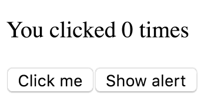
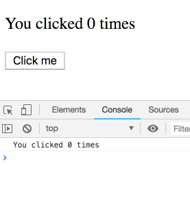
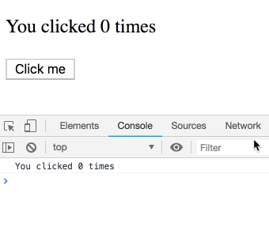
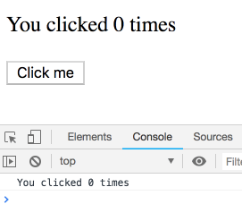
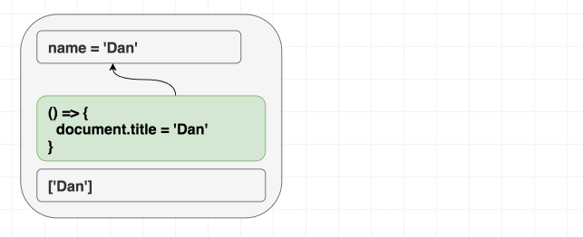
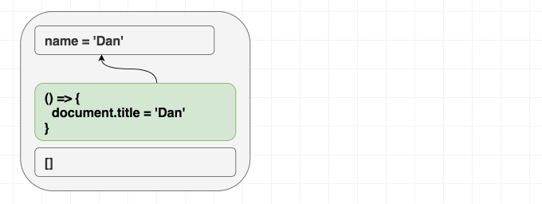
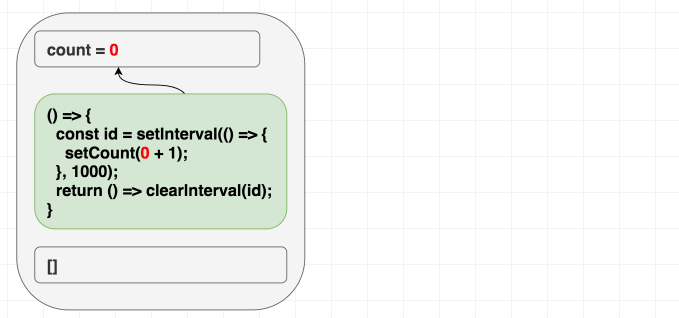
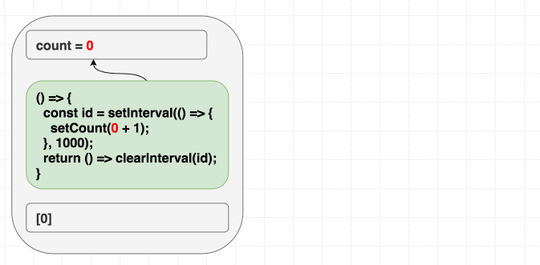
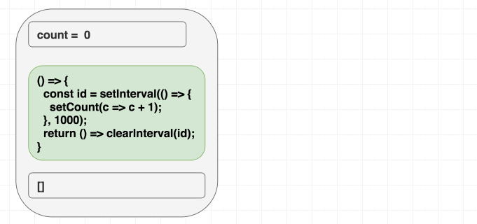
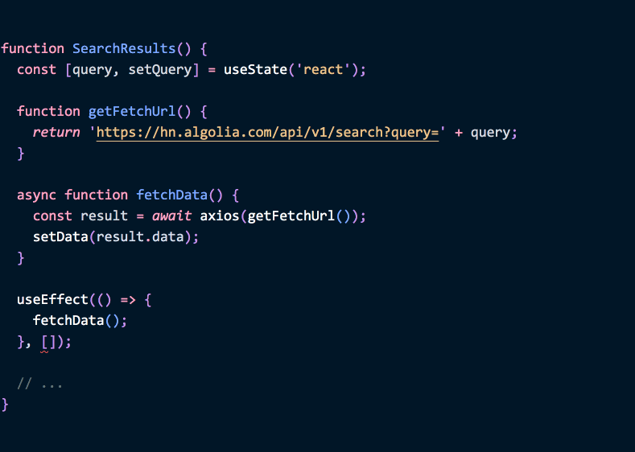

You wrote a few components with [Hooks](https://reactjs.org/docs/hooks-intro.html). Maybe even a small app. You’re mostly satisfied. You’re comfortable with the API and picked up a few tricks along the way. You even made some [custom Hooks](https://reactjs.org/docs/hooks-custom.html) to extract repetitive logic (300 lines gone!) and showed it off to your colleagues. “Great job”, they said.

But sometimes when you `useEffect`, the pieces don’t quite fit together. You have a nagging feeling that you’re missing something. It seems similar to class lifecycles... but is it really? You find yourself asking questions like:

* 🤔 How do I replicate `componentDidMount` with `useEffect`?
* 🤔 How do I correctly fetch data inside `useEffect`? What is `[]`?
* 🤔 Do I need to specify functions as effect dependencies or not?
* 🤔 Why do I sometimes get an infinite refetching loop?
* 🤔 Why do I sometimes get an old state or prop value inside my effect?

When I just started using Hooks, I was confused by all of those questions too. Even when writing the initial docs, I didn’t have a firm grasp on some of the subtleties. I’ve since had a few “aha” moments that I want to share with you. **This deep dive will make the answers to these questions look obvious to you.**

To *see* the answers, we need to take a step back. The goal of this article isn’t to give you a list of bullet point recipes. It’s to help you truly “grok” `useEffect`. There won’t be much to learn. In fact, we’ll spend most of our time *un*learning.

**It’s only after I stopped looking at the `useEffect` Hook through the prism of the familiar class lifecycle methods that everything came together for me.**

>“Unlearn what you have learned.” — Yoda


---

**This article assumes that you’re somewhat familiar with [`useEffect`](https://reactjs.org/docs/hooks-effect.html) API.**

**It’s also *really* long. It’s like a mini-book. That’s just my preferred format. But I wrote a TLDR just below if you’re in a rush or don’t really care.**

**If you’re not comfortable with deep dives, you might want to wait until these explanations appear elsewhere. Just like when React came out in 2013, it will take some time for people to recognize a different mental model and teach it.**

---

## TLDR

Here’s a quick TLDR if you don’t want to read the whole thing. If some parts don’t make sense, you can scroll down until you find something related.

Feel free to skip it if you plan to read the whole post. I’ll link to it at the end.


**🤔 Question: How do I replicate `componentDidMount` with `useEffect`?**

While you can `useEffect(fn, [])`, it’s not an exact equivalent. Unlike `componentDidMount`, it will *capture* props and state. So even inside the callbacks, you’ll see the initial props and state. If you want to see “latest” something, you can write it to a ref. But there’s usually a simpler way to structure the code so that you don’t have to. Keep in mind that the mental model for effects is different from `componentDidMount` and other lifecycles, and trying to find their exact equivalents may confuse you more than help. To get productive, you need to “think in effects”, and their mental model is closer to implementing synchronization than to responding to lifecycle events.

**🤔 Question:  How do I correctly fetch data inside `useEffect`? What is `[]`?**

[This article](https://www.robinwieruch.de/react-hooks-fetch-data/) is a good primer on data fetching with `useEffect`. Make sure to read it to the end! It’s not as long as this one. `[]` means the effect doesn’t use any value that participates in React data flow, and is for that reason safe to apply once. It is also a common source of bugs when the value actually *is* used. You’ll need to learn a few strategies (primarily `useReducer` and `useCallback`) that can *remove the need* for a dependency instead of incorrectly omitting it.

**🤔 Question: Do I need to specify functions as effect dependencies or not?**

The recommendation is to hoist functions that don’t need props or state *outside* of your component, and pull the ones that are used only by an effect *inside* of that effect.  If after that your effect still ends up using functions in the render scope (including function from props), wrap them into `useCallback` where they’re defined, and repeat the process. Why does it matter? Functions can “see” values from props and state — so they participate in the data flow. There's a [more detailed answer](https://reactjs.org/docs/hooks-faq.html#is-it-safe-to-omit-functions-from-the-list-of-dependencies) in our FAQ.

**🤔 Question: Why do I sometimes get an infinite refetching loop?**

This can happen if you’re doing data fetching in an effect without the second dependencies argument. Without it, effects run after every render — and setting the state will trigger the effects again. An infinite loop may also happen if you specify a value that *always* changes in the dependency array. You can tell which one by removing them one by one. However, removing a dependency you use (or blindly specifying `[]`) is usually the wrong fix. Instead, fix the problem at its source. For example, functions can cause this problem, and putting them inside effects, hoisting them out, or wrapping them with `useCallback` helps. To avoid recreating objects, `useMemo` can serve a similar purpose.

**🤔 Why do I sometimes get an old state or prop value inside my effect?**

Effects always “see” props and state from the render they were defined in. That [helps prevent bugs](/how-are-function-components-different-from-classes/) but in some cases can be annoying. For those cases, you can explicitly maintain some value in a mutable ref (the linked article explains it at the end). If you think you’re seeing some props or state from an old render but don’t expect it, you probably missed some dependencies. Try using the [lint rule](https://github.com/facebook/react/issues/14920) to train yourself to see them. A few days, and it’ll be like a second nature to you. See also [this answer](https://reactjs.org/docs/hooks-faq.html#why-am-i-seeing-stale-props-or-state-inside-my-function) in our FAQ.

---

I hope this TLDR was helpful! Otherwise, let’s go.

---

## Each Render Has Its Own Props and State

Before we can talk about effects, we need to talk about rendering.

Here’s a counter. Look at the highlighted line closely:

```jsx{6}
function Counter() {
  const [count, setCount] = useState(0);

  return (
    <div>
      <p>You clicked {count} times</p>
      <button onClick={() => setCount(count + 1)}>
        Click me
      </button>
    </div>
  );
}
```

What does it mean? Does `count` somehow “watch” changes to our state and update automatically? That might be a useful first intuition when you learn React but it’s *not* an [accurate mental model](https://overreacted.io/react-as-a-ui-runtime/).

**In this example, `count` is just a number.** It’s not a magic “data binding”, a “watcher”, a “proxy”, or anything else. It’s a good old number like this one:

```jsx
const count = 42;
// ...
<p>You clicked {count} times</p>
// ...
```

The first time our component renders, the `count` variable we get from `useState()` is `0`. When we call `setCount(1)`, React calls our component again. This time, `count` will be `1`. And so on:

```jsx{3,11,19}
// During first render
function Counter() {
  const count = 0; // Returned by useState()
  // ...
  <p>You clicked {count} times</p>
  // ...
}

// After a click, our function is called again
function Counter() {
  const count = 1; // Returned by useState()
  // ...
  <p>You clicked {count} times</p>
  // ...
}

// After another click, our function is called again
function Counter() {
  const count = 2; // Returned by useState()
  // ...
  <p>You clicked {count} times</p>
  // ...
}
```

**Whenever we update the state, React calls our component. Each render result “sees” its own `counter` state value which is a *constant* inside our function.**

So this line doesn’t do any special data binding:

```jsx
<p>You clicked {count} times</p>
```

**It only embeds a number value into the render output.** That number is provided by React. When we `setCount`, React calls our component again with a different `count` value. Then React updates the DOM to match our latest render output.

The key takeaway is that the `count` constant inside any particular render doesn’t change over time. It’s our component that’s called again — and each render “sees” its own `count` value that’s isolated between renders.

*(For an in-depth overview of this process, check out my post [React as a UI Runtime](https://overreacted.io/react-as-a-ui-runtime/).)*

## Each Render Has Its Own Event Handlers

So far so good. What about event handlers?

Look at this example. It shows an alert with the `count` after three seconds:

```jsx{4-8,16-18}
function Counter() {
  const [count, setCount] = useState(0);

  function handleAlertClick() {
    setTimeout(() => {
      alert('You clicked on: ' + count);
    }, 3000);
  }

  return (
    <div>
      <p>You clicked {count} times</p>
      <button onClick={() => setCount(count + 1)}>
        Click me
      </button>
      <button onClick={handleAlertClick}>
        Show alert
      </button>
    </div>
  );
}
```

Let’s say I do this sequence of steps:

* **Increment** the counter to 3
* **Press** “Show alert”
* **Increment** it to 5 before the timeout fires



What do you expect the alert to show? Will it show 5 — which is the counter state at the time of the alert? Or will it show 3 — the state when I clicked?

----

*spoilers ahead*

---

Go ahead and [try it yourself!](https://codesandbox.io/s/w2wxl3yo0l)

If the behavior doesn’t quite make sense to you, imagine a more practical example: a chat app with the current recipient ID in the state, and a Send button. [This article](https://overreacted.io/how-are-function-components-different-from-classes/) explores the reasons in depth but the correct answer is 3.

The alert will “capture” the state at the time I clicked the button.

*(There are ways to implement the other behavior too but I’ll be focusing on the default case for now. When building a mental model, it’s important that we distinguish the “path of least resistance” from the opt-in escape hatches.)*

---

But how does it work?

We’ve discussed that the `count` value is constant for every particular call to our function. It’s worth emphasizing this — **our function gets called many times (once per each render), but every one of those times the `count` value inside of it is constant and set to a particular value (state for that render).**

This is not specific to React — regular functions work in a similar way:

```jsx{2}
function sayHi(person) {
  const name = person.name;
  setTimeout(() => {
    alert('Hello, ' + name);
  }, 3000);
}

let someone = {name: 'Dan'};
sayHi(someone);

someone = {name: 'Yuzhi'};
sayHi(someone);

someone = {name: 'Dominic'};
sayHi(someone);
```

In [this example](https://codesandbox.io/s/mm6ww11lk8), the outer `someone` variable is reassigned several times. (Just like somewhere in React, the *current* component state can change.) **However, inside `sayHi`, there is a local `name` constant that is associated with a `person` from a particular call.** That constant is local, so it’s isolated between the calls! As a result, when the timeouts fire, each alert “remembers” its own `name`.

This explains how our event handler captures the `count` at the time of the click. If we apply the same substitution principle, each render “sees” its own `count`:

```jsx{3,15,27}
// During first render
function Counter() {
  const count = 0; // Returned by useState()
  // ...
  function handleAlertClick() {
    setTimeout(() => {
      alert('You clicked on: ' + count);
    }, 3000);
  }
  // ...
}

// After a click, our function is called again
function Counter() {
  const count = 1; // Returned by useState()
  // ...
  function handleAlertClick() {
    setTimeout(() => {
      alert('You clicked on: ' + count);
    }, 3000);
  }
  // ...
}

// After another click, our function is called again
function Counter() {
  const count = 2; // Returned by useState()
  // ...
  function handleAlertClick() {
    setTimeout(() => {
      alert('You clicked on: ' + count);
    }, 3000);
  }
  // ...
}
```

So effectively, each render returns its own “version” of `handleAlertClick`. Each of those versions “remembers” its own `count`:

```jsx{6,10,19,23,32,36}
// During first render
function Counter() {
  // ...
  function handleAlertClick() {
    setTimeout(() => {
      alert('You clicked on: ' + 0);
    }, 3000);
  }
  // ...
  <button onClick={handleAlertClick} /> // The one with 0 inside
  // ...
}

// After a click, our function is called again
function Counter() {
  // ...
  function handleAlertClick() {
    setTimeout(() => {
      alert('You clicked on: ' + 1);
    }, 3000);
  }
  // ...
  <button onClick={handleAlertClick} /> // The one with 1 inside
  // ...
}

// After another click, our function is called again
function Counter() {
  // ...
  function handleAlertClick() {
    setTimeout(() => {
      alert('You clicked on: ' + 2);
    }, 3000);
  }
  // ...
  <button onClick={handleAlertClick} /> // The one with 2 inside
  // ...
}
```

This is why [in this demo](https://codesandbox.io/s/w2wxl3yo0l) event handlers “belong” to a particular render, and when you click, it keeps using the `counter` state *from* that render.

**Inside any particular render, props and state forever stay the same.** But if props and state are isolated between renders, so are any values using them (including the event handlers). They also “belong” to a particular render. So even async functions inside an event handler will “see” the same `count` value.

*Side note: I inlined concrete `count` values right into `handleAlertClick` functions above. This mental substitution is safe because `count` can’t possibly change within a particular render. It’s declared as a `const` and is a number. It would be safe to think the same way about other values like objects too, but only if we agree to avoid mutating state. Calling `setSomething(newObj)` with a newly created object instead of mutating it is fine because state belonging to previous renders is intact.*

## Each Render Has Its Own Effects

This was supposed to be a post about effects but we still haven’t talked about effects yet! We’ll rectify this now. Turns out, effects aren’t really any different.

Let’s go back to an example from [the docs](https://reactjs.org/docs/hooks-effect.html):

```jsx{4-6}
function Counter() {
  const [count, setCount] = useState(0);

  useEffect(() => {
    document.title = `You clicked ${count} times`;
  });

  return (
    <div>
      <p>You clicked {count} times</p>
      <button onClick={() => setCount(count + 1)}>
        Click me
      </button>
    </div>
  );
}
```

**Here’s a question for you: how does the effect read the latest `count` state?**

Maybe, there’s some kind of “data binding” or “watching” that makes `count` update live inside the effect function? Maybe `count` is a mutable variable that React sets inside our component so that our effect always sees the latest value?

Nope.

We already know that `count` is constant within a particular component render. Event handlers “see” the `count` state from the render that they “belong” to because `count` is a variable in their scope. The same is true for effects!

**It’s not the `count` variable that somehow changes inside an “unchanging” effect. It’s the _effect function itself_ that’s different on every render.**

Each version “sees” the `count` value from the render that it “belongs” to:

```jsx{5-8,17-20,29-32}
// During first render
function Counter() {
  // ...
  useEffect(
    // Effect function from first render
    () => {
      document.title = `You clicked ${0} times`;
    }
  );
  // ...
}

// After a click, our function is called again
function Counter() {
  // ...
  useEffect(
    // Effect function from second render
    () => {
      document.title = `You clicked ${1} times`;
    }
  );
  // ...
}

// After another click, our function is called again
function Counter() {
  // ...
  useEffect(
    // Effect function from third render
    () => {
      document.title = `You clicked ${2} times`;
    }
  );
  // ..
}
```

React remembers the effect function you provided, and runs it after flushing changes to the DOM and letting the browser paint the screen.

So even if we speak of a single conceptual *effect* here (updating the document title), it is represented by a *different function* on every render — and each effect function “sees” props and state from the particular render it “belongs” to.

**Conceptually, you can imagine effects are a *part of the render result*.**

Strictly saying, they’re not (in order to [allow Hook composition](https://overreacted.io/why-do-hooks-rely-on-call-order/) without clumsy syntax or runtime overhead). But in the mental model we’re building up, effect functions *belong* to a particular render in the same way that event handlers do.

---

To make sure we have a solid understanding, let’s recap our first render:

* **React:** Give me the UI when the state is `0`.
* **Your component:**
  * Here’s the render result:
  `<p>You clicked 0 times</p>`.
  * Also remember to run this effect after you’re done: `() => { document.title = 'You clicked 0 times' }`.
* **React:** Sure. Updating the UI. Hey browser, I’m adding some stuff to the DOM.
* **Browser:** Cool, I painted it to the screen.
* **React:** OK, now I’m going to run the effect you gave me.
  * Running `() => { document.title = 'You clicked 0 times' }`.

---

Now let’s recap what happens after we click:

* **Your component:** Hey React, set my state to `1`.
* **React:** Give me the UI for when the state is `1`.
* **Your component:**
  * Here’s the render result:
  `<p>You clicked 1 times</p>`.
  * Also remember to run this effect after you’re done: `() => { document.title = 'You clicked 1 times' }`.
* **React:** Sure. Updating the UI. Hey browser, I’ve changed the DOM.
* **Browser:** Cool, I painted your changes to the screen.
* **React:** OK, now I’ll run the effect that belongs to the render I just did.
  * Running `() => { document.title = 'You clicked 1 times' }`.

---

## Each Render Has Its Own... Everything

**We know now that effects run after every render, are conceptually a part of the component output, and “see” the props and state from that particular render.**

Let’s try a thought experiment. Consider this code:

```jsx{4-8}
function Counter() {
  const [count, setCount] = useState(0);

  useEffect(() => {
    setTimeout(() => {
      console.log(`You clicked ${count} times`);
    }, 3000);
  });

  return (
    <div>
      <p>You clicked {count} times</p>
      <button onClick={() => setCount(count + 1)}>
        Click me
      </button>
    </div>
  );
}
```

If I click several times with a small delay, what is the log going to look like?

---

*spoilers ahead*

---

You might think this is a gotcha and the end result is unintuitive. It’s not! We’re going to see a sequence of logs — each one belonging to a particular render and thus with its own `count` value. You can [try it yourself](https://codesandbox.io/s/lyx20m1ol):




You may think: “Of course that’s how it works! How else could it work?”

Well, that’s not how `this.state` works in classes. It’s easy to make the mistake of thinking that this [class implementation](https://codesandbox.io/s/kkymzwjqz3) is equivalent:

```jsx
  componentDidUpdate() {
    setTimeout(() => {
      console.log(`You clicked ${this.state.count} times`);
    }, 3000);
  }
```

However, `this.state.count` always points at the *latest* count rather than the one belonging to a particular render. So you’ll see `5` logged each time instead:



I think it’s ironic that Hooks rely so much on JavaScript closures, and yet it’s the class implementation that suffers from [the canonical wrong-value-in-a-timeout confusion](https://wsvincent.com/javascript-closure-settimeout-for-loop/) that’s often associated with closures. This is because the actual source of the confusion in this example is the mutation (React mutates `this.state` in classes to point to the latest state) and not closures themselves.

**Closures are great when the values you close over never change. That makes them easy to think about because you’re essentially referring to constants.** And as we discussed, props and state never change within a particular render. By the way, we can fix the class version... by [using a closure](https://codesandbox.io/s/w7vjo07055).

## Swimming Against the Tide

At this point it’s important that we call it out explicitly: **every** function inside the component render (including event handlers, effects, timeouts or API calls inside them) captures the props and state of the render call that defined it.

So these two examples are equivalent:

```jsx{4}
function Example(props) {
  useEffect(() => {
    setTimeout(() => {
      console.log(props.counter);
    }, 1000);
  });
  // ...
}
```

```jsx{2,5}
function Example(props) {
  const counter = props.counter;
  useEffect(() => {
    setTimeout(() => {
      console.log(counter);
    }, 1000);
  });
  // ...
}
```

**It doesn’t matter whether you read from props or state “early” inside of your component.** They’re not going to change! Inside the scope of a single render, props and state stay the same. (Destructuring props makes this more obvious.)

Of course, sometimes you *want* to read the latest rather than captured value inside some callback defined in an effect. The easiest way to do it is by using refs, as described in the last section of [this article](https://overreacted.io/how-are-function-components-different-from-classes/).

Be aware that when you want to read the *future* props or state from a function in a *past* render, you’re swimming against the tide. It’s not *wrong* (and in some cases necessary) but it might look less “clean” to break out of the paradigm. This is an intentional consequence because it helps highlight which code is fragile and depends on timing. In classes, it’s less obvious when this happens.

Here’s a [version of our counter example](https://codesandbox.io/s/rm7z22qnlp) that replicates the class behavior:

```jsx{3,6-7,9-10}
function Example() {
  const [count, setCount] = useState(0);
  const latestCount = useRef(count);

  useEffect(() => {
    // Set the mutable latest value
    latestCount.current = count;
    setTimeout(() => {
      // Read the mutable latest value
      console.log(`You clicked ${latestCount.current} times`);
    }, 3000);
  });
  // ...
```



It might seem quirky to mutate something in React. However, this is exactly how React itself reassigns `this.state` in classes. Unlike with captured props and state, you don’t have any guarantees that reading `latestCount.current` would give you the same value in any particular callback. By definition, you can mutate it any time. This is why it’s not a default, and you have to opt into that.

## So What About Cleanup?

As [the docs explain](https://reactjs.org/docs/hooks-effect.html#effects-with-cleanup), some effects might have a cleanup phase. Essentially, its purpose is to “undo” an effect for cases like subscriptions.

Consider this code:

```jsx
  useEffect(() => {
    ChatAPI.subscribeToFriendStatus(props.id, handleStatusChange);
    return () => {
      ChatAPI.unsubscribeFromFriendStatus(props.id, handleStatusChange);
    };
  });
```

Say `props` is `{id: 10}` on the first render, and `{id: 20}` on the second render. You *might* think that something like this happens:

* React cleans up the effect for `{id: 10}`.
* React renders UI for `{id: 20}`.
* React runs the effect for `{id: 20}`.

(This is not quite the case.)

With this mental model, you might think the cleanup “sees” the old props because it runs before we re-render, and then the new effect “sees” the new props because it runs after the re-render. That’s the mental model lifted directly from the class lifecycles, and **it’s not accurate here**. Let’s see why.

React only runs the effects after [letting the browser paint](https://medium.com/@dan_abramov/this-benchmark-is-indeed-flawed-c3d6b5b6f97f). This makes your app faster as most effects don’t need to block screen updates. Effect cleanup is also delayed. **The previous effect is cleaned up _after_ the re-render with new props:**

* **React renders UI for `{id: 20}`.**
* The browser paints. We see the UI for `{id: 20}` on the screen.
* **React cleans up the effect for `{id: 10}`.**
* React runs the effect for `{id: 20}`.

You might be wondering: but how can the cleanup of the previous effect still “see” the old `{id: 10}` props if it runs *after* the props change to `{id: 20}`?

We’ve been here before... 🤔


Quoting the previous section:

>Every function inside the component render (including event handlers, effects, timeouts or API calls inside them) captures the props and state of the render call that defined it.

Now the answer is clear! The effect cleanup doesn’t read the “latest” props, whatever that means. It reads props that belong to the render it’s defined in:

```jsx{8-11}
// First render, props are {id: 10}
function Example() {
  // ...
  useEffect(
    // Effect from first render
    () => {
      ChatAPI.subscribeToFriendStatus(10, handleStatusChange);
      // Cleanup for effect from first render
      return () => {
        ChatAPI.unsubscribeFromFriendStatus(10, handleStatusChange);
      };
    }
  );
  // ...
}

// Next render, props are {id: 20}
function Example() {
  // ...
  useEffect(
    // Effect from second render
    () => {
      ChatAPI.subscribeToFriendStatus(20, handleStatusChange);
      // Cleanup for effect from second render
      return () => {
        ChatAPI.unsubscribeFromFriendStatus(20, handleStatusChange);
      };
    }
  );
  // ...
}
```

Kingdoms will rise and turn into ashes, the Sun will shed its outer layers to be a white dwarf, and the last civilization will end. But nothing will make the props “seen” by the first render effect’s cleanup anything other than `{id: 10}`.

That’s what allows React to deal with effects right after painting — and make your apps faster by default. The old props are still there if our code needs them.

## Synchronization, Not Lifecycle

One of my favorite things about React is that it unifies describing the initial render result and the updates. This [reduces the entropy](https://overreacted.io/the-bug-o-notation/) of your program.

Say my component looks like this:

```jsx
function Greeting({ name }) {
  return (
    <h1 className="Greeting">
      Hello, {name}
    </h1>
  );
}
```

It doesn’t matter if I render `<Greeting name="Dan" />` and later `<Greeting name="Yuzhi" />`, or if I just render `<Greeting name="Yuzhi" />`. In the end, we will see “Hello, Yuzhi” in both cases.

People say: “It’s all about the journey, not the destination”. With React, it’s the opposite. **It’s all about the destination, not the journey.** That’s the difference between `$.addClass` and `$.removeClass` calls in jQuery code (our “journey”) and specifying what the CSS class *should be* in React code (our “destination”).

**React synchronizes the DOM according to our current props and state.** There is no distinction between a “mount” or an “update” when rendering.

You should think of effects in a similar way. **`useEffect` lets you _synchronize_ things outside of the React tree according to our props and state.**

```jsx{2-4}
function Greeting({ name }) {
  useEffect(() => {
    document.title = 'Hello, ' + name;
  });
  return (
    <h1 className="Greeting">
      Hello, {name}
    </h1>
  );
}
```

This is subtly different from the familiar *mount/update/unmount* mental model. It is important really to internalize this. **If you’re trying to write an effect that behaves differently depending on whether the component renders for the first time or not, you’re swimming against the tide!** We’re failing at synchronizing if our result depends on the “journey” rather than the “destination”.

It shouldn’t matter whether we rendered with props A, B, and C, or if we rendered with C immediately. While there may be some temporary differences (e.g. while we’re fetching data), eventually the end result should be the same.

Still, of course running all effects on *every* render might not be efficient. (And in some cases, it would lead to infinite loops.)

So how can we fix this?

## Teaching React to Diff Your Effects

We’ve already learned that lesson with the DOM itself. Instead of touching it on every re-render, React only updates the parts of the DOM that actually change.

When you’re updating

```jsx
<h1 className="Greeting">
  Hello, Dan
</h1>
```

to

```jsx
<h1 className="Greeting">
  Hello, Yuzhi
</h1>
```

React sees two objects:

```jsx
const oldProps = {className: 'Greeting', children: 'Hello, Dan'};
const newProps = {className: 'Greeting', children: 'Hello, Yuzhi'};
```

It goes over each of their props and determine that `children` have changed and need a DOM update, but `className` did not. So it can just do:

```jsx
domNode.innerText = 'Hello, Yuzhi';
// No need to touch domNode.className
```

**Could we do something like this with effects too? It would be nice to avoid re-running them when applying the effect is unnecessary.**

For example, maybe our component re-renders because of a state change:

```jsx{11-13}
function Greeting({ name }) {
  const [counter, setCounter] = useState(0);

  useEffect(() => {
    document.title = 'Hello, ' + name;
  });

  return (
    <h1 className="Greeting">
      Hello, {name}
      <button onClick={() => setCounter(count + 1)}>
        Increment
      </button>
    </h1>
  );
}
```

But our effect doesn’t use the `counter` state. **Our effect synchronizes the `document.title` with the `name` prop, but the `name` prop is the same.** Re-assigning `document.title` on every counter change seems non-ideal.

OK, so can React just... diff effects?


```jsx
let oldEffect = () => { document.title = 'Hello, Dan'; };
let newEffect = () => { document.title = 'Hello, Dan'; };
// Can React see these functions do the same thing?
```

Not really. React can’t guess what the function does without calling it. (The source doesn’t really contain specific values, it just closes over the `name` prop.)

This is why if you want to avoid re-running effects unnecessarily, you can provide a dependency array (also known as “deps”) argument to `useEffect`:

```jsx{3}
  useEffect(() => {
    document.title = 'Hello, ' + name;
  }, [name]); // Our deps
```

**It’s like if we told React: “Hey, I know you can’t see _inside_ this function, but I promise it only uses `name` and nothing else from the render scope.”**

If each of these values is the same between the current and the previous time this effect ran, there’s nothing to synchronize so React can skip the effect:

```jsx
const oldEffect = () => { document.title = 'Hello, Dan'; };
const oldDeps = ['Dan'];

const newEffect = () => { document.title = 'Hello, Dan'; };
const newDeps = ['Dan'];

// React can't peek inside of functions, but it can compare deps.
// Since all deps are the same, it doesn’t need to run the new effect.
```

If even one of the values in the dependency array is different between renders, we know running the effect can’t be skipped. Synchronize all the things!

## Don’t Lie to React About Dependencies

Lying to React about dependencies has bad consequences. Intuitively, this makes sense, but I’ve seen pretty much everyone who tries `useEffect` with a mental model from classes try to cheat the rules. (And I did that too at first!)

```jsx
function SearchResults() {
  async function fetchData() {
    // ...
  }

  useEffect(() => {
    fetchData();
  }, []); // Is this okay? Not always -- and there's a better way to write it.

  // ...
}
```

*(The [Hooks FAQ](https://reactjs.org/docs/hooks-faq.html#is-it-safe-to-omit-functions-from-the-list-of-dependencies) explains what to do instead. We'll come back to this example [below](#moving-functions-inside-effects).)*

“But I only want to run it on mount!”, you’ll say. For now, remember: if you specify deps, **_all_ values from inside your component that are used by the effect _must_ be there**. Including props, state, functions — anything in your component.

Sometimes when you do that, it causes a problem. For example, maybe you see an infinite refetching loop, or a socket is recreated too often. **The solution to that problem is _not_ to remove a dependency.** We’ll look at the solutions soon.

But before we jump to solutions, let’s understand the problem better.

## What Happens When Dependencies Lie

If deps contain every value used by the effect, React knows when to re-run it:

```jsx{3}
  useEffect(() => {
    document.title = 'Hello, ' + name;
  }, [name]);
```



*(Dependencies are different, so we re-run the effect.)*

But if we specified `[]` for this effect, the new effect function wouldn’t run:

```jsx{3}
  useEffect(() => {
    document.title = 'Hello, ' + name;
  }, []); // Wrong: name is missing in deps
```



*(Dependencies are equal, so we skip the effect.)*

In this case the problem might seem obvious. But the intuition can fool you in other cases where a class solution “jumps out” from your memory.

For example, let’s say we’re writing a counter that increments every second. With a class, our intuition is: “Set up the interval once and destroy it once”. Here’s an [example](https://codesandbox.io/s/n5mjzjy9kl) of how we can do it. When we mentally translate this code to `useEffect`, we instinctively add `[]` to the deps. “I want it to run once”, right?

```jsx{9}
function Counter() {
  const [count, setCount] = useState(0);

  useEffect(() => {
    const id = setInterval(() => {
      setCount(count + 1);
    }, 1000);
    return () => clearInterval(id);
  }, []);

  return <h1>{count}</h1>;
}
```

However, this example [only *increments* once](https://codesandbox.io/s/91n5z8jo7r). *Oops.*

If your mental model is “dependencies let me specify when I want to re-trigger the effect”, this example might give you an existential crisis. You *want* to trigger it once because it’s an interval — so why is it causing issues?

However, this makes sense if you know that dependencies are our hint to React about *everything* that the effect uses from the render scope. It uses `count` but we lied that it doesn’t with `[]`. It’s only a matter of time before this bites us!

In the first render, `count` is `0`. Therefore, `setCount(count + 1)` in the first render’s effect means `setCount(0 + 1)`. **Since we never re-run the effect because of `[]` deps, it will keep calling `setCount(0 + 1)` every second:**

```jsx{8,12,21-22}
// First render, state is 0
function Counter() {
  // ...
  useEffect(
    // Effect from first render
    () => {
      const id = setInterval(() => {
        setCount(0 + 1); // Always setCount(1)
      }, 1000);
      return () => clearInterval(id);
    },
    [] // Never re-runs
  );
  // ...
}

// Every next render, state is 1
function Counter() {
  // ...
  useEffect(
    // This effect is always ignored because
    // we lied to React about empty deps.
    () => {
      const id = setInterval(() => {
        setCount(1 + 1);
      }, 1000);
      return () => clearInterval(id);
    },
    []
  );
  // ...
}
```

We lied to React by saying our effect doesn’t depend on a value from inside our component, when in fact it does!

Our effect uses `count` — a value inside the component (but outside the effect):

```jsx{1,5}
  const count = // ...

  useEffect(() => {
    const id = setInterval(() => {
      setCount(count + 1);
    }, 1000);
    return () => clearInterval(id);
  }, []);
```

Therefore, specifying `[]` as a dependency will create a bug. React will compare the dependencies, and skip updating this effect:



*(Dependencies are equal, so we skip the effect.)*

Issues like this are difficult to think about. Therefore, I encourage you to adopt it as a hard rule to always be honest about the effect dependencies, and specify them all. (We provide a [lint rule](https://github.com/facebook/react/issues/14920) if you want to enforce this on your team.)

## Two Ways to Be Honest About Dependencies

There are two strategies to be honest about dependencies. You should generally start with the first one, and then apply the second one if needed.

**The first strategy is to fix the dependency array to include _all_ the values inside the component that are used inside the effect.** Let’s include `count` as a dep:

```jsx{3,6}
useEffect(() => {
  const id = setInterval(() => {
    setCount(count + 1);
  }, 1000);
  return () => clearInterval(id);
}, [count]);
```

This makes the dependency array correct. It may not be *ideal* but that’s the first issue we needed to fix. Now a change to `count` will re-run the effect, with each next interval referencing `count` from its render in `setCount(count + 1)`:

```jsx{8,12,24,28}
// First render, state is 0
function Counter() {
  // ...
  useEffect(
    // Effect from first render
    () => {
      const id = setInterval(() => {
        setCount(0 + 1); // setCount(count + 1)
      }, 1000);
      return () => clearInterval(id);
    },
    [0] // [count]
  );
  // ...
}

// Second render, state is 1
function Counter() {
  // ...
  useEffect(
    // Effect from second render
    () => {
      const id = setInterval(() => {
        setCount(1 + 1); // setCount(count + 1)
      }, 1000);
      return () => clearInterval(id);
    },
    [1] // [count]
  );
  // ...
}
```

That would [fix the problem](https://codesandbox.io/s/0x0mnlyq8l) but our interval would be cleared and set again whenever the `count` changes. That may be undesirable:



*(Dependencies are different, so we re-run the effect.)*

---

**The second strategy is to change our effect code so that it wouldn’t *need* a value that changes more often than we want.** We don’t want to lie about the dependencies — we just want to change our effect to have *fewer* of them.

Let’s look at a few common techniques for removing dependencies.

---

## Making Effects Self-Sufficient

We want to get rid of the `count` dependency in our effect.

```jsx{3,6}
  useEffect(() => {
    const id = setInterval(() => {
      setCount(count + 1);
    }, 1000);
    return () => clearInterval(id);
  }, [count]);
```

To do this, we need to ask ourselves: **what are we using `count` for?** It seems like we only use it for the `setCount` call. In that case, we don’t actually need `count` in the scope at all. When we want to update state based on the previous state, we can use the [functional updater form](https://reactjs.org/docs/hooks-reference.html#functional-updates) of `useState`:

```jsx{3}
  useEffect(() => {
    const id = setInterval(() => {
      setCount(c => c + 1);
    }, 1000);
    return () => clearInterval(id);
  }, []);
```

I like to think of these cases as “false dependencies”. Yes, `count` was a necessary dependency because we wrote `setCount(count + 1)` inside the effect. However, we only truly needed `count` to transform it into `count + 1` and “send it back” to React. But React *already knows* the current `count`. **All we needed to tell React is to increment the state — whatever it is right now.**

That’s exactly what `setCount(c => c + 1)` does. You can think of it as “sending an instruction” to React about how the state should change. This “updater form” also helps in other cases, like when you [batch multiple updates](/react-as-a-ui-runtime/#batching).

**Note that we actually _did the work_ to remove the dependency. We didn’t cheat. Our effect doesn’t read the `counter` value from the render scope anymore:**



*(Dependencies are equal, so we skip the effect.)*

You can try it [here](https://codesandbox.io/s/q3181xz1pj).

Even though this effect only runs once, the interval callback that belongs to the first render is perfectly capable of sending the `c => c + 1` update instruction every time the interval fires. It doesn’t need to know the current `counter` state anymore. React already knows it.

## Functional Updates and Google Docs

Remember how we talked about synchronization being the mental model for effects? An interesting aspect of synchronization is that you often want to keep the “messages” between the systems untangled from their state. For example, editing a document in Google Docs doesn’t actually send the *whole* page to the server. That would be very inefficient. Instead, it sends a representation of what the user tried to do.

While our use case is different, a similar philosophy applies to effects. **It helps to send only the minimal necessary information from inside the effects into a component.** The updater form like `setCount(c => c + 1)` conveys strictly less information than `setCount(count + 1)` because it isn’t “tainted” by the current count. It only expresses the action (“incrementing”). Thinking in React involves [finding the minimal state](https://reactjs.org/docs/thinking-in-react.html#step-3-identify-the-minimal-but-complete-representation-of-ui-state). This is the same principle, but for updates.

Encoding the *intent* (rather than the result) is similar to how Google Docs [solves](https://medium.com/@srijancse/how-real-time-collaborative-editing-work-operational-transformation-ac4902d75682) collaborative editing. While this is stretching the analogy, functional updates serve a similar role in React. They ensure updates from multiple sources (event handlers, effect subscriptions, etc) can be correctly applied in a batch and in a predictable way.

**However, even `setCount(c => c + 1)` isn’t that great.** It looks a bit weird and it’s very limited in what it can do. For example, if we had two state variables whose values depend on each other, or if we needed to calculate the next state based on a prop, it wouldn’t help us. Luckily, `setCount(c => c + 1)` has a more powerful sister pattern. Its name is `useReducer`.

## Decoupling Updates from Actions

Let’s modify the previous example to have two state variables: `count` and `step`. Our interval will increment the count by the value of the `step` input:

```jsx{7,10}
function Counter() {
  const [count, setCount] = useState(0);
  const [step, setStep] = useState(1);

  useEffect(() => {
    const id = setInterval(() => {
      setCount(c => c + step);
    }, 1000);
    return () => clearInterval(id);
  }, [step]);

  return (
    <>
      <h1>{count}</h1>
      <input value={step} onChange={e => setStep(Number(e.target.value))} />
    </>
  );
}
```

(Here’s a [demo](https://codesandbox.io/s/zxn70rnkx).)

Note that **we’re not cheating**. Since I started using `step` inside the effect, I added it to the dependencies. And that’s why the code runs correctly.

The current behavior in this example is that changing the `step` restarts the interval — because it’s one of the dependencies. And in many cases, that is exactly what you want! There’s nothing wrong with tearing down an effect and setting it up anew, and we shouldn’t avoid that unless we have a good reason.

However, let’s say we want the interval clock to not reset on changes to the `step`. How do we remove the `step` dependency from our effect?

**When setting a state variable depends on the current value of another state variable, you might want to try replacing them both with `useReducer`.**

When you find yourself writing `setSomething(something => ...)`, it’s a good time to consider using a reducer instead. A reducer lets you **decouple expressing the “actions” that happened in your component from how the state updates in response to them**.

Let’s trade the `step` dependency for a `dispatch` dependency in our effect:

```jsx{1,6,9}
const [state, dispatch] = useReducer(reducer, initialState);
const { count, step } = state;

useEffect(() => {
  const id = setInterval(() => {
    dispatch({ type: 'tick' }); // Instead of setCount(c => c + step);
  }, 1000);
  return () => clearInterval(id);
}, [dispatch]);
```

(See the [demo](https://codesandbox.io/s/xzr480k0np).)

You might ask me: “How is this any better?” The answer is that **React guarantees the `dispatch` function to be constant throughout the component lifetime. So the example above doesn’t ever need to resubscribe the interval.**

We solved our problem!

*(You may omit `dispatch`, `setState`, and `useRef` container values from the deps because React guarantees them to be static. But it also doesn’t hurt to specify them.)*

Instead of reading the state *inside* an effect, it dispatches an *action* that encodes the information about *what happened*. This allows our effect to stay decoupled from the `step` state. Our effect doesn’t care *how* we update the state, it just tells us about *what happened*. And the reducer centralizes the update logic:

```jsx{8,9}
const initialState = {
  count: 0,
  step: 1,
};

function reducer(state, action) {
  const { count, step } = state;
  if (action.type === 'tick') {
    return { count: count + step, step };
  } else if (action.type === 'step') {
    return { count, step: action.step };
  } else {
    throw new Error();
  }
}
```

(Here’s a [demo](https://codesandbox.io/s/xzr480k0np) if you missed it earlier).

## Why useReducer Is the Cheat Mode of Hooks

We’ve seen how to remove dependencies when an effect needs to set state based on previous state, or on another state variable. **But what if we need _props_ to calculate the next state?** For example, maybe our API is `<Counter step={1} />`. Surely, in this case we can’t avoid specifying `props.step` as a dependency?

In fact, we can! We can put *the reducer itself* inside our component to read props:

```jsx{1,6}
function Counter({ step }) {
  const [count, dispatch] = useReducer(reducer, 0);

  function reducer(state, action) {
    if (action.type === 'tick') {
      return state + step;
    } else {
      throw new Error();
    }
  }

  useEffect(() => {
    const id = setInterval(() => {
      dispatch({ type: 'tick' });
    }, 1000);
    return () => clearInterval(id);
  }, [dispatch]);

  return <h1>{count}</h1>;
}
```

This pattern disables a few optimizations so try not to use it everywhere, but you can totally access props from a reducer if you need to. (Here’s a [demo](https://codesandbox.io/s/7ypm405o8q).)

**Even in that case, `dispatch` identity is still guaranteed to be stable between re-renders.** So you may omit it from the effect deps if you want. It’s not going to cause the effect to re-run.

You may be wondering: how can this possibly work? How can the reducer “know” props when called from inside an effect that belongs to another render? The answer is that when you `dispatch`, React just remembers the action — but it will *call* your reducer during the next render. At that point the fresh props will be in scope, and you won’t be inside an effect.

**This is why I like to think of `useReducer` as the “cheat mode” of Hooks. It lets me decouple the update logic from describing what happened. This, in turn, helps me remove unnecessary dependencies from my effects and avoid re-running them more often than necessary.**

## Moving Functions Inside Effects

A common mistake is to think functions shouldn’t be dependencies. For example, this seems like it could work:

```jsx{13}
function SearchResults() {
  const [data, setData] = useState({ hits: [] });

  async function fetchData() {
    const result = await axios(
      'https://hn.algolia.com/api/v1/search?query=react',
    );
    setData(result.data);
  }

  useEffect(() => {
    fetchData();
  }, []); // Is this okay?

  // ...
```

*([This example](https://codesandbox.io/s/8j4ykjyv0) is adapted from a great article by Robin Wieruch — [check it out](https://www.robinwieruch.de/react-hooks-fetch-data/)!)*

And to be clear, this code *does* work. **But the problem with simply omitting local functions is that it gets pretty hard to tell whether we’re handling all cases as the component grows!**

Imagine our code was split like this and each function was five times larger:

```jsx
function SearchResults() {
  // Imagine this function is long
  function getFetchUrl() {
    return 'https://hn.algolia.com/api/v1/search?query=react';
  }

  // Imagine this function is also long
  async function fetchData() {
    const result = await axios(getFetchUrl());
    setData(result.data);
  }

  useEffect(() => {
    fetchData();
  }, []);

  // ...
}
```


Now let’s say we later use some state or prop in one of these functions:

```jsx{6}
function SearchResults() {
  const [query, setQuery] = useState('react');

  // Imagine this function is also long
  function getFetchUrl() {
    return 'https://hn.algolia.com/api/v1/search?query=' + query;
  }

  // Imagine this function is also long
  async function fetchData() {
    const result = await axios(getFetchUrl());
    setData(result.data);
  }

  useEffect(() => {
    fetchData();
  }, []);

  // ...
}
```

If we forget to update the deps of any effects that call these functions (possibly, through other functions!), our effects will fail to synchronize changes from our props and state. This doesn’t sound great.

Luckily, there is an easy solution to this problem. **If you only use some functions *inside* an effect, move them directly *into* that effect:**

```jsx{4-12}
function SearchResults() {
  // ...
  useEffect(() => {
    // We moved these functions inside!
    function getFetchUrl() {
      return 'https://hn.algolia.com/api/v1/search?query=react';
    }

    async function fetchData() {
      const result = await axios(getFetchUrl());
      setData(result.data);
    }

    fetchData();
  }, []); // ✅ Deps are OK
  // ...
}
```

([Here’s a demo](https://codesandbox.io/s/04kp3jwwql).)

So what is the benefit? We no longer have to think about the “transitive dependencies”. Our dependencies array isn’t lying anymore: **we truly _aren’t_ using anything from the outer scope of the component in our effect**.

If we later edit `getFetchUrl` to use the `query` state, we’re much more likely to notice that we’re editing it *inside* an effect — and therefore, we need to add `query` to the effect dependencies:

```jsx{6,15}
function SearchResults() {
  const [query, setQuery] = useState('react');

  useEffect(() => {
    function getFetchUrl() {
      return 'https://hn.algolia.com/api/v1/search?query=' + query;
    }

    async function fetchData() {
      const result = await axios(getFetchUrl());
      setData(result.data);
    }

    fetchData();
  }, [query]); // ✅ Deps are OK

  // ...
}
```

(Here’s a [demo](https://codesandbox.io/s/pwm32zx7z7).)

By adding this dependency, we’re not just “appeasing React”. It *makes sense* to refetch the data when the query changes. **The design of `useEffect` forces you to notice the change in our data flow and choose how our effects should synchronize it — instead of ignoring it until our product users hit a bug.**

Thanks to the `exhaustive-deps` lint rule from the `eslint-plugin-react-hooks` plugin, you can [analyze the effects as you type in your editor](https://github.com/facebook/react/issues/14920) and receive suggestions about which dependencies are missing. In other words, a machine can tell you which data flow changes aren’t handled correctly by a component.



Pretty sweet.

## But I Can’t Put This Function Inside an Effect

Sometimes you might not want to move a function *inside* an effect. For example, several effects in the same component may call the same function, and you don’t want to copy and paste its logic. Or maybe it’s a prop.

Should you skip a function like this in the effect dependencies? I think not. Again, **effects shouldn’t lie about their dependencies.** There are usually better solutions. A common misconception is that “a function would never change”. But as we learned throughout this article, this couldn’t be further from truth. Indeed, a function defined inside a component changes on every render!

**That by itself presents a problem.** Say two effects call `getFetchUrl`:

```jsx
function SearchResults() {
  function getFetchUrl(query) {
    return 'https://hn.algolia.com/api/v1/search?query=' + query;
  }

  useEffect(() => {
    const url = getFetchUrl('react');
    // ... Fetch data and do something ...
  }, []); // 🔴 Missing dep: getFetchUrl

  useEffect(() => {
    const url = getFetchUrl('redux');
    // ... Fetch data and do something ...
  }, []); // 🔴 Missing dep: getFetchUrl

  // ...
}
```

In that case you might not want to move `getFetchUrl` inside either of the effects since you wouldn’t be able to share the logic.

On the other hand, if you’re “honest” about the effect dependencies, you may run into a problem. Since both our effects depend on `getFetchUrl` **(which is different on every render)**, our dependency arrays are useless:

```jsx{2-5}
function SearchResults() {
  // 🔴 Re-triggers all effects on every render
  function getFetchUrl(query) {
    return 'https://hn.algolia.com/api/v1/search?query=' + query;
  }

  useEffect(() => {
    const url = getFetchUrl('react');
    // ... Fetch data and do something ...
  }, [getFetchUrl]); // 🚧 Deps are correct but they change too often

  useEffect(() => {
    const url = getFetchUrl('redux');
    // ... Fetch data and do something ...
  }, [getFetchUrl]); // 🚧 Deps are correct but they change too often

  // ...
}
```

A tempting solution to this is to just skip the `getFetchUrl` function in the deps list. However, I don’t think it’s a good solution. This makes it difficult to notice when we *are* adding a change to the data flow that *needs* to be handled by an effect. This leads to bugs like the “never updating interval” we saw earlier.

Instead, there are two other solutions that are simpler.

**First of all, if a function doesn’t use anything from the component scope, you can hoist it outside the component and then freely use it inside your effects:**

```jsx{1-4}
// ✅ Not affected by the data flow
function getFetchUrl(query) {
  return 'https://hn.algolia.com/api/v1/search?query=' + query;
}

function SearchResults() {
  useEffect(() => {
    const url = getFetchUrl('react');
    // ... Fetch data and do something ...
  }, []); // ✅ Deps are OK

  useEffect(() => {
    const url = getFetchUrl('redux');
    // ... Fetch data and do something ...
  }, []); // ✅ Deps are OK

  // ...
}
```

There’s no need to specify it in deps because it’s not in the render scope and can’t be affected by the data flow. It can’t accidentally depend on props or state.

Alternatively, you can wrap it into the [`useCallback` Hook](https://reactjs.org/docs/hooks-reference.html#usecallback):


```jsx{2-5}
function SearchResults() {
  // ✅ Preserves identity when its own deps are the same
  const getFetchUrl = useCallback((query) => {
    return 'https://hn.algolia.com/api/v1/search?query=' + query;
  }, []);  // ✅ Callback deps are OK

  useEffect(() => {
    const url = getFetchUrl('react');
    // ... Fetch data and do something ...
  }, [getFetchUrl]); // ✅ Effect deps are OK

  useEffect(() => {
    const url = getFetchUrl('redux');
    // ... Fetch data and do something ...
  }, [getFetchUrl]); // ✅ Effect deps are OK

  // ...
}
```

`useCallback` is essentially like adding another layer of dependency checks. It’s solving the problem on the other end — **rather than avoid a function dependency, we make the function itself only change when necessary**.

Let's see why this approach is useful. Previously, our example showed two search results (for `'react'` and `'redux'` search queries). But let's say we want to add an input so that you can search for an arbitrary `query`. So instead of taking `query` as an argument, `getFetchUrl` will now read it from local state.

We'll immediately see that it's missing a `query` dependency:

```jsx{5}
function SearchResults() {
  const [query, setQuery] = useState('react');
  const getFetchUrl = useCallback(() => { // No query argument
    return 'https://hn.algolia.com/api/v1/search?query=' + query;
  }, []); // 🔴 Missing dep: query
  // ...
}
```

If I fix my `useCallback` deps to include `query`, any effect with `getFetchUrl` in deps will re-run whenever the `query` changes:

```jsx{4-7}
function SearchResults() {
  const [query, setQuery] = useState('react');

  // ✅ Preserves identity until query changes
  const getFetchUrl = useCallback(() => {
    return 'https://hn.algolia.com/api/v1/search?query=' + query;
  }, [query]);  // ✅ Callback deps are OK

  useEffect(() => {
    const url = getFetchUrl();
    // ... Fetch data and do something ...
  }, [getFetchUrl]); // ✅ Effect deps are OK

  // ...
}
```

Thanks to `useCallback`, if `query` is the same, `getFetchUrl` also stays the same, and our effect doesn't re-run. But if `query` changes, `getFetchUrl` will also change, and we will re-fetch the data. It's a lot like when you change some cell in an Excel spreadsheet, and the other cells using it recalculate automatically.

This is just a consequence of embracing the data flow and the synchronization mindset. **The same solution works for function props passed from parents:**

```jsx{4-8}
function Parent() {
  const [query, setQuery] = useState('react');

  // ✅ Preserves identity until query changes
  const fetchData = useCallback(() => {
    const url = 'https://hn.algolia.com/api/v1/search?query=' + query;
    // ... Fetch data and return it ...
  }, [query]);  // ✅ Callback deps are OK

  return <Child fetchData={fetchData} />
}

function Child({ fetchData }) {
  let [data, setData] = useState(null);

  useEffect(() => {
    fetchData().then(setData);
  }, [fetchData]); // ✅ Effect deps are OK

  // ...
}
```

Since `fetchData` only changes inside `Parent` when its `query` state changes, our `Child` won’t refetch the data until it’s actually necessary for the app.

## Are Functions Part of the Data Flow?

Interestingly, this pattern is broken with classes in a way that really shows the difference between the effect and lifecycle paradigms. Consider this translation:

```jsx{5-8,18-20}
class Parent extends Component {
  state = {
    query: 'react'
  };
  fetchData = () => {
    const url = 'https://hn.algolia.com/api/v1/search?query=' + this.state.query;
    // ... Fetch data and do something ...
  };
  render() {
    return <Child fetchData={this.fetchData} />;
  }
}

class Child extends Component {
  state = {
    data: null
  };
  componentDidMount() {
    this.props.fetchData();
  }
  render() {
    // ...
  }
}
```

You might be thinking: “Come on Dan, we all know that `useEffect` is like `componentDidMount` and `componentDidUpdate` combined, you can’t keep beating that drum!” **Yet this doesn’t work even with `componentDidUpdate`:**

```jsx{8-13}
class Child extends Component {
  state = {
    data: null
  };
  componentDidMount() {
    this.props.fetchData();
  }
  componentDidUpdate(prevProps) {
    // 🔴 This condition will never be true
    if (this.props.fetchData !== prevProps.fetchData) {
      this.props.fetchData();
    }
  }
  render() {
    // ...
  }
}
```

Of course, `fetchData` is a class method! (Or, rather, a class property — but that doesn’t change anything.) It’s not going to be different because of a state change. So `this.props.fetchData` will stay equal to `prevProps.fetchData` and we’ll never refetch. Let’s just remove this condition then?

```jsx
  componentDidUpdate(prevProps) {
    this.props.fetchData();
  }
```

Oh wait, this fetches on *every* re-render. (Adding an animation above in the tree is a fun way to discover it.) Maybe let’s bind it to a particular query?

```jsx
  render() {
    return <Child fetchData={this.fetchData.bind(this, this.state.query)} />;
  }
```

But then `this.props.fetchData !== prevProps.fetchData` is *always* `true`, even if the `query` didn’t change! So we’ll *always* refetch.

The only real solution to this conundrum with classes is to bite the bullet and pass the `query` itself into the `Child` component. The `Child` doesn’t actually end up *using* the `query`, but it can trigger a refetch when it changes:

```jsx{10,22-24}
class Parent extends Component {
  state = {
    query: 'react'
  };
  fetchData = () => {
    const url = 'https://hn.algolia.com/api/v1/search?query=' + this.state.query;
    // ... Fetch data and do something ...
  };
  render() {
    return <Child fetchData={this.fetchData} query={this.state.query} />;
  }
}

class Child extends Component {
  state = {
    data: null
  };
  componentDidMount() {
    this.props.fetchData();
  }
  componentDidUpdate(prevProps) {
    if (this.props.query !== prevProps.query) {
      this.props.fetchData();
    }
  }
  render() {
    // ...
  }
}
```

Over the years of working with classes with React, I’ve gotten so used to passing unnecessary props down and breaking encapsulation of parent components that I only realized a week ago why we had to do it.

**With classes, function props by themselves aren’t truly a part of the data flow.** Methods close over the mutable `this` variable so we can’t rely on their identity to mean anything. Therefore, even when we only want a function, we have to pass a bunch of other data around in order to be able to “diff” it. We can’t know whether `this.props.fetchData` passed from the parent depends on some state or not, and whether that state has just changed.

**With `useCallback`, functions can fully participate in the data flow.** We can say that if the function inputs changed, the function itself has changed, but if not, it stayed the same. Thanks to the granularity provided by `useCallback`, changes to props like `props.fetchData` can propagate down automatically.

Similarly, [`useMemo`](https://reactjs.org/docs/hooks-reference.html#usememo) lets us do the same for complex objects:

```jsx
function ColorPicker() {
  // Doesn't break Child's shallow equality prop check
  // unless the color actually changes.
  const [color, setColor] = useState('pink');
  const style = useMemo(() => ({ color }), [color]);
  return <Child style={style} />;
}
```

**I want to emphasize that putting `useCallback` everywhere is pretty clunky.** It’s a nice escape hatch and it’s useful when a function is both passed down *and* called from inside an effect in some children. Or if you’re trying to prevent breaking memoization of a child component. But Hooks lend themselves better to [avoiding passing callbacks down](https://reactjs.org/docs/hooks-faq.html#how-to-avoid-passing-callbacks-down) altogether.

In the above examples, I’d much prefer if `fetchData` was either inside my effect (which itself could be extracted to a custom Hook) or a top-level import. I want to keep the effects simple, and callbacks in them don’t help that. (“What if some `props.onComplete` callback changes while the request was in flight?”) You can [simulate the class behavior](#swimming-against-the-tide) but that doesn’t solve race conditions.

## Speaking of Race Conditions

A classic data fetching example with classes might look like this:

```jsx
class Article extends Component {
  state = {
    article: null
  };
  componentDidMount() {
    this.fetchData(this.props.id);
  }
  async fetchData(id) {
    const article = await API.fetchArticle(id);
    this.setState({ article });
  }
  // ...
}
```

As you probably know, this code is buggy. It doesn’t handle updates. So the second classic example you could find online is something like this:

```jsx{8-12}
class Article extends Component {
  state = {
    article: null
  };
  componentDidMount() {
    this.fetchData(this.props.id);
  }
  componentDidUpdate(prevProps) {
    if (prevProps.id !== this.props.id) {
      this.fetchData(this.props.id);
    }
  }
  async fetchData(id) {
    const article = await API.fetchArticle(id);
    this.setState({ article });
  }
  // ...
}
```

This is definitely better! But it’s still buggy. The reason it’s buggy is that the request may come out of order. So if I’m fetching `{id: 10}`, switch to `{id: 20}`, but the `{id: 20}` request comes first, the request that started earlier but finished later would incorrectly overwrite my state.

This is called a race condition, and it’s typical in code that mixes `async` / `await` (which assumes something waits for the result) with top-down data flow (props or state can change while we’re in the middle of an async function).

Effects don’t magically solve this problem, although they’ll warn you if you try to pass an `async` function to the effect directly. (We’ll need to improve that warning to better explain the problems you might run into.)

If the async approach you use supports cancellation, that’s great! You can cancel the async request right in your cleanup function.

Alternatively, the easiest stopgap approach is to track it with a boolean:

```jsx{5,9,16-18}
function Article({ id }) {
  const [article, setArticle] = useState(null);

  useEffect(() => {
    let didCancel = false;

    async function fetchData() {
      const article = await API.fetchArticle(id);
      if (!didCancel) {
        setArticle(article);
      }
    }

    fetchData();

    return () => {
      didCancel = true;
    };
  }, [id]);

  // ...
}
```

[This article](https://www.robinwieruch.de/react-hooks-fetch-data/) goes into more detail about how you can handle errors and loading states, as well as extract that logic into a custom Hook. I recommend you to check it out if you’re interested to learn more about data fetching with Hooks.

## Raising the Bar

With the class lifecycle mindset, side effects behave differently from the render output. Rendering the UI is driven by props and state, and is guaranteed to be consistent with them, but side effects are not. This is a common source of bugs.

With the mindset of `useEffect`, things are synchronized by default. Side effects become a part of the React data flow. For every `useEffect` call, once you get it right, your component handles edge cases much better.

However, the upfront cost of getting it right is higher. This can be annoying. Writing synchronization code that handles edge cases well is inherently more difficult than firing one-off side effects that aren’t consistent with rendering.

This could be worrying if `useEffect` was meant to be *the* tool you use most of the time. However, it’s a low-level building block. It’s an early time for Hooks so everybody uses low-level ones all the time, especially in tutorials. But in practice, it’s likely the community will start moving to higher-level Hooks as good APIs gain momentum.

I’m seeing different apps create their own Hooks like `useFetch` that encapsulates some of their app’s auth logic or `useTheme` which uses theme context. Once you have a toolbox of those, you don’t reach for `useEffect` *that* often. But the resilience it brings benefits every Hook built on top of it.

So far, `useEffect` is most commonly used for data fetching. But data fetching isn’t exactly a synchronization problem. This is especially obvious because our deps are often `[]`. What are we even synchronizing?

In the longer term, [Suspense for Data Fetching](https://reactjs.org/blog/2018/11/27/react-16-roadmap.html#react-16x-mid-2019-the-one-with-suspense-for-data-fetching) will allow third-party libraries to have a first-class way to tell React to suspend rendering until something async (anything: code, data, images) is ready.

As Suspense gradually covers more data fetching use cases, I anticipate that `useEffect` will fade into background as a power user tool for cases when you actually want to synchronize props and state to some side effect. Unlike data fetching, it handles this case naturally because it was designed for it. But until then, custom Hooks like [shown here](https://www.robinwieruch.de/react-hooks-fetch-data/) are a good way to reuse data fetching logic.

## In Closing

Now that you know pretty much everything I know about using effects, check out the [TLDR](#tldr) in the beginning. Does it make sense? Did I miss something? (I haven’t run out of paper yet!)

I’d love to hear from you on Twitter! Thanks for reading.
