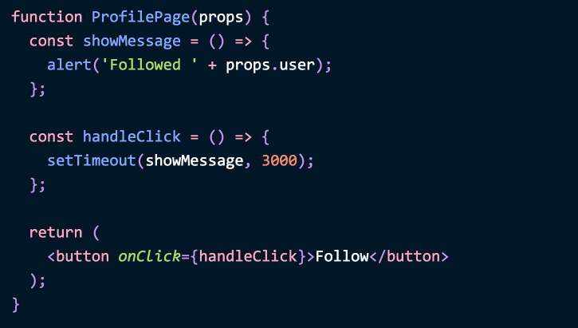

¿En React, en qué se diferencian los componentes de función de las clases?

Durante un tiempo, la respuesta canónica ha sido que las clases proporcionan accesos a más funcionalidades (como el estado). Con [los Hooks](https://reactjs.org/docs/hooks-intro.html), ya eso dejó de ser cierto.

Quizá has escuchado que uno de ellos es mejor en cuanto a rendimiento. ¿Cuál? Muchos de los análisis que se encuentran tienen [fallas](https://medium.com/@dan_abramov/this-benchmark-is-indeed-flawed-c3d6b5b6f97f?source=your_stories_page---------------------------), por lo que en mi caso sería cuidadoso en [sacar conclusiones](https://github.com/ryardley/hooks-perf-issues/pull/2) a partir de ellos. El rendimiento depende principalmente de lo que hace el código y no de si escoges una función o una clase. En nuestra observación, las diferencias en el rendimiento son despreciables, aunque las estrategias de optimización son algo [distintas](https://reactjs.org/docs/hooks-faq.html#are-hooks-slow-because-of-creating-functions-in-render).

En cualquier caso [no recomendamos](https://reactjs.org/docs/hooks-faq.html#should-i-use-hooks-classes-or-a-mix-of-both) reescribir tus componentes existentes a menos que tengas otras razones y no te importe ser un pionero. Los Hooks aún son nuevos (como lo fue React en 2014), y algunas «buenas prácticas» aún no han llegado a los tutoriales.

¿Y eso dónde nos deja? ¿Existe alguna diferencia fundamental en React entre las funciones y las clases? Por supuesto, las hay, en el modelo mental. **En este artículo, fijaré mi mirada en la mayor diferencia entre ellas.** Esta diferencia ha existido desde que se [introdujeron](https://reactjs.org/blog/2015/09/10/react-v0.14-rc1.html#stateless-function-components) los componentes de función en 2015, pero a menudo se pasa por alto:

>**Los componentes de función capturan los valores renderizados.**

Expliquemos lo que esto significa.

---

**Nota: en este artículo no se juzga el valor ni de las clases ni de las funciones. Solo describo la diferencia entre estos dos modelos de programación en React. Para acceder a preguntas sobre cómo adoptar las funciones más ampliamente, dirígete a las [Preguntas frecuentes sobre los Hooks](https://reactjs.org/docs/hooks-faq.html#adoption-strategy).**

---

Considera este componente:

```jsx
function ProfilePage(props) {
  const showMessage = () => {
    alert('Ahora sigues a ' + props.user);
  };

  const handleClick = () => {
    setTimeout(showMessage, 3000);
  };

  return (
    <button onClick={handleClick}>Seguir</button>
  );
}
```

Muestra un botón que simula una petición de red con `setTimeout` y luego muestra una alerta de confirmación. Por ejemplo, si `props.user` es `'Dan'`, mostrará `'Ahora sigues a Dan'` después de tres segundos. Bien simple.

*(Nota que en el ejemplo anterior no importa si se usan funciones flecha o declaraciones regulares de función. `function handleClick()` serviría exactamente de la misma forma).*

¿Cómo escribirlo como una clase? Una traducción ingenua podría verse así:

```jsx
class ProfilePage extends React.Component {
  showMessage = () => {
    alert('Ahora sigues a ' + this.props.user);
  };

  handleClick = () => {
    setTimeout(this.showMessage, 3000);
  };

  render() {
    return <button onClick={this.handleClick}>Seguir</button>;
  }
}
```

Comúnmente se piensa que estos dos fragmentos de código son equivalentes. A menudo se refactoriza entre estos patrones sin notar sus implicaciones:



**Sin embargo, estos dos fragmentos de código tienen diferencias sutiles.** Míralos con detenimiento. ¿Ya ves la diferencia? Personalmente, me tomó un tiempo encontrarla.

**Se vienen *espóilers* más adelante, así que aquí te dejo un [demo en vivo](https://codesandbox.io/s/pjqnl16lm7) si quieres resolverlo por ti mismo.** El resto de este artículo explica la diferencia y por qué importa.

---

Antes de continuar, me gustaría enfatizar que la diferencia que describo no tiene nada que ver con los Hooks en sí. ¡Los ejemplos de arriba ni siquiera utilizan Hooks!

Todo se reduce a la diferencia entre funciones y clases en React. Si tienes en tus planes usar funciones con mayor frecuencia en una aplicación hecha en React, podrías querer entenderla.

---

**Ilustraremos la diferencia con un error que es común en aplicaciones hechas en React.**

Abre este **[ejemplo interactivo](https://codesandbox.io/s/pjqnl16lm7)** con un selector de perfil actual y las dos implementaciones de `ProfilePage` que se mostraron arriba, cada una renderizando un botón Seguir.

Intenta esta secuencia de acciones con ambos botones:

1. **Haz clic** en uno de los botones Seguir.
2. **Cambia** el perfil seleccionado antes de que pasen 3 segundos.
3. **Lee** el texto de alerta.

Notarás una diferencia peculiar:

* Con la función `ProfilePage` de arriba, al hacer clic en el botón Seguir del perfil de Dan y luego navegar al de Sophie aun mostraría la alerta `'Ahora sigues a Dan'`.

* Con la clase `ProfilePage` de arriba, alertaría `'Ahora sigues a Sophie'`:


---


En este ejemplo, el primer comportamiento es el correcto. **Si sigues a una persona y luego navegas al perfil de otra, mi componente no debería confundirse respecto a quién seguí.** Esta implementación de la clase claramente contiene errores.

*(No obstante, absolutamente deberías [seguir a Sophie](https://mobile.twitter.com/sophiebits)).*

---

Entonces, ¿por qué nuestro ejemplo de clase se comporta de esta manera?

Miremos con mayor detenimiento al método `showMessage` de nuestra clase:

```jsx{3}
class ProfilePage extends React.Component {
  showMessage = () => {
    alert('Ahora sigues a ' + this.props.user);
  };
```

Este método de clase lee de `this.props.user`. Las props son inmutables en React por lo que nunca pueden cambiar. **Sin embargo, `this` *es*, y siempre ha sido, mutable.**

De hecho, ese es el próposito de `this` en una clase. React lo muta con el tiempo de manera tal que podamos leer la versión fresca en los métodos `render` y de ciclo de vida.

Por lo que si nuestro componente se vuelve a renderizar mientras la petición se está haciendo, `this.props` cambiará. El método `showMessage` lee `user` de las `props` «demasiado nuevas».

Esto expone una observación importante acerca de la naturaleza de las interfaces de usuario. Si decimos que una interfaz de usuario es conceptualmente una función del estado actual de la aplicación, **los manejadores de eventos son una parte del resultado del renderizado, justo como la salida visual**. Nuestros manejadores de eventos «pertenecen» a un renderizado particular con sus particulares props y estado.

Sin embargo, programar un *timeout* cuyo *callback* lee `this.props` rompe esa asociación. Nuestro *callback* `showMessage` no está «atado» a ningún renderizado en particular, y por tanto «pierde» las props correctas. Al leer de `this` se rompe esa conexión.

---

**Supongamos que los componentes de función no existieran.** ¿Cómo resolveríamos este problema?

Querríamos de alguna manera «reparar» la conexión entre el `render` con las props correctas y el *callback* `showMessage` que las lee. En algún lugar en el camino se pierden las `props`.

Una forma de hacerlo sería leer `this.props` al principio del evento, y luego explícitamente pasarlas en el manejador de completamiento del timeout:

```jsx{2,7}
class ProfilePage extends React.Component {
  showMessage = (user) => {
    alert('Ahora sigues a ' + user);
  };

  handleClick = () => {
    const {user} = this.props;
    setTimeout(() => this.showMessage(user), 3000);
  };

  render() {
    return <button onClick={this.handleClick}>Seguir</button>;
  }
}
```

Esto [funciona](https://codesandbox.io/s/3q737pw8lq). Sin embargo, este enfoque hace que el código sea significativamente más verboso y propenso a errores con el paso del tiempo. ¿Y si necesitáramos más de una prop? ¿Y si también necesitáramos acceder al estado? **Si `showMessage` llama otro método, y ese método lee `this.props.something` o `this.state.something`, tendríamos de nuevo exactamente el mismo problema.** Y entonces tendríamos que pasar `this.props` y `this.state` como argumentos a través de cada método que se llame desde `showMessage`.

Hacerlo acaba con la ergonomía que normalmente proporciona una clase. También es difícil de recordar o hacer que se cumpla, que es la razón por la que las personas a menudo se conforman con los errores.

De manera similar, si se pone en línea el código de `alert` dentro de `handleClick` no se confronta el problema principal. Queremos estructurar el código de forma tal que permita dividirlo en más métodos, *pero* también leer las props y el estado que se corresponden con el renderizado relacionado con esa llamada. **Este problema ni siquiera es único de React, puedes reproducirlo en cualquier biblioteca de interfaces de usuario que ponga datos en un objeto mutable como el caso de `this`.**

¿Quizá podríamos *enlazar* los métodos en el constructor?

```jsx{4-5}
class ProfilePage extends React.Component {
  constructor(props) {
    super(props);
    this.showMessage = this.showMessage.bind(this);
    this.handleClick = this.handleClick.bind(this);
  }

  showMessage() {
    alert('Ahora sigues a ' + this.props.user);
  }

  handleClick() {
    setTimeout(this.showMessage, 3000);
  }

  render() {
    return <button onClick={this.handleClick}>Seguir</button>;
  }
}
```

No, no resuelve nada. Recuerda, el problema es que leemos `this.props` demasiado tarde, ¡no con la sintaxis que estamos usando! **Sin embargo, el problema desaparecería si dependiéramos completamente de las clausuras de Javascript.**

Las clausuras a menudo se evitan porque es [difícil](https://wsvincent.com/javascript-closure-settimeout-for-loop/) pensar en un valor que se puede mutar con el tiempo. Pero en React, ¡las props y el estado son inmutables! (O al menos, se recomienda fuertemente que así sea). Así se elimina un problema mayúsculo de las clausuras.

Esto significa que si encierras las props o el estado de un renderizado en particular, siempre puedes contar con que sean exactamente los mismos:

```jsx{3,4,9}
class ProfilePage extends React.Component {
  render() {
    // ¡Capturar las props!
    const props = this.props;

    // Nota: estamos *dentro de render*.
    // Estos no son métodos de clase.
    const showMessage = () => {
      alert('Ahora sigues a ' + props.user);
    };

    const handleClick = () => {
      setTimeout(showMessage, 3000);
    };

    return <button onClick={handleClick}>Seguir</button>;
  }
}
```


**Has «capturado» las props en el momento del renderizado:**


De esta forma se garantiza que cualquier código dentro de ella (incluido `showMessage`) vea las props para este renderizado en particular. React ya no nos «mueve el queso».

**Podríamos entonces añadir tantas funciones auxiliares como quisiéramos, y todas usarían las props y el estado capturados.** ¡Clausuras al rescate!

---

El [ejemplo de arriba](https://codesandbox.io/s/oqxy9m7om5) es correcto, pero luce extraño. ¿Cuál es el punto de tener una clase si defines funciones dentro de `render` en lugar de usar métodos de clase?

De hecho, podemos simplificar el código al eliminar el «caparazón» de la clase:

```jsx
function ProfilePage(props) {
  const showMessage = () => {
    alert('Ahora sigues a ' + props.user);
  };

  const handleClick = () => {
    setTimeout(showMessage, 3000);
  };

  return (
    <button onClick={handleClick}>Seguir</button>
  );
}
```

Al igual que el anterior, las `props` aún se siguen capturando: React las pasa como un argumento. **A diferencia de `this`, React nunca muta al objeto `props`.**

Es un poco más obvio si desestructuras `props` en la definición de la función:

```jsx{1,3}
function ProfilePage({ user }) {
  const showMessage = () => {
    alert('Ahora sigues a ' + user);
  };

  const handleClick = () => {
    setTimeout(showMessage, 3000);
  };

  return (
    <button onClick={handleClick}>Seguir</button>
  );
}
```

Cuando el componente padre renderiza `ProfilePage` con props diferentes, React llamará nuevamente a la función `ProfilePage`. Pero el manejador de eventos al que ya hicimos clic «pertenecía» al renderizado anterior con su propio valor de `user` y el *callback* `showMessage` que lo lee. Todos permanecen intactos.

Es por eso que en la versión de función de [este demo](https://codesandbox.io/s/pjqnl16lm7), hacer clic en el perfil de Sophie y luego cambiar la selección a Sunil alerta `'Ahora sigues a Sophie'`:


Este comportamiento es correcto. *(¡Aunque probablemente quieras [seguir también a Sunil](https://mobile.twitter.com/threepointone)!)*

---

Ahora entendemos la mayor diferencia entre funciones y clases en React:

>**Los componentes de función capturan los valores renderizados.**

**Con los Hooks, el mismo principio se aplica también al estado.** Considera este ejemplo:

```jsx
function MessageThread() {
  const [message, setMessage] = useState('');

  const showMessage = () => {
    alert('Dijiste: ' + message);
  };

  const handleSendClick = () => {
    setTimeout(showMessage, 3000);
  };

  const handleMessageChange = (e) => {
    setMessage(e.target.value);
  };

  return (
    <>
      <input value={message} onChange={handleMessageChange} />
      <button onClick={handleSendClick}>Enviar</button>
    </>
  );
}
```

(Aquí hay un [demo en vivo](https://codesandbox.io/s/93m5mz9w24).)

Si bien esta no es una buena interfaz para una aplicación de mensajería, ilustra el mismo punto: si envío un mensaje en particular, el componente no se debería confundir acerca de qué mensaje se envió en realidad. El `message` de este componente de función captura el estado que «pertenece» al renderizado que devolvió el manejador de clic llamado por el navegador. Por tanto `message` se establece en el valor que estaba en la entrada cuando se hace clic en «Send».

---

Ahora bien, sabes que las funciones en React capturan las props y el estado por defecto. **Pero, ¿y si *queremos* leer las últimas props o el estado que no pertenecen a este renderizado en particular?** ¿Y si queremos [«leerlas desde el futuro»](https://dev.to/scastiel/react-hooks-get-the-current-state-back-to-the-future-3op2)?

En la clases lo harías leyendo `this.props` o `this.state` porque `this` es mutable. React lo muta. En los componentes de función también puedes tener un valor mutable que es compartido por todos los renderizados del componente. Se llama un «ref»:

```jsx
function MyComponent() {
  const ref = useRef(null);
  // Puedes leer o escribir `ref.current`.
  // ...
}
```

Sin embargo, lo tendrás que manejar tú mismo.

Un ref [desempeña el mismo papel](https://reactjs.org/docs/hooks-faq.html#is-there-something-like-instance-variables) que un campo de instancia. Es la puerta de escape hacia el mundo mutable e imperativo. Puede que estés familiarizado con los «refs del DOM», pero el concepto es mucho más general. Es simplemente una caja en la que puedes poner algo.

Incluso visualmente, `this.something` parece un reflejo de `something.current`. Ambos representan el mismo concepto.

Por defecto, React no crea refs para las últimas props o el estado en los componentes de función. En muchos casos no los necesitamos y sería trabajo perdido asignarlos. Sin embargo, puedes monitorear el valor manualmente si así lo quieres:

```jsx{3,6,15}
function MessageThread() {
  const [message, setMessage] = useState('');
  const latestMessage = useRef('');

  const showMessage = () => {
    alert('Dijiste: ' + latestMessage.current);
  };

  const handleSendClick = () => {
    setTimeout(showMessage, 3000);
  };

  const handleMessageChange = (e) => {
    setMessage(e.target.value);
    latestMessage.current = e.target.value;
  };
```

Si leemos `message` en `showMessage`, veremos el mensaje en el momento en que presionemos el botón Enviar. Pero cuando leemos `latestMessage.current`, obtenemos el último valor, aún si continuamos escribiendo después de que se presiona el botón Enviar.

Puedes comparar los [dos](https://codesandbox.io/s/93m5mz9w24) [demos](https://codesandbox.io/s/ox200vw8k9) para que veas la diferencia por ti mismo. Un ref es una forma de «salirse» de la consistencia del renderizado, y puede ser útil en algunos casos.

De manera general deberías evitar leer o asignar refs *durante* el renderizado, porque las refs son mutables. Es deseable que el renderizado permanezca predecible. **Sin embargo, si queremos obtener el último valor de una prop o estado en particular, puede resultar molesto actualizar la ref manualmente.** Podríamos automatizarlo mediante el uso de un efecto:

```jsx{4-8,11}
function MessageThread() {
  const [message, setMessage] = useState('');

  // Monitorear el último valor.
  const latestMessage = useRef('');
  useEffect(() => {
    latestMessage.current = message;
  });

  const showMessage = () => {
    alert('Dijiste: ' + latestMessage.current);
  };
```

(Aquí hay un [demo](https://codesandbox.io/s/yqmnz7xy8x).)

Hacemos la asignación *dentro* de un efecto de manera tal que el valor de la ref solo cambie después de que el DOM haya sido actualizado. Esto asegura que nuestra mutación no quiebre funcionalidades como [*Time Slicing* y *Suspense*](https://reactjs.org/blog/2018/03/01/sneak-peek-beyond-react-16.html), las cuales dependen de un renderizado interrumpible.

Un uso como este de un ref no se necesita con frecuencia. **Capturar props o estado es a menudo un mejor comportamiento predeterminado.** Sin embargo, puede ser útil cuando nos encontramos con [APIs impertivas](/making-setinterval-declarative-with-react-hooks/) como los intervalos y las suscripciones. Recuerda que puedes monitorear *cualquier* valor de esta forma: una prop, una variable de estado, el objeto completo de props o incluso una función.

Este patrón puede ser también útil para optimizaciones, como cuando la identidad de `useCallback` cambia muy a menudo. Sin embargo, [usar un reductor](https://reactjs.org/docs/hooks-faq.html#how-to-avoid-passing-callbacks-down) es con frecuencia una [mejor solución](https://github.com/ryardley/hooks-perf-issues/pull/3). (¡Tema para un próximo artículo!)

---

En este artículo, hemos analizado patrones comunes en clases que son defectuosos y cómo las clausuras ayudan a arreglarlos. Sin embargo, puede que hayas notado que cuando intentas optimizar Hooks especificando un arreglo de dependencias, puedes encontrarte con errores debido a clausuras obsoletas. ¿Significa esto que las clausuras son el problema? No lo creo.

Como hemos visto anteriormente, las clausuras de hecho nos ayudan a *solucionar* los problemas sutiles que son díficiles de encontrar. De manera similar, hacen que sea mucho más fácil escribir código que funcione correctamente en el [modo concurrente](https://reactjs.org/blog/2018/03/01/sneak-peek-beyond-react-16.html). Esto es posible porque la lógica dentro del componente encierra las props y estado correctos con el que fue renderizado.

En todos los casos que he visto hasta ahora, **los problemas de «clausuras obsoletas» ocurren debido a que se asume incorrectamente que las «funciones no cambian» o que «las props son siempre las mismas»**. Este no es el caso, como espero que este artículo haya ayudado a esclarecer.

Las funciones encierran sus props y estado, y por tanto su identidad es igual de importante. Esto no es un error, sino una característica de los componentes de función. Las funciones no deberían excluirse del «arreglo de dependencias» para `useEffect` o `useCallback`, por ejemplo. (La solución correcta usualmente es o bien `useReducer` o la solución con `useRef` vista anteriormente. Pronto documentaremos como elegir entre ellas.)

Cuando escribimos la mayoría de nuestro código de React con funciones, necesitamos ajustar nuestra intuición sobre la [optimización de código](https://github.com/ryardley/hooks-perf-issues/pull/3) y sobre [qué valores pueden cambiar con el tiempo](https://github.com/facebook/react/issues/14920).

Como [Fredrik lo expresó](https://mobile.twitter.com/EphemeralCircle/status/1099095063223812096):

>La mejor regla mental que he encontrado hasta ahora con los hooks es «escribe código como si cualquier valor pudiera cambiar con el tiempo».

Las funciones no son excepciones a esta regla. Tomará algo de tiempo para que sea conocimiento generalizado en los materiales de aprendizaje sobre React. Requiere algunos ajustes del modo de pensar relacionado con las clases. Pero espero que este artículo te ayude a verlo con una mirada fresca.

Las funciones de React siempre capturan sus valores, y ahora sabemos por qué.


Son un Pokémon completamente diferente.
