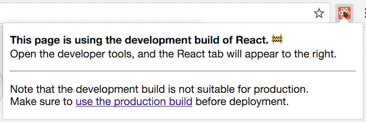

Se sua base de código JavaScript for moderadamente complexa, **você provavelmente terá uma maneira de agrupar e executar código diferente no desenvolvimento e produção**.

Agrupar e executar código diferente no desenvolvimento e produção é poderoso. No modo de desenvolvimento, o React inclui muitos avisos que ajudam a encontrar problemas antes que eles levem a erros. No entanto, o código necessário para detectar esses erros geralmente aumenta o tamanho do pacote e torna o aplicativo mais lento.

A desaceleração é aceitável no desenvolvimento. De fato, executar o código mais lentamente no desenvolvimento *pode até ser benéfico*, pois compensa parcialmente a discrepância entre máquinas de desenvolvimento rápido e um dispositivo de consumo médio.

Em produção, não queremos pagar nenhum custo. Portanto, omitimos essas verificações na produção. Como isso funciona? Vamos dar uma olhada.

--


A maneira exata de executar código diferente no desenvolvimento depende do pipeline de construção do seu JavaScript (e se você possui um). No Facebook, parece com isso:

```jsx
if (__DEV__) {
  doSomethingDev();
} else {
  doSomethingProd();
}
```

Aqui, `__DEV__` não é uma variável real. É uma constante que é substituída quando os módulos são unidos para o navegador. O resultado fica assim:

```jsx
// Em desenvolvimento:
if (true) {
  doSomethingDev(); // 👈
} else {
  doSomethingProd();
}

// Em produção:
if (false) {
  doSomethingDev();
} else {
  doSomethingProd(); // 👈
}
```


Em produção, você também executa um minificador (por exemplo, [terser](https://github.com/terser-js/terser)) no código. A maioria dos minificadores de JavaScript faz uma forma limitada de [eliminação de código morto](https://en.wikipedia.org/wiki/Dead_code_elimination), como a remoção de ramificações `if (false)`. Então, em produção, você só vê:

```jsx
// In production (after minification):
doSomethingProd();
```

*(Observe que existem limites significativos sobre a eficácia da eliminação do código morto com as principais ferramentas JavaScript, mas esse é um tópico separado.)*

Embora você possa não estar usando uma constante mágica `__DEV__`, se você usar um empacotador JavaScript popular como o webpack, provavelmente há outras convenções que você pode seguir. Por exemplo, é comum expressar o mesmo padrão assim:

```jsx
if (process.env.NODE_ENV !== 'production') {
  doSomethingDev();
} else {
  doSomethingProd();
}
```

**Esse é exatamente o padrão usado por bibliotecas como [React](https://reactjs.org/docs/optimizing-performance.html#use-the-production-build) e [Vue](https://vuejs.org /v2/guide/deployment.html#Turn-on-Production-Mode) ao importá-los do npm usando um empacotador.** (A criação da tag `<script>` de arquivo único oferece versões de desenvolvimento e produção separadas como arquivos `.js` e `.min.js`.)

Essa convenção em particular é originária do Node.js. No Node.js, existe uma variável global `process` que expõe as variáveis de ambiente do sistema como propriedades no [`process.env`](https://nodejs.org/dist/latest-v8.x/docs/api/process.html#process_process_env). No entanto, quando você vê esse padrão em uma base de código front-end, geralmente não há nenhuma variável real de `processo` envolvida. 🤯

Em vez disso, toda a expressão `process.env.NODE_ENV` é substituída por uma string literal no momento da construção, assim como nossa variável mágica `__DEV__`:

```jsx
// Em desenvolvimento:
if ('development' !== 'production') { // true
  doSomethingDev(); // 👈
} else {
  doSomethingProd();
}

// Em produção:
if ('production' !== 'production') { // false
  doSomethingDev();
} else {
  doSomethingProd(); // 👈
}
```

Como toda a expressão é constante (`'produção' !== 'produção'` é garantida como `falsa`), um minificador também pode remover o outro ramo.

```jsx
// Em produção (depois da minificação):
doSomethingProd();
```

Prejuízo controlado.

---

Observe que isso **não funcionaria** com expressões mais complexas:

```jsx
let mode = 'production';
if (mode !== 'production') {
  // 🔴 não é garantido que seja eliminado
}
```

As ferramentas de análise estática do JavaScript não são muito inteligentes devido à natureza dinâmica da linguagem. Quando eles veem variáveis como `mode` em vez de expressões estáticas como `false` ou `'production' !== 'production'`, eles geralmente desistem.

Da mesma forma, a eliminação de código morto no JavaScript geralmente não funciona bem nos limites do módulo quando você usa as instruções `import` de nível superior:

```jsx
// 🔴 não é garantido que seja eliminado
import {someFunc} from 'some-module';

if (false) {
  someFunc();
}
```

Portanto, você precisa escrever o código de uma maneira muito mecânica que torne a condição *definitivamente estática* e garantir que *todo o código* que você deseja eliminar esteja dentro dela.

---

Para que tudo isso funcione, seu empacotador precisa fazer a substituição do `process.env.NODE_ENV` e precisa saber em qual modo você *deseja* construir o projeto.

Alguns anos atrás, costumava-se esquecer de configurar o ambiente. Você costuma ver um projeto no modo de desenvolvimento implantado na produção.

Isso é ruim porque faz o site carregar e ficar mais lento.

Nos últimos dois anos, a situação melhorou significativamente. Por exemplo, o webpack adicionou uma opção simples `mode` em vez de configurar manualmente a substituição do `process.env.NODE_ENV`. O React DevTools agora também exibe um ícone vermelho em sites com modo de desenvolvimento, facilitando a localização e até o [relatório](https://mobile.twitter.com/BestBuySupport/status/1027195363713736704).



Configurações opinativas como Create React App, Next/Nuxt, Vue CLI, Gatsby e outras dificultam ainda mais a confusão, separando as compilações de desenvolvimento e produção em dois comandos separados. (Por exemplo, `npm start` e `npm run build`.) Normalmente, apenas uma compilação de produção pode ser implantada, para que o desenvolvedor não cometa mais esse erro.

Sempre há um argumento de que talvez o modo *produção* precise ser o padrão e o modo de desenvolvimento precise ser aceito. Pessoalmente, não acho esse argumento convincente. As pessoas que mais se beneficiam dos avisos do modo de desenvolvimento geralmente são novas na biblioteca. *Eles não saberiam ativá-lo* e perderiam muitos bugs que os avisos teriam detectado antes.

Sim, problemas de desempenho são ruins. Mas o envio de experiências cheias de bugs para os usuários finais também é ruim. Por exemplo, o [Aviso React sobre keys de arrays](https://reactjs.org/docs/lists-and-keys.html#keys) ajuda a evitar erros, como enviar uma mensagem para uma pessoa errada ou comprar um produto errado. Desenvolver com esse aviso desabilitado é um risco significativo para você *e* para os seus usuários. Se estiver desativado por padrão, no momento em que você encontrar o comando e ativá-lo, você terá muitos avisos para limpar. Então, a maioria das pessoas iria desativá-lo. É por isso que ele precisa estar ativado desde o início, e não ativado mais tarde.

Por fim, mesmo que os avisos de desenvolvimento tenham sido aceitos e os desenvolvedores *soubessem* ativá-los no início do desenvolvimento, voltaríamos ao problema original. Alguém os deixaria ativos acidentalmente ao implantar na produção!

E voltamos à estaca zero.

Pessoalmente, acredito em **ferramentas que exibem e usam o modo correto, dependendo de você estar depurando ou implantando**. Quase todos os outros ambientes (móveis, desktops ou servidores), exceto o navegador, já têm uma maneira de carregar e diferenciar o desenvolvimento e a produção há décadas.

Em vez de as bibliotecas criarem e confiarem em convenções ad-hoc, talvez seja a hora dos ambientes JavaScript verem essa distinção como uma necessidade de primeira classe.

---

Chega de filosofia!

Vamos dar uma olhada novamente neste código:

```jsx
if (process.env.NODE_ENV !== 'production') {
  doSomethingDev();
} else {
  doSomethingProd();
}
```

Você pode estar se perguntando: se não há um objeto `process` real no código front-end, por que bibliotecas como React e Vue dependem dele nas compilações npm?

*(Para esclarecer isso novamente: as tags `<script>` que você pode carregar no navegador, oferecidas pelo React e pelo Vue, não confiam nisso. Em vez disso, você deve escolher manualmente entre os arquivos desenvolvimento `.js` e o `.min.js` de produção. A seção abaixo é apenas sobre o uso do React ou do Vue com um empacotador, `import`ando-os do npm.)*

Como muitas coisas na programação, esta convenção em particular tem razões históricas. Ainda o estamos usando, porque agora ele é amplamente adotado por diferentes ferramentas. Mudar para outra coisa é caro e não agrega muito.

Então, qual é a história por trás disso?

Muitos anos antes da padronização da sintaxe `import` e `export`, havia várias maneiras concorrentes de expressar relacionamentos entre os módulos. O Node.js. popularizou `require()` e `module.exports`, conhecidos como [CommonJS](https://en.wikipedia.org/wiki/CommonJS).

O código publicado no registro npm no início foi escrito para Node.js. [Express](https://expressjs.com) foi (e provavelmente ainda é?) a estrutura do servidor mais popular para o Node.js e [usou a variável de ambiente `NODE_ENV`](https://expressjs.com/en/advanced/best-practice-performance.html#set-node_env-to-production) para ativar o modo de produção. Alguns outros pacotes npm adotaram a mesma convenção.

Os primeiros empacotadores de JavaScript, como o browserify, queriam possibilitar o uso do código do npm em projetos de front-end. (Sim, [naquela época](https://blog.npmjs.org/post/101775448305/npm-and-front-end-packaging) quase ninguém usava o npm no front-end! Você pode imaginar?) Então eles estenderam o mesma convenção já presente no ecossistema Node.js. para o código de front-end.

A transformação "envify" original foi [lançada em 2013](https://github.com/hughsk/envify/commit/ae8aa26b759cd2115eccbed96f70e7bbdceded97). O React teve seu código aberto nessa época e o npm com o browserify parecia a melhor solução para agrupar o código CommonJS de front-end naquela época.

O React começou a fornecer compilações npm (além das compilações de tags `<script>`) desde o início. À medida que o React se popularizou, a prática de escrever JavaScript modular com módulos CommonJS e enviar código de front-end via npm também ficou popular.

React precisave de remover o código somente de desenvolvimento no modo de produção. O Browserify já ofereceu uma solução para esse problema, então o React também adotou a convenção de usar o `process.env.NODE_ENV` para suas compilações npm. Com o tempo, muitas outras ferramentas e bibliotecas, incluindo webpack e Vue, fizeram o mesmo.

Em 2019, o browserify perdeu um pouco de atenção. No entanto, substituir `process.env.NODE_ENV` por `'development'` ou `'production'` durante uma etapa de compilação é uma convenção mais popular do que nunca.

*(Seria interessante ver como a adoção dos Módulos ES como um formato de distribuição, em vez de apenas o formato de autoria, altera a equação. Diga-me no Twitter?)*

---

Uma coisa que ainda pode confundir você é que no React *código-fonte* no GitHub, você verá `__DEV__` sendo usado como uma variável mágica. Mas no código React no npm, ele usa `process.env.NODE_ENV`. Como isso funciona?

Historicamente, usamos `__DEV__` no código-fonte para corresponder ao código-fonte do Facebook. Por um longo tempo, o React foi copiado diretamente na base de código do Facebook, por isso era necessário seguir as mesmas regras. Para o npm, tivemos uma etapa de construção que literalmente substituiu as verificações `__DEV__` por `process.env.NODE_ENV! == 'produção'` logo antes da publicação.

Isso às vezes era um problema. Às vezes, um padrão de código baseado em alguma convenção do Node.js funcionava bem no npm, mas quebrava o Facebook ou vice-versa.

Desde ao React 16, mudamos a abordagem. Em vez disso, agora [compilamos um pacote](https://reactjs.org/blog/2017/12/15/improving-the-repository-infrastructure.html#compiling-flat-bundles) para cada ambiente (incluindo `<script>` tags, npm e a base de código interna do Facebook). Assim, mesmo o código CommonJS para npm é compilado para separar os pacotes de desenvolvimento e produção antes do tempo.

Isso significa que enquanto o código fonte do React diz `if (__DEV __)`, na verdade produzimos *dois* pacotes para cada pacote. Um já está pré-compilado com `__DEV__ = true` e outro é pré-compilado com `__DEV__ = false`. O ponto de entrada para cada pacote no npm "decide" qual exportar.

[Por exemplo:](https://unpkg.com/browse/react@16.8.6/index.js)

```jsx
if (process.env.NODE_ENV === 'production') {
  module.exports = require('./cjs/react.production.min.js');
} else {
  module.exports = require('./cjs/react.development.js');
}
```

E esse é o único local em que seu empacotador interpolará `'development'` ou `'production'` como uma string e o seu minificador se livrará do somente `necessário` para o desenvolvimento.

Tanto o `react.production.min.js` quanto o `react.development.js` não têm mais nenhuma verificação do `process.env.NODE_ENV`. Isso é ótimo porque *ao executar o Node.js*, o acesso ao `process.env` é [um pouco lento](https://reactjs.org/blog/2017/09/26/react-v16.0.html#better-server-side-rendering). A compilação antecipada de pacotes nos dois modos também permite otimizar o tamanho do arquivo [com muito mais consistência](https://reactjs.org/blog/2017/09/26/react-v16.0.html#reduced-file-size), independentemente de qual bundler ou minificador você está usando.

E é assim que realmente funciona!

---

Eu gostaria que houvesse uma maneira mais de primeira classe de fazer isso sem depender de convenções, mas aqui estamos. Seria ótimo se os modos fossem um conceito de primeira classe em todos os ambientes JavaScript e se houvesse alguma maneira de um navegador mostrar que algum código está sendo executado em um modo de desenvolvimento quando não deveria.

Por outro lado, é fascinante como uma convenção em um único projeto pode se propagar pelo ecossistema. `EXPRESS_ENV` [se tornou `NODE_ENV`](https://github.com/expressjs/express/commit/03b56d8140dc5c2b574d410bfeb63517a0430451) em 2010 e [espalhou para o front-end](https://github.com/hughsk/envify/commit/ae8aa26b759cd2115eccbed96f70e7bbdceded97) em 2013. Talvez a solução não seja perfeita, mas para cada projeto o custo de adotá-la foi menor do que o custo de convencer os outros a fazer algo diferente. Isso ensina uma lição valiosa sobre a adoção de cima para baixo versus de baixo para cima. A compreensão de como essa dinâmica ocorre distingue as tentativas bem-sucedidas de tentativas de padronização mal sucedidas.

Separar os modos de desenvolvimento e produção é uma técnica muito útil. Eu recomendo usá-lo em suas bibliotecas e no código de aplicações que os tipos de verificações são muito caras para fazer na produção, mas são valiosas (e geralmente críticas!) de fazer no desenvolvimento.

Como em qualquer recurso poderoso, existem algumas maneiras de usá-lo incorretamente. Este será o tópico do meu próximo post!
