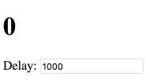

Si vous avez joué avec les [Hooks React](https://reactjs.org/docs/hooks-intro.html) pendant plus de quelques heures, vous avez probablement buté sur un curieux problème : utiliser `setInterval` ne [marche juste pas](https://stackoverflow.com/questions/53024496/state-not-updating-when-using-react-state-hook-within-setinterval) comme on s’y attendrait.

Pour reprendre [les mots](https://mobile.twitter.com/ryanflorence/status/1088606583637061634) de Ryan Florence :

> J’ai entendu pas mal de monde dire que quand on regarde setInterval avec les hooks, on se dit que sur ce coup React doit se sentir morveux…

Honnêtement, je trouve que ces personnes n’ont pas tort.  *C’est en effet* déconcertant au premier abord.

Mais j’ai aussi fini par y voir non pas un défaut des Hooks, mais un décalage entre le [modèle de programmation de React](/react-as-a-ui-runtime/) et `setInterval`. Les Hooks, qui sont plus en phase avec le modèle de programmation de React que les classes, rendent ce décalage plus évident.

**Il _y a_ une manière de les faire fonctionner ensemble sans souci mais elle n’est guère intuitive.**

Dans cet article, nous examinerons _comment_ faire collaborer efficacement les intervalles et les Hooks, _pourquoi_ cette solution est pertinente, et quelles _nouvelles_ possibilités elle nous offre.

-----

**Avertissement : cet article se concentre sur un _cas pathologique_.  Même si l’API simplifie une centaine de cas d’utilisation, les gens parleront toujours du cas qui est devenu plus difficile.**

Si vous ne connaissez pas les Hooks, ou ne comprenez pas pourquoi toute cette agitation, jetez plutôt un œil à [cette introduction](https://medium.com/@dan_abramov/making-sense-of-react-hooks-fdbde8803889) et à la [documentation](https://reactjs.org/docs/hooks-intro.html). Cet article suppose que vous avez bossé avec les Hooks pendant plus d’une heure.

---

## Fais-moi voir le code

Sans plus attendre, voici un compteur qui s’incrémente à chaque seconde :

```jsx{6-9}
import React, { useState, useEffect, useRef } from 'react';

function Counter() {
  let [count, setCount] = useState(0);

  useInterval(() => {
    // Votre logique métier ici
    setCount(count + 1);
  }, 1000);

  return <h1>{count}</h1>;
}
```

*(Et voici une [démo sur CodeSandbox](https://codesandbox.io/s/105x531vkq).)*

Ce `useInterval` n’est pas un Hook fourni par React ; c’est un [Hook personnalisé](https://reactjs.org/docs/hooks-custom.html) que j’ai écrit :

```jsx
import React, { useState, useEffect, useRef } from 'react';

function useInterval(callback, delay) {
  const savedCallback = useRef();

  // Se souvenir de la dernière fonction de rappel.
  useEffect(() => {
    savedCallback.current = callback;
  });

  // Configurer l’intervalle.
  useEffect(() => {
    function tick() {
      savedCallback.current();
    }
    if (delay !== null) {
      let id = setInterval(tick, delay);
      return () => clearInterval(id);
    }
  }, [delay]);
}
```

*(Et revoici <s>la sous-préfète</s> [la démo CodeSandbox](https://codesandbox.io/s/105x531vkq) au cas où vous l’auriez loupée plus haut.)*

**Mon Hook `useInterval` met en place un intervalle et le détruit après le démontage** *(le retrait du DOM virtuel, NdT)*. C’est une combo de `setInterval` et `clearInterval` associée au cycle de vie du composant.

Sentez-vous libres de copier-coller ça dans vos projets ou d’en faire un module npm.

**Si vous vous fichez de savoir pourquoi ça fonctionne, vous pouvez cesser votre lecture ici ! Le reste de cet article est pour celles et ceux qui sont prêt·e·s à explorer les Hooks React plus en profondeur.**

---

## Keskispass ?! 🤔

Je sais ce que vous vous dites :

> Dan, ce code n’a aucun sens.  Qu’est-il donc arrivé à « juste du JavaScript » ?  Admets-le, React est parti en vrille avec les Hooks !

**Je pensais pareil mais j’ai changé d’avis, et je vais changer le vôtre.**  Avant d’expliquer pourquoi ce code est pertinent, je veux la ramener un peu en vous montrant ce dont il est capable.

---

## Pourquoi `useInterval()` est une meilleure API

À titre de rappel, mon Hook `useInterval` accepte une fonction et une durée :

```jsx
  useInterval(() => {
    // ...
  }, 1000);
```

Ça ressemble beaucoup à `setInterval` :

```jsx
  setInterval(() => {
    // ...
  }, 1000);
```

**Alors pourquoi ne pas utiliser directement `setInterval` ?**

Ce n’est sans doute pas évident au premier abord, mais la différence entre le `setInterval` que vous connaissez et mon Hook `useInterval` c’est que **ses arguments sont « dynamiques »**.

Permettez-moi d’illustrer ça avec un exemple concret.

---

Disons qu’on veut que la durée de l’intervalle soit ajustable :



Même si vous ne contrôleriez pas nécessairement la durée avec un *champ*, l’ajuster dynamiquement peut être utile—par exemple, pour ralentir le rythme de requêtes Ajax de mise à jour périodique lorsque l’utilisateur est passé sur un autre onglet.

Alors comment feriez-vous ça avec un `setInterval` dans une classe ?  Moi, je me suis retrouvé avec le code suivant :

```jsx{7-26}
class Counter extends React.Component {
  state = {
    count: 0,
    delay: 1000,
  };

  componentDidMount() {
    this.interval = setInterval(this.tick, this.state.delay);
  }

  componentDidUpdate(prevProps, prevState) {
    if (prevState.delay !== this.state.delay) {
      clearInterval(this.interval);
      this.interval = setInterval(this.tick, this.state.delay);
    }
  }

  componentWillUnmount() {
    clearInterval(this.interval);
  }

  tick = () => {
    this.setState({
      count: this.state.count + 1
    });
  }

  handleDelayChange = (e) => {
    this.setState({ delay: Number(e.target.value) });
  }

  render() {
    return (
      <>
        <h1>{this.state.count}</h1>
        <input value={this.state.delay} onChange={this.handleDelayChange} />
      </>
    );
  }
}
```

*(Et voilà la [démo sur CodeSandbox](https://codesandbox.io/s/mz20m600mp).)*

C’est pas si mal !

Et à quoi ressemble la version basée Hook ?

<font size="50">🥁🥁🥁</font>

```jsx{5-8}
function Counter() {
  let [count, setCount] = useState(0);
  let [delay, setDelay] = useState(1000);

  useInterval(() => {
    // Votre logique métier ici
    setCount(count + 1);
  }, delay);

  function handleDelayChange(e) {
    setDelay(Number(e.target.value));
  }

  return (
    <>
      <h1>{count}</h1>
      <input value={delay} onChange={handleDelayChange} />
    </>
  );
}
```

*(Et sa [démo sur CodeSandbox](https://codesandbox.io/s/329jy81rlm).)*

Et ouais, *c’est tout*.

Contrairement à la version basée classe, il n’y a pas de montée en complexité afin « d’améliorer » notre exemple de Hook pour disposer d’une durée ajustable dynamiquement :

```jsx{4,9}
  // Durée constante
  useInterval(() => {
    setCount(count + 1);
  }, 1000);

  // Durée ajustable
  useInterval(() => {
    setCount(count + 1);
  }, delay);
```

Quand le Hook `useInterval` voit une durée différente, il reconfigure l’intervalle.

**Au lieu d’écrire du code qui *crée* et *efface* l’intervalle, je peux *déclarer* un intervalle avec une durée particulière—et notre Hook `useInterval` s’occupe du reste.**

Et si je voulais mettre temporairement mon intervalle *en pause* ?  Je peux le faire avec un état :

```jsx{6}
  const [delay, setDelay] = useState(1000);
  const [isRunning, setIsRunning] = useState(true);

  useInterval(() => {
    setCount(count + 1);
  }, isRunning ? delay : null);
```

*(Voici la [démo](https://codesandbox.io/s/l240mp2pm7) !)*

C’est le genre de truc sur les Hooks qui me redonne la pêche en React.  On peut enrober des APIs impératives existantes et créer des APIs déclaratives qui expriment plus lisiblement notre intention.  Tout comme avec le rendu, nous pouvons **décrire le process dans toute sa temporalité simultanément** plutôt que d’émettre précautionneusement toute une série de commandes pour le manipuler.

---

J’espère que ça vous a convaincus que le Hook `useInterval()` est une plus chouette API—au moins quand on s’en sert au sein d’un composant.

**Mais pourquoi est-il pénible d’utiliser `setInterval()` et `clearInterval()` avec les Hooks ?**  Revenons sur notre exemple de compteur pour tenter de l’implémenter à la main.

---

## Première tentative

Je vais commencer avec un exemple simple qui fait juste le rendu de l’état initial :

```jsx
function Counter() {
  const [count, setCount] = useState(0);
  return <h1>{count}</h1>;
}
```

Ensuite, je veux un intervalle qui l’incrémente à chaque seconde.  C’est un [effet de bord qui devra se nettoyer](https://reactjs.org/docs/hooks-effect.html#effects-with-cleanup) alors je vais utiliser `useEffect()` et renvoyer la fonction de nettoyage :

```jsx{4-9}
function Counter() {
  let [count, setCount] = useState(0);

  useEffect(() => {
    let id = setInterval(() => {
      setCount(count + 1);
    }, 1000);
    return () => clearInterval(id);
  });

  return <h1>{count}</h1>;
}
```

*(Voir la [démo sur CodeSandbox](https://codesandbox.io/s/7wlxk1k87j).)*

Ça semble assez simple ?  Ça marche pas trop mal.

**Pourtant, ce code a un comportement étrange.**

Par défaut, React ré-applique les effets à chaque rendu.  C’est volontaire car ça permet d’éviter [toute une catégorie de bugs](https://reactjs.org/docs/hooks-effect.html#explanation-why-effects-run-on-each-update) qu’on trouve dans les composants React à base de classes.

Ce comportement est généralement souhaitable car de nombreuses APIs d’inscription peuvent facilement retirer l’ancien écouteur et ajouter le nouveau à tout moment.  Hélas, `setInterval` n’est pas de celles-ci.  Quand nous appelons `clearInterval` et `setInterval`, leur planification se décale.  Si nous refaisons un rendu et ré-appliquons les effets trop souvent, l’intervalle n’aura jamais l’opportunité de se déclencher !

On peut voir ce bug en refaisant un rendu de notre composant au sein d’un intervalle *plus court* :

```jsx
setInterval(() => {
  // Refait le rendu et ré-applique les effets de Counter,
  // ce qui entraîne un clearInterval() et un setInterval()
  // avant même que l’intervalle ne se déclenche.
  ReactDOM.render(<Counter />, rootElement);
}, 100);
```

*(Voir une [démo](https://codesandbox.io/s/9j86r218y4) de ce bug.)*

---

## Deuxième tentative

Vous savez peut-être que `useEffect()` nous permet de [*refuser*](https://reactjs.org/docs/hooks-effect.html#tip-optimizing-performance-by-skipping-effects) que nos effets soient ré-appliqués.  On peut préciser un tableau de dépendances comme second argument, et React ne ré-exécutera notre effet que si quelque chose change dans ce tableau :

```jsx{3}
useEffect(() => {
  document.title = `Vous avez cliqué ${count} fois`;
}, [count]);
```

Quand nous voulons exécuter un effet *seulement* au montage, et le nettoyer au démontage, on peut passer un tableau de dépendances vides `[]`.

Cependant, c’est souvent la cause d’erreurs si vous n’êtes pas bien à l’aise avec les fermetures lexicales *(closures, NdT)* en JavaScript.  Nous allons faire cette erreur dès maintenant ! (Notez qu’on est en train de construire une [règle de linter](https://github.com/facebook/react/pull/14636) conçue pour mettre en évidence ce type de bugs le plus tôt possible, mais elle n’est pas encore tout à fait prête.)

Avec notre première tentative, notre problème venait du fait que la ré-exécution des effets effaçait trop tôt notre timer.  On peut tenter de corriger ça en ne les ré-exécutant jamais :

```jsx{9}
function Counter() {
  let [count, setCount] = useState(0);

  useEffect(() => {
    let id = setInterval(() => {
      setCount(count + 1);
    }, 1000);
    return () => clearInterval(id);
  }, []);

  return <h1>{count}</h1>;
}
```

Sauf que voilà, maintenant notre compteur monte à 1 et ne bouge plus. ([Voir le bug en action](https://codesandbox.io/s/jj0mk6y683).)

Que s’est-il passé ?

**Le problème, c’est que `useEffect` capture la valeur de `count` issue du premier rendu.**  Il est égal à `0`.  On ne ré-applique jamais l’effet, alors la fermeture lexicale de `setInterval` référence toujours le `count` du premier rendu, et `count + 1` est toujours `1`. Oups !

**J’entends vos dents grincer d’ici.  Les hooks sont énervants, pas vrai ?**

[Une des manières](https://codesandbox.io/s/j379jxrzjy) de corriger ça serait de remplacer `setCount(count + 1)` par sa forme « fonction de mise à jour » `setCount(c => c + 1)`.  Elle pourra ainsi toujours lire l’état à jour dans cette variable.  Mais ça ne nous aiderait pas à lire des props à jour, par exemple.

[Un autre correctif](https://codesandbox.io/s/00o9o95jyv) consisterait à utiliser [`useReducer()`](https://reactjs.org/docs/hooks-reference.html#usereducer).  Cette approche nous donne une meilleure flexibilité.  Au sein du réducteur, vous avez accès tant à l’état courant qu’aux props à jour.  La fonction `dispatch` elle-même ne change jamais, alors on peut y balancer des données depuis n’importe quelle fermeture lexicale.  `useReducer()` est toutefois limité en ce qu’il ne permet pas d’émettre des effets de bord. (Ceci dit, vous pouvez renvoyer un nouvel état—qui pourrait déclencher un effet.)

**Mais pourquoi ça devient si compliqué ?**

---

## Le décalage d’impédance

On emploie parfois ce terme, et [Phil Haack](https://haacked.com/archive/2004/06/15/impedance-mismatch.aspx/) l’explique ainsi :

> On pourrait dire que les Bases de données viennent de Mars et les Objets de Vénus.  Les bases de données n’ont pas de correspondance naturelle aux modèles objets.  Ça revient en fait à essayer de faire coller les pôles Nord de deux aimants.

Notre « décalage d’impédance » n’est pas ici entre les Bases de Données et les Objets.  Il survient entre le modèle de programmation de React et l’API impérative `setInterval`.

**Un composant React peut être monté pendant un bout de temps et passer par de nombreux états distincts, mais son résultat de rendu est censé *tous les décrire d’un coup.***

```jsx
  // Décrit tous les rendus possibles
  return <h1>{count}</h1>
```

Les Hooks nous permettent d’appliquer la même approche déclarative pour les effets :

```jsx{4}
  // Décrit tous les états d’intervalle
  useInterval(() => {
    setCount(count + 1);
  }, isRunning ? delay : null);
```

On ne *configure* pas l’intervalle, mais on définit *si* il est actif, et avec quelle durée.  Notre Hook s’occupe de la réalisation.  Un processus continu est ici décrit en termes discrets.

**À l’inverse, `setInterval` ne décrit pas un processus dans le temps—une fois l’intervalle configuré, vous ne pouvez rien y changer, à part l’annuler.**

Voilà le décalage entre le modèle de React et l’API `setInterval`.

---

Les props et l’état des composants React peuvent changer.  React refera leur rendu et « oubliera » tout du résultat du rendu précédent.  Ce dernier n’a plus d’intérêt.

Le Hook `useEffect()` « oublie » le rendu précédent, lui aussi.  Il nettoie l’effet précédent et configure l’effet suivant.  Cet effet suivant porte dans sa fermeture lexicale les props et l’état à jour.  C’est pourquoi notre [première tentative](https://codesandbox.io/s/7wlxk1k87j) marche pour les cas simples.

**Mais `setInterval` « n’oublie » rien.**  Il référencera pour toujours les anciennes valeurs des props et de l’état, à moins que vous ne le remplaciez—ce que vous ne pouvez pas faire sans réinitialiser la planification.

À moins que…?

---

## Les refs à la rescousse !

<!-- RESUME -->

Le problème se résume à ceci :

* On appelle `setInterval(callback1, delay)` avec le `callback1` du premier rendu.
* On a `callback2` du rendu suivant, dont la fermeture lexicale contient les props et l’état à jour.
* Mais on ne peut pas remplacer un intervalle existant sans réinitialiser sa planification !

**Alors si on ne remplaçait pas du tout l’intervalle, mais qu’on introduisait plutôt une variable modifiable `savedCallback` qui pointerait vers la fonction de rappel *la plus récente* pour l’intervalle ?**

On entrevoit maintenant la solution :

* On appelle `setInterval(fn, delay)`, avec `fn` qui appelle `savedCallback`.
* On fait pointer `savedCallback` sur `callback1` après le premier rendu.
* On fait pointer `savedCallback` sur `callback2` après le rendu suivant.
* ???
* FORTUNE ET GLOIRE

Ce `savedCallback` modifiable doit pouvoir « persister » d’un rendu à l’autre.  Il ne peut donc pas s’agir d’une variable classique.  On veut quelque chose qui se comporte plus comme un champ d’instance.

[Comme on peut le voir dans la FAQ des Hooks](https://reactjs.org/docs/hooks-faq.html#is-there-something-like-instance-variables), `useRef()` nous fournit exactement ça :

```jsx
  const savedCallback = useRef();
  // { current: null }
```

*(Vous connaissez peut-être les [refs DOM](https://reactjs.org/docs/refs-and-the-dom.html) de React.  Les Hooks utilisent le même concept pour garder sous la main des valeurs modifiables.  Une ref est comme une « boîte » dans laquelle vous pouvez mettre ce qui vous chante.)*

`useRef()` renvoie un objet brut avec une propriété modifiable `current`, partagée d’un rendu à l’autre.  On peut y sauvegarder la fonction de rappel *la plus récente* pour l’intervalle :

```jsx{8}
  function callback() {
    // Ici on a accès aux props et à l’état à jour, etc.
    setCount(count + 1);
  }

  // Après chaque rendu, on sauve la fonction de rappel
  // à jour dans notre ref.
  useEffect(() => {
    savedCallback.current = callback;
  });
```

Après quoi on peut la lire et l’appeler au sein de notre intervalle :

```jsx{3,8}
  useEffect(() => {
    function tick() {
      savedCallback.current();
    }

    let id = setInterval(tick, 1000);
    return () => clearInterval(id);
  }, []);
```

Grâce au `[]`, notre effet n’est jamais ré-exécuté, du coup l’intervalle n’est pas réinitialisé.  Néanmoins, grâce à la ref `savedCallback`, nous pouvons toujours lire la fonction de rappel définie lors du dernier rendu, et l’appeler à chaque tic de l’intervalle.

Voici la solution complète qui fonctionne :

```jsx{10,15}
function Counter() {
  const [count, setCount] = useState(0);
  const savedCallback = useRef();

  function callback() {
    setCount(count + 1);
  }

  useEffect(() => {
    savedCallback.current = callback;
  });

  useEffect(() => {
    function tick() {
      savedCallback.current();
    }

    let id = setInterval(tick, 1000);
    return () => clearInterval(id);
  }, []);

  return <h1>{count}</h1>;
}
```

*(Voir la [démo sur CodeSandbox](https://codesandbox.io/s/3499qqr565).)*

---

## Extraire un Hook

J’avoue, le code ci-dessus peut être déroutant.  Ça tord un peu le cerveau de mélanger des paradigmes opposés.  Il existe aussi un risque de mettre le bazar avec les refs modifiables.

**Je trouve que les Hooks fournissent des primitives de plus bas niveau que les classes—mais leur beauté réside en ce qu’ils nous permettent de les composer pour créer de meilleures abstractions déclaratives.**

Idéalement, j’aimerais juste pouvoir écrire :

```jsx{4-6}
function Counter() {
  const [count, setCount] = useState(0);

  useInterval(() => {
    setCount(count + 1);
  }, 1000);

  return <h1>{count}</h1>;
}
```

Je vais copier-coller le corps de mon mécanisme de refs dans un Hook personnalisé :

```jsx
function useInterval(callback) {
  const savedCallback = useRef();

  useEffect(() => {
    savedCallback.current = callback;
  });

  useEffect(() => {
    function tick() {
      savedCallback.current();
    }

    let id = setInterval(tick, 1000);
    return () => clearInterval(id);
  }, []);
}
```

Pour le moment, ma durée de `1000` est codée en dur.  J’aimerais en faire un argument :

```jsx
function useInterval(callback, delay) {
```

Je vais l’utiliser pour configurer l’intervalle :

```jsx
    let id = setInterval(tick, delay);
```

À présent que le `delay` peut changer d’un rendu à l’autre, j’ai besoin de le déclarer dans les dépendances de mon effet d’intervalle :

```jsx{8}
  useEffect(() => {
    function tick() {
      savedCallback.current();
    }

    let id = setInterval(tick, delay);
    return () => clearInterval(id);
  }, [delay]);
```

Attendez une minute, on ne voulait pas justement éviter de réinitialiser l’effet d’intervalle, en lui passant expressément `[]` pour cette raison ?  Pas exacte­ment.  On voulait juste éviter de le réinitialiser quand *la fonction de rappel* changeait.  Mais si `delay` change, on *veut* redémarrer le timer !

Voyons si notre code fonctionne :

```jsx
function Counter() {
  const [count, setCount] = useState(0);

  useInterval(() => {
    setCount(count + 1);
  }, 1000);

  return <h1>{count}</h1>;
}

function useInterval(callback, delay) {
  const savedCallback = useRef();

  useEffect(() => {
    savedCallback.current = callback;
  });

  useEffect(() => {
    function tick() {
      savedCallback.current();
    }

    let id = setInterval(tick, delay);
    return () => clearInterval(id);
  }, [delay]);
}
```

*(Essayez donc sur [CodeSandbox](https://codesandbox.io/s/xvyl15375w).)*

Ça marche ! On peut maintenant faire un `useInterval()` dans n’importe quel composant sans avoir à trop penser aux détails de son implémentation.

## Bonus : mettre l’intervalle en pause

Disons que nous voulons pouvoir mettre l’intervalle en pause en passant `null` comme `delay` :

```jsx{6}
  const [delay, setDelay] = useState(1000);
  const [isRunning, setIsRunning] = useState(true);

  useInterval(() => {
    setCount(count + 1);
  }, isRunning ? delay : null);
```

Comment implémenter ça ? La réponse est simple : en ne configurant pas l’intervalle.

```jsx{6}
  useEffect(() => {
    function tick() {
      savedCallback.current();
    }

    if (delay !== null) {
      let id = setInterval(tick, delay);
      return () => clearInterval(id);
    }
  }, [delay]);
```

*(Voir la [démo sur CodeSandbox](https://codesandbox.io/s/l240mp2pm7).)*

Et c’est tout.  Ce code gère toutes les transitions possibles : changement de durée, pause, reprise de l’intervalle.  L’API `useEffect()` nous demande de consacrer un plus gros effort en amont à la description de la mise en place et du nettoyage—mais rajouter des cas devient facile.

## Bonus : une démo rigolote

Ce Hook `useInterval()` est vraiment marrant à utiliser.  Quand les effets de bord sont déclaratifs, il est beaucoup plus facile d’orchestrer plusieurs comportements complexes.

**Par exemple, on peut faire que le `delay` d’un intervalle soit contrôlé par un autre :**


```jsx{10-15}
function Counter() {
  const [delay, setDelay] = useState(1000);
  const [count, setCount] = useState(0);

  // Incrémenter le compteur.
  useInterval(() => {
    setCount(count + 1);
  }, delay);

  // Accélérer à chaque seconde !
  useInterval(() => {
    if (delay > 10) {
      setDelay(delay / 2);
    }
  }, 1000);

  function handleReset() {
    setDelay(1000);
  }

  return (
    <>
      <h1>Compteur : {count}</h1>
      <h4>Durée : {delay}</h4>
      <button onClick={handleReset}>
        Réinitialiser la durée
      </button>
    </>
  );
}
```

*(Voir la [démo sur CodeSandbox](https://codesandbox.io/s/znr418qp13) !)*

## En conclusion

Les Hooks nécessitent de la pratique—*en particulier* à la frontière entre des codes impératif et déclaratif.  Vous pouvez créer de puissantes abstractions déclaratives grâces à eux, comme [React Spring](http://react-spring.surge.sh/hooks), mais ils peuvent clairement parfois vous porter sur les nerfs.

Nous n’en sommes qu’au début des Hooks, et nous avons clairement encore du boulot pour affiner et comparer les solutions et les bonnes pratiques.  Ne précipitez pas votre adoption des Hooks si vous avez plutôt l’habitude de suivre des bonnes pratiques bien établies.  Il nous reste beaucoup de choses à essayer et à découvrir.

J’espère que cet article vous aura aidés à comprendre les pièges classiques associés à l’utilisation d’APIs telles que `setInterval()` avec les Hooks, à discerner les approches qui peuvent vous aider à vous en dépêtrer, et à goûter le fruit délicieux de la création d’APIs déclaratives plus expressives grâce à eux.
