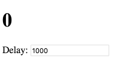
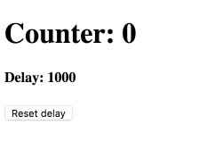

如果你玩了几小时的 [React Hooks](https://reactjs.org/docs/hooks-intro.html)，你可能会陷入一个烦人的问题：在用 `setInterval` 时总会[偏离](https://stackoverflow.com/questions/53024496/state-not-updating-when-using-react-state-hook-within-setinterval)自己想要的效果。

这是 Ryan Florence 的[原话](https://mobile.twitter.com/ryanflorence/status/1088606583637061634)：

>我已经碰到许多人提到带有 setInterval 的 hooks 时常会打 React 的脸，但因为 stale state 引发的问题我还是头一次见。 如果在 hooks 中这个问题极其困难，那么相比于 class component，我们遇到了不同级别复杂度的问题。

老实说，我觉得这些人是有一套的，至少为此困惑了。

然而我发现这不是 Hooks 的问题，而是 [React编程模型](/react-as-a-ui-runtime/) 和 `setInterval` 不匹配造成的。Hooks 比 class 更贴近 React 编程模型，使这种不匹配更明显。

在这篇文章里，我们会看到 intervals 和 Hooks 是如何玩在一起的、为什么这个方案有意义和可以提供哪些新的功能。

-----

**免责声明：这篇文章的重点是一个 _问题样例_。即使 API 可以简化上百种情况，议论始终指向更难的问题上**。

如果你刚入手 Hooks 且不知道这儿在说什么，先查看 [这个介绍](https://juejin.im/post/5be98a87f265da616e4bf8a4) 和 [文档](https://reactjs.org/docs/hooks-intro.html)。这篇文章假设你已经使用 Hooks 超过一个小时。

---

## 直接给我看代码

不用多说，这是一个每秒递增的计数器：

```jsx{6-9}
import React, { useState, useEffect, useRef } from 'react';

function Counter() {
  let [count, setCount] = useState(0);

  useInterval(() => {
    // 你自己的代码
    setCount(count + 1);
  }, 1000);

  return <h1>{count}</h1>;
}
```

*（这是 [CodeSandbox demo](https://codesandbox.io/s/105x531vkq)）。*

demo里面的 `useInterval` 不是一个内置 React Hook，而是一个我写的 [custom Hook](https://reactjs.org/docs/hooks-custom.html)。

```jsx
import React, { useState, useEffect, useRef } from 'react';

function useInterval(callback, delay) {
  const savedCallback = useRef();

  // 保存新回调
  useEffect(() => {
    savedCallback.current = callback;
  });

  // 建立 interval
  useEffect(() => {
    function tick() {
      savedCallback.current();
    }
    if (delay !== null) {
      let id = setInterval(tick, delay);
      return () => clearInterval(id);
    }
  }, [delay]);
}
```

*(这是前面的demo中，你可能错过的 [CodeSandbox demo](https://codesandbox.io/s/105x531vkq)。)*

**我的 `useInterval` Hook 内置了一个 interval 并在 unmounting 的时候清除**，它是一个作用在组件生命周期里的 `setInterval` 和 `clearInterval` 的组合。

你可以随意将它复制粘贴到项目中或者用 npm 导入。

**如果你不在乎它是怎么实现的，你可以停止阅读了！接下来的部分是给想深度挖掘 React Hooks 的乡亲们准备的**。

---

## 等什么?! 🤔

我知道你在想什么：

>Dan，这段代码根本没什么意思，「单单是 JavaScript」能有什么？承认 React 用 Hooks 钓到了 「鲨鱼」 吧！

**一开始我也是这样想的，但后来我改变想法了，我也要改变你的**。在解释这段代码为什么有意义之前，我想展示下它能做什么。

---

## 为什么 `useInterval()` 是更好的API

提醒你下，我的 `useInterval` Hook 接收 一个 function 和 一个 delay 参数：

```jsx
  useInterval(() => {
    // ...
  }, 1000);
```

这样看起很像 `setInterval`：

```jsx
  setInterval(() => {
    // ...
  }, 1000);
```

**所以为什么不直接用 `setInterval` 呢**？

一开始可能不明显，但你发现我的 `useInterval` 与 `setInterval` 之间的不同后，你会看出 **它的参数是「动态地」**。

我将用具体的例子来说明这一点。

---

假设我们希望 delay 可调：



虽然你不一定要用到输入控制 delay，但动态调整可能很有用 —— 例如，用户切换到其他选项卡时，要减少 AJAX 轮询更新间隔。

所以在 class 里你要怎么用 `setInterval` 做到这一点呢？我会这么做：

```jsx{7-26}
class Counter extends React.Component {
  state = {
    count: 0,
    delay: 1000,
  };

  componentDidMount() {
    this.interval = setInterval(this.tick, this.state.delay);
  }

  componentDidUpdate(prevProps, prevState) {
    if (prevState.delay !== this.state.delay) {
      clearInterval(this.interval);
      this.interval = setInterval(this.tick, this.state.delay);
    }
  }

  componentWillUnmount() {
    clearInterval(this.interval);
  }

  tick = () => {
    this.setState({
      count: this.state.count + 1
    });
  }

  handleDelayChange = (e) => {
    this.setState({ delay: Number(e.target.value) });
  }

  render() {
    return (
      <>
        <h1>{this.state.count}</h1>
        <input value={this.state.delay} onChange={this.handleDelayChange} />
      </>
    );
  }
}
```

*（这是 [CodeSandbox demo](https://codesandbox.io/s/mz20m600mp)。）*

这样也不错！

Hook 版本看起来是什么样子的？

<font size="50">🥁🥁🥁</font>

```jsx{5-8}
function Counter() {
  let [count, setCount] = useState(0);
  let [delay, setDelay] = useState(1000);

  useInterval(() => {
    // 这是你的自定义逻辑
    setCount(count + 1);
  }, delay);

  function handleDelayChange(e) {
    setDelay(Number(e.target.value));
  }

  return (
    <>
      <h1>{count}</h1>
      <input value={delay} onChange={handleDelayChange} />
    </>
  );
}
```

*（这是 [CodeSandbox demo](https://codesandbox.io/s/329jy81rlm)。）*

是的，*这就是全部了*。

不像 class 的版本，`useInterval` Hook 例子中，「更新」成动态调整 delay 很简单：

```jsx{4,9}
  // 固定 delay
  useInterval(() => {
    setCount(count + 1);
  }, 1000);

  // 可调整 delay
  useInterval(() => {
    setCount(count + 1);
  }, delay);
```

当 `useInterval` Hook 接收到不同 delay，它会重设 interval。

**声明一个带有动态调整 delay 的 interval，来替代写 *添加*和*清除* interval 的代码 —— `useInterval` Hook 帮我们做到了**。

如果我想暂时 *暂停* interval 要怎么做？我可以用一个 state 来做到：

```jsx{6}
  const [delay, setDelay] = useState(1000);
  const [isRunning, setIsRunning] = useState(true);

  useInterval(() => {
    setCount(count + 1);
  }, isRunning ? delay : null);
```

*（这是 [demo](https://codesandbox.io/s/l240mp2pm7)!）*

这让我对 React 和 Hooks 再次感到兴奋。我们可以包装现有的命令式 APIs 和创建更贴近表达我们意图的声明式 APIs。就拿渲染来说，我们可以同时准确地描述每个时间点过程，而不用小心地用指令来操作它。

---

我希望到这里你们开始觉得 `useInterval()` Hook 是一个更好的 API 了 —— 至少和组件比。

**但为什么在 Hooks 中使用 `setInterval()` 和 `clearInterval()` 让人心烦呢**？让我们回到计数器例子并试着手动实现它。

---

## 第一次尝试

我会从一个只渲染初始状态的简单例子开始：

```jsx
function Counter() {
  const [count, setCount] = useState(0);
  return <h1>{count}</h1>;
}
```

现在我想要一个每秒增加的 interval，它是一个[需要清理副作用](https://reactjs.org/docs/hooks-effect.html#effects-with-cleanup)的，所以我将用到 `useEffect()` 并返回清理函数：

```jsx{4-9}
function Counter() {
  let [count, setCount] = useState(0);

  useEffect(() => {
    let id = setInterval(() => {
      setCount(count + 1);
    }, 1000);
    return () => clearInterval(id);
  });

  return <h1>{count}</h1>;
}
```

*（查看 [CodeSandbox demo](https://codesandbox.io/s/7wlxk1k87j).）*

这种工作看起来很简单对吧？

**但是，这代码有一个奇怪的行为**。

默认情况下，React 会在每次渲染后重执行 effects，这是有目的的，这有助于避免 React class 组件的[某种 bugs](https://reactjs.org/docs/hooks-effect.html#explanation-why-effects-run-on-each-update)。

这通常是好的，因为需要许多订阅 API 可以随时顺手移除老的监听者和加个新的。但是，`setInterval` 和它们不一样。当我们执行 `clearInterval` 和 `setInterval` 时，它们会进入时间队列里，如果我们频繁重渲染和重执行 effects，interval 有可能没有机会被执行！

我们可以通过以*更短*间隔重渲染我们的组件，来发现这个 bug：

```jsx
setInterval(() => {
  // 重渲染和重执行 Counter 的 effects
  // 这里会发生 clearInterval()
  // 在 interval 被执行前 setInterval()
  ReactDOM.render(<Counter />, rootElement);
}, 100);
```

*（看这个 bug 的 [demo](https://codesandbox.io/s/9j86r218y4)）*

---

## 第二次尝试

你可能知道 `useEffect()` 允许我们[*选择性地*](https://reactjs.org/docs/hooks-effect.html#tip-optimizing-performance-by-skipping-effects)进行重执行 effects，你可以设定一个依赖数组作为第二个参数，React 只会在数组里的某个发生变化时重运行：

```jsx{3}
useEffect(() => {
  document.title = `You clicked ${count} times`;
}, [count]);
```

当我们 *只* 想在 mount 时执行 effect 和 unmount 时清理它，我们可以传空 `[]` 的依赖数组。

但是，如果你不熟悉 JavaScript 的闭包，会碰到一个常见的错误。我们现在就来制造这个错误！（我们还建立了一个尽早反馈这个错误的 [lint 规则](https://github.com/facebook/react/pull/14636)，但还没准备好。）

在第一次尝试中，我们的问题是重运行 effects 时使得 timer 过早被清除，我们可以尝试不重运行去修复它们：

```jsx{9}
function Counter() {
  let [count, setCount] = useState(0);

  useEffect(() => {
    let id = setInterval(() => {
      setCount(count + 1);
    }, 1000);
    return () => clearInterval(id);
  }, []);

  return <h1>{count}</h1>;
}
```

但是，现在我们的计时器更新到 1 就不动了。（[查看真实 bug](https://codesandbox.io/s/jj0mk6y683)。）

发生了什么？！

**问题在于，`useEffect` 在第一次渲染时获取值为 0 的 `count`**，我们不再重执行 effect，所以 `setInterval` 一直引用第一次渲染时的闭包 `count`，以至于 `count + 1` 一直是 `1`。哎呀呀！

**我可以听见你咬牙切齿了，Hooks 真烦人对吧**？

修复它的[一种方法](https://codesandbox.io/s/j379jxrzjy)是用像 `setCount(c => c + 1)` 这样的 「updater」替换 `setCount(count + 1)`，这样可以读到新 state 变量。但这个无法帮助你获取到新的 props。

[另一个方法](https://codesandbox.io/s/00o9o95jyv)是用 [`useReducer()`](https://reactjs.org/docs/hooks-reference.html#usereducer)。这种方法为你提供了更大的灵活性。在 reducer 中，你可以访问到当前 state 和新的 props。`dispatch` 方法本身永远不会改变，所以你可以从任何闭包中将数据放入其中。`useReducer()` 有个约束是你不可以用它执行副作用。（但是，你可以返回新状态 —— 触发一些 effect。）

**但为什么要变得这么复杂**？

---

## 阻抗不匹配

这个术语有时会被提到，[Phil Haack](https://haacked.com/archive/2004/06/15/impedance-mismatch.aspx/) 解释如下：

>有人说数据库来自火星而对象来自金星，数据库不会自然地映射到对象模型。这很像试图将磁铁的两极推到一起。

我们的「阻抗匹配」不在数据库和对象之间，它在 React 编程模型和命令式 `setInterval` API 之间。

**一个 React 组件可能在 mounted 之前流经许多不同的 state，但它的渲染结果将*一次性全部*描述出来**。

```jsx
  // 描述每次渲染
  return <h1>{count}</h1>
```

Hooks 使我们把相同的声明方法用在 effects 上：

```jsx{4}
  // 描述每个间隔状态
  useInterval(() => {
    setCount(count + 1);
  }, isRunning ? delay : null);
```

我们不*设置* interval，但指定它*是否*设置延迟或延迟多少，我们的 Hooks 做到了，用离散术语描述连续过程

**相反，`setInterval` 没有及时地描述过程 —— 一旦设定了 interval，除了清除它，你无法对它做任何改变**。

这就是 React 模型和 `setInterval` API 之间的不匹配。

---

React 组件中的 props 和 state 是可以改变的， React 会重渲染它们且「丢弃」任何关于上一次渲染的结果，它们之间不再有相关性。

`useEffect()` Hook 也「丢弃」上一次渲染结果，它会清除上一次 effect 再建立下一个 effect，下一个 effect 锁住新的 props 和 state，这也是我们[第一次尝试](https://codesandbox.io/s/7wlxk1k87j)简单示例可以正确工作的原因。

**但 `setInterval` 不会「丢弃」。** 它会一直引用老的 props 和 state 直到你把它换掉 —— 不重置时间你是无法做到的。

或者等等，你可以做到？

---

## Refs 可以做到！

这个问题归结为下面这样：

* 我们在第一次渲染时执行带 `callback1` 的 `setInterval(callback1, delay)`。
* 我们在下一次渲染时得到携带新的 props 和 state 的 `callbaxk2`。
* 我们无法在不重置时间的情况下替换掉已经存在的 interval。

**那么如果我们根本不替换 interval，而是引入一个指向*新* interval 回调的可变 `savedCallback` 会怎么样**？

现在我们来看看这个方案：

* 我们调用 `setInterval(fn, delay)`，其中 `fn` 调用 `savedCallback`。
* 第一次渲染后将 `savedCallback` 设为 `callback1`。
* 下一次渲染后将 `savedCallback` 设为 `callback2`。
* ???
* 完成

这个可变的 `savedCallback` 需要在重新渲染时「可持续（persist）」，所以不可以是一个常规变量，我们想要一个类似实例的字段。

[正如我们从 Hooks FAQ 中学到的](https://reactjs.org/docs/hooks-faq.html#is-there-something-like-instance-variables)，`useRef()` 给出了我们想要的结果：

```jsx
  const savedCallback = useRef();
  // { current: null }
```

*（你可能熟悉 React 中的 [DOM refs](https://reactjs.org/docs/refs-and-the-dom.html)）。Hooks 使用相同的概念来保存任意可变值。ref 就像一个「盒子」，你可以放任何东西*

`useRef()` 返回一个有带有 `current` 可变属性的普通对象在 renders 间共享，我们可以保存*新*的 interval 回调给它：

```jsx{8}
  function callback() {
    // 可以读到新 props，state等。
    setCount(count + 1);
  }

  // 每次渲染后，保存新的回调到我们的 ref 里。
  useEffect(() => {
    savedCallback.current = callback;
  });
```

之后我们便可以从我们的 interval 中读取和调用它：

```jsx{3,8}
  useEffect(() => {
    function tick() {
      savedCallback.current();
    }

    let id = setInterval(tick, 1000);
    return () => clearInterval(id);
  }, []);
```

感谢 `[]`，不重执行我们的 effect，interval 就不会被重置。同时，感谢 `savedCallback` ref，让我们可以一直在新渲染之后读取到回调，并在 interval tick 里调用它。

这是完整的解决方案：

```jsx{10,15}
function Counter() {
  const [count, setCount] = useState(0);
  const savedCallback = useRef();

  function callback() {
    setCount(count + 1);
  }

  useEffect(() => {
    savedCallback.current = callback;
  });

  useEffect(() => {
    function tick() {
      savedCallback.current();
    }

    let id = setInterval(tick, 1000);
    return () => clearInterval(id);
  }, []);

  return <h1>{count}</h1>;
}
```

*（看 [CodeSandbox demo](https://codesandbox.io/s/3499qqr565)。）*

---

## 提取一个 Hook

不可否认，上面的代码令人困惑，混合相反的范式令人费解，还可能弄乱可变 refs。

**我觉得 Hooks 提供了比 class 更低级的原语 —— 但它们的美丽在于它们使我们能够创作并创造出更好的陈述性抽象**。

理想情况下，我只想这样写：

```jsx{4-6}
function Counter() {
  const [count, setCount] = useState(0);

  useInterval(() => {
    setCount(count + 1);
  }, 1000);

  return <h1>{count}</h1>;
}
```

我将我 ref 机制的代码复制粘贴到一个 custom Hook：

```jsx
function useInterval(callback) {
  const savedCallback = useRef();

  useEffect(() => {
    savedCallback.current = callback;
  });

  useEffect(() => {
    function tick() {
      savedCallback.current();
    }

    let id = setInterval(tick, 1000);
    return () => clearInterval(id);
  }, []);
}
```

当前，`1000` delay 是写死的，我想把它变成一个参数：

```jsx
function useInterval(callback, delay) {
```

我会在创建好 interval 后使用它：

```jsx
    let id = setInterval(tick, delay);
```

 现在 `delay` 可以在 renders 之间改变，我需要在我的 interval effect 依赖部分声明它：

```jsx{8}
  useEffect(() => {
    function tick() {
      savedCallback.current();
    }

    let id = setInterval(tick, delay);
    return () => clearInterval(id);
  }, [delay]);
```

等等，我们不是要避免重置 interval effect，并专门通过 `[]` 来避免它吗？不完全是，我们只想在*回调*改变时避免重置它，但当 `delay` 改变时，我们*想要*重启 timer！

让我们检查下我们的代码是否有效：

```jsx
function Counter() {
  const [count, setCount] = useState(0);

  useInterval(() => {
    setCount(count + 1);
  }, 1000);

  return <h1>{count}</h1>;
}

function useInterval(callback, delay) {
  const savedCallback = useRef();

  useEffect(() => {
    savedCallback.current = callback;
  });

  useEffect(() => {
    function tick() {
      savedCallback.current();
    }

    let id = setInterval(tick, delay);
    return () => clearInterval(id);
  }, [delay]);
}
```

*（尝试它 [CodeSandbox](https://codesandbox.io/s/xvyl15375w)。）*

有效！我们现在可以不用想太多 `useInterval()` 的实现过程，在任意组件中使用它。

## 福利：暂停 Interval

假设我们希望能够通过传递 `null` 作为 `delay` 来暂停我们的 interval：

```jsx{6}
  const [delay, setDelay] = useState(1000);
  const [isRunning, setIsRunning] = useState(true);

  useInterval(() => {
    setCount(count + 1);
  }, isRunning ? delay : null);
```

如何实现这个？答案时：不创建 interval。

```jsx{6}
  useEffect(() => {
    function tick() {
      savedCallback.current();
    }

    if (delay !== null) {
      let id = setInterval(tick, delay);
      return () => clearInterval(id);
    }
  }, [delay]);
```

*（看 [CodeSandbox demo](https://codesandbox.io/s/l240mp2pm7)。）*

就是这样。此代码处理了所有可能的变化：改变 delay、暂停、或者恢复 interval。`useEffect()` API 要求我们花费更多的前期工作来描述建立和清除 —— 但添加新案例很容易。

## 福利：有趣的 Demo

`useInterval()` Hook 真的很好玩，当副作用是陈述性的，将复杂的行为编排在一起要容易得多。

**例如：我们 interval 中 `delay` 可以受控于另外一个：**

 <h1>!!!!</h1>

```jsx{10-15}
function Counter() {
  const [delay, setDelay] = useState(1000);
  const [count, setCount] = useState(0);

  // 增加计数器
  useInterval(() => {
    setCount(count + 1);
  }, delay);

  // 每秒加速
  useInterval(() => {
    if (delay > 10) {
      setDelay(delay / 2);
    }
  }, 1000);

  function handleReset() {
    setDelay(1000);
  }

  return (
    <>
      <h1>Counter: {count}</h1>
      <h4>Delay: {delay}</h4>
      <button onClick={handleReset}>
        Reset delay
      </button>
    </>
  );
}
```

*（看 [CodeSandbox demo](https://codesandbox.io/s/znr418qp13)！）*

## 尾声总结

Hooks 需要花时间去习惯 —— *特别*是在跨越命令式和声明式的代码上。你可以创建像 [React Spring](http://react-spring.surge.sh/hooks) 一样的抽象，但有时它们会让你不安。

Hooks 还处于前期阶段，无疑此模式仍需要修炼和比较。如果你习惯跟随众所周知的「最佳实践」，不要急于采用 Hooks，它需要很多的尝试和探索。

我希望这篇文章可以帮助你理解带有 `setInterval()` 等 API 的 Hooks 的相关常见问题、可以帮助你克服它们的模式、及享用建立在它们之上更具表达力的声明式 APIs 的甜蜜果实。
