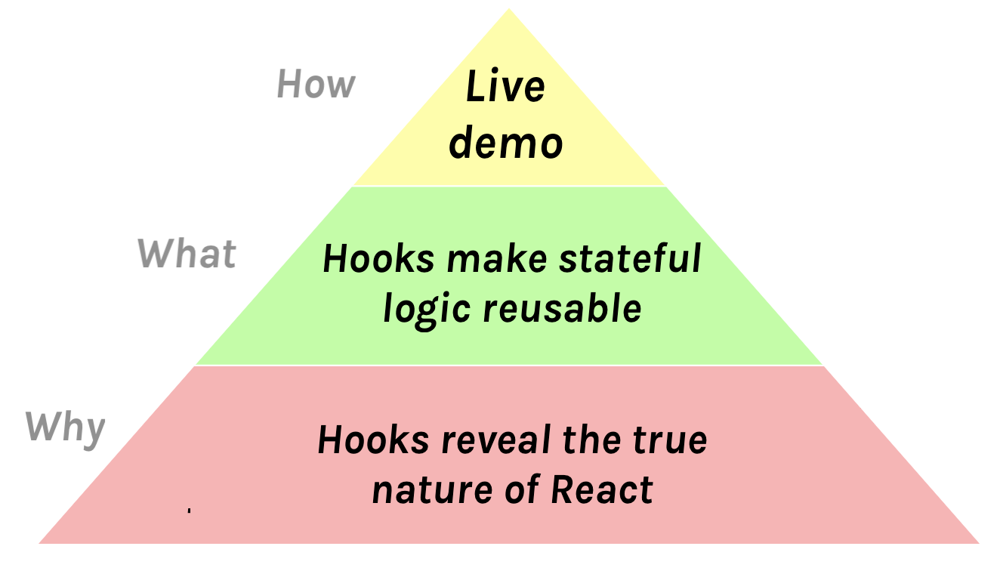

He hecho unas [cuantas](https://www.youtube.com/watch?v=xsSnOQynTHs) [charlas](https://www.youtube.com/watch?v=nLF0n9SACd4) [técnicas](https://www.youtube.com/watch?v=dpw9EHDh2bM) que creo que fueron bien.

A veces la gente me pregunta cómo me preparo para una charla. Para cada orador, la respuesta es muy personal. Solo voy a compartir lo que funciona para mí.

**Este es el segundo artículo de una serie** donde explico mi proceso de preparación para una carla técnica — desde la concepción de la idea hasta el día de la presentación:

* **[Preparándose para una charla técnica, Parte 1: Motivación](/es/preparing-for-tech-talk-part-1-motivation/)**
* **Preparándose para una charla técnica, Parte 2: Qué, Porqué y Cómo (*este artículo*)**
* Continuará

---

**En este artículo me enfocaré en encontrar el Qué, el Porqué y el Cómo de mi charla.** Hacer esto con tiempo me ayuda a evitarme muchos dolores de cabeza luego.

---

Si no has visto [Inception](https://en.wikipedia.org/wiki/Inception), mírala hoy. Es un éxito de taquilla entretenido con visuales alucinantes y una trama estimulante. Pero cómo me ha enseñado [Ryan Florence](https://mobile.twitter.com/ryanflorence), también contiene buenos consejos para crear una charla memorable.

Esa película es acerca de poner ideas en las cabezas de otras personas mientras duermen. Esto puede sonar un poco invasivo (y es ilegal en la película). Pero si te alistaste para dar una charla técnica, es una descripción bastante precisa de lo que te enfrentas.

---

**¿Qué es lo más importante que quieres que la gente lleve de tu charla?** Trato de formularlo temprano en una oración. Esta idea no debería ser más larga que doce palabras. La gente olvidará la mayor parte de lo que dices así que necesitas escoger cuidadosamente *qué* quieres que persista. Es la semilla que quieres plantar en sus cabezas.

Por ejemplo, estas son las ideas principales de mis charlas:

* [Hot Reloading](https://www.youtube.com/watch?v=xsSnOQynTHs): “Los principios funcionales mejoran el flujo de trabajo de desarrollo.”

* [Más allá de React 16](https://www.youtube.com/watch?v=nLF0n9SACd4): “Esperar el CPU y la IO tiene una solución unificada.”

* [Introducción a Hooks](https://www.youtube.com/watch?v=dpw9EHDh2bM): “Hooks hacen re-utilizable la lógica *stateful*”

No siempre *digo* explícitamente la idea central ni la escribo en una diapositiva, pero siempre es la espina dorsal intelectual de mi charla. Todo lo que digo y muestro debe finalmente trabajar en soportar esta idea. Quiero demostrártelo.

---

Una idea es el **“Qué”** de mi charla. Pero también están el **“Cómo”** y el **“Porqué”**:

El **“Cómo”** es mi método para entregar la idea a la audiencia. Personalmente prefiero los demos en vivo, pero hay muchas cosas que pueden funcionar. Hablaré más acerca del “Cómo” en un artículo futuro en esta serie.

Acabamos de hablar sobre el **“Qué”**, lo cual es la idea central de la charla. Es el pensamiento que quiero implantar en tu cabeza y la visión con la que quiero que te vayas. Es lo que quiero que la gente comparta con sus amigos y colegas.

Lo que nos trae al **“Porqué”**.

---

Para explicar el **“Porqué”** citaré este diálogo de la película Inception:

**(advertencia: spoilers!)**

>**Cobb:** "I will split up my father's empire." Now, this is obviously an idea that Robert himself will choose to reject. Which is why we need to plant it deep in his subconscious. The subconscious is motivated by emotion, right? Not reason. We need to find a way to translate this into an emotional concept.
>
>**Arthur:** How do you translate a business strategy into an emotion?
>
>**Cobb:** That's what we're here to figure out, right. Now Robert's relationship with his father is stressed, to say the least.
>
>**Eames:** Well can we run with that? We could suggest him breaking up his fathers company as a "screw you" to the old man.
>
>**Cobb:** No, cause I think positive emotion trumps negative emotion every time. We all yearn for reconciliation, for catharsis. We need Robert Fischer to have a positive emotional reaction to all this.
>
>**Eames:** Alright, well, try this? "My father accepts that I want to create for myself, not follow in his footsteps."
>
>**Cobb:** That might work.

Now, I’m not suggesting that you break up empires with your talk.

But there must be a [reason](/preparing-for-tech-talk-part-1-motivation/) you get out in front of thousands of people to speak about something. You *believe* in something — and you want others to share that feeling. **This is the “Why” — the emotional core of your talk.**

---

Here’s the example “What”, “Why”, and “How” from my talks.

*(The above pyramid is for [Hot reloading with time travel](https://www.youtube.com/watch?v=xsSnOQynTHs))*

*(The above pyramid is for [Beyond React 16](https://www.youtube.com/watch?v=nLF0n9SACd4))*

*(The above pyramid is for [Introducing Hooks](https://www.youtube.com/watch?v=dpw9EHDh2bM))*

A memorable talk takes a concise idea, makes the audience care about it, and has a clear and convincing execution. That’s the “What”, “Why”, and “How”.

---

In this post, I described how I organize the core ideas of my talks. Again, I want to emphasize I’m just sharing what works for me — there are [many kinds of talks](https://mobile.twitter.com/jackiehluo/status/1077717283026411520) and your outlook on this may be very different.

In the next posts in this series, I will talk about preparing the talk outline, slides, rehearsing the talks, and what I do at the day of the presentation.

**Previous in this series: [Preparing for a Tech Talk, Part 1: Motivation](/preparing-for-tech-talk-part-1-motivation/)**.
