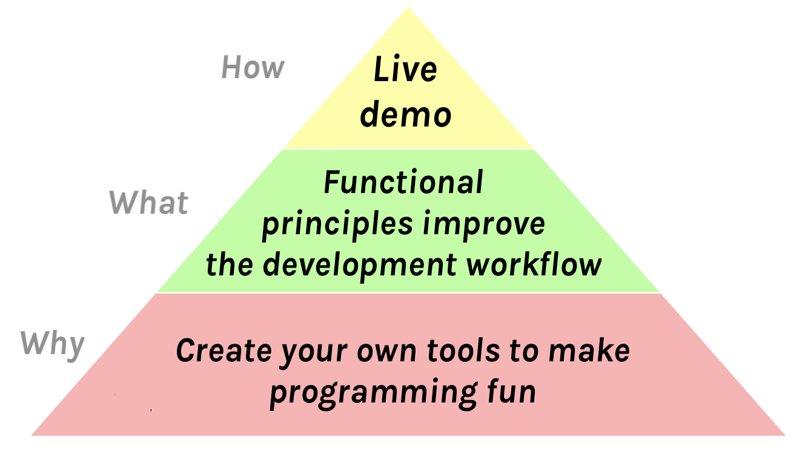

I’ve done a [few](https://www.youtube.com/watch?v=xsSnOQynTHs) [tech](https://www.youtube.com/watch?v=nLF0n9SACd4) [talks](https://www.youtube.com/watch?v=dpw9EHDh2bM) that I think went well.

Sometimes people ask me how I prepare for a talk. For every speaker, the answer is very personal. I’m just sharing what works for me.

**This is the second post in a series** where I explain my process preparing for a tech talk — from conceiving the idea to the actual day of the presentation:

* **[Preparing for a Tech Talk, Part 1: Motivation](/preparing-for-tech-talk-part-1-motivation/)**
* **Preparing for a Tech Talk, Part 2: What, Why, and How (*this post*)**
* To be continued

---

**In this post, I will focus on finding the What, Why, and How of my talk.** Doing this early helps me avoid a lot of headache at a later stage.

---

If you haven’t seen [Inception](https://en.wikipedia.org/wiki/Inception), watch it today. It’s an enjoyable blockbuster with mindbending visuals and a stimulating plot. But as [Ryan Florence](https://mobile.twitter.com/ryanflorence) taught me, it also contains good advice for creating a memorable talk.

That movie is about putting ideas into other people’s heads while they sleep. This might sound a bit invasive (and is illegal in the movie). But if you signed up to give a tech talk, that’s a pretty accurate description of your challenge.

---

**What is the one thing that you want people to take away from your talk?** I try to formulate it as a sentence early on. This idea shouldn’t be longer than a dozen words. People will forget most of what you say so you need to pick carefully *what* you want to stick. It’s the seed you want to plant in their heads.

For example, here’s the core ideas of my talks.

* [Hot Reloading](https://www.youtube.com/watch?v=xsSnOQynTHs): “Functional principles improve the development workflow.”

* [Beyond React 16](https://www.youtube.com/watch?v=nLF0n9SACd4): “Waiting for CPU and IO has a unified solution.”

* [Introducing Hooks](https://www.youtube.com/watch?v=dpw9EHDh2bM): “Hooks make stateful logic reusable.”

I don’t always explicitly *say* the central idea out loud or write it on a slide, but it is always the intellectual backbone of my talk. Everything I say and show must ultimately work towards supporting this idea. I want to prove it to you.

---

An idea is the **“What”** of my talk. But there is also **“How”** and **“Why”**:

**“How”** is my method for delivering the idea to the audience. Personally, I prefer live demos, but there are many things that can work. I will talk more about “How” in the later blog posts in this series.

We’ve just discussed **“What”** which is the core idea of the talk. It’s the thought I want to plant in your head and the insight I want you to walk away with. It’s what I want people to share with their friends and colleagues.

Which brings us to **“Why”**. 

---

To explain **“Why”**, I’ll quote this dialog from the Inception movie:

**(warning: spoilers!)**

>**Cobb:** "I will split up my father's empire." Now, this is obviously an idea that Robert himself will choose to reject. Which is why we need to plant it deep in his subconscious. The subconscious is motivated by emotion, right? Not reason. We need to find a way to translate this into an emotional concept.
>
>**Arthur:** How do you translate a business strategy into an emotion?
>
>**Cobb:** That's what we're here to figure out, right. Now Robert's relationship with his father is stressed, to say the least.
>
>**Eames:** Well can we run with that? We could suggest him breaking up his fathers company as a "screw you" to the old man.
>
>**Cobb:** No, cause I think positive emotion trumps negative emotion every time. We all yearn for reconciliation, for catharsis. We need Robert Fischer to have a positive emotional reaction to all this.
>
>**Eames:** Alright, well, try this? "My father accepts that I want to create for myself, not follow in his footsteps."
>
>**Cobb:** That might work.

Now, I’m not suggesting that you break up empires with your talk.

But there must be a [reason](/preparing-for-tech-talk-part-1-motivation/) you get out in front of thousands of people to speak about something. You *believe* in something — and you want others to share that feeling. **This is the “Why” — the emotional core of your talk.**

---

Here’s the example “What”, “Why”, and “How” from my talks.

*(The above pyramid is for [Hot reloading with time travel](https://www.youtube.com/watch?v=xsSnOQynTHs))*

*(The above pyramid is for [Beyond React 16](https://www.youtube.com/watch?v=nLF0n9SACd4))*

*(The above pyramid is for [Introducing Hooks](https://www.youtube.com/watch?v=dpw9EHDh2bM))*

A memorable talk takes a concise idea, makes the audience care about it, and has a clear and convincing execution. That’s the “What”, “Why”, and “How”.

---

In this post, I described how I organize the core ideas of my talks. Again, I want to emphasize I’m just sharing what works for me — there are [many kinds of talks](https://mobile.twitter.com/jackiehluo/status/1077717283026411520) and your outlook on this may be very different.

In the next posts in this series, I will talk about preparing the talk outline, slides, rehearsing the talks, and what I do at the day of the presentation.

**Previous in this series: [Preparing for a Tech Talk, Part 1: Motivation](/preparing-for-tech-talk-part-1-motivation/)**.
