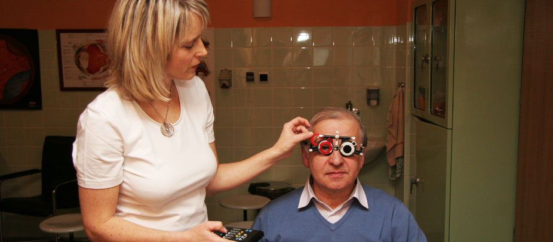

Slnečné svetlo je nevyhnutné pre život na Zemi. Človek ho potrebuje pre tvorbu vitamínu D, pre posilnenie imunitného systému a tiež pozitívne ovplyvnenie nálady. Neviditeľné zložky slnenčného žiarenia- ultrafialové /UV/ a infračervené /IR/ pri väčšom množstve ľudskému telu škodia.

Zrakom získavame až 80% informácií z prostredia, ktoré nás obklopuje. Venujeme im primeraný podiel zo starostlivosti o naše telo?

Za posledných 30 rokov sa zmenšila veľkosť ozónovej vrstvy o 10%, čo znamená že je priepustnejšia pre UV žiarenie. Na ochranu očí treba dbať hlavne pri vysokohorskej turistike a plávaní v prírode. Zradcom môže byť vietor, ktorý nás ochladzuje, tým znižuje našu ostražitosť a snahu chrániť sa. Zaujímavé je, že aj hmla môže zvyšovať **škodlivé účinky UV-žiarenia**, keď kvapky pôsobia ako lupa.

Pred nadmerným pôsobením slnečného žiarenia sa treba chrániť. Slnečné okuliare sú nielen módnym doplnkom, ale tiež chránia naše oči pred škodlivým žiarením. Hlavným kritériom pri výbere a nákupe slnečných okuliarov je kvalitný UV filter. Jeho zárukou by malo byť označenie CE /Communauté Européene/, ktoré sa používa od r. 1998. Znamená to, že výrobok je v súlade s EU direktívou.

Je lepšie nenosiť žiadne okuliare ako mať tmavé sklá bez UV filtra. Zrenica totiž reaguje na tmavé sklo rozšírením. Tým sa zväčší aj vstupná brána pre vniknutie škodlivých lúčov do oka.
UV filter sa označuje číslom od 0 po 4 alebo sa vyjadruje v %. Pre naše zemepisné pásmo sa doporučujú sklá označené 2 alebo so zachytením 20- 40% UV žiarenia. K moru alebo do vysokých hôr sa doporučujú sklá s UV filtrom s číslom 3- 4.

Farba skiel môže byť rôzna. Príjemné je pozeranie cez sklá sivej, hnedej, zelenej farby, ale pri dobrom UV filtri môžu byť sklá kľudne aj modré či ružové. Priepustnosť UV žiarenia okuliarmi nie je viazaná na farbu či tmavosť skla. Zelená farba skiel je vhodná pri nižšej intenzite slnečného žiarenia, tmavohnedá až čierna pri vyššej intenzite.

Slnečné okuliare **odporúčame hlavne ľuďom so svetlými očami,** lebo tie nezachytia dostatočne UV žiarenie.
Nie všetci naši pacienti sú informovaní, že ich slnečné okuliare môžu mať súčasne dioptrické hodnoty. Ak do dioptrických slnečných okuliarov nechceme investovať, obstarajme si aspoň klipy s tmavými sklami s UV filtrom.

Často sa nás pýtate, od ktorého veku treba chrániť oči detí pred slnkom. Bábätká chránime jednoducho tak, že ich nevystavujeme priamemu slnku, batoľatá chránime šiltovkou alebo klobúkom. Obvykle až väčšie deti tolerujú okuliare.

Apropó: slušnosť káže, aby sme si nezabudli zložiť okuliare pri rozhovore s inými ľuďmi. Existuje trik, ako sa tomu dá na ostrom slnku vyhnúť- stačí otázka:“ Nebude Vám vadiť, keď si nezložím okuliare?“ Len málokto to nedovolí.

Ďalej ponúkam spektrum možného postihnutia očí nadmerným slnečným žiarením. Rozhodne to nie je za účelom vyvolania Vášho strachu. Pred spoznaným nepriateľom sa vieme chrániť lepšie.

UV žiarenie môže podráždiť citlivú kožu okolo očí, čím dochádza k začervenaniu a opuchu v okolí očí. Je dokázaný aj vplyv UV žiarenia pre rozvoj nádorov.

Zvláštnym postihnutím očí je tzv. snežná slepota, ktorá vzniká následkom opuchu a poškodenia rohovky vo vysokých zasnežených horách. Podobné poškodenie vzniká následkom pozerania na zváranie bez ochranného štítu. Postihnuté oči sú tak bolestivé, že sa nedajú otvoriť, čo môže spôsobiť stratu orientácie. Prvá pomoc sú studené obklady. Treba sa postarať aj o bezpečný zostup postihnutého.

UV žiarenie urýchľuje rozvoj zákalu šošovky a má svoj podiel aj na rozvoji vekom podmienenej degenerácii sietnice, hlavne u fajčiarov.

K vážnemu poškodeniu očí môže dôjsť pri priamom pohľade do Slnka, kedy sa tepelne poškodí centrálna časť sietnice, ktorá zabezpečuje najostrejšie videnie. Pred niekoľkými rokmi následkom sledovania zatmenia Slnka bez ochranných okuliarov som mala možnosť sledovať niekoľko pacientov s poškodením sietnice. U niektorých bolo postihnutie prechodné s úpravou zraku. Bolo však aj niekoľko takých, u ktorých síce nedošlo k úplnému oslepnutiu- ale k trvalému zníženiu zraku.

Takže nezabúdajme na kvalitné slnenčné okuliare! 😎
