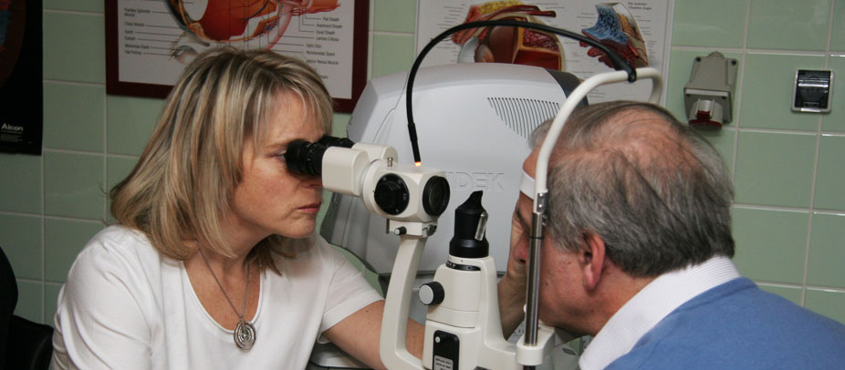

Oko je najdôležitejší zmyslový orgán- získavame ním až 90% informácií z okolia, ktoré nás obklopuje. Žijeme v hektickej dobe, ktorá kladie aj na naše oči obrovské nároky. Oči si preto zaslúžia odborné sledovanie a dohľad. Práve preventívne vyšetrenie očí dokáže včas odhaliť príčinu, ktorá by mohla viesť k zníženiu zraku, ba až ohrozeniu života.

Očnú ambulanciu sme zriadili ako odpoveď na podnety tých, ktorí požadujú nielen odbornú pomoc, ale aj nadštandardnú osobnú starostlivosť a pozornosť. V ambulancii sa snúbi tesné spojenie príjemného prostredia s kvalitným, moderným vybavením a skúsenosťami personálu.

Moju prax predstavuje ambulantná starostlivosť aj očné operácie (ich spektrum zahŕňa fakoemulzifikáciu katarakty s implantáciou umelej vnútroočnej šošovky, pars plana vitrektómiu, vrátane endolaserového ošetrenia sietnice a peelingu MLI, ďalej fotorefraktívnu keratektómiu a LASEK). Taktiež mám skúsenosti s viacerými druhmi laseru. S prednáškami a postermi sa zúčastňujem na slovenskom odbornom fóre a aj v zahraničí.

Zúčastnila som sa mnohých kurzov a odborných stáží, veľkým prínosom bola najmä účasť v Mníchove a v Antverpách. Absolvovala som atestačnú skúšku 2.stupňa a odborný test Basic Science Assessmet of International Council of Ophthalmology a v roku 2012 som úspešne ukončila doktorandské štúdium v svojom odbore.
Naším poslaním je pracovať na čo najvyššej úrovni- tak, aby naše odborné skúsenosti a individuálny prístup ku každému, priniesli zdravie Vašim očiam, a pritom sme napĺňali zásady Hippokratovej prísahy. Naším ocenením bude spokojnosť tých, ktorí sa rozhodnú pre vyšetrenie či liečbu u nás.

## Ponúkame

- objednanie vyšetrenia na presný termín, dohodou aj mimo ordinačných hodín
- dostatok času na vyšetrenie a konzultáciu
- možnosť parkovania
- príjemné prostredie v modernej ambulancii, vybavenej kvalitnými
- prístrojmi
- bezbariérový vstup a vybavenie
- ľudský a profesionálny prístup

## Poskytujeme

- vyšetrenie očí v prípade akýchkoľvek ťažkostí s videním
- predpis okuliarov
- aplikáciu kontaktných šošoviek
- pravidelné kontroly očí pri cukrovke, pri vysokom krvnom tlaku, ...
- dispenzarizáciu pacientov s glaukómom
- vyšetrenie zraku vodičov, preventívne vyšetrenia pre povolania so zvýšeným nárokom na zrakové funkcie ( zvárači, vojaci, pedagógovia, pracovníci s počítačom,.......)
- ošetrenia po úrazoch očí
- kontroly po očných operáciách
- konzultácie Vášho nálezu
