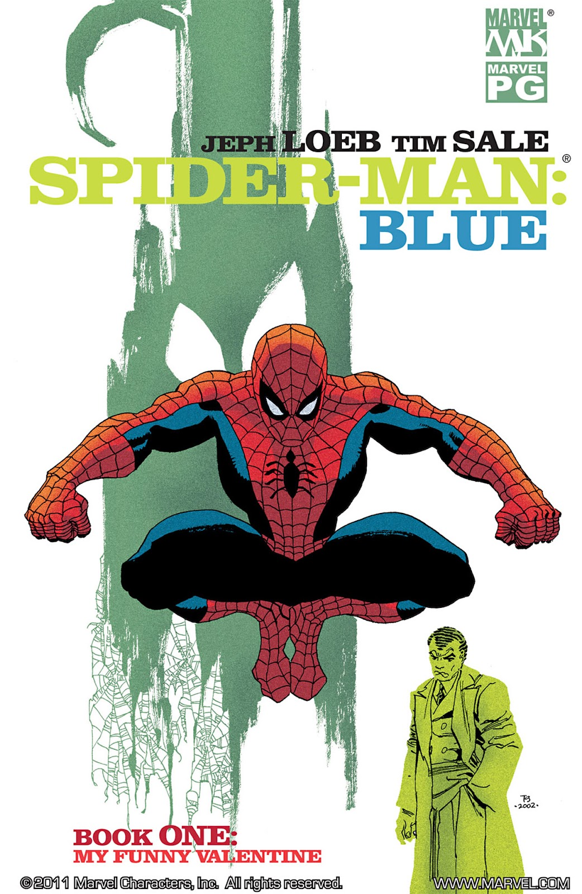

E' il giorno di San Valentino e Spider-Man :spider: si aggira per Manhattan ricordando il suo primo incontro con Gwen.. e la sua morte per mano del Green Goblin. Pensa a come le scelte che ha fatto abbiano condizionato la sua vita.

--

Scritto da **Jeph Loeb** e disegnato da **Tim Sale**, Spider-Man: Blue #1 e' la primo di sei fumetti di una serie pubblicata per la prima volta nel 2002 da Marvel Comics e fa parte di un progetto in cui i due autori hanno sperimentato molto con l'uso dei colori (ad esempio [Daredevil: Yellow, 2001](https://www.marvel.com/comics/series/377/daredevil_yellow_2001_-_2002)). Come dichiarato dagli stessi Loeb e Sale, e' stato scelto il colore blu in quanto rappresenta bene lo stato emotivo di Peter (dall'inglese *feeling blue*, essere tristi) a causa della prematura morte della sua ragazza Gwen Stacy. 

Non avevo mai visto il Green Goblin disegnato cosi' bene. Lo stile di Tim Sale e' inconfondibile.

Questo e' uno degli estratti che preferisco:

<blockquote>
  Your name was Gwen Stacy. Mine is Peter Parker. This is the story of how we fell in love. Or, more appropriately, how we almost didn't fall in love.
</blockquote>

<blockquote>
  Il tuo nome era Gwen Stacy. Il mio e' Peter Parker. Questa e' la storia di come ci siamo innamorati. O, piu' precisamente, di come quasi non ci siamo innamorati.
</blockquote>

Voto: 5/5