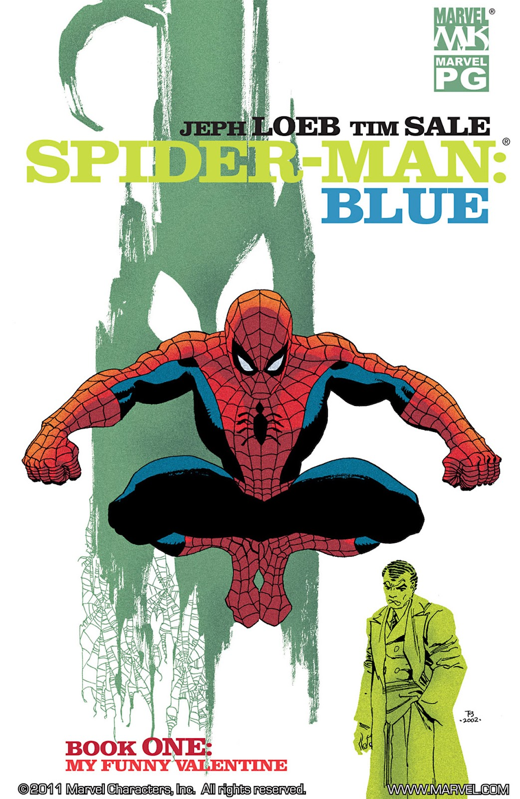
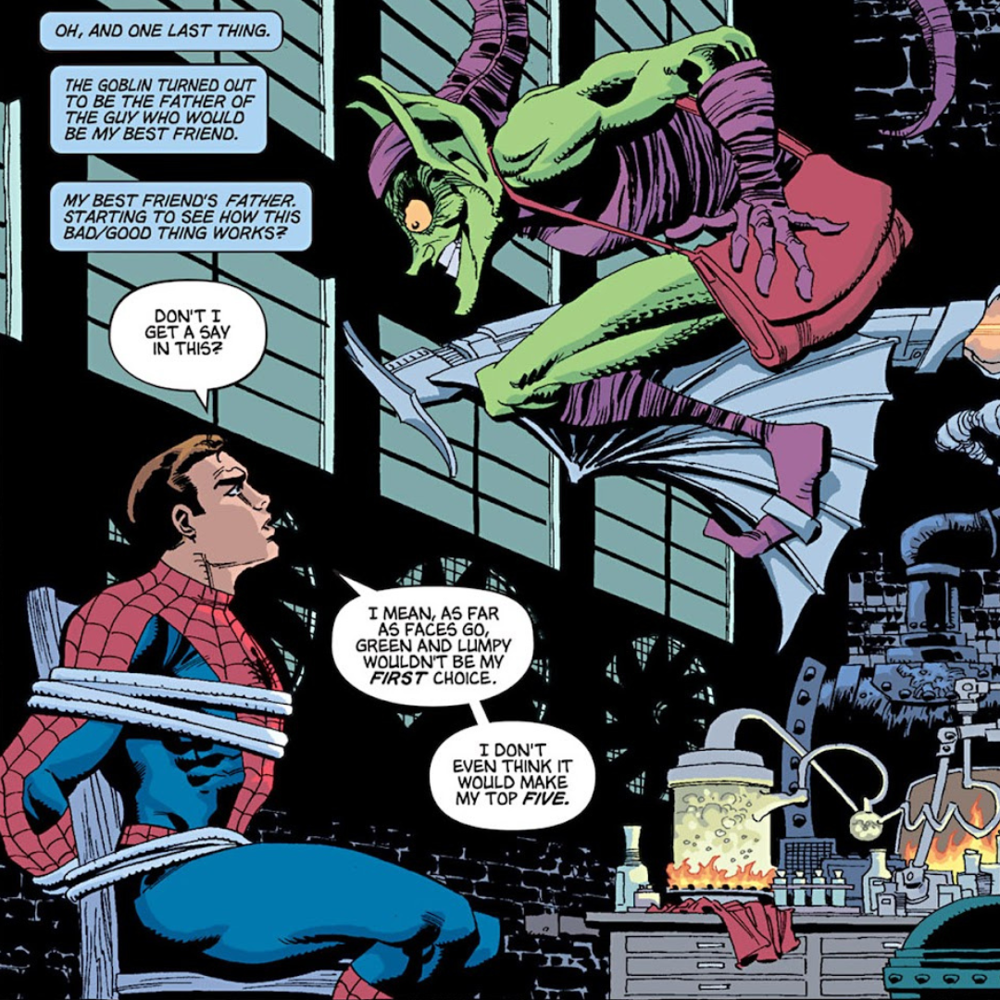

<!--  -->

It's Saint Valentine's day and Spider-Man :spider: swings over Manhattan remembering when he first met Gwen.. and her death at the hand of the Green Goblin. He thinks about the choices he made that changed his life. 

--

Written by **Jeph Loeb** and illustrated by **Tim Sale**, Spider-Man: Blue #1 is the first of six issues of a run published for the first time in 2002 by Marvel Comics and it's part of a bigger project where the two authors did experiments with colours (for example [Daredevil: Yellow, 2001](https://www.marvel.com/comics/series/377/daredevil_yellow_2001_-_2002)). As stated by Loeb and Sale, the use of the colour blue is to match Peter's feelings, as he "feels blue" for the premature death of his girlfriend Gwen Stacy.

I've never seen the Green Goblin so well illustrated. Tim Sale's style is unmistakable.

<!--  -->

Here's my favourite line:

<blockquote>
  Your name was Gwen Stacy. Mine is Peter Parker. This is the story of how we fell in love. Or, more appropriately, how we almost didn't fall in love.
</blockquote>

Rating: 5/5