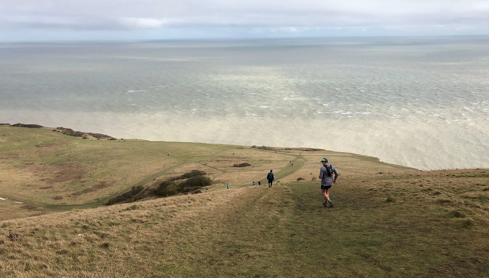

This race is part of the coastal trail series which are scenic and challenging runs mostly around the coastal paths in the UK. A great thing about the Sussex Coastal Marathon is that the route includes the Seven Sisters cliffs and offers spectacular views over the English Channel. To be honest, the localisation and the views were the main reason why my flatmate, Eduardo, managed to convince me to sign up a few months ago. Watching the [promo of the race](https://www.facebook.com/CoastalTrailSeries/videos/1666969293317932/) got me hooked up and gave me a lot of motivation during the training.

## Running for the climate change

Together with my friend Ed we decided to use this challenge as an opportunity to make a difference. We managed to [raise 200£](https://www.gofundme.com/f/vmckwn?fbclid=IwAR1oINcBdvMpJPXSPR-yUCHl_uF5SwTqSKNo0BozHojsjUXsU6LDbOzjBZU), all of which was forwarded to [The Climate Group](https://www.theclimategroup.org/) that specialises on the environment. Big thank you to everyone who donated!

## My experience

The marathon was rather a hard one, definitely harder than I had expected. It had almost 1700m (5600ft) of elevation gain. There was quite a few muddy sections of the trail as it was raining the night before the race. During the run it was quite windy with a bit of rain.

I was definitely underprepared. My training was mostly based on running in Hyde Park which offers a few flat "trail" routes. Looking back, I should have included at least some hilly runs in my routine to prepare my legs better.

Upon starting the marathon I was confident that I would be able to run all the way to the finish line. I did a few long runs as a part of my training and I felt prepared. To my disappointment, a lot of hilly sections and muddy trail took their toll and made me walk a lot after hitting 30km mark. The result? Time `5hr 17min` is definitely not what I was hoping for but it’s a good motivation to carry on with the training to improve myself in the future. I’m already looking forward to new cool challenges I can sign up for. If you have a suggestion, lmk on Twitter!

## Photos from the event

*Before the race. Waiting with the others to start.*

*Views of the English Channel at around 30km.*

*Super happy after completing my first marathon.*

## How COVID-19 affected the event

I did ask myself a question of whether or not should I participate. In the end I decided to take a calculated risk. Only a handful of people took part in this race, also the distances between runners were big and the organisers made sure to minimise physical touch points: all the runners were required to carry their own food and water.
