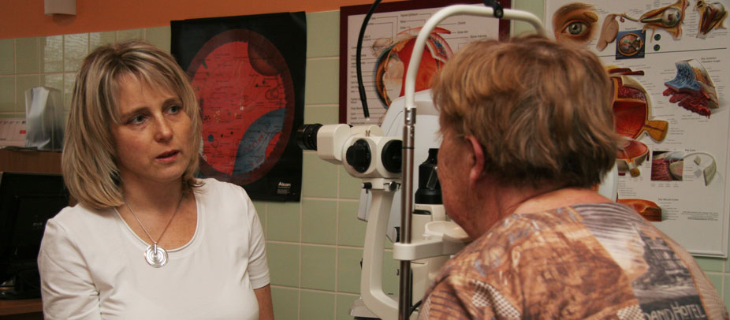

## Otestujte svoj zrak!

Ak máte vek nad 60 rokov, fajčíte, máte modrú alebo zelenú farbu dúhoviek očí, platí to dvojnásobne. A pokiaľ badáte pri pohľade na rovné línie (komíny, stĺpy, obkladačky,...) ich zvlnenie alebo pokrivenie, alebo dokonca v centre zorného poľa zahmlenie či úplne škvrnu sivej alebo čiernej farby, či stratu farebného vnímania môžete byť postihnutý **VPDM- vekom podmienenou degeneráciou makuly ( žltej škvrny sietnice)**. Neváhajte a navštívte očného lekára, ktorý vás vyšetrí a zariadi liečbu v jednom zo špecializovaných Centier pre liečbu VPDM.

---

## Ktorú časť oka a akým mechanizmom VPDM postihuje?

**Sietnicu** možno prirovnať filmu vo fotoaparáte. V žltej škvrne je najväčšia hustota svetlocitlivých buniek, čo umožňuje najväčšiu schopnosť rozlíšenia detailov a tiež farebné videnie. V reálnom živote to znamená možnosť čítať, písať, rozlišovať mince, sledovať TV, spoznať tváre. VPDM postihuje práve sietnicu v oblasti žltej škvrny.

Rozlišujeme dve základné formy: suchú a vlhkú.

Pri **suchej forme** dochádza k strate svetlocitlivých a pigmentových buniek sietnice. Táto forma postupuje zvyčajne pomaly, v priebehu mesiacov až rokov.
**Vlhkú formu** charakterizuje vznik nových ciev pod sietnicou. Tieto cievy sú veľmi krehké a priepustné. Do ich okolia sa dostáva tekutina, ktorá spôsobí opuch sietnice alebo dôjde k zakrvácaniu prasknutím krehkých ciev, čo priamo poškodí sietnicu.

VPDM postihuje obvykle obe oči. Často sú príznaky spočiatku len na jednom oku.

Pri bežnom pozeraní sa dívame oboma očami a zhoršený zrak na jedno oko si nemusíme uvedomiť. Práve v tom má význam testovanie samostatne pravého oka a zvlášť ľavého oka Amslerovou mriežkou.

---

## Je možné brániť sa VPDM?

Prevenciu VPMD predstavuje správna životospráva zahŕňajúca vyšší príjem rýb, listovej a inej zelenej zeleniny a pohyb na čerstvom vzduchu v prírode. Vitamín C je vhodný hlavne v prirodzenej forme, v ovocí. Prísun luteínu, zeaxantínu, antioxidantov, zinku je možný formou výživových doplnkov dostupných  na trhu. Víno, najmä červené, samozrejme v obmedzenom množstve má vďaka resveratrolu tiež inhibičný vplyv na starnutie a s tým spojené procesy aj na sietnici.

Riziko zvyšujú ochorenia srdca a ciev, takže ich liečba redukuje aj vznik VPDM. Ďalšie opatrenie predstavuje nefajčiť a vyhýbať sa nadmernému príjmu tukov a cukrov. Taktiež ochrana pred slnečným žiarením správnymi slnečnými okuliarmi je dôležité preventívne opatrenie.

---

## Aké vyšetrenia potvrdia VPDM?

Ochorenie sa diagnostikuje na základe vyšetrenia očného pozadia po rozšírení zreničiek. Nález potvrdí a bližšie charakterizuje fluoresceínová angiografia ( aplikácia kontrastnej látky do žily a sledovanie jej prechodu cievami očného pozadia), angio OCT (vyšetrenie, pri ktorom sa zobrazia cievy bez kontrastnej látky) a OCT (vyšetrenie, pri ktorom sa zoskenuje prierez sietnice v oblasti žltej škvrny).

---

## Existuje účinná liečba v prípade postihnutia oka VPDM?

Suchá forma je častejšia, s celkom pomalým postupovaním poškodenia zraku. U pacientov so suchou formou VPDM preparáty obsahujúce luteín spomaľujú rozvoj choroby. Suchá forma VPDM si vyžaduje však pravidelné kontroly u očného lekára, nakoľko kedykoľvek môže prejsť do vlhkej formy. V súčasnosti prebieha výskum lieku, ktorý spomaľuje prirodzený rozvoj apoptózy- smrti buniek. Vlhká forma spôsobuje rýchlejšie poškodenie zraku ( v priebehu niekoľkých dní až mesiacov).

Pri vlhkej forme je jedinou účinnou liečnou zablokovať novotvorbu ciev pod sietnicou. Ešte pred niekoľkými rokmi to dokázal len laser, ktorý síce zničil novovytvorené cievy ale aj s celou hrúbkou sietnice, ktorá tým stratila schopnosť vidieť. Výkon odstránil podstatu choroby, ale bolo to za cenu súčasnej deštrukcie chorej sietnice, čo viedlo k bezprostrednému vzniku čierneho fľaku vo videní v centre zorného poľa. Revolúciu v liečbe predstavuje vyvinutie nových liekov, tzv. antirastových faktorov, ktoré tlmia rast nežiadúcich ciev pod sietnicou. Aplikujú  sa injekciou priamo do oka ( konkrétne do sklovca). Musia sa podávať opakovane, lebo ich účinok odznie po 1- 2 mesiacoch. Injekcia do oka skutočne nespôsobuje bolesť, ani nezanecháva stopu.
Čím skôr sa s liečbou začne, tým je lepší výhľad na zachovanie zraku. Antirastové faktory sú úspešné práve u očí s včasnou vlhkou formou VPDM, u ktorých nedošlo k úplnému zániku svetlocitlivých buniek.

---

## Môže VPDM viesť k úplnej slepote?

Pokiaľ sa dozviete, že vaše oči sú postihnuté VPDM, je treba vás súčasne informovať, že VPDM nevedie k úplnej slepote ( t.j. neschopnosti odlíšiť svetlo od tmy). VPDM poškodzuje „len“ žltú škvrnu, teda periféria sietnice ostáva funkčná. Hrubá orientácia v priestore, avšak bez rozlišovania farieb a detailov ostane zachovaná.

---

## Rada na záver

Žite zdravo, absolvujte pravidelné preventívne očné vyšetrenia a v prípade prvých ťažkostí sa okamžite hláste u svojho očného lekára!

## Otestujte si svoj zrak- funkciu žltej škvrny!

Amslerova mriežka Ak používate na čítanie okuliare, nasaďte si ich! Dlaňou ľavej ruky si zakryte najprv ľavé oko a pravým okom sa zadívajte na výrazný bod v centre mriežky, pričom si všímajte, či sú všetky čiary rovné, či sa neohýbajú, nekrivia, alebo či sa niektorá časť mriežky nezahmlieva, prípadne či nie je nahradená čiernym fľakom. Rovnako otestujte aj ľavé oko. Čiary by ste mali vidieť rovné a neprerušovamé.
