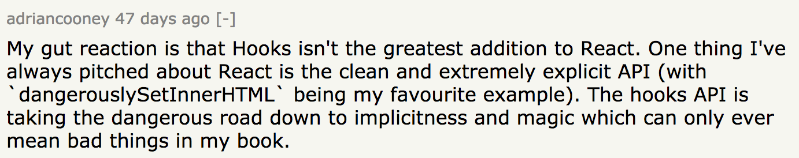
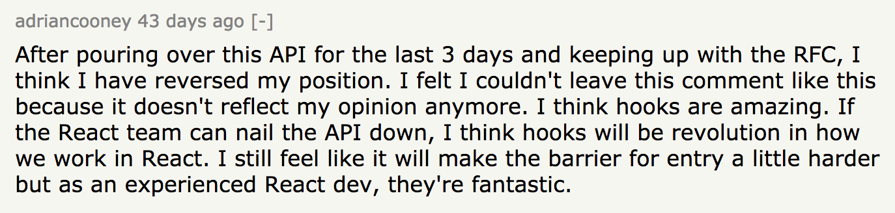

At React Conf 2018, the React team presented the [Hooks proposal](https://reactjs.org/docs/hooks-intro.html).

If you’d like to understand what Hooks are and what problems they solve, check out [our talks](https://www.youtube.com/watch?v=dpw9EHDh2bM) introducing them and [my follow-up article](https://medium.com/@dan_abramov/making-sense-of-react-hooks-fdbde8803889) addressing common misconceptions.

Chances are you won’t like Hooks at first:



They’re like a music record that grows on you only after a few good listens:



When you read the docs, don’t miss [the most important page](https://reactjs.org/docs/hooks-custom.html) about building your own Hooks! Too many people get fixated on some part of our messaging they disagree with (e.g. that learning classes is difficult) and miss the bigger picture behind Hooks. And the bigger picture is that **Hooks are like *functional mixins* that let you create and compose your own abstractions.**

Hooks [are influenced by some prior art](https://reactjs.org/docs/hooks-faq.html#what-is-the-prior-art-for-hooks) but I haven’t seen anything *quite* like them until Sebastian shared his idea with the team. Unfortunately, it’s easy to overlook the connection between the specific API choices and the valuable properties unlocked by this design. With this post I hope to help more people understand the rationale for the most controversial aspect of Hooks proposal.

**The rest of this post assumes you know the `useState()` Hook API and how to write a custom Hook. If you don’t, check out the earlier links. Also, keep in mind Hooks are experimental and you don’t have to learn them right now!**

(Disclaimer: this is a personal post and doesn’t necessarily reflect the opinions of the React team. It’s large, the topic is complex, and I may have made mistakes somewhere.)

---

The first and probably the biggest shock when you learn about Hooks is that they rely on *persistent call index between re-renders*. This has some [implications](https://reactjs.org/docs/hooks-rules.html).

This decision is obviously controversial. This is why, [against our principles](https://www.reddit.com/r/reactjs/comments/9xs2r6/sebmarkbages_response_to_hooks_rfc_feedback/e9wh4um/), we only published this proposal after we felt the documentation and talks describe it well enough for people to give it a fair chance.

**If you’re concerned about some aspects of the Hooks API design, I encourage you to read Sebastian’s [full response](https://github.com/reactjs/rfcs/pull/68#issuecomment-439314884) to the 1,000+ comment RFC discussion.** It is thorough but also quite dense. I could probably turn every paragraph of this comment into its own blog post. (In fact, I already [did](/how-does-setstate-know-what-to-do/) that once!)

There is one specific part that I’d like to focus on today. As you may recall, each Hook can be used in a component more than once. For example, we can declare [multiple state variables](https://reactjs.org/docs/hooks-state.html#tip-using-multiple-state-variables) by calling `useState()` repeatedly:

```jsx{2,3,4}
function Form() {
  const [name, setName] = useState('Mary');              // State variable 1
  const [surname, setSurname] = useState('Poppins');     // State variable 2
  const [width, setWidth] = useState(window.innerWidth); // State variable 3

  useEffect(() => {
    const handleResize = () => setWidth(window.innerWidth);
    window.addEventListener('resize', handleResize);
    return () => window.removeEventListener('resize', handleResize);
  });

  function handleNameChange(e) {
    setName(e.target.value);
  }

  function handleSurnameChange(e) {
    setSurname(e.target.value);
  }

  return (
    <>
      <input value={name} onChange={handleNameChange} />
      <input value={surname} onChange={handleSurnameChange} />
      <p>Hello, {name} {surname}</p>
      <p>Window width: {width}</p>
    </>
  );
}
```

Note that we use array destructuring syntax to name `useState()` state variables but these names are not passed to React. Instead, in this example **React treats `name` as “the first state variable”, `surname` as “the second state variable”, and so on**. Their *call index* is what gives them a stable identity between re-renders. This mental model is well-described [in this article](https://medium.com/@ryardley/react-hooks-not-magic-just-arrays-cd4f1857236e).

On a surface level, relying on the call index just *feels wrong*. A gut feeling is a useful signal but it can be misleading — especially if we haven’t fully internalized the problem we’re solving. **In this post, I’ll take a few commonly suggested alternative designs for Hooks and show where they break down.**

---

This post won’t be exhaustive. Depending on how granular you’re counting, we’ve seen from a dozen to *hundreds* of different alternative proposals. We’ve also been [thinking](https://github.com/reactjs/react-future) about alternative component APIs for the last five years.

Blog posts like this are tricky because even if you cover a hundred alternatives, somebody can tweak one and say: “Ha, you didn’t think of *that*!”

In practice, different alternative proposals tend to overlap in their downsides. Rather than enumerate *all* the suggested APIs (which would take me months), I’ll demonstrate the most common flaws with specific examples. Categorizing other possible APIs by these problems could be an exercise to the reader. 🧐

*That is not to say that Hooks are flawless.* But once you get familiar with the flaws of other solutions, you might find that the Hooks design makes some sense.

---

### Flaw #1: Can’t Extract a Custom Hook

Surprisingly, many alternative proposals don’t allow [custom Hooks](https://reactjs.org/docs/hooks-custom.html) at all. Perhaps we didn’t emphasize custom Hooks enough in the “motivation” docs. It’s difficult to do until the primitives are well-understood. So it’s a chicken-and-egg problem. But custom Hooks are largely the point of the proposal.

For example, an alternative banned multiple `useState()` calls in a component. You’d keep state in one object. That works for classes, right?

```jsx
function Form() {
  const [state, setState] = useState({
    name: 'Mary',
    surname: 'Poppins',
    width: window.innerWidth,
  });
  // ...
}
```

To be clear, Hooks *do* allow this style. You don’t *have to* split your state into a bunch of state variables (see our [recommendations](https://reactjs.org/docs/hooks-faq.html#should-i-use-one-or-many-state-variables) in the FAQ).

But the point of supporting multiple `useState()` calls is so that you can *extract* parts of stateful logic (state + effects) out of your components into custom Hooks which can *also* independently use local state and effects:

```jsx{6-7}
function Form() {
  // Declare some state variables directly in component body
  const [name, setName] = useState('Mary');
  const [surname, setSurname] = useState('Poppins');

  // We moved some state and effects into a custom Hook
  const width = useWindowWidth();
  // ...
}

function useWindowWidth() {
  // Declare some state and effects in a custom Hook
  const [width, setWidth] = useState(window.innerWidth);
  useEffect(() => {
    // ...
  });
  return width;
}
```

If you only allow one `useState()` call per component, you lose the ability of custom Hooks to introduce local state. Which is the point of custom Hooks.

### Flaw #2: Name Clashes

One common suggestion is to let `useState()` accept a key argument (e.g. a string) that uniquely identifies a particular state variable within a component.

There are a few variations on this idea, but they roughly look like this:

```jsx
// ⚠️ This is NOT the React Hooks API
function Form() {
  // We pass some kind of state key to useState()
  const [name, setName] = useState('name');
  const [surname, setSurname] = useState('surname');
  const [width, setWidth] = useState('width');
  // ...
```

This tries to avoid reliance on the call index (yay explicit keys!) but introduces another problem — name clashes.

Granted, you probably won’t be tempted to call `useState('name')` twice in the same component except by mistake. This can happen accidentally but we could argue that about any bug. However, it’s quite likely that when you work on a *custom Hook*, you’ll want to add or remove state variables and effects.

With this proposal, any time you add a new state variable inside a custom Hook, you risk breaking any components that use it (directly or transitively) because *they might already use the same name* for their own state variables.

This is an example of an API that’s not [optimized for change](/optimized-for-change/). The current code might always look “elegant”, but it is very fragile to changes in requirements. We should [learn](https://reactjs.org/blog/2016/07/13/mixins-considered-harmful.html#mixins-cause-name-clashes) from our mistakes.

The actual Hooks proposal solves this by relying on the call order: even if two Hooks use a `name` state variable, they would be isolated from each other. Every `useState()` call gets its own “memory cell”.

There are still a few other ways we could work around this flaw but they also have their own issues. Let’s explore this problem space more closely.

### Flaw #3: Can’t Call the Same Hook Twice

Another variation of the “keyed” `useState` proposal is to use something like Symbols. Those can’t clash, right?

```jsx
// ⚠️ This is NOT the React Hooks API
const nameKey = Symbol();
const surnameKey = Symbol();
const widthKey = Symbol();

function Form() {
  // We pass some kind of state key to useState()
  const [name, setName] = useState(nameKey);
  const [surname, setSurname] = useState(surnameKey);
  const [width, setWidth] = useState(widthKey);
  // ...
```

This proposal seems to work for extracting the `useWindowWidth()` Hook:

```jsx{4,11-17}
// ⚠️ This is NOT the React Hooks API
function Form() {
  // ...
  const width = useWindowWidth();
  // ...
}

/*********************
 * useWindowWidth.js *
 ********************/
const widthKey = Symbol();
 
function useWindowWidth() {
  const [width, setWidth] = useState(widthKey);
  // ...
  return width;
}
```

But if we attempt to extract input handling, it would fail:

```jsx{4,5,19-29}
// ⚠️ This is NOT the React Hooks API
function Form() {
  // ...
  const name = useFormInput();
  const surname = useFormInput();
  // ...
  return (
    <>
      <input {...name} />
      <input {...surname} />
      {/* ... */}
    </>    
  )
}

/*******************
 * useFormInput.js *
 ******************/
const valueKey = Symbol();
 
function useFormInput() {
  const [value, setValue] = useState(valueKey);
  return {
    value,
    onChange(e) {
      setValue(e.target.value);
    },
  };
}
```

(I’ll admit this `useFormInput()` Hook isn’t particularly useful but you could imagine it handling things like validation and dirty state flag a la [Formik](https://github.com/jaredpalmer/formik).)

Can you spot the bug?

We’re calling `useFormInput()` twice but our `useFormInput()` always calls `useState()` with the same key. So effectively we’re doing something like:

```jsx
  const [name, setName] = useState(valueKey);
  const [surname, setSurname] = useState(valueKey);
```

And this is how we get a clash again.

The actual Hooks proposal doesn’t have this problem because **each _call_ to `useState()` gets its own isolated state.** Relying on a persistent call index frees us from worrying about name clashes.

### Flaw #4: The Diamond Problem

This is technically the same flaw as the previous one but it’s worth mentioning for its notoriety. It’s even [described on Wikipedia](https://en.wikipedia.org/wiki/Multiple_inheritance#The_diamond_problem). (Apparently, it’s sometimes called “the deadly diamond of death” — cool beans.)

Our own mixin system [suffered from it](https://reactjs.org/blog/2016/07/13/mixins-considered-harmful.html#mixins-cause-name-clashes).

Two custom Hooks like `useWindowWidth()` and `useNetworkStatus()` might want to use the same custom Hook like `useSubscription()` under the hood:

```jsx{12,23-27,32-42}
function StatusMessage() {
  const width = useWindowWidth();
  const isOnline = useNetworkStatus();
  return (
    <>
      <p>Window width is {width}</p>
      <p>You are {isOnline ? 'online' : 'offline'}</p>
    </>
  );
}

function useSubscription(subscribe, unsubscribe, getValue) {
  const [state, setState] = useState(getValue());
  useEffect(() => {
    const handleChange = () => setState(getValue());
    subscribe(handleChange);
    return () => unsubscribe(handleChange);
  });
  return state;
}

function useWindowWidth() {
  const width = useSubscription(
    handler => window.addEventListener('resize', handler),
    handler => window.removeEventListener('resize', handler),
    () => window.innerWidth
  );
  return width;
}

function useNetworkStatus() {
  const isOnline = useSubscription(
    handler => {
      window.addEventListener('online', handler);
      window.addEventListener('offline', handler);
    },
    handler => {
      window.removeEventListener('online', handler);
      window.removeEventListener('offline', handler);
    },
    () => navigator.onLine
  );
  return isOnline;
}
```

This is a completely valid use case. **It should be safe for a custom Hook author to start or stop using another custom Hook without worrying whether it is “already used” somewhere in the chain.** In fact, *you can never know* the whole chain unless you audit every component using your Hook on every change.

(As a counterexample, the legacy React `createClass()` mixins did not let you do this. Sometimes you’d have two mixins that both do exactly what you need but are mutually incompatible due to extending the same “base” mixin.)

This is our “diamond”: 💎

```
       / useWindowWidth()   \                   / useState()  🔴 Clash
Status                        useSubscription() 
       \ useNetworkStatus() /                   \ useEffect() 🔴 Clash
```

Reliance on the persistent call order naturally resolves it:

```
                                                 / useState()  ✅ #1. State
       / useWindowWidth()   -> useSubscription()                    
      /                                          \ useEffect() ✅ #2. Effect
Status                         
      \                                          / useState()  ✅ #3. State
       \ useNetworkStatus() -> useSubscription()
                                                 \ useEffect() ✅ #4. Effect
```

Function calls don’t have a “diamond” problem because they form a tree. 🎄 

### Flaw #5: Copy Paste Breaks Things

Maybe we could salvage the keyed state proposal by introducing some sort of namespacing. There are a few different ways to do it.

One way could be to isolate state keys with closures. This would require you to “instantiate” custom Hooks and add a function wrapper around each of them:

```jsx{5,6}
/*******************
 * useFormInput.js *
 ******************/
function createUseFormInput() {
  // Unique per instantiation
  const valueKey = Symbol();  

  return function useFormInput() {
    const [value, setValue] = useState(valueKey);
    return {
      value,
      onChange(e) {
        setValue(e.target.value);
      },
    };
  }
}
```

This approach is rather heavy-handed. One of the design goals of Hooks is to avoid the deeply nested functional style that is prevalent with higher-order components and render props. Here, we have to “instantiate” *any* custom Hook before its use — and use the resulting function *exactly once* in the body of a component. This isn’t much simpler than calling Hooks unconditionally.

Additionally, you have to repeat every custom Hook used in a component twice. Once in the top level scope (or inside a function scope if we’re writing a custom Hook), and once at the actual call site. This means you have to jump between the rendering and top-level declarations even for small changes:

```jsx{2,3,7,8}
// ⚠️ This is NOT the React Hooks API
const useNameFormInput = createUseFormInput();
const useSurnameFormInput = createUseFormInput();

function Form() {
  // ...
  const name = useNameFormInput();
  const surname = useNameFormInput();
  // ...
}
```

You also need to be very precise with their names. You would always have “two levels” of names — factories like `createUseFormInput` and the instantiated Hooks like `useNameFormInput` and `useSurnameFormInput`.

If you call the same custom Hook “instance” twice you’d get a state clash. In fact, the code above has this mistake — have you noticed? It should be:

```jsx
  const name = useNameFormInput();
  const surname = useSurnameFormInput(); // Not useNameFormInput!
```

These problems are not insurmountable but I would argue that they add *more* friction than following the [Rules of Hooks](https://reactjs.org/docs/hooks-rules.html).

Importantly, they break the expectations of copy-paste. Extracting a custom Hook without an extra closure wrapper *still works* with this approach but only until you call it twice. (Which is when it creates a conflict.) It’s unfortunate when an API seems to work but then forces you to Wrap All the Things™️ once you realize there is a conflict somewhere deep down the chain.

### Flaw #6: We Still Need a Linter

There is another way to avoid conflicts with keyed state. If you know about it, you were probably really annoyed I still haven’t acknowledged it! Sorry.

The idea is that we could *compose* keys every time we write a custom Hook. Something like this:

```jsx{4,5,16,17}
// ⚠️ This is NOT the React Hooks API
function Form() {
  // ...
  const name = useFormInput('name');
  const surname = useFormInput('surname');
  // ...
  return (
    <>
      <input {...name} />
      <input {...surname} />
      {/* ... */}
    </>    
  )
}

function useFormInput(formInputKey) {
  const [value, setValue] = useState('useFormInput(' + formInputKey + ').value');
  return {
    value,
    onChange(e) {
      setValue(e.target.value);
    },
  };
}
```

Out of different alternatives, I dislike this approach the least. I don’t think it’s worth it though.

Code passing non-unique or badly composed keys would *accidentally work* until a Hook is called multiple times or clashes with another Hook. Worse, if it’s meant to be conditional (we’re trying to “fix” the unconditional call requirement, right?), we might not even encounter the clashes until later.

Remembering to pass keys through all layers of custom Hooks seems fragile enough that we’d want to lint for that. They would add extra work at runtime (don’t forget they’d need to serve *as keys*), and each of them is a paper cut for bundle size. **But if we have to lint anyway, what problem did we solve?**

This might make sense if conditionally declaring state and effects was very desirable. But in practice I find it confusing. In fact, I don’t recall anyone ever asking to conditionally define `this.state` or `componentDidMount` either.

What does this code mean exactly?

```jsx{3,4}
// ⚠️ This is NOT the React Hooks API
function Counter(props) {
  if (props.isActive) {
    const [count, setCount] = useState('count');
    return (
      <p onClick={() => setCount(count + 1)}>
        {count}
      </p>;
    );
  }
  return null;
}
```

Is `count` preserved when `props.isActive` is `false`? Or does it get reset because `useState('count')` wasn’t called?

If conditional state gets preserved, what about an effect?

```jsx{5-8}
// ⚠️ This is NOT the React Hooks API
function Counter(props) {
  if (props.isActive) {
    const [count, setCount] = useState('count');
    useEffect(() => {
      const id = setInterval(() => setCount(c => c + 1), 1000);
      return () => clearInterval(id);
    }, []);
    return (
      <p onClick={() => setCount(count + 1)}>
        {count}
      </p>;
    );
  }
  return null;
}
```

It definitely can’t run *before* `props.isActive` is `true` for the first time. But once it becomes `true`, does it ever stop running? Does the interval reset when `props.isActive` flips to `false`? If it does, it’s confusing that effect behaves differently from state (which we said wouldn’t reset). If the effect keeps running, it’s confusing that `if` outside the effect doesn’t actually make the effect conditional. Didn’t we say we wanted conditional effects?

If the state *does* get reset when we don’t “use” it during a render, what happens if multiple `if` branches contain `useState('count')` but only one runs at any given time? Is that valid code? If our mental model is a “map with keys”, why do things “disappear” from it? Would the developer expect an early `return` from a component to reset all state after it? If we truly wanted to reset the state, we could make it explicit by extracting a component:

```jsx
function Counter(props) {
  if (props.isActive) {
    // Clearly has its own state
    return <TickingCounter />;
  }
  return null;
}
```

That would probably become the “best practice” to avoid these confusing questions anyway. So whichever way you choose to answer them, I think the semantics of conditionally *declaring* state and effects itself end up weird enough that you might want to lint against it.

If we have to lint anyway, the requirement to correctly compose keys becomes “dead weight”. It doesn’t buy us anything we actually *want* to do. However, dropping that requirement (and going back to the original proposal) *does* buy us something. It makes copy-pasting component code into a custom Hook safe without namespacing it, reduces bundle size paper cuts from keys and unlocks a slightly more efficient implementation (no need for Map lookups).

Small things add up.

### Flaw #7: Can’t Pass Values Between Hooks

One of the best features of Hooks is that you can pass values between them.

Here is a hypothetical example of a message recipient picker that shows whether the currently chosen friend is online:

```jsx{8,9}
const friendList = [
  { id: 1, name: 'Phoebe' },
  { id: 2, name: 'Rachel' },
  { id: 3, name: 'Ross' },
];

function ChatRecipientPicker() {
  const [recipientID, setRecipientID] = useState(1);
  const isRecipientOnline = useFriendStatus(recipientID);

  return (
    <>
      <Circle color={isRecipientOnline ? 'green' : 'red'} />
      <select
        value={recipientID}
        onChange={e => setRecipientID(Number(e.target.value))}
      >
        {friendList.map(friend => (
          <option key={friend.id} value={friend.id}>
            {friend.name}
          </option>
        ))}
      </select>
    </>
  );
}

function useFriendStatus(friendID) {
  const [isOnline, setIsOnline] = useState(null);
  const handleStatusChange = (status) => setIsOnline(status.isOnline);
  useEffect(() => {
    ChatAPI.subscribeToFriendStatus(friendID, handleStatusChange);
    return () => {
      ChatAPI.unsubscribeFromFriendStatus(friendID, handleStatusChange);
    };
  });
  return isOnline;
}
```

When you change the recipient, our `useFriendStatus()` Hook would unsubscribe from the previous friend’s status, and subscribe to the next one.

This works because we can pass the return value of the `useState()` Hook to the `useFriendStatus()` Hook:

```jsx{2}
  const [recipientID, setRecipientID] = useState(1);
  const isRecipientOnline = useFriendStatus(recipientID);
```

Passing values between Hooks is very powerful. For example, [React Spring](https://medium.com/@drcmda/hooks-in-react-spring-a-tutorial-c6c436ad7ee4) lets you create a trailing animation of several values “following” each other:

```jsx
  const [{ pos1 }, set] = useSpring({ pos1: [0, 0], config: fast });
  const [{ pos2 }] = useSpring({ pos2: pos1, config: slow });
  const [{ pos3 }] = useSpring({ pos3: pos2, config: slow });
```

(Here’s a [demo](https://codesandbox.io/s/ppxnl191zx).)

Proposals that put Hook initialization into default argument values or that write Hooks in a decorator form make it difficult to express this kind of logic.

If calling Hooks doesn’t happen in the function body, you can no longer easily pass values between them, transform those values without creating many layers of components, or add `useMemo()` to memoize an intermediate computation. You also can’t easily reference these values in effects because they can’t capture them in a closure. There are ways to work around these issues with some convention but they require you to mentally “match up” inputs and outputs. This is tricky and violates React’s otherwise direct style.

Passing values between Hooks is at the heart of our proposal. Render props pattern was the closest you could get to it without Hooks, but you couldn’t get full benefits without something like [Component Component](https://ui.reach.tech/component-component) which has a lot of syntactic noise due to a “false hierarchy”. Hooks flatten that hierarchy to passing values — and function calls is the simplest way to do that.

### Flaw #8: Too Much Ceremony

There are many proposals that fall under this umbrella. Most attempt to avoid the perceived dependency of Hooks on React. There is a wide variety of ways to do it: by making built-in Hooks available on `this`, making them an extra argument you have to pass through everything, and so on.

I think [Sebastian’s answer](https://github.com/reactjs/rfcs/pull/68#issuecomment-439314884) addresses this way better than I could describe so I encourage you to check out its first section (“Injection Model”).

I’ll just say there is a reason programmers tend to prefer `try` / `catch` for error handling to passing error codes through every function. It’s the same reason why we prefer ES Modules with `import` (or CommonJS `require`) to AMD’s “explicit” definitions where `require` is passed to us.

```jsx
// Anyone miss AMD?
define(['require', 'dependency1', 'dependency2'], function (require) {
  var dependency1 = require('dependency1'),
  var dependency2 = require('dependency2');
  return function () {};
});
```

Yes, AMD may be more “honest” to the fact that modules aren’t actually synchronously loaded in a browser environment. But once you learn about that, writing the `define` sandwich becomes a mindless chore.

`try` / `catch`, `require`, and React Context API are pragmatic examples of how we want to have some “ambient” handler available to us instead of explicitly threading it through every level — even if in general we value explicitness. I think the same is true for Hooks.

This is similar to how, when we define components, we just grab `Component` from `React`. Maybe our code would be more decoupled from React if we exported a factory for every component instead:

```jsx
function createModal(React) {
  return class Modal extends React.Component {
    // ...
  };
}
```

But in practice this ends up being just an annoying indirection. When we actually want to stub React with something else, we can always do that at the module system level instead.

The same applies to Hooks. Still, as [Sebastian’s answer](https://github.com/reactjs/rfcs/pull/68#issuecomment-439314884) mentions, it is *technically possible* to “redirect” Hooks exported from `react` to a different implementation. ([One of my previous posts](/how-does-setstate-know-what-to-do/) mentions how.)

Another way to impose more ceremony is by making Hooks [monadic](https://paulgray.net/an-alternative-design-for-hooks/) or adding a first-class concept like `React.createHook()`. Aside from the runtime overhead, any solution that adds wrappers loses a huge benefit of using plain functions: *they are as easy to debug as it gets*.

Plain functions let you step in and out with a debugger without any library code in the middle, and see exactly how values flow inside your component body. Indirections make this difficult. Solutions similar in spirit to either higher-order components (“decorator” Hooks) or render props (e.g. `adopt` proposal or `yield`ing from generators) suffer from the same problem. Indirections also complicate static typing.

---

As I mentioned earlier, this post doesn’t aim to be exhaustive. There are other interesting problems with different proposals. Some of them are more obscure (e.g. related to concurrency or advanced compilation techniques) and might be a topic for another blog post in the future.

Hooks aren’t perfect either, but it’s the best tradeoff we could find for solving these problems. There are things we [still need to fix](https://github.com/reactjs/rfcs/pull/68#issuecomment-440780509), and there exist things that are more awkward with Hooks than classes. That is also a topic for another blog post.

Whether I covered your favorite alternative proposal or not, I hope this writeup helped shed some light on our thinking process and the criteria we consider when choosing an API. As you can see, a lot of it (such as making sure that copy-pasting, moving code, adding and removing dependencies works as expected) has to do with [optimizing for change](/optimized-for-change/). I hope that React users will appreciate these aspects.
