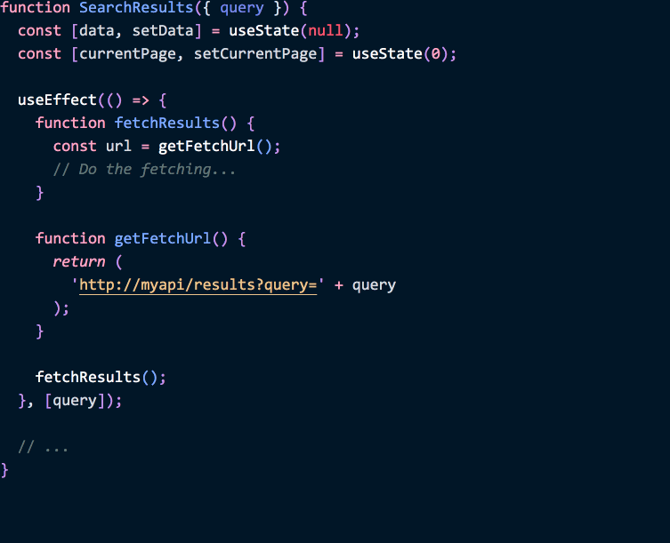

When people start learning React, they often ask for a style guide. While it’s a good idea to have some consistent rules applied across a project, a lot of them are arbitrary — and so React doesn’t have a strong opinion about them.

You can use different type systems, prefer function declarations or arrow functions, sort your props in alphabetical order or in an order you find pleasing.

This flexibility allows [integrating React](https://reactjs.org/docs/add-react-to-a-website.html) into projects with existing conventions. But it also invites endless debates.

**There _are_ important design principles that every component should strive to follow. But I don’t think style guides capture those principles well. We’ll talk about style guides first, and then [look at the principles that really _are_ useful](#writing-resilient-components).**

---

## Don’t Get Distracted by Imaginary Problems

Before we talk about component design principles, I want to say a few words about style guides. This isn’t a popular opinion but someone needs to say it!

In the JavaScript community, there are a few strict opinionated style guides enforced by a linter. My personal observation is that they tend to create more friction than they’re worth. I can’t count how many times somebody showed me some absolutely valid code and said “React complains about this”, but it was their lint config complaining! This leads to three issues:

* People get used to seeing the linter as an **overzealous noisy gatekeeper** rather than a helpful tool. Useful warnings are drowned out by a sea of style nits. As a result, people don’t scan the linter messages while debugging, and miss helpful tips. Additionally, people who are less used to writing JavaScript (for example, designers) have a harder time working with the code.

* People don’t learn to **differentiate between valid and invalid uses** of a certain pattern. For example, there is a popular rule that forbids calling `setState` inside `componentDidMount`. But if it was always “bad”, React simply wouldn’t allow it! There is a legitimate use case for it, and that is to measure the DOM node layout — e.g. to position a tooltip. I’ve seen people “work around” this rule by adding a `setTimeout` which completely misses the point.

* Eventually, people adopt the “enforcer mindset” and get opinionated about things that **don’t bring a meaningful difference** but are easy to scan for in the code. “You used a function declaration, but *our* project uses arrow functions.” Whenever I have a strong feeling about enforcing a rule like this, looking deeper reveals that I invested emotional effort into this rule — and struggle to let it go. It lulls me into a false sense of accomplishment without improving my code.

Am I saying that we should stop linting? Not at all!

**With a good config, a linter is a great tool to catch bugs before they happen.** It’s focusing on the *style* too much that turns it into a distraction.

---

## Marie Kondo Your Lint Config

Here’s what I suggest you to do on Monday. Gather your team for half an hour, go through every lint rule enabled in your project’s config, and ask yourself: *“Has this rule ever helped us catch a bug?”* If not, *turn it off.* (You can also start from a clean slate with [`eslint-config-react-app`](https://www.npmjs.com/package/eslint-config-react-app) which has no styling rules.)

At the very least, your team should have a process for removing rules that cause friction. Don’t assume that whatever you or something somebody else added to your lint config a year ago is a “best practice”. Question it and look for answers. Don’t let anyone tell you you’re not smart enough to pick your lint rules.

**But what about formatting?** Use [Prettier](https://prettier.io/) and forget about the “style nits”. You don’t need a tool to shout at you for putting an extra space if another tool can fix it for you. Use the linter to find *bugs*, not enforcing the *a e s t h e t i c s*.

Of course, there are aspects of the coding style that aren’t directly related to formatting but can still be annoying when inconsistent across the project.

However, many of them are too subtle to catch with a lint rule anyway. This is why it’s important to **build trust** between the team members, and to share useful learnings in the form of a wiki page or a short design guide.

Not everything is worth automating! The insights gained from *actually reading* the rationale in such a guide can be more valuable than following the “rules”.

**But if following a strict style guide is a distraction, what’s actually important?**

That’s the topic of this post.

---

## Writing Resilient Components

No amount of indentation or sorting imports alphabetically can fix a broken design. So instead of focusing on how some code *looks*, I will focus on how it *works*. There’s a few component design principles that I find very helpful:

1. **[Don’t stop the data flow](#principle-1-dont-stop-the-data-flow)**
2. **[Always be ready to render](#principle-2-always-be-ready-to-render)**
3. **[No component is a singleton](#principle-3-no-component-is-a-singleton)**
4. **[Keep the local state isolated](#principle-4-keep-the-local-state-isolated)**

Even if you don’t use React, you’ll likely discover the same principles by trial and error for any UI component model with unidirectional data flow.

---

## Principle 1: Don’t Stop the Data Flow

### Don’t Stop the Data Flow in Rendering

When somebody uses your component, they expect that they can pass different props to it over time, and that the component will reflect those changes:

```jsx
// isOk might be driven by state and can change at any time
<Button color={isOk ? 'blue' : 'red'} />
```

In general, this is how React works by default. If you use a `color` prop inside a `Button` component, you’ll see the value provided from above for that render:

```jsx
function Button({ color, children }) {
  return (
    // ✅ `color` is always fresh!
    <button className={'Button-' + color}>
      {children}
    </button>
  );
}
```

However, a common mistake when learning React is to copy props into state:

```jsx{3,6}
class Button extends React.Component {
  state = {
    color: this.props.color
  };
  render() {
    const { color } = this.state; // 🔴 `color` is stale!
    return (
      <button className={'Button-' + color}>
        {this.props.children}
      </button>
    );
  }
}
```

This might seem more intuitive at first if you used classes outside of React. **However, by copying a prop into state you’re ignoring all updates to it.**

```jsx
// 🔴 No longer works for updates with the above implementation
<Button color={isOk ? 'blue' : 'red'} />
```

In the rare case that this behavior *is* intentional, make sure to call that prop `initialColor` or `defaultColor` to clarify that changes to it are ignored.

But usually you’ll want to **read the props directly in your component** and avoid copying props (or anything computed from the props) into state:

```jsx
function Button({ color, children }) {
  return (
    // ✅ `color` is always fresh!
    <button className={'Button-' + color}>
      {children}
    </button>
  );
}
```

----

Computed values are another reason people sometimes attempt to copy props into state. For example, imagine that we determined the *button text* color based on an expensive computation with background `color` as an argument: 

```jsx{3,9}
class Button extends React.Component {
  state = {
    textColor: slowlyCalculateTextColor(this.props.color)
  };
  render() {
    return (
      <button className={
        'Button-' + this.props.color +
        ' Button-text-' + this.state.textColor // 🔴 Stale on `color` prop updates
      }>
        {this.props.children}
      </button>
    );
  }
}
```

This component is buggy because it doesn’t recalculate `this.state.textColor` on the `color` prop change. The easiest fix would be to move the `textColor` calculation into the `render` method, and make this a `PureComponent`:

```jsx{1,3}
class Button extends React.PureComponent {
  render() {
    const textColor = slowlyCalculateTextColor(this.props.color);
    return (
      <button className={
        'Button-' + this.props.color +
        ' Button-text-' + textColor // ✅ Always fresh
      }>
        {this.props.children}
      </button>
    );
  }
}
```

Problem solved! Now if props change, we'll recalculate `textColor`, but we avoid the expensive computation on the same props.

However, we might want to optimize it further. What if it’s the `children` prop that changed? It seems unfortunate to recalculate the `textColor` in that case. Our second attempt might be to invoke the calculation in `componentDidUpdate`:

```jsx{5-12}
class Button extends React.Component {
  state = {
    textColor: slowlyCalculateTextColor(this.props.color)
  };
  componentDidUpdate(prevProps) {
    if (prevProps.color !== this.props.color) {
      // 😔 Extra re-render for every update
      this.setState({
        textColor: slowlyCalculateTextColor(this.props.color),
      });
    }
  }
  render() {
    return (
      <button className={
        'Button-' + this.props.color +
        ' Button-text-' + this.state.textColor // ✅ Fresh on final render
      }>
        {this.props.children}
      </button>
    );
  }
}
```

However, this would mean our component does a second re-render after every change. That’s not ideal either if we’re trying to optimize it.

You could use the legacy `componentWillReceiveProps` lifecycle for this. However, people often put side effects there too. That, in turn, often causes problems for the upcoming Concurrent Rendering [features like Time Slicing and Suspense](https://reactjs.org/blog/2018/03/01/sneak-peek-beyond-react-16.html). And the “safer” `getDerivedStateFromProps` method is clunky.

Let’s step back for a second. Effectively, we want [*memoization*](https://en.wikipedia.org/wiki/Memoization). We have some inputs, and we don’t want to recalculate the output unless the inputs change.

With a class, you could use a [helper](https://reactjs.org/blog/2018/06/07/you-probably-dont-need-derived-state.html#what-about-memoization) for memoization. However, Hooks take this a step further, giving you a built-in way to memoize expensive computations:

```jsx{2-5}
function Button({ color, children }) {
  const textColor = useMemo(
    () => slowlyCalculateTextColor(color),
    [color] // ✅ Don’t recalculate until `color` changes
  );
  return (
    <button className={'Button-' + color + ' Button-text-' + textColor}>
      {children}
    </button>
  );
}
```

That’s all the code you need!

In a class component, you can use a helper like [`memoize-one`](https://github.com/alexreardon/memoize-one) for that. In a function component, `useMemo` Hook gives you similar functionality.

Now we see that **even optimizing expensive computations isn’t a good reason to copy props into state.** Our rendering result should respect changes to props.

---

### Don’t Stop the Data Flow in Side Effects

So far, we’ve talked about how to keep the rendering result consistent with prop changes. Avoiding copying props into state is a part of that. However, it is important that **side effects (e.g. data fetching) are also a part of the data flow**.

Consider this React component:

```jsx{5-7}
class SearchResults extends React.Component {
  state = {
    data: null
  };
  componentDidMount() {
    this.fetchResults();
  }
  fetchResults() {
    const url = this.getFetchUrl();
    // Do the fetching...
  }
  getFetchUrl() {
    return 'http://myapi/results?query' + this.props.query;
  }
  render() {
    // ...
  }
}
```

A lot of React components are like this — but if we look a bit closer, we'll notice a bug. The `getFetchUrl` method uses the `query` prop for data fetching:

```jsx{2}
  getFetchUrl() {
    return 'http://myapi/results?query' + this.props.query;
  }
```

But what if the `query` prop changes? In our component, nothing will happen. **This means our component’s side effects don’t respect changes to its props.** This is a very common source of bugs in React applications.

In order to fix our component, we need to:

* Look at `componentDidMount` and every method called from it.
  - In our example, that’s `fetchResults` and `getFetchUrl`.
* Write down all props and state used by those methods.
  - In our example, that’s `this.props.query`.
* Make sure that whenever those props change, we re-run the side effect.
  - We can do this by adding the `componentDidUpdate` method.

```jsx{8-12,18}
class SearchResults extends React.Component {
  state = {
    data: null
  };
  componentDidMount() {
    this.fetchResults();
  }
  componentDidUpdate(prevProps) {
    if (prevProps.query !== this.props.query) { // ✅ Refetch on change
      this.fetchResults();
    }
  }
  fetchResults() {
    const url = this.getFetchUrl();
    // Do the fetching...
  }
  getFetchUrl() {
    return 'http://myapi/results?query' + this.props.query; // ✅ Updates are handled
  }
  render() {
    // ...
  }
}
```

Now our code respects all changes to props, even for side effects.

However, it’s challenging to remember not to break it again. For example, we might add `currentPage` to the local state, and use it in `getFetchUrl`:

```jsx{4,21}
class SearchResults extends React.Component {
  state = {
    data: null,
    currentPage: 0,
  };
  componentDidMount() {
    this.fetchResults();
  }
  componentDidUpdate(prevProps) {
    if (prevProps.query !== this.props.query) {
      this.fetchResults();
    }
  }
  fetchResults() {
    const url = this.getFetchUrl();
    // Do the fetching...
  }
  getFetchUrl() {
    return (
      'http://myapi/results?query' + this.props.query +
      '&page=' + this.state.currentPage // 🔴 Updates are ignored
    );
  }
  render() {
    // ...
  }
}
```

Alas, our code is again buggy because our side effect doesn’t respect changes to `currentPage`.

**Props and state are a part of the React data flow. Both rendering and side effects should reflect changes in that data flow, not ignore them!**

To fix our code, we can repeat the steps above:

* Look at `componentDidMount` and every method called from it.
  - In our example, that’s `fetchResults` and `getFetchUrl`.
* Write down all props and state used by those methods.
  - In our example, that’s `this.props.query` **and `this.state.currentPage`**.
* Make sure that whenever those props change, we re-run the side effect.
  - We can do this by changing the `componentDidUpdate` method.

Let’s fix our component to handle updates to the `currentPage` state:

```jsx{11,24}
class SearchResults extends React.Component {
  state = {
    data: null,
    currentPage: 0,
  };
  componentDidMount() {
    this.fetchResults();
  }
  componentDidUpdate(prevProps, prevState) {
    if (
      prevState.currentPage !== this.state.currentPage || // ✅ Refetch on change
      prevProps.query !== this.props.query
    ) {
      this.fetchResults();
    }
  }
  fetchResults() {
    const url = this.getFetchUrl();
    // Do the fetching...
  }
  getFetchUrl() {
    return (
      'http://myapi/results?query' + this.props.query +
      '&page=' + this.state.currentPage // ✅ Updates are handled
    );
  }
  render() {
    // ...
  }
}
```

**Wouldn’t it be nice if we could somehow automatically catch these mistakes?** Isn’t that something a linter could help us with?

---

Unfortunately, automatically checking a class component for consistency is too difficult. Any method can call any other method. Statically analyzing calls from `componentDidMount` and `componentDidUpdate` is fraught with false positives.

However, one *could* design an API that *can* be statically analyzed for consistency. The [React `useEffect` Hook](/a-complete-guide-to-useeffect/) is an example of such API:

```jsx{13-14,19}
function SearchResults({ query }) {
  const [data, setData] = useState(null);
  const [currentPage, setCurrentPage] = useState(0);

  useEffect(() => {
    function fetchResults() {
      const url = getFetchUrl();
      // Do the fetching...
    }

    function getFetchUrl() {
      return (
        'http://myapi/results?query' + query +
        '&page=' + currentPage
      );
    }

    fetchResults();
  }, [currentPage, query]); // ✅ Refetch on change

  // ...
}
```

We put the logic *inside* of the effect, and that makes it easier to see *which values from the React data flow* it depends on. These values are called “dependencies”, and in our example they are `[currentPage, query]`.

Note how this array of “effect dependencies” isn’t really a new concept. In a class, we had to search for these “dependencies” through all the method calls. The `useEffect` API just makes the same concept explicit.

This, in turn, lets us validate them automatically:



*(This is a demo of the new recommended `exhaustive-deps` lint rule which is a part of `eslint-plugin-react-hooks`. It will soon be included in Create React App.)*

**Note that it is important to respect all prop and state updates for effects regardless of whether you’re writing component as a  class or a function.**

With the class API, you have to think about consistency yourself, and verify that changes to every relevant prop or state are handled by `componentDidUpdate`. Otherwise, your component is not resilient to prop and state changes. This is not even a React-specific problem. It applies to any UI library that lets you handle “creation” and “updates” separately.

**The `useEffect` API flips the default by encouraging consistency.** This [might feel unfamiliar at first](/a-complete-guide-to-useeffect/), but as a result your component becomes more resilient to changes in the logic. And since the “dependencies” are now explicit, we can *verify* the effect is consistent using a lint rule. We’re using a linter to catch bugs!

---

### Don’t Stop the Data Flow in Optimizations

There's one more case where you might accidentally ignore changes to props. This mistake can occur when you’re manually optimizing your components.

Note that optimization approaches that use shallow equality like `PureComponent` and `React.memo` with the default comparison are safe.

**However, if you try to “optimize” a component by writing your own comparison, you may mistakenly forget to compare function props:**

```jsx{2-5,7}
class Button extends React.Component {
  shouldComponentUpdate(prevProps) {
    // 🔴 Doesn't compare this.props.onClick 
    return this.props.color !== prevProps.color;
  }
  render() {
    const onClick = this.props.onClick; // 🔴 Doesn't reflect updates
    const textColor = slowlyCalculateTextColor(this.props.color);
    return (
      <button
        onClick={onClick}
        className={'Button-' + this.props.color + ' Button-text-' + textColor}>
        {this.props.children}
      </button>
    );
  }
}
```

It is easy to miss this mistake at first because with classes, you’d usually pass a *method* down, and so it would have the same identity anyway:

```jsx{2-4,9-11}
class MyForm extends React.Component {
  handleClick = () => { // ✅ Always the same function
    // Do something
  }
  render() {
    return (
      <>
        <h1>Hello!</h1>
        <Button color='green' onClick={this.handleClick}>
          Press me
        </Button>
      </>
    )
  }
}
```

So our optimization doesn’t break *immediately*. However, it will keep “seeing” the old `onClick` value if it changes over time but other props don’t:

```jsx{6,13-15}
class MyForm extends React.Component {
  state = {
    isEnabled: true
  };
  handleClick = () => {
    this.setState({ isEnabled: false });
    // Do something
  }
  render() {
    return (
      <>
        <h1>Hello!</h1>
        <Button color='green' onClick={
          // 🔴 Button ignores updates to the onClick prop
          this.state.isEnabled ? this.handleClick : null
        }>
          Press me
        </Button>
      </>
    )
  }
}
```

In this example, clicking the button should disable it — but this doesn’t happen because the `Button` component ignores any updates to the `onClick` prop.

This could get even more confusing if the function identity itself depends on something that could change over time, like `draft.content` in this example:

```jsx{6-7}
  drafts.map(draft =>
    <Button
      color='blue'
      key={draft.id}
      onClick={
        // 🔴 Button ignores updates to the onClick prop
        this.handlePublish.bind(this, draft.content)
      }>
      Publish
    </Button>
  )
```

While `draft.content` could change over time, our `Button` component ignored change to the `onClick` prop so it continues to see the “first version” of the `onClick` bound method with the original `draft.content`.

**So how do we avoid this problem?**

I recommend to avoid manually implementing `shouldComponentUpdate` and to avoid specifying a custom comparison to `React.memo()`. The default shallow comparison in `React.memo` will respect changing function identity:

```jsx{11}
function Button({ onClick, color, children }) {
  const textColor = slowlyCalculateTextColor(color);
  return (
    <button
      onClick={onClick}
      className={'Button-' + color + ' Button-text-' + textColor}>
      {children}
    </button>
  );
}
export default React.memo(Button); // ✅ Uses shallow comparison
```

In a class, `PureComponent` has the same behavior.

This ensures that passing a different function as a prop will always work.

If you insist on a custom comparison, **make sure that you don’t skip functions:**

```jsx{5}
  shouldComponentUpdate(prevProps) {
    // ✅ Compares this.props.onClick 
    return (
      this.props.color !== prevProps.color ||
      this.props.onClick !== prevProps.onClick
    );
  }
```

As I mentioned earlier, it’s easy to miss this problem in a class component because method identities are often stable (but not always — and that’s where the bugs become difficult to debug). With Hooks, the situation is a bit different:

1. Functions are different *on every render* so you discover this problem [right away](https://github.com/facebook/react/issues/14972#issuecomment-468280039).
2. With `useCallback` and `useContext`, you can [avoid passing functions deep down altogether](https://reactjs.org/docs/hooks-faq.html#how-to-avoid-passing-callbacks-down). This lets you optimize rendering without worrying about functions.

---

To sum up this section, **don’t stop the data flow!**

Whenever you use props and state, consider what should happen if they change. In most cases, a component shouldn’t treat the initial render and updates differently. That makes it resilient to changes in the logic.

With classes, it’s easy to forget about updates when using props and state inside the lifecycle methods. Hooks nudge you to do the right thing — but it takes some mental adjustment if you’re not used to already doing it.

---

## Principle 2: Always Be Ready to Render

React components let you write rendering code without worrying too much about time. You describe how the UI *should* look at any given moment, and React makes it happen. Take advantage of that model!

Don’t try to introduce unnecessary timing assumptions into your component behavior. **Your component should be ready to re-render at any time.**

How can one violate this principle? React doesn’t make it very easy — but you can do it by using the legacy `componentWillReceiveProps` lifecycle method:

```jsx{5-8}
class TextInput extends React.Component {
  state = {
    value: ''
  };
  // 🔴 Resets local state on every parent render
  componentWillReceiveProps(nextProps) {
    this.setState({ value: nextProps.value });
  }
  handleChange = (e) => {
    this.setState({ value: e.target.value });
  };
  render() {
    return (
      <input
        value={this.state.value}
        onChange={this.handleChange}
      />
    );
  }
}
```

In this example, we keep `value` in the local state, but we *also* receive `value` from props. Whenever we “receive new props”, we reset the `value` in state.

**The problem with this pattern is that it entirely relies on accidental timing.**

Maybe today this component’s parent updates rarely, and so our `TextInput` only “receives props” when something important happens, like saving a form.

But tomorrow you might add some animation to the parent of `TextInput`. If its parent re-renders more often, it will keep [“blowing away”](https://codesandbox.io/s/m3w9zn1z8x) the child state! You can read more about this problem in [“You Probably Don’t Need Derived State”](https://reactjs.org/blog/2018/06/07/you-probably-dont-need-derived-state.html).

**So how can we fix this?**

First of all, we need to fix our mental model. We need to stop thinking of “receiving props” as something different from just “rendering”. A re-render caused by a parent shouldn’t behave differently from a re-render caused by our own local state change. **Components should be resilient to rendering less or more often because otherwise they’re too coupled to their particular parents.**

*([This demo](https://codesandbox.io/s/m3w9zn1z8x) shows how re-rendering can break fragile components.)*

While there are a few [different](https://reactjs.org/blog/2018/06/07/you-probably-dont-need-derived-state.html#preferred-solutions) [solutions](https://reactjs.org/docs/hooks-faq.html#how-do-i-implement-getderivedstatefromprops) for when you *truly* want to derive state from props, usually you should use either a fully controlled component:

```jsx
// Option 1: Fully controlled component.
function TextInput({ value, onChange }) {
  return (
    <input
      value={value}
      onChange={onChange}
    />
  );
}
```

Or you can use an uncontrolled component with a key to reset it:

```jsx
// Option 2: Fully uncontrolled component.
function TextInput() {
  const [value, setValue] = useState('');
  return (
    <input
      value={value}
      onChange={e => setValue(e.target.value)}
    />
  );
}

// We can reset its internal state later by changing the key:
<TextInput key={formId} />
```

The takeaway from this section is that your component shouldn’t break just because it or its parent re-renders more often. The React API design makes it easy if you avoid the legacy `componentWillReceiveProps` lifecycle method.

To stress-test your component, you can temporarily add this code to its parent:

```jsx{2}
componentDidMount() {
  // Don't forget to remove this immediately!
  setInterval(() => this.forceUpdate(), 100);
}
```

**Don’t leave this code in** — it’s just a quick way to check what happens when a parent re-renders more often than you expected. It shouldn’t break the child!

---

You might be thinking: “I’ll keep resetting state when the props change, but will prevent unnecessary re-renders with `PureComponent`”.

This code should work, right?

```jsx{1-2}
// 🤔 Should prevent unnecessary re-renders... right?
class TextInput extends React.PureComponent {
  state = {
    value: ''
  };
  // 🔴 Resets local state on every parent render
  componentWillReceiveProps(nextProps) {
    this.setState({ value: nextProps.value });
  }
  handleChange = (e) => {
    this.setState({ value: e.target.value });
  };
  render() {
    return (
      <input
        value={this.state.value}
        onChange={this.handleChange}
      />
    );
  }
}
```

At first, it might seem like this component solves the problem of “blowing away” the state on parent re-render. After all, if the props are the same, we just skip the update — and so `componentWillReceiveProps` doesn’t get called.

However, this gives us a false sense of security. **This component is still not resilient to _actual_ prop changes.** For example, if we added *another* often-changing prop, like an animated `style`, we would still “lose” the internal state:

```jsx{2}
<TextInput
  style={{opacity: someValueFromState}}
  value={
    // 🔴 componentWillReceiveProps in TextInput
    // resets to this value on every animation tick.
    value
  }
/>
```

So this approach is still flawed. We can see that various optimizations like `PureComponent`, `shouldComponentUpdate`, and `React.memo` shouldn’t be used for controlling *behavior*. Only use them to improve *performance* where it helps. If removing an optimization _breaks_ a component, it was too fragile to begin with.

The solution here is the same as we described earlier. Don’t treat “receiving props” as a special event. Avoid “syncing” props and state. In most cases, every value should either be fully controlled (through props), or fully uncontrolled (in local state). Avoid derived state [when you can](https://reactjs.org/blog/2018/06/07/you-probably-dont-need-derived-state.html#preferred-solutions). **And always be ready to render!**

---

## Principle 3: No Component Is a Singleton

Sometimes we assume a certain component is only ever displayed once. Such as a navigation bar. This might be true for some time. However, this assumption often causes design problems that only surface much later. 

For example, maybe you need to implement an animation *between* two `Page` components on a route change — the previous `Page` and the next `Page`. Both of them need to be mounted during the animation. However, you might discover that each of those components assumes it’s the only `Page` on the screen.

It’s easy to check for these problems. Just for fun, try to render your app twice:

```jsx{3,4}
ReactDOM.render(
  <>
    <MyApp />
    <MyApp />
  </>,
  document.getElementById('root')
);
```

Click around. (You might need to tweak some CSS for this experiment.)

**Does your app still behave as expected?** Or do you see strange crashes and errors? It’s a good idea to do this stress test on complex components once in a while, and ensure that multiple copies of them don’t conflict with one another.

An example of a problematic pattern I’ve written myself a few times is performing global state “cleanup” in `componentWillUnmount`:

```jsx{2-3}
componentWillUnmount() {
  // Resets something in Redux store
  this.props.resetForm();
}
```

Of course, if there are two such components on the page, unmounting one of them can break the other one. Resetting “global” state on *mount* is no better:

```jsx{2-3}
componentDidMount() {
  // Resets something in Redux store
  this.props.resetForm();
}
```

In that case *mounting* a second form will break the first one.

These patterns are good indicators of where our components are fragile. ***Showing* or *hiding* a tree shouldn’t break components outside of that tree.**

Whether you plan to render this component twice or not, solving these issues pays off in the longer term. It leads you to a more resilient design.

---

## Principle 4: Keep the Local State Isolated

Consider a social media `Post` component. It has a list of `Comment` threads (that can be expanded) and a `NewComment` input.

React components may have local state. But what state is truly local? Is the post content itself local state or not? What about the list of comments? Or the record of which comment threads are expanded? Or the value of the comment input?

If you’re used to putting everything into a “state manager”, answering this question can be challenging. So here’s a simple way to decide.

**If you’re not sure whether some state is local, ask yourself: “If this component was rendered twice, should this interaction reflect in the other copy?” Whenever the answer is “no”, you found some local state.**

For example, imagine we rendered the same `Post` twice. Let’s look at different things inside of it that can change.

* *Post content.* We’d want editing the post in one tree to update it in another tree. Therefore, it probably **should not** be the local state of a `Post` component. (Instead, the post content could live in some cache like Apollo, Relay, or Redux.)

* *List of comments.* This is similar to post content. We’d want adding a new comment in one tree to be reflected in the other tree too. So ideally we would use some kind of a cache for it, and it **should not** be a local state of our `Post`.

* *Which comments are expanded.* It would be weird if expanding a comment in one tree would also expand it in another tree. In this case we’re interacting with a particular `Comment` *UI representation* rather than an abstract “comment entity”. Therefore, an “expanded” flag **should** be a local state of the `Comment`.

* *The value of new comment input.* It would be odd if typing a comment in one input would also update an input in another tree. Unless inputs are clearly grouped together, usually people expect them to be independent. So the input value **should** be a local state of the `NewComment` component.

I don’t suggest a dogmatic interpretation of these rules. Of course, in a simpler app you might want to use local state for everything, including those “caches”. I’m only talking about the ideal user experience [from the first principles](/the-elements-of-ui-engineering/).

**Avoid making truly local state global.** This plays into our topic of “resilience”: there’s fewer surprising synchronization happening between components. As a bonus, this *also* fixes a large class of performance issues. “Over-rendering” is much less of an issue when your state is in the right place.

---

## Recap

Let’s recap these principles one more time:

1. **[Don’t stop the data flow.](#principle-1-dont-stop-the-data-flow)** Props and state can change, and components should handle those changes whenever they happen.
2. **[Always be ready to render.](#principle-2-always-be-ready-to-render)** A component shouldn’t break because it’s rendered more or less often.
3. **[No component is a singleton.](#principle-3-no-component-is-a-singleton)** Even if a component is rendered just once, your design will improve if rendering twice doesn’t break it.
4. **[Keep the local state isolated.](#principle-4-keep-the-local-state-isolated)** Think about which state is local to a particular UI representation — and don’t hoist that state higher than necessary.

**These principles help you write components that are [optimized for change](/optimized-for-change/). It’s easy to add, change them, and delete them.**

And most importantly, once our components are resilient, we can come back to the pressing dilemma of whether or not props should be sorted by alphabet.
