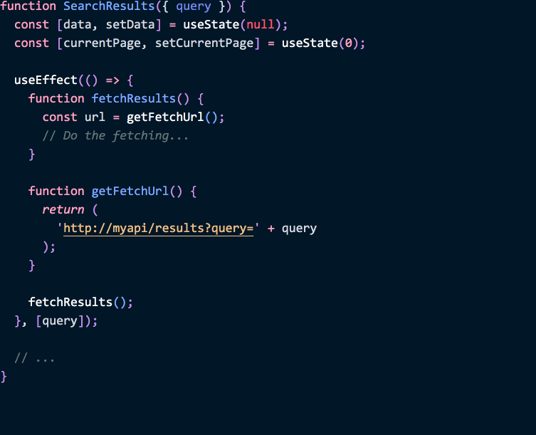

当大家开始学习 React 时，常常问到风格指南。虽然呢，项目中应用一致的规则，是个不错的主意，但是很多规则挺随意的——所以 React 对这些并没有强烈的意见。

你可以使用不同的类型系统，使用函数声明或者箭头函数，也可以对你的属性按字母序或任何你愿意的其他顺序来排序。

这样的灵活性允许在项目中 [整合 React](https://reactjs.org/docs/add-react-to-a-website.html) 时，能应用已有的一些约定习惯。不过同时，这也会引发无休止的争论。

**_有_一些每个组件都应极力遵守的设计原则。但我不认为风格指南能很好地捕捉这些原则。接下来，我们先谈谈风格指南，然后[再看看真的有用的设计原则](#编写有弹性的组件)。**


---

## 别被虚幻的问题分散了注意力

在我们讨论组件的设计原则前，我想先简单说说风格指南。这不是个流行的观点，但有人得说出来！

在 JavaScript 社区中，有一些由 linter 强制约束的样式指南。我个人的观察是，他们会产生比他们价值更多的麻烦。我算不清有多少人向我展示过一些完全有效的代码，然后跟我说 “React 提示这有问题啊！”，但这其实是由他们的 lint 配置产生的！这就导致了三个问题：

* 人们习惯于将 linter 看作是一个过分热心又吵闹的看门人，而不是一个有用的工具。 有用的警告被风格提示的海洋淹没了。因此，人们在调试时不看 linter 的提示，错过有用的信息。此外，之前不太写 JavaScript 的人群（例如，设计人员）也因此更难使用代码。

* 对于某种模式，大家不太学着**区分有效和无效的用法**。例如，有一条流行的规则是，禁止在 `componentDidMount` 中调用 `setState`。但如果这个用法总是 “错的”，那 React 根本不会允许它！这就有一个合法的用例，那就是测量 DOM 节点布局——例如，定位 tooltip。我见过有人添加 `setTimeout` 来 “解决” 这条规则，这完全搞错了。

* 最终，人们采用 “执法者心态”，对那些**没带来有意义变化**但在代码中易于发现的地方持批评态度。“你用了函数声明，但*我们的*项目用的是箭头函数。” 每次我有强烈意愿，想要强制执行类似的规则时，仔细想想就会发现，我把个人情绪投入到了这个规则中——然后又努力让这消失。这让我陷入虚假的成就感，而丝毫没有改进我的代码。

我这是在宣扬停止使用 linter 吗？ 不！

**通过良好的配置，linter 是一个很好的工具，它可以在 bug 出现前就能发现它们。**但它对*代码风格*的关注过多，使其变得会分散注意力。

---

## 整理你的 Lint 配置

这是我建议你在周一要做的事。把你的团队叫到一起花半个小时时间，一条条过一下你们项目中启用的 lint 规则，接着问问自己：*“这条规则有帮我找到过 bug 吗?”* 如果不是，*关掉这条规则*。（你也可以用 [`eslint-config-react-app`](https://www.npmjs.com/package/eslint-config-react-app) 从头开始创建，里面不含任何代码风格的规则）

至少，你的团队应该有一个流程，会去删除引起干扰的规则项。不要假设一年前你或别人添加到你的 lint 配置中的任何东西，都是“最佳实践”。保持质疑，找到答案。别让任何人告诉你，你不够聪明，不能选择 lint 规则。

**那代码格式化呢？** 用 [Prettier](https://prettier.io/) 然后忘掉 “风格”。你完全不需要一个工具告诉你得在这加一个空格，如果有别的工具能为你修复它。用 linter 找 *bug*，而不是做 *代 码 美 学*。

当然，某些方面来说，编码风格和格式没有直接关系，但在整个项目中存在不一致时还是很恼人。

然而，它们中的许多都太微妙了，无法通过一条 lint 规则捕捉到。这就是为什么说，在团队成员之间**建立信任**，在 wiki 或简短的设计指南里分享有用的知识，是非常重要的事了。

不是一切都值得自动化！从 *实际阅读* 中获得的见解，这种指南中的理由可能比遵循 "规则" 更有价值。

**如果遵循严格的风格指南是一种分心，那到底什么才是重要的呢？**

这就是这篇文章的主题。

---

## 编写有弹性的组件

不论多少缩进或按字母序排列，都不能修复糟糕的设计。因此，我不会专注于某些代码*看起来如何*，而是专注于如何让它*工作*。这有一些组件设计原则我认为是非常有用：

1. **[不阻断数据流](#原则-1：不阻断数据流)**
2. **[时刻准备渲染](#原则-2：时刻准备渲染)**
3. **[没有单例组件](#原则-3：没有单例组件)**
4. **[隔离本地状态](#原则-4：隔离本地状态)**

即使你不使用 React，对于存在单向数据流的任何 UI 组件模型，可能也能通过反复试验发现相同的原则。

---

## 原则 1：不阻断数据流

### 渲染中不要阻断数据流

当别人使用你的组件时，他们的预期是，不论传递属性如何变化, 组件都将反映这些变化：

```jsx
// isOk 也许在 state 里，随时会变化
<Button color={isOk ? 'blue' : 'red'} />
```

通常，这是 React 默认工作的方式。如果你在 `Button` 组件中使用 `color`，你会看到从上层为该渲染提供的值：

```jsx
function Button({ color, children }) {
  return (
    // ✅ `color` 永远是新的
    <button className={'Button-' + color}>
      {children}
    </button>
  );
}
```

然而，学习 React 时常见的一个错误是，把 props 复制到 state：

```jsx{3,6}
class Button extends React.Component {
  state = {
    color: this.props.color
  };
  render() {
    const { color } = this.state; // 🔴 `color` 不更新了！
    return (
      <button className={'Button-' + color}>
        {this.props.children}
      </button>
    );
  }
}
```

这也许看起来更直观，如果你使用过 React 之外的东西。 **但是，通过将 prop 复制到 state，你忽略了对它的所有更新。**

```jsx
// 🔴 上面的实现在更新时无法正常工作了
<Button color={isOk ? 'blue' : 'red'} />
```

很少情况下，这样的行为 *是* 有意为之的，请确认将这样的属性取名为 `initialColor` 或 `defaultColor` 来表明组件会忽略这个属性的改变。

但通常你会想在你的组件中 **直接读取 props**，避免复制 props（或从 props 中计算得到的值) 到 state：

```jsx
function Button({ color, children }) {
  return (
    // ✅ `color` 永远是新的!
    <button className={'Button-' + color}>
      {children}
    </button>
  );
}
```

----

计算值是另一个大家可能会将 props 复制到 state 的场景。举例来说，想象一下 *按钮文字* 的颜色是根据 `color` 属性通过昂贵计算得来：

```jsx{3,9}
class Button extends React.Component {
  state = {
    textColor: slowlyCalculateTextColor(this.props.color)
  };
  render() {
    return (
      <button className={
        'Button-' + this.props.color +
        ' Button-text-' + this.state.textColor // 🔴 `color` 改变的时候就不更新了
      }>
        {this.props.children}
      </button>
    );
  }
}
```

这个组件有 bug，它在 `color` 属性改变时无法重新计算 `this.state.textColor`。最简单的修复是把 `textColor` 的计算放到 `render` 方法中，然后把组件改为 `PureComponent`：

```jsx{1,3}
class Button extends React.PureComponent {
  render() {
    const textColor = slowlyCalculateTextColor(this.props.color);
    return (
      <button className={
        'Button-' + this.props.color +
        ' Button-text-' + textColor // ✅ 永远是新的
      }>
        {this.props.children}
      </button>
    );
  }
}
```

问题解决了！现在当 props 改变时重新计算 `textColor`，但是在属性不变时，能避免重复进行昂贵计算。

然而，也许我们还能再优化一下。如果 `children` 改变了呢？很遗憾 `textColor` 在这种情况下会重复计算。我们第二次尝试可能是通过在 `componentDidUpdate` 中调用计算。

```jsx{5-12}
class Button extends React.Component {
  state = {
    textColor: slowlyCalculateTextColor(this.props.color)
  };
  componentDidUpdate(prevProps) {
    if (prevProps.color !== this.props.color) {
      // 😔 额外的重复渲染
      this.setState({
        textColor: slowlyCalculateTextColor(this.props.color),
      });
    }
  }
  render() {
    return (
      <button className={
        'Button-' + this.props.color +
        ' Button-text-' + this.state.textColor // ✅ 在最后一次渲染后是新的
      }>
        {this.props.children}
      </button>
    );
  }
}
```

然而，这也意味着我们的组件在每次更新后，都有两次 render 调用。如果我们试图优化它，那也不理想。

你可以使用已不推荐的 `componentWillReceiveProps` 生命周期函数。然而，大家经常把 side effects 放这。这反过来又往往会给即将到来的并发渲染 [特性像 Time Slicing 和 Suspense](https://reactjs.org/blog/2018/03/01/sneak-peek-beyond-react-16.html) 带来问题。而更 “安全” 的 `getDerivedStateFromProps` 又有点难用。

让我们退一步。实际上，我们想要 [*memoization*](https://en.wikipedia.org/wiki/Memoization)。我们有一些输入，除非输入发生变化，否则我们不想重新计算输出。

使用类，你可以使用[帮助程序](https://reactjs.org/blog/2018/06/07/you-probably-dont-need-derived-state.html#what-about-memoization)完成 memoization。但是，Hooks 更进了一步，提供了一种记忆昂贵计算的内置方法：

```jsx{2-5}
function Button({ color, children }) {
  const textColor = useMemo(
    () => slowlyCalculateTextColor(color),
    [color] // ✅ 除非 `color` 改变，不会重新计算
  );
  return (
    <button className={'Button-' + color + ' Button-text-' + textColor}>
      {children}
    </button>
  );
}
```

这就是所有你需要的全部代码了！

在 class 组件中，你可以使用帮助程序类似 [`memoize-one`](https://github.com/alexreardon/memoize-one)。在函数组件中，`useMemo` Hook 提供了类似的功能。

现在我们看到**优化昂贵的计算也不是将 props 复制到 state 的好理由**。我们的渲染结果应该响应 props 的变化。

---

### 不要在 Side Effects 里阻断数据流

目前为止，我们讨论了关于如何在属性变化时保持渲染结果的一致。避免复制 props 到 state 是一部分。然而，**side effects（例如获取数据）也是数据流重要的一部分**

看看这个 React 组件：

```jsx{5-7}
class SearchResults extends React.Component {
  state = {
    data: null
  };
  componentDidMount() {
    this.fetchResults();
  }
  fetchResults() {
    const url = this.getFetchUrl();
    // 获取数据...
  }
  getFetchUrl() {
    return 'http://myapi/results?query' + this.props.query;
  }
  render() {
    // ...
  }
}
```

很多 React 组件都像这样——但如果看看，会发现这有个 bug。`fetchResults` 方法使用了 `query` 属性来做数据获取：

```jsx{2}
  getFetchUrl() {
    return 'http://myapi/results?query' + this.props.query;
  }
```

但如果 `query` 变了呢？在这个组件中，什么都不会发生。**这意味着组件的 side effects 没有响应它 props 的变化**。这在 React 应用中是常见 bug 的根源。

为了修复这个组件，我们需要：

* 查看 `componentDidMount` 和它所调用的所有方法
  - 在我们的例子中，就是 `fetchResults` 和 `getFetchUrl`
* 写下所有被他们使用的 props 和 state
  - 在我们的例子中，就是 `this.props.query`
* 确保不论 props 如何变化，都重新执行 side effect
  - 我们可以通过 `componentDidUpdate` 方法实现

```jsx{8-12,18}
class SearchResults extends React.Component {
  state = {
    data: null
  };
  componentDidMount() {
    this.fetchResults();
  }
  componentDidUpdate(prevProps) {
    if (prevProps.query !== this.props.query) { // ✅ 重新获取数据
      this.fetchResults();
    }
  }
  fetchResults() {
    const url = this.getFetchUrl();
    // 获取数据...
  }
  getFetchUrl() {
    return 'http://myapi/results?query' + this.props.query; // ✅ 更新也处理好了
  }
  render() {
    // ...
  }
}
```

现在我们的代码能响应所有的 props 变化了，甚至是 side effects。

然而，牢记不要再搞砸了，这真是个挑战。例如，也许又加了 `currentPage` 到 state，然后在 `getFetchUrl` 中使用了它：

```jsx{4,21}
class SearchResults extends React.Component {
  state = {
    data: null,
    currentPage: 0,
  };
  componentDidMount() {
    this.fetchResults();
  }
  componentDidUpdate(prevProps) {
    if (prevProps.query !== this.props.query) {
      this.fetchResults();
    }
  }
  fetchResults() {
    const url = this.getFetchUrl();
    // 获取数据...
  }
  getFetchUrl() {
    return (
      'http://myapi/results?query' + this.props.query +
      '&page=' + this.state.currentPage // 🔴 更新被忽略了
    );
  }
  render() {
    // ...
  }
}
```

哎呀，我们的代码又有 bug 了，这是因为 side effect 没有响应 `currentPage` 的变化。

**props 和 state 是 React 数据流的一部分。在这个数据流中，rendering 和 side effects 都应响应它们的变化，而不是忽略它们！**

为了修复这个问题，可以重复上面的步骤：

* 查看 `componentDidMount` 和它所调用的所有方法
  - 在我们的例子中，就是 `fetchResults` 和 `getFetchUrl`
* 写下所有被他们使用的 props 和 state
  - 在我们的例子中，就是 `this.props.query` **和 `this.state.currentPage`**
* 确保不论 props 如何变化，都重新执行 side effect
  - 我们可以通过 `componentDidUpdate` 方法实现

让我们修复我们的组件，用以处理 `currentPage` 的更新吧：

```jsx{11,24}
class SearchResults extends React.Component {
  state = {
    data: null,
    currentPage: 0,
  };
  componentDidMount() {
    this.fetchResults();
  }
  componentDidUpdate(prevProps, prevState) {
    if (
      prevState.currentPage !== this.state.currentPage || // ✅ 更新后重新获取数据
      prevProps.query !== this.props.query
    ) {
      this.fetchResults();
    }
  }
  fetchResults() {
    const url = this.getFetchUrl();
    // 获取数据...
  }
  getFetchUrl() {
    return (
      'http://myapi/results?query' + this.props.query +
      '&page=' + this.state.currentPage // ✅ 更新被处理了
    );
  }
  render() {
    // ...
  }
}
```

**如果我们能够以某种方式自动捕捉到这些错误，那不是很好吗？**难道没有什么 linter 可以帮助我们处理这事吗？

---

遗憾的是，自动检查类组件的一致性太困难了。任何方法都可以调用任何其他方法。静态分析来自 `componentDidMount` 和 `componentDidUpdate` 的调用充满了误报。

但是，*可能* 可以设计一个 *能* 被静态分析的一致性 API。[React `useEffect` Hook](/a-complete-guide-to-useeffect/) 就是这样 API 的一个例子：

```jsx{13-14,19}
function SearchResults({ query }) {
  const [data, setData] = useState(null);
  const [currentPage, setCurrentPage] = useState(0);

  useEffect(() => {
    function fetchResults() {
      const url = getFetchUrl();
      // 数据获取...
    }

    function getFetchUrl() {
      return (
        'http://myapi/results?query' + query +
        '&page=' + currentPage
      );
    }

    fetchResults();
  }, [currentPage, query]); // ✅ 更新后重新获取

  // ...
}
```

我们将逻辑 *放在* effect 中，这样可以更容易地看到*它从 React 数据流中依赖了哪些值*。这些值称为“依赖”，在我们的例子中它们是 `[currentPage, query]`。

注意这个“effect 依赖”数组并不是一个新概念。在类中，我们必须遍历所有方法调用，来搜索这些“依赖项”。`useEffect` API 只是显式地使用了相同的概念。

反过来说，这可以让我们自动验证它们：



*（这个 demo 来自最新推荐的 `exhaustive-deps` lint 规则，这是 `eslint-plugin-react-hooks` 其中一部分。它将不久加入到 Create React App 中）*

**注意，无论是将组件编写为类还是函数，都必须为 effect 响应所有 props 和 state 的更新。**

使用 class API，你必须自己考虑一致性，并验证对每个相关 prop 或 state 的更改是否该由 `componentDidUpdate` 处理。否则，组件对 prop 和 state 的更改不具有弹性。这甚至不是专属于 React 的问题。它适用于任何允许你单独处理 “创建” 和 “更新” 事件的 UI 库

**`useEffect` API 通过鼓励一致性来翻转默认值。** 这 [可能在开始时觉得会不熟悉](/a-complete-guide-to-useeffect/)，但这样的结果是你的组件对逻辑更改更具弹性了。由于 “依赖关系” 现在是显式的，我们可以使用 lint 规则*检验*是否一致。 我们用 linter 来捕捉 bug！

---

### 不要在优化中阻断数据流

还有一种情况，你可能会意外忽略对 props 的更改。当你手动优化组件时，可能会发生这类错误。

注意，使用浅比较的优化方法（如 `PureComponent` 和 `React.memo`）与默认比较是安全的。

**但是，如果你尝试通过编写自己的比较方法来 “优化” 组件，你可能会错误地忘记比较函数属性：**

```jsx{2-5,7}
class Button extends React.Component {
  shouldComponentUpdate(prevProps) {
    // 🔴 没比较 this.props.onClick
    return this.props.color !== prevProps.color;
  }
  render() {
    const onClick = this.props.onClick; // 🔴 将不响应更新
    const textColor = slowlyCalculateTextColor(this.props.color);
    return (
      <button
        onClick={onClick}
        className={'Button-' + this.props.color + ' Button-text-' + textColor}>
        {this.props.children}
      </button>
    );
  }
}
```

一开始很容易错过这个错误，因为对于类，你通常会传递一个*方法*，所以它会有相同的身份：

```jsx{2-4,9-11}
class MyForm extends React.Component {
  handleClick = () => { // ✅ 总是同一个函数
    // Do something
  }
  render() {
    return (
      <>
        <h1>Hello!</h1>
        <Button color='green' onClick={this.handleClick}>
          Press me
        </Button>
      </>
    )
  }
}
```

所以我们的优化不会*马上*被破坏。但是，它将持续 “看到” 旧的 `onClick` 值，但其他 props 不会这样：

```jsx{6,13-15}
class MyForm extends React.Component {
  state = {
    isEnabled: true
  };
  handleClick = () => {
    this.setState({ isEnabled: false });
    // Do something
  }
  render() {
    return (
      <>
        <h1>Hello!</h1>
        <Button color='green' onClick={
          // 🔴 Button 忽略了 onClick 的更新
          this.state.isEnabled ? this.handleClick : null
        }>
          Press me
        </Button>
      </>
    )
  }
}
```

在这个例子中，应该禁用按钮点击事件——但这不会发生，因为 `Button` 组件忽略了对`onClick` 属性的任何更新。

如果函数标识本身依赖于可能随时间变化的东西，例如本例中的 `draft.content`，这可能会让人更加困惑：

```jsx{6-7}
  drafts.map(draft =>
    <Button
      color='blue'
      key={draft.id}
      onClick={
        // 🔴 Button 忽略了 onClick 的更新
        this.handlePublish.bind(this, draft.content)
      }>
      Publish
    </Button>
  )
```

虽然 `draft.content` 可能随着时间的推移而改变，但是我们的 `Button` 组件忽略了对`onClick` 属性的改变，所以它继续看到 `onClick` 绑定方法的 “第一个版本” 与原始的`draft.content`。

**那怎么避免这个问题？**

我建议避免手动实现 `shouldComponentUpdate` ，也要避免在 `React.memo()` 中使用自定义的比较方法。`React.memo` 中默认的浅比较会响应函数标识的更新：

```jsx{11}
function Button({ onClick, color, children }) {
  const textColor = slowlyCalculateTextColor(this.props.color);
  return (
    <button
      onClick={onClick}
      className={'Button-' + color + ' Button-text-' + textColor}>
      {children}
    </button>
  );
}
export default React.memo(Button); // ✅ 使用浅比较
```

在类中，`PureComponent` 也有类似的行为.

这确保了传递不同的函数作为 prop，始终能有效工作。

如果你坚持使用自定义的比较，**请确保不跳过函数：**

```jsx{5}
  shouldComponentUpdate(prevProps) {
    // ✅ 比较 this.props.onClick
    return (
      this.props.color !== prevProps.color ||
      this.props.onClick !== prevProps.onClick
    );
  }
```

正如之前提到的，在类组件中很容易错过这个问题，因为方法标识通常是稳定的（但并非总是如此——而这就是 debug 困难的地方）。有了Hooks，情况不同了：

1. function 在*每个渲染*中都不同，所以你能[马上](https://github.com/facebook/react/issues/14972#issuecomment-468280039)发现这个问题
2. 通过 `useCallback` 和 `useContext`，你能 [避免往下传递函数](https://reactjs.org/docs/hooks-faq.html#how-to-avoid-passing-callbacks-down)。这让你优化渲染时不用太担心函数的问题。

---

总结一下这部分，**不要阻断数据流！**

无论何时使用 props 和 state，请考虑如果它们发生变化会发生什么。在大多数情况下，组件不应以不同方式处理初始渲染和更新流程。这使它能够适应逻辑上的变化。

对于类，在生命周期方法中使用 props 和 state 时很容易忘记更新。Hooks 推动你做正确的事情——但是如果你不习惯于这样做，它会需要一些心理调整。

---

## 原则 2：时刻准备渲染

React 组件使你可以不用花太长时间就能编写渲染代码。你描述了在任何时刻 UI *应该* 如何，接着 React 去完成。好好利用那个模型！

不要试图在组件行为中，假设任何不必要的时序信息。**你的组件应该随时可以重新渲染。**

违背这个原则的方式是什么样的？React 让这没那么容易发生——但你可以使用传统的`componentWillReceiveProps` 生命周期方法来实现它：

```jsx{5-8}
class TextInput extends React.Component {
  state = {
    value: ''
  };
  // 🔴 每次父节点渲染时重置本地状态
  componentWillReceiveProps(nextProps) {
    this.setState({ value: nextProps.value });
  }
  handleChange = (e) => {
    this.setState({ value: e.target.value });
  };
  render() {
    return (
      <input
        value={this.state.value}
        onChange={this.handleChange}
      />
    );
  }
}
```

在这个例子中，我们将 `value` 放在 state 里，但我们 *也* 从 props 接收 `value`。每当我们 “接收新 props” 时，就会重置状态中的 `value`。

**这种模式的问题在于它完全依赖于偶然的时间。**

也许今天这个组件的父级很少更新，我们的 `TextInput` 仅在重要事件发生时 “接收 props”，比如保存表单。

但明天你可能会向 `TextInput` 的父组件加一些动画。如果父组件经常重渲染，它将 [“污染”](https://codesandbox.io/s/m3w9zn1z8x) 子组件的状态！你可以在 [“你可能不需要派生状态”](https://reactjs.org/blog/2018/06/07/you-probably-dont-need-derived-state.html) 中阅读有关此问题的更多信息。

**所以该怎么修复呢？**

首先，我们得调整一下心理，需要停止将 “接收 props” 视为与 “渲染” 不同的东西。 由父组件引起的重渲染不应与由本地状态更改引起的重渲染不同。**组件应该具有弹性，能适应更少或更频繁地渲染，否则它们与特定父组件存在过多耦合。**

*([这个 demo](https://codesandbox.io/s/m3w9zn1z8x) 给我们展示了重渲染会如何毁坏脆弱的组件)*

当你真正想从 props 派生 state 时，尽管有一些[不同](https://reactjs.org/blog/2018/06/07/you-probably-dont-need-derived-state.html#preferred-solutions)的[解决方案](https://reactjs.org/docs/hooks-faq.html#how-do-i-implement-getderivedstatefromprops)，通常你应该使用一个完全受控制的组件：

```jsx
// Option 1: Fully controlled component.
function TextInput({ value, onChange }) {
  return (
    <input
      value={value}
      onChange={onChange}
    />
  );
}
```

或者使用一个不受控的组件，加上 key 来重置它：

```jsx
// Option 2: Fully uncontrolled component.
function TextInput() {
  const [value, setValue] = useState('');
  return (
    <input
      value={value}
      onChange={e => setValue(e.target.value)}
    />
  );
}

// 之后我们能通过更改 key 来重置内部 state：
<TextInput key={formId} />
```

本节的内容是，组件不应该因为它或其父组件频繁地重渲染而坏掉。如果想避免使用传统的 `componentWillReceiveProps` 生命周期方法，React API 的设计，可以轻松实现这个目的。

要对你的组件进行压力测试，可以将这段代码临时添加到它的父组件：

```jsx{2}
componentDidMount() {
  // 之后别忘了删除这行！
  setInterval(() => this.forceUpdate(), 100);
}
```

**可别把这段代码保留在项目里**——这只是用来检查父组件重渲染的频率超出预期时，会发生什么的快速方法。它不应该损坏子组件！

---

你可能会想：“那我在 props 改变时重置 state，再使用 `PureComponent` 来避免不必要的重渲染”。

这段代码应该能工作，对吧？

```jsx{1-2}
// 🤔 应该阻止不必要的重渲染... 对吧?
class TextInput extends React.PureComponent {
  state = {
    value: ''
  };
  // 🔴 在父组件更新时重置本地 state
  componentWillReceiveProps(nextProps) {
    this.setState({ value: nextProps.value });
  }
  handleChange = (e) => {
    this.setState({ value: e.target.value });
  };
  render() {
    return (
      <input
        value={this.state.value}
        onChange={this.handleChange}
      />
    );
  }
}
```

乍一看，这个组件似乎解决了父级重渲染时 “污染” state 的问题。毕竟，如果 props 是相同的，我们会跳过更新——所以 `componentWillReceiveProps` 不会被调用。

但是这都是幻觉。**这个组件对_实际_的 prop 更改仍然不具备弹性。**例如，如果我们添加*另一个*经常变化的 prop，就像用来做动画的 `style`，我们还是会 “丢失” 内部状态：

```jsx{2}
<TextInput
  style={{opacity: someValueFromState}}
  value={
    // 🔴 componentWillReceiveProps in TextInput
    // resets to this value on every animation tick.
    value
  }
/>
```

所以这个方法仍然存在缺陷。我们可以看到各种优化，例如 `PureComponent`、`shouldComponentUpdate` 和 `React.memo`，它们不应该用于控制*行为*。只有提高*性能*的场景下，去使用它们。如果删除优化就会_破坏_某个组件，那么它就太脆弱了。

这里的解决方案和之前提到的一样。不要将 “接受 props” 视作特殊的事件。避免 “同步” props 和 state。大部分情况下，每个值都应该是完全控制的（通过 props），或者完全不受控制的（在本地 state 里）。可以的话，避免[派生 state](https://reactjs.org/blog/2018/06/07/you-probably-dont-need-derived-state.html#preferred-solutions)。**当然，时刻准备渲染！**

---

## 原则 3：没有单例组件

有时我们假设某个组件只会显示一次，如导航栏。在一段时间内这也许是对的，然而，这种假设导致的设计问题，常常会在后期显现。

例如，你可能需要在路由变化后，两个 `Page` 组件切换*间*实现动画——前一个 `Page` 和下一个 `Page`。它们都需要在动画期间被加载。但是，你可能会发现，每个组件都假定它是屏幕上唯一的 `Page`。

要重现这类问题也很容易，试试渲染你的应用两次：

```jsx{3,4}
ReactDOM.render(
  <>
    <MyApp />
    <MyApp />
  </>,
  document.getElementById('root')
);
```

到处点击看看。（你可能需要为这个实验调整一些 CSS 样式）

**你的应用仍然正常运行吗？**或者你是否看到奇怪的崩溃和错误？偶尔对复杂组件进行压力测试是个好主意，可以确保组件存在多个拷贝时不会相互冲突。

我自己写过几次有问题的代码，例如在 `componentWillUnmount` 中执行全局状态 “清理”：

```jsx{2-3}
componentWillUnmount() {
  // 重置 Redux store 里的一些东西
  this.props.resetForm();
}
```

当然，如果页面上有两个这样的组件，卸载其中一个组件可能会破坏另一个组件。在 *mount* 后重置 “全局” 状态也不好：

```jsx{2-3}
componentDidMount() {
  // 重置 Redux store 里的一些东西
  this.props.resetForm();
}
```

在这情况下， *挂载* 第二个 form 就会破坏前一个。

这些模式是检测组件是否脆弱的好指标。***显示* 或 *隐藏* 一颗树，不应该破坏树之外的组件。**

无论你是否有计划将这个组件渲染两次，从长远来看，解决这些问题是值得的。它将引导你进行更具弹性的设计。

---

## 原则 4：隔离本地状态

假设有一个 `POST` 社交组件，它有一个 `Comment` 列表（可扩展）和一个 `NewComment` 输入框。

React 组件可能有本地状态。但是哪个状态真的是自己的呢？帖子内容本身是否为本地状态？评论列表呢？或者评论流的记录？或评论框里输入的值？

如果你习惯于将所有内容都放入 “状态管理”，那么可能很难回答这个问题。所以这有一个简单的决定方式。

**如果你不确定某个状态是否属于本地，请问自己：“如果此组件呈现两次，交互是否应反映在另一个副本中？” 只要答案为“否”，那你就找到本地状态了。**

例如，假设我们两次渲染相同的 `Post`。让我们看一下哪些内容会更新。

* *发布内容* ：我们希望在一棵树中编辑帖子，在另一棵树中也更新。因此，它可能**不是** `Post` 组件的本地状态。（相反，帖子内容可能存在于 Apollo、Relay 或 Redux等缓存中）

* *评论列表* ：这与帖子内容类似。我们希望在一棵树中添加一条新注释，以反映在另一棵树中。理想情况下，我们会为它使用某种缓存，而 **不应该是** 我们 `Post` 的本地状态。

* *被展开的评论*：如果在一棵树中展开评论也会在另一棵树中展开，这有点奇怪。在这种情况下，我们与特定的 `Comment` *UI 元素* 进行交互，而不是抽象的 “评论实体”。因此，“是否已展开” **应该** 是 `Comment` 的本地状态。

* *输入的新评论的值*：如果在一个输入框中输入评论，也会更新到另一个树中的输入框，这也有点奇怪。除非输入框明确地组合在一起，否则通常人们期望它们是独立的。所以输入值 **应该** 是 `NewComment` 组件的本地状态。

我不建议对这些规则进行教条式的解释。当然，在一个简单的应用程序中，你可能希望使用本地状态来处理所有事情，包括 “缓存”。我只是谈论在[第一原则](/the-elements-of-ui-engineering/)下，理想状态的用户体验。

**别把该本地的状态全局化了**。这涉及到我们的 “弹性” 主题：组件之间发生的意外同步更少。作为奖励，这*也*修复了一大类性能问题。当你的 state 在正确的地方时，“过度渲染” 都不成问题了。

---

## 回顾

让我们再一次回顾一下这些原则：

1. **[不阻断数据流](#原则-1：不阻断数据流)** props 和 state 可能会更新，组件应该处理好这些更新，不论什么时候。
2. **[时刻准备渲染](#原则-2：时刻准备渲染)** 一个组件不应该被或多或少的渲染而损坏。
3. **[没有单例组件](#原则-3：没有单例组件)** 即使组件只渲染一次，但通过设计让它渲染两次也不会被破坏，是更好了。
4. **[隔离本地状态](#原则-4：隔离本地状态)** 想想哪个状态是特定 UI 展示下的本地状态——并且除非必要，不要将该状态提升到更高的地方。

**这些原则能帮助你编写[针对更新而优化](/optimized-for-change/)的组件。这让添加，更改和删除那些组件更容易。**

重要的是，一旦我们的组件具有了弹性，那就可以再回过头，到是否应按字母排序的紧迫困境中去了。
